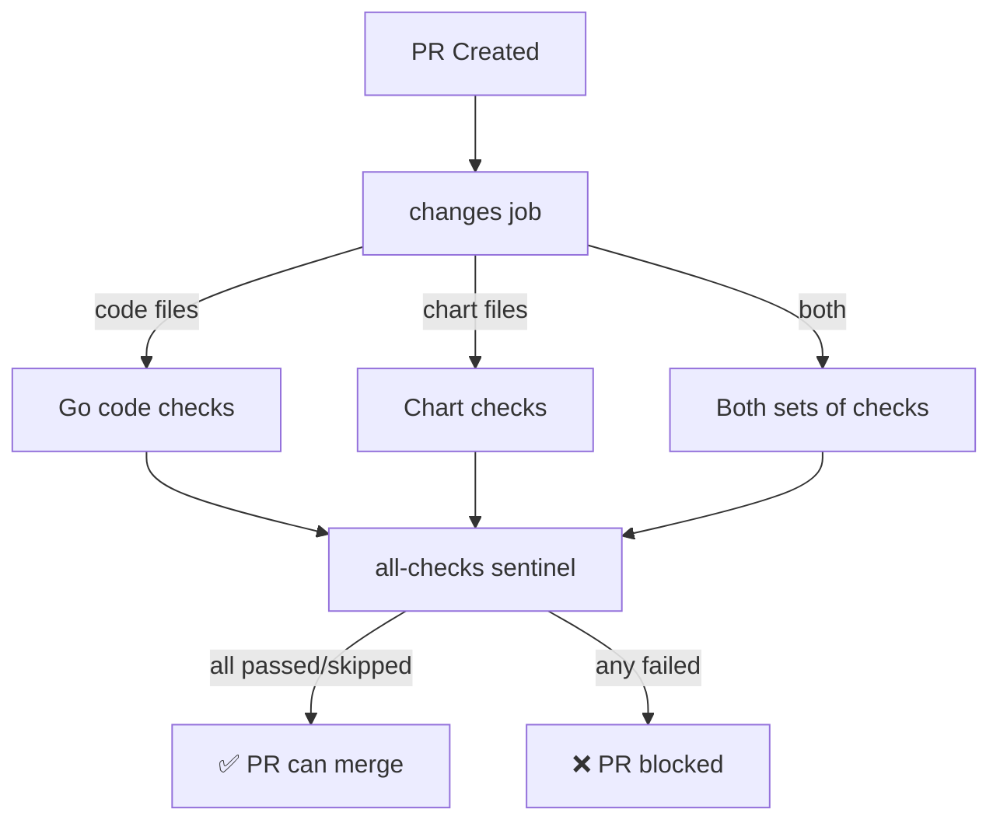

# PR Gate Workflow

This document explains the PR Gate workflow and how to configure branch protection rules.

## Problem

ToolHive has multiple quality gate workflows that run conditionally based on which files are changed:
- `run-on-pr.yml` - Runs when Go code changes (excludes `deploy/charts/**`)
- `run-on-pr-charts.yml` - Runs when Helm charts change (only `deploy/charts/**`)

This creates a problem for branch protection:
- If you require BOTH workflows, no PR can pass (one will never trigger)
- If you require neither, you can't enforce quality gates

## Solution

The `pr-gate.yml` workflow acts as a sentinel that:
1. Detects which files changed using `dorny/paths-filter`
2. Conditionally runs the appropriate quality checks
3. Provides a single "All Checks Pass" job that reports the combined status

This is a well-established pattern used by many large open-source projects.

## Configuration

### Branch Protection Rules

Configure your branch protection to require only the **"All Checks Pass"** job:

1. Go to Repository Settings → Branches
2. Add or edit a branch protection rule for `main`
3. Enable "Require status checks to pass before merging"
4. Search for and select: **"All Checks Pass"**
5. Remove any other workflow requirements (the gate handles them all)

### How It Works



The `all-checks` job:
- Runs with `if: always()` so it executes even if some jobs were skipped
- Checks the status of all quality gate jobs
- Succeeds if all jobs are either `success` or `skipped`
- Fails if any job has status `failure` or `cancelled`

## Deprecating Old Workflows

Once the PR gate is enabled and tested, you can consider deprecating:
- `run-on-pr.yml`
- `run-on-pr-charts.yml`

These workflows are now replaced by `pr-gate.yml`. However, you may want to keep them temporarily for:
- Existing PRs that reference them
- Gradual migration period
- Rollback capability if issues arise

## Modifying the Gate

To add or remove checks from the gate:

1. **Add a new check**:
   - Add the workflow call as a new job under the appropriate section (code or charts)
   - Add the job name to the `needs:` list in the `all-checks` job
   - Ensure the job has proper conditionals (`if: needs.changes.outputs.code == 'true'`)

2. **Remove a check**:
   - Remove the job definition
   - Remove the job name from the `needs:` list in `all-checks`

3. **Modify path filters**:
   - Edit the `filters:` section in the `changes` job
   - The `code` filter matches everything except charts
   - The `charts` filter matches only `deploy/charts/**`

## Testing

To test the gate workflow:

1. **Test with code changes**:
   ```bash
   # Make a small Go file change
   echo "// test" >> cmd/thv/main.go
   git add cmd/thv/main.go
   git commit -m "test: verify PR gate with code change"
   git push origin feature-branch
   ```
   - Verify: Code checks run, chart checks skip, "All Checks Pass" succeeds

2. **Test with chart changes**:
   ```bash
   # Make a chart change
   echo "# test" >> deploy/charts/toolhive/README.md
   git add deploy/charts/toolhive/README.md
   git commit -m "test: verify PR gate with chart change"
   git push origin feature-branch
   ```
   - Verify: Chart checks run, code checks skip, "All Checks Pass" succeeds

3. **Test with both**:
   ```bash
   # Change both code and charts
   echo "// test" >> cmd/thv/main.go
   echo "# test" >> deploy/charts/toolhive/README.md
   git add .
   git commit -m "test: verify PR gate with mixed changes"
   git push origin feature-branch
   ```
   - Verify: ALL checks run, "All Checks Pass" succeeds

## Troubleshooting

### Jobs not running as expected

Check the `changes` job output to see which filters matched:
- Go to Actions → PR Gate workflow → changes job
- Look at the outputs: `code: true/false` and `charts: true/false`

### All checks skip

This can happen if:
- The path filters don't match any changed files
- Review the `filters:` configuration in the `changes` job

### Sentinel reports failure even though all checks passed

Check the status of each job in the `all-checks` step output:
- Jobs should be `success` or `skipped`, not `failure` or `cancelled`
- If a job shows `cancelled`, check if it has proper `if: !cancelled()` conditions

## References

- [GitHub Actions: Using jobs in a workflow](https://docs.github.com/en/actions/using-workflows/workflow-syntax-for-github-actions#jobs)
- [dorny/paths-filter action](https://github.com/dorny/paths-filter)
- [Branch protection rules](https://docs.github.com/en/repositories/configuring-branches-and-merges-in-your-repository/managing-protected-branches/about-protected-branches)
