# Debugging vMCP with Optimizer

This guide explains how to debug the vMCP server with the optimizer integration enabled.

## Prerequisites

### 1. Install sqlite-vec Extension

The optimizer **requires** the sqlite-vec extension for semantic vector search.

**macOS:**
```bash
brew install asg017/sqlite-vec/sqlite-vec
export SQLITE_VEC_PATH=/usr/local/lib/vec0.dylib
```

**Linux:**
```bash
# Download from: https://github.com/asg017/sqlite-vec/releases
wget https://github.com/asg017/sqlite-vec/releases/download/v0.1.1/sqlite-vec-0.1.1-linux-amd64.tar.gz
tar -xzf sqlite-vec-0.1.1-linux-amd64.tar.gz
sudo mv vec0.so /usr/local/lib/
export SQLITE_VEC_PATH=/usr/local/lib/vec0.so
```

### 2. Set Up MCP Backend Servers

Create a ToolHive group with some MCP servers:

```bash
# Create group
thv group create default

# Run example MCP servers
thv run weather --name weather-mcp --group default
thv run github --name github-mcp --group default
thv run fetch --name fetch-mcp --group default

# Verify servers are running
thv list --group default
```

## Debug Configurations

### VS Code

Three debug configurations are available in `.vscode/launch.json`:

#### 1. **Debug vMCP with Optimizer** (Recommended)
- Starts vMCP with optimizer enabled
- Uses placeholder embeddings (no external service needed)
- Sets `SQLITE_VEC_PATH` environment variable
- Logs to integrated terminal

**To use:**
1. Open VS Code
2. Press `F5` or click "Run and Debug"
3. Select "Debug vMCP with Optimizer"
4. Set breakpoints in:
   - `pkg/vmcp/server/server.go` (OnRegisterSession hook)
   - `pkg/vmcp/optimizer/optimizer.go` (OnRegisterSession, RegisterTools)
   - `pkg/vmcp/router/default_router.go` (RouteTool)

#### 2. **Debug vMCP (no optimizer)**
- Standard vMCP without optimizer
- Useful for comparing behavior

#### 3. **Validate vMCP Config**
- Validates the optimizer config without starting server
- Useful for debugging config parsing issues

## Configuration

### Config File (`examples/vmcp-config-optimizer.yaml`)

The config file is now **valid and working**, but the optimizer section is commented out because config parsing isn't implemented yet:

```yaml
name: "vmcp-debug"
groupRef: "default"
incomingAuth:
  type: anonymous
outgoingAuth:
  source: inline
  default:
    type: unauthenticated
aggregation:
  conflictResolution: prefix
```

**Optimizer Config:**

✅ **The optimizer is now automatically enabled** when using the `vmcp-debug` configuration!

The code in `cmd/vmcp/app/commands.go` detects the debug config and enables the optimizer:

```go
// Enable optimizer for debug configuration
if cfg.Name == "vmcp-debug" {
    serverCfg.OptimizerConfig = &vmcpserver.OptimizerConfig{
        Enabled:            true,
        DBPath:             "/tmp/vmcp-optimizer-debug.db",
        EmbeddingBackend:   "placeholder",
        EmbeddingURL:       "",
        EmbeddingModel:     "",
        EmbeddingDimension: 384,
    }
}
```

**What This Means:**
- 🎯 Just press F5 in VS Code - optimizer is enabled automatically
- 📊 Uses placeholder embeddings (no external service needed)
- 💾 SQLite database at `/tmp/vmcp-optimizer-debug.db`
- 🔧 384-dimensional vectors (standard for all-MiniLM-L6-v2)

**Phase 2 Goal:** Move this configuration into the YAML file for full config-file control.

### Embedding Backends

| Backend | Use Case | Setup Required |
|---------|----------|----------------|
| **placeholder** | Development/CI | None - generates hash-based embeddings |
| **ollama** | Local dev with real embeddings | `ollama serve` + `ollama pull all-minilm` |
| **vllm** | Production | Deploy vLLM service with embedding model |

## Debugging Tips

### 1. **Enable Verbose Logging**

Set debug flag and check logs:
```bash
vmcp serve --config examples/vmcp-config-optimizer.yaml --debug
```

### 2. **Inspect Database**

Check what's in the optimizer database:
```bash
sqlite3 /tmp/vmcp-optimizer-debug.db

# List tables
.tables

# Check backend servers
SELECT id, name, url, transport FROM mcpservers_backend;

# Check tools
SELECT id, mcpserver_id, details FROM tools_backend LIMIT 10;

# Check embeddings (if sqlite-vec is loaded)
SELECT COUNT(*) FROM backend_tool_vectors;
```

### 3. **Test Optimizer Tools**

Once Phase 2 is complete, test the optimizer tools via MCP client:

```json
// Request
{
  "jsonrpc": "2.0",
  "id": 1,
  "method": "tools/call",
  "params": {
    "name": "optim.find_tool",
    "arguments": {
      "tool_description": "get weather information",
      "limit": 5
    }
  }
}

// Expected Response (Phase 2)
{
  "jsonrpc": "2.0",
  "id": 1,
  "result": {
    "content": [
      {
        "type": "text",
        "text": "{\"tools\": [{\"name\": \"weather_get_current\", \"backend_id\": \"weather-mcp\", \"score\": 0.95}], ...}"
      }
    ]
  }
}
```

### 4. **Common Issues**

#### "sqlite-vec extension not found"
```bash
# Check if sqlite-vec is in the right location
ls -la /usr/local/lib/vec0.*

# Set environment variable
export SQLITE_VEC_PATH=/usr/local/lib/vec0.dylib  # macOS
export SQLITE_VEC_PATH=/usr/local/lib/vec0.so      # Linux
```

#### "No backends found"
```bash
# Make sure ToolHive group exists and has servers
thv group list
thv list --group default

# If empty, add some servers
thv run weather --name weather-mcp --group default
```

#### "Optimizer tools not registered"
- Check that `OptimizerConfig.Enabled = true` in server config
- Set breakpoints in `OnRegisterSession` and `RegisterTools`
- Verify `optimizerIntegration` is not nil in server

## Architecture Flow

```mermaid
sequenceDiagram
    participant VSCode
    participant vMCP
    participant Optimizer
    participant Ingestion
    participant SQLite

    VSCode->>vMCP: Start with debugger
    vMCP->>vMCP: Load config
    vMCP->>Optimizer: NewIntegration(cfg)
    Optimizer->>Ingestion: NewService(cfg)
    Ingestion->>SQLite: Connect (with sqlite-vec)
    
    Note over vMCP: Client connects
    vMCP->>vMCP: Discovery middleware
    vMCP->>Optimizer: OnRegisterSession(capabilities)
    
    loop For each backend
        Optimizer->>Ingestion: IngestServer(backend, tools)
        Ingestion->>SQLite: Store embeddings
    end
    
    Optimizer->>vMCP: RegisterTools (optim.*)
    vMCP->>VSCode: Breakpoint hit! 🎯
```



## Next Steps

Once you have the debugger running and breakpoints hit:

1. **Phase 2**: Implement `createFindToolHandler()`
   - Parse request arguments
   - Call semantic search service
   - Return ranked results

2. **Phase 3**: Implement `createCallToolHandler()`
   - Extract backend_id and tool_name
   - Route to backend via existing router
   - Return tool result

3. **Add Config Parsing**: Wire optimizer config from YAML into server

## Resources

- [RFC-0022: Optimizer Migration to vMCP](https://github.com/stacklok/toolhive-rfcs/blob/main/rfcs/THV-0022-optimizer-migration-to-vmcp.md)
- [sqlite-vec Documentation](https://github.com/asg017/sqlite-vec)
- [vMCP Architecture](../../docs/arch/10-virtual-mcp-architecture.md)
