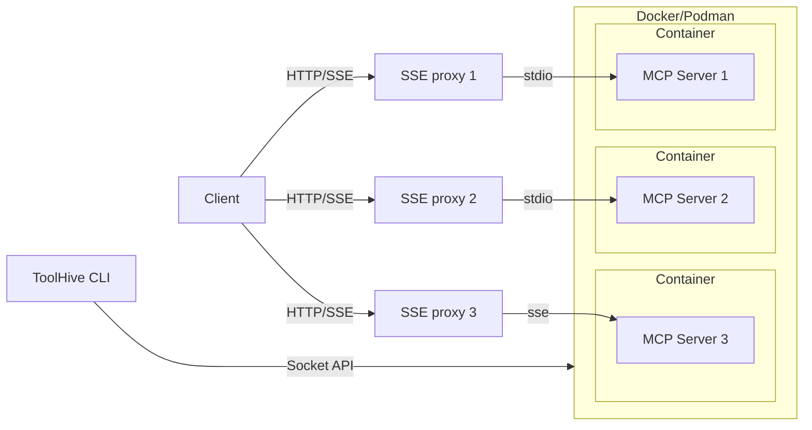

# ToolHive - making MCP servers easy and secure <!-- omit in toc -->

[](https://github.com/stacklok/toolhive/releases)
|
[](https://github.com/stacklok/toolhive/actions/workflows/run-on-main.yml)
|
[](https://opensource.org/licenses/Apache-2.0)
|
[](https://github.com/stacklok/toolhive)
|
[](https://discord.gg/stacklok)


ToolHive (thv) is a lightweight utility designed to simplify the deployment and
management of MCP (Model Context Protocol) servers, ensuring ease of use,
consistency, and security.


## Contents <!-- omit in toc -->

- [Why ToolHive?](#why-toolhive)
  - [Key benefits](#key-benefits)
- [Getting started](#getting-started)
  - [Prerequisites](#prerequisites)
  - [Installation](#installation)
  - [Quickstart - run your first MCP server](#quickstart---run-your-first-mcp-server)
- [Client compatibility](#client-compatibility)
- [Architecture overview](#architecture-overview)
- [Usage examples](#usage-examples)
  - [Register clients](#register-clients)
  - [Find and run an MCP server](#find-and-run-an-mcp-server)
  - [Manage MCP servers](#manage-mcp-servers)
  - [Secrets management](#secrets-management)
    - [`encrypted`](#encrypted)
    - [`1password`](#1password)
  - [Run a custom MCP server](#run-a-custom-mcp-server)
  - [Run MCP servers using protocol schemes](#run-mcp-servers-using-protocol-schemes)
- [Advanced usage](#advanced-usage)
  - [Customize permissions](#customize-permissions)
  - [Run ToolHive in Kubernetes](#run-toolhive-in-kubernetes)
- [API Documentation](#api-documentation)
- [Contributing to ToolHive](#contributing-to-toolhive)
- [License](#license)

## Why ToolHive?

Deploying MCP servers often involves complex, multi-step processes that can
introduce friction, such as running potentially unsafe commands (e.g., uv or
npx), manually managing security credentials (e.g., storing API tokens in
plaintext), and dealing with inconsistent packaging methods.

ToolHive aims to solve these challenges by running containers in a consistent
and locked-down environment, granting only the minimal permissions required to
run. This significantly reduces the attack surface, improves usability, and
enforces best practices for container security.

ToolHive simplifies MCP deployment by focusing on three key areas:

- **Ease of use**: Instantly deploy MCP servers using Docker containers. Start
  MCP servers with a single, straightforward command without the need to install
  and manage different versions of Python, Node.js, or other build tools.

- **Enhanced security**: Secure by default. ToolHive securely manages secrets
  and configurations, greatly reducing the risk of leaks. Avoid plaintext
  secrets in configuration files.

- **Standardized packaging**: Leverage OCI container standards to provide a
  repeatable, standardized packaging method for MCP servers, ensuring
  compatibility and reliability.

### Key benefits

- **Curated MCP registry**: ToolHive provides a curated registry of MCPs with
  verified configurations, allowing you to discover and deploy MCP servers
  effortlessly. Simply select one from the list and run it securely with a
  single command.

- **Enterprise-ready authorization**: Robust authorization controls designed for
  enterprise environments, securely managing tool access and integrating
  seamlessly with existing infrastructure (e.g., Kubernetes).

- **Seamless integration**: Automatic configuration of popular development tools
  like GitHub Copilot, Cursor, and more to streamline your workflow.

## Getting started

### Prerequisites

ToolHive currently works on macOS and Linux using Docker or Podman.

For client auto-discovery/configuration, a supported client:

- VS Code (v1.99.0 or newer) with an active GitHub Copilot subscription
- Cursor
- Roo Code (VS Code extension)

### Installation

ToolHive is a CLI tool written in Go and packaged as a single binary. You can
install it using one of the following methods:

#### Download the binary <!-- omit in toc -->

Download the latest cross-platform release binaries from
[toolhive/releases](https://github.com/stacklok/toolhive/releases).

#### Homebrew (macOS) <!-- omit in toc -->

Install on macOS using Homebrew:

```bash
brew tap stacklok/tap
brew install thv
```

#### Build from source <!-- omit in toc -->

To build ToolHive from source, clone this repository and build the CLI using Go:

```bash
go build ./cmd/thv
go install ./cmd/thv
```

Or using [Task](https://taskfile.dev/installation):

```bash
task build
task install
```

### Quickstart - run your first MCP server

> Note: This example enables auto-discovery to automatically find supported
> client(s) and update their configuration. Skip this step if you prefer to
> manually configure your client, or run `thv config register-client --help` to
> learn how to explicitly register a client.

```bash
# Enable client auto-discovery:
thv config auto-discovery true

# Run the Fetch MCP server which allows LLMs to fetch the contents of a website:
thv run fetch

# List the running MCP servers:
thv list
```

Your client should now be able to use the `fetch` MCP tool to fetch website
content.

## Client compatibility

ToolHive has been tested with the following clients:

| Client            | Supported | Notes                                  |
| ----------------- | --------- | -------------------------------------- |
| Copilot (VS Code) | ✅        | v1.99.0+ or Insiders version           |
| Cursor            | ✅        |                                        |
| Roo Code          | ✅        |                                        |
| PydanticAI        | ✅        |                                        |
| Claude Code       | ✅        |                                        |
| Continue          | ❌        | Continue doesn't yet support SSE       |
| Claude Desktop    | ❌        | Claude Desktop doesn't yet support SSE |

Other clients and development libraries that support the SSE protocol can also
be used with ToolHive.

Automatic configuration is supported for Copilot, Cursor, and Roo Code. For
other clients, manual configuration of the MCP server URL is required.

## Architecture overview

ToolHive exposes an SSE proxy to forward requests to MCP servers running in
containers. The proxy communicates with MCP servers via standard input/output
(stdio) or server-sent events (SSE).



## Usage examples

Common usage scenarios are detailed below. To view all available commands and
options, see the [ToolHive CLI reference](./docs/cli/thv.md) or run
`thv --help`.

### Register clients

ToolHive can automatically configure supported clients to use the MCP servers
you run. To take advantage of this feature, clients must be registered before
you run an MCP server.

To enable automatic discovery and configuration of supported clients, run:

```bash
thv config auto-discovery true
```

Or, you can register clients manually:

```bash
# Register a client
thv config register-client <client-name>

# Show registered clients
thv config list-registered-clients

# Remove a client
thv config remove-client <client-name>
```

### Find and run an MCP server

First, find the MCP server you want to run. You can list or search available MCP
servers in the built-in registry using:

```bash
# List all available servers
thv registry list

# Find a server by keyword
thv search <search-term>
```

To view detailed information about a specific MCP server including its available
tools, configuration options, and other metadata, use:

```bash
thv registry info <name-of-mcp-server>
```

Once you find the MCP server you want to run, start it using the `thv run`
command:

```bash
thv run <name-of-mcp-server>
```

The registry already contains all the parameters needed to run the server, so
you don't need to specify any additional arguments. ToolHive will automatically
pull the image and start the server.

We're always looking to expand our MCP server registry. If you have a specific
server you'd like to see included, feel free to
[open an issue](https://github.com/stacklok/toolhive/issues) or submit a
pull request to update the [registry.json](pkg/registry/data/registry.json)
file.

### Manage MCP servers

To list the running MCP servers:

```bash
thv list
```

This displays all active MCP servers managed by ToolHive, along with their
current status. To include stopped servers, add the `--all` flag.

To stop and/or remove a server:

```bash
thv stop <name-of-mcp-server>
thv rm <name-of-mcp-server>

# Or to stop and remove in one command:
thv rm -f <name-of-mcp-server>
```

### Secrets management

Many MCP servers require API tokens or other secrets for authentication.
ToolHive provides a secure way to manage these secrets without exposing them in
plaintext configuration files.

ToolHive offers integration with multiple secret providers:

- `encrypted`
- `1password`

#### `encrypted`

This example enables ToolHive's encrypted secrets store, creates a secret for a
GitHub authentication token, and runs the GitHub MCP server with the token:

```bash
thv config secrets-provider encrypted
thv secret set github
# <enter your GitHub personal access token when prompted>

thv run --secret github,target=GITHUB_PERSONAL_ACCESS_TOKEN github
```

ToolHive stores the encryption password in your operating system's keyring
service.

For more details on managing secrets, see the
[`thv secret` command reference](./docs/cli/thv_secret.md) or run
`thv secret --help`.

#### `1password`

This example enables ToolHive's 1Password integration for retrieving secrets.

To enable the `1password` provider:

```bash
$ thv config secrets-provider 1password
Secrets provider type updated to: 1password
```

To allow ToolHive to retrieve secrets from your 1Password make sure you setup a [Service Account](https://developer.1password.com/docs/sdks/#step-1-create-a-service-account) and set the `OP_SERVICE_ACCOUNT_TOKEN` variable before running any ToolHive commands that use it.

When you are referencing a secret make sure to follow the [secret reference](https://developer.1password.com/docs/cli/secret-references/#step-3-resolve-secret-references) required by 1Password

```bash
# `op://<vault-name>/<item-name>/[section-name/]<field-name>`
$ OP_SERVICE_ACCOUNT_TOKEN="<token>" thv secret get op://test/login/password
Secret op://test/login/password: my-test-passywordy
```

> Note: Only getting of secrets is supported with 1Password currently. If there is a demand to support setting of secrets in future, we will look into adding this capability.

For more details on managing secrets, see the
[`thv secret` command reference](./docs/cli/thv_secret.md) or run
`thv secret --help`.

### Run a custom MCP server

If you want to run a custom MCP server that is not in the registry, you can do
so by specifying the image name and any additional arguments. For example:

```bash
thv run --transport sse --name my-mcp-server --port 8080 my-mcp-server-image:latest -- my-mcp-server-args
```

This command closely resembles `docker run` but focuses on security and
simplicity. When invoked:

- ToolHive creates a container from the specified image
  (`my-mcp-server-image:latest`).

- It configures the container to listen on the chosen port (8080).

- Labels the container so it can be tracked by ToolHive:

  ```yaml
  toolhive: true
  toolhive-name: my-mcp-server
  ```

- Sets up the specified transport method (`--transport stdio` or
  `--transport sse`):
  - **Standard I/O** (`stdio`), default:\
    ToolHive redirects SSE traffic from the client to the container's standard input
    and output. This acts as a secure proxy, ensuring that the container does not
    have direct access to the network or the host machine.
  - **Server-sent events (SSE)** (`sse`):\
    ToolHive creates a reverse proxy on a random port that forwards requests to the
    container. This means the container itself does not directly expose any ports.

### Run MCP servers using protocol schemes

ToolHive supports running MCP servers directly from package managers using protocol schemes. This allows you to run MCP servers without having to build and publish Docker images first.

Currently, three protocol schemes are supported:

- **uvx://**: For Python-based MCP servers using the uv package manager
- **npx://**: For Node.js-based MCP servers using npm
- **go://**: For Go-based MCP servers using the Go toolchain

For example, to run a Python-based MCP server:

```bash
thv run uvx://awslabs.core-mcp-server@latest
```

Or to run a Node.js-based MCP server:

```bash
thv run npx://pulumi/mcp-server@latest
```

Or to run a Go-based MCP server:

```bash
thv run go://github.com/example/go-mcp-server@latest
```

When you use a protocol scheme, ToolHive will:

1. Detect the protocol scheme and extract the package name
2. Generate a Dockerfile based on the appropriate template
3. Build a Docker image with the package installed
4. Run the MCP server using the built image

Note that in this case, you still might need to specify additional arguments like the
transport method, volumes, and environment variables. So, the command might look like:

```bash
thv run --transport sse --name my-mcp-server --port 8080 uvx://some-sse-mcp-server@latest -- my-mcp-server-args
```

Read the documentation for the specific MCP server to see if it requires any additional
arguments.

## Advanced usage

### Customize permissions

Containers launched by ToolHive come with a minimal set of permissions, strictly
limited to what is required. Permissions can be further customized via a
JSON-based permission profile provided with the `--permission-profile` flag.

An example permission profile file could be:

```json
{
  "read": ["/var/run/mcp.sock"],
  "write": ["/var/run/mcp.sock"],
  "network": {
    "outbound": {
      "insecure_allow_all": false,
      "allow_transport": ["tcp", "udp"],
      "allow_host": ["localhost", "google.com"],
      "allow_port": [80, 443]
    }
  }
}
```

This profile lets the container read and write to the `/var/run/mcp.sock` Unix
socket and also make outbound network requests to `localhost` and `google.com`
on ports `80` and `443`.

Two built-in profiles are included for convenience:

- `none`: Grants minimal permissions with no network access.
- `network`: Permits outbound network connections to any host on any port (not
  recommended for production use).

### Run ToolHive in Kubernetes

ToolHive can also be used to deploy MCP servers in a Kubernetes cluster via our new Operator. This
functionality is still under active development for production use cases, but we
invite you to try it out locally using a Kind cluster.

Check out the
[Run ToolHive Operator in Kubernetes using kind](./docs/kind/deploying-toolhive-operator.md)
guide to get started.

[Deploy MCP Servers in Kubernetes with ToolHive Operator](./docs/kind/deploying-mcp-server-with-operator.md)

## API Documentation

Full OpenAPI 3.1.0 REST API generation and documentation is available in the [docs/server](./docs/server) directory.

## Contributing to ToolHive

We welcome contributions to ToolHive! If you'd like to contribute, please review
the [CONTRIBUTING guide](./CONTRIBUTING.md) for details on how to get started.

If you run into a bug or have a feature request, please
[open an issue](https://github.com/stacklok/toolhive/issues) in the
repository or join us in the `#toolhive-developers` channel on our
[community Discord server](https://discord.gg/stacklok).

## License

This project is licensed under the Apache 2.0 License. See the
[LICENSE](./LICENSE) file for details.

<!-- markdownlint-disable-file MD033 -->
