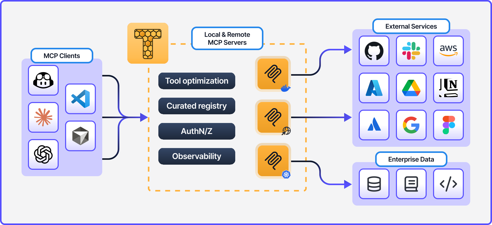
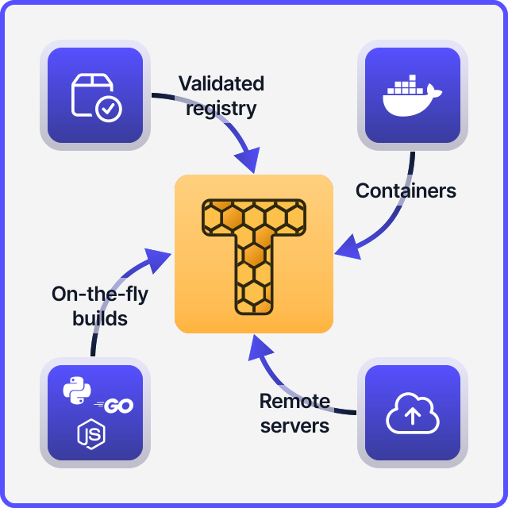

<p float="left">
  <picture>
    
  </picture>
  <picture>
    <source media="(prefers-color-scheme: dark)" srcset="docs/images/toolhive-wordmark-white.png">
    
  </picture>
</p>

[](https://github.com/stacklok/toolhive/releases)
|
[](https://github.com/stacklok/toolhive/actions/workflows/run-on-main.yml)
|
[](https://opensource.org/licenses/Apache-2.0)
|
[](https://github.com/stacklok/toolhive)
|
[](https://discord.gg/stacklok)

# ToolHive - simplify and secure MCP servers

**Run any Model Context Protocol (MCP) server — securely, instantly, anywhere.**

ToolHive is the easiest way to discover, deploy, and manage MCP servers. Launch
any MCP server in a locked-down container with a single command. No manual
setup, no security headaches, no runtime hassles.

<picture>
  <source media="(prefers-color-scheme: dark)" srcset="docs/images/toolhive-diagram-dark.svg">
  
</picture>

---

<table>
<tr>
<td width="50%">

## Why ToolHive?

- **Instant deployment:** Start any MCP server with one command, using Docker or
  Kubernetes.
- **Secure by default:** Every server runs in an isolated container with only
  the permissions it needs. Secrets are managed securely, never in plaintext.
- **Works everywhere:** Use the CLI for local development, or the Kubernetes
  Operator for production and scale.
- **Seamless integration:** ToolHive auto-configures popular clients like GitHub
  Copilot, Cursor, and more.

## Quick links

- 📚 [Documentation](https://docs.stacklok.com/toolhive/)
- 🚀 [Quickstart guide](https://docs.stacklok.com/toolhive/quickstart)
- 💬 [Discord](https://discord.gg/stacklok)

<br>
</td>
<td width="50%" align="center">
  <picture>
    <source media="(prefers-color-scheme: dark)" srcset="docs/images/toolhive-sources-dark.svg">
    
  </picture>
</td>
</tr>
</table>

---

## Quickstart

To get started, make sure you have Docker or Podman installed.

### Install the ToolHive CLI

macOS (or Linux) with Homebrew:

```sh title="Install ToolHive CLI"
brew tap stacklok/tap
brew install thv
```

Windows:

```sh
winget install stacklok.thv
```

Or download the latest binary from
[GitHub releases](https://github.com/stacklok/toolhive/releases/latest)

### Run your first MCP server

1. Enable client auto-discovery (optional):

   ```sh
   thv config auto-discovery true
   ```

2. Run the Fetch MCP server:

   ```sh
   thv run fetch
   ```

3. List running servers:

   ```sh
   thv list
   ```

If you enabled auto-discovery, your
[supported client](https://docs.stacklok.com/toolhive/reference/client-compatibility)
can now use the `fetch` MCP tool to retrieve website content. You might need to
restart your client for changes to take effect.

### Next steps

ToolHive can run any MCP server from the built-in registry, custom container
images, or even build images on the fly from source packages.

FWant to explore more? Run:

```sh
thv registry list
```

This will show additional MCP servers available in the built-in registry that
you can run with ToolHive.

For more details, see the
[Quickstart guide](https://docs.stacklok.com/toolhive/quickstart).

---

## Contributing

We welcome contributions and feedback from the community!

- 🐛 [Report issues](https://github.com/stacklok/toolhive/issues)
- 🤝 [Contributing guide](./CONTRIBUTING.md)

If you have ideas, suggestions, or want to get involved, check out our
contributing guide or open an issue. Join us in making ToolHive even better!

---

## License

This project is licensed under the [Apache 2.0 License](./LICENSE).

<!-- markdownlint-disable-file first-line-heading no-inline-html -->
