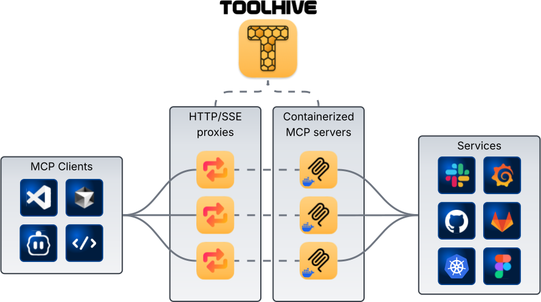
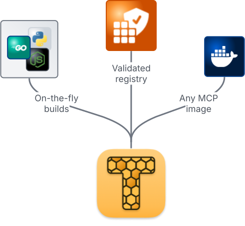

  <picture>
    
  </picture>
  <picture>
    <source media="(prefers-color-scheme: dark)" srcset="docs/images/toolhive-wordmark-white.png">
    
  </picture>
  <picture>
    
  </picture>

[![Release][release-img]][release] [![Build status][ci-img]][ci]
[![License: Apache 2.0][license-img]][license]
[![Star on GitHub][stars-img]][stars] [![Discord][discord-img]][discord]

# ToolHive - simplify and secure MCP servers

**Run any Model Context Protocol (MCP) server — securely, instantly, anywhere.**

ToolHive is the easiest way to discover, deploy, and manage MCP servers. Launch
any MCP server in a locked-down container with a single command. No manual
setup, no security headaches, no runtime hassles.

<picture>
  <source media="(prefers-color-scheme: dark)" srcset="docs/images/toolhive-diagram-dark.svg">
  
</picture>

---

<table>
<tr>
<td width="50%">

## Why ToolHive?

- **Instant deployment:** Start any MCP server with one command, using Docker or
  Kubernetes.
- **Secure by default:** Every server runs in an isolated container with only
  the permissions it needs. Secrets are managed securely, never in plaintext.
- **Works everywhere:** Use the CLI for local development, or the Kubernetes
  Operator for production and scale.
- **Seamless integration:** ToolHive auto-configures popular clients like GitHub
  Copilot, Cursor, and more.

## Quick links

- 📚 [Documentation](https://docs.stacklok.com/toolhive/)
- 🚀 [Quickstart guide](https://docs.stacklok.com/toolhive/quickstart)
- 💬 [Discord](https://discord.gg/stacklok)

 
</td>
<td width="50%" align="center">
  <picture>
    <source media="(prefers-color-scheme: dark)" srcset="docs/images/toolhive-sources-dark.svg">
    
  </picture>
</td>
</tr>
</table>

---

## Contributing

We welcome contributions and feedback from the community!

- 🐛 [Report issues](https://github.com/stacklok/toolhive/issues)
- 💬 [Join our Discord](https://discord.gg/stacklok)
- 🤝 [Contributing guide](./CONTRIBUTING.md)
- 📖 [Developer guide](./docs/README.md)

If you have ideas, suggestions, or want to get involved, check out our
contributing guide or open an issue. Join us in making ToolHive even better!

---

## License

This project is licensed under the [Apache 2.0 License](./LICENSE).

<!-- Badge links -->
<!-- prettier-ignore-start -->
[release-img]: https://img.shields.io/github/v/release/stacklok/toolhive?style=flat&label=Latest%20version
[release]: https://github.com/stacklok/toolhive/releases/latest
[ci-img]: https://img.shields.io/github/actions/workflow/status/stacklok/toolhive/run-on-main.yml?style=flat&logo=github&label=Build
[ci]: https://github.com/stacklok/toolhive/actions/workflows/run-on-main.yml
[license-img]: https://img.shields.io/badge/License-Apache2.0-blue.svg?style=flat
[license]: https://opensource.org/licenses/Apache-2.0
[stars-img]: https://img.shields.io/github/stars/stacklok/toolhive.svg?style=flat&logo=github&label=Stars
[stars]: https://github.com/stacklok/toolhive
[discord-img]: https://img.shields.io/discord/1184987096302239844?style=flat&logo=discord&logoColor=white&label=Discord
[discord]: https://discord.gg/stacklok
<!-- prettier-ignore-end -->

<!-- markdownlint-disable-file first-line-heading no-inline-html -->
