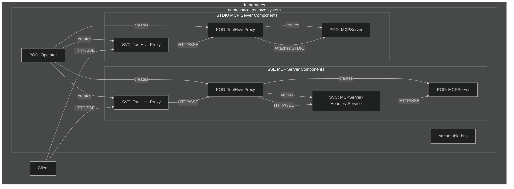

# ToolHive Kubernetes Operator

The ToolHive Kubernetes Operator manages MCP (Model Context Protocol) servers in Kubernetes clusters. It allows you to define MCP servers as Kubernetes resources and automates their deployment and management.

This operator is built using [Kubebuilder](https://book.kubebuilder.io/), a framework for building Kubernetes APIs using Custom Resource Definitions (CRDs).

## Overview

The operator introduces Custom Resource Definitions (CRDs) for managing MCP infrastructure in Kubernetes:

- **MCPServer**: Represents an individual MCP server deployment
- **MCPRegistry**: Manages collections of MCP server definitions and their lifecycle

When you create these resources, the operator automatically:

1. Creates a Deployment to run the MCP server
2. Sets up a Service to expose the MCP server
3. Configures the appropriate permissions and settings
4. Manages the lifecycle of the MCP server



## Installation

### Prerequisites

- Kubernetes cluster (v1.19+)
- kubectl configured to communicate with your cluster

### Installing the Operator via Helm

1. Install the CRD:

```bash
helm upgrade -i toolhive-operator-crds oci://ghcr.io/stacklok/toolhive/toolhive-operator-crds
```

2. Install the operator:

```bash
helm upgrade -i <release_name> oci://ghcr.io/stacklok/toolhive/toolhive-operator --version=<version> -n toolhive-system --create-namespace
```

## Usage

### Creating an MCP Registry

To manage collections of MCP servers, you can define an `MCPRegistry` resource that references server definitions stored in ConfigMaps.

First we can create the `ConfigMap` from the project's registry daya:
```bash
kubectl create cm --from-file pkg/registry/data/registry.json thv-registry
``

Then reference it in the created `MCPRegistry`:

```yaml
apiVersion: toolhive.stacklok.dev/v1alpha1
kind: MCPRegistry
metadata:
  name: database-registry
  namespace: toolhive-system
spec:
  displayName: "Database MCP Server Registry"
  source:
    type: configmap
    configmap:
      name: thv-registry
      key: registry.json
  syncPolicy:
    interval: "1h"  # Enable automatic sync every hour
  filter:
    names:
      include:
        - "database"  # Only servers tagged with "database'
```

### Creating an MCP Server

To create an MCP server, define an `MCPServer` resource and apply it to your cluster:

```yaml
apiVersion: toolhive.stacklok.dev/v1alpha1
kind: MCPServer
metadata:
  name: fetch
spec:
  image: docker.io/mcp/fetch
  transport: stdio
  port: 8080
  permissionProfile:
    type: builtin
    name: network
  resources:
    limits:
      cpu: "100m"
      memory: "128Mi"
    requests:
      cpu: "50m"
      memory: "64Mi"
```

Apply this resource:

```bash
kubectl apply -f your-mcpserver.yaml
```

### Using Secrets

For MCP servers that require authentication tokens or other secrets:

```yaml
apiVersion: toolhive.stacklok.dev/v1alpha1
kind: MCPServer
metadata:
  name: github
  namespace: toolhive-system
spec:
  image: ghcr.io/github/github-mcp-server
  transport: stdio
  port: 8080
  permissionProfile:
    type: builtin
    name: network
  secrets:
    - name: github-token
      key: token
      targetEnvName: GITHUB_PERSONAL_ACCESS_TOKEN
```

First, create the secret:

```bash
kubectl create secret generic github-token -n toolhive-system --from-literal=token=<YOUR_GITHUB_TOKEN>
```

Then apply the MCPServer resource.

The `secrets` field has the following parameters:
- `name`: The name of the Kubernetes secret (required)
- `key`: The key in the secret itself (required)
- `targetEnvName`: The environment variable to be used when setting up the secret in the MCP server (optional). If left unspecified, it defaults to the key.

### Manual Registry Synchronization

You can trigger manual synchronization of an MCPRegistry by adding an annotation:

```bash
kubectl annotate mcpregistry my-registry toolhive.stacklok.dev/sync-trigger="$(date +%s)"
```

Every time the annotation value changes, a new synchronization is triggered.

### Checking Resource Status

To check the status of your MCP registries:

```bash
kubectl get mcpregistries
```

To check the status of your MCP servers:

```bash
kubectl get mcpservers
```

This will show the status, URL, and age of each resource.

For more details about a specific resource:

```bash
kubectl describe mcpregistry <name>
kubectl describe mcpserver <name>
```

## Configuration Reference

### MCPServer Spec

| Field               | Description                                      | Required | Default |
|---------------------|--------------------------------------------------|----------|---------|
| `image`             | Container image for the MCP server               | Yes      | -       |
| `transport`         | Transport method (stdio, streamable-http or sse) | No       | stdio   |
| `port`              | Port to expose the MCP server on                 | No       | 8080    |
| `targetPort`        | Port that MCP server listens to                  | No       | -       |
| `args`              | Additional arguments to pass to the MCP server   | No       | -       |
| `env`               | Environment variables to set in the container    | No       | -       |
| `volumes`           | Volumes to mount in the container                | No       | -       |
| `resources`         | Resource requirements for the container          | No       | -       |
| `secrets`           | References to secrets to mount in the container  | No       | -       |
| `permissionProfile` | Permission profile configuration                 | No       | -       |
| `tools`             | Allow-list filter on the list of tools           | No       | -       |

### MCPRegistry Spec

| Field         | Description                                        | Required | Default      |
|---------------|----------------------------------------------------|----------|--------------|
| `displayName` | Human-readable name for the registry               | No       | -            |
| `source`      | Configuration for the registry data source        | Yes      | -            |
| `syncPolicy`  | Automatic synchronization configuration           | No       | Manual only  |
| `filter`      | Include/exclude patterns for registry content     | No       | -            |

#### Source Configuration

| Field        | Description                                      | Required | Default       |
|--------------|--------------------------------------------------|----------|---------------|
| `type`       | Type of source (currently only "configmap")      | Yes      | `configmap`     |
| `format`     | Data format (only "toolhive" is supported)       | No       | `toolhive`      |
| `configmap`  | ConfigMap source configuration                   | Yes      | -             |

#### ConfigMap Source

| Field       | Description                                        | Required | Default       |
|-------------|-----------------------------------------------------|----------|---------------|
| `name`      | Name of the ConfigMap containing registry data    | Yes      | -             |
| `namespace` | Namespace of the ConfigMap (defaults to registry namespace) | No | Same as registry |
| `key`       | Key in the ConfigMap containing the registry data | No       | `registry.json` |

#### Sync Policy

| Field      | Description                                      | Required | Default |
|------------|--------------------------------------------------|----------|---------|
| `interval` | Automatic sync interval (Go duration format)    | Yes      | -       |

Examples: "1h", "30m", "24h"

#### Filter Configuration

| Field   | Description                    | Required | Default |
|---------|--------------------------------|----------|---------|
| `names` | Name-based filtering patterns  | No       | -       |
| `tags`  | Tag-based filtering patterns   | No       | -       |

##### Name Filter

| Field     | Description                              | Required | Default |
|-----------|------------------------------------------|----------|---------|
| `include` | List of glob patterns to include         | No       | -       |
| `exclude` | List of glob patterns to exclude         | No       | -       |

##### Tag Filter

| Field     | Description                        | Required | Default |
|-----------|------------------------------------|----------|---------|
| `include` | List of tags to include            | No       | -       |
| `exclude` | List of tags to exclude            | No       | -       |

### Permission Profiles

Permission profiles can be configured in two ways:

1. Using a built-in profile:

```yaml
permissionProfile:
  type: builtin
  name: network  # or "none"
```

2. Using a ConfigMap:

```yaml
permissionProfile:
  type: configmap
  name: my-permission-profile
  key: profile.json
```

The ConfigMap should contain a JSON permission profile.

## Examples

See the `examples/operator/mcp-servers/` directory for example MCPServer resources.

## Development

### Building the Operator

To build the operator:

```bash
go build -o bin/thv-operator cmd/thv-operator/main.go
```

### Running Locally

For development, you can run the operator locally:

```bash
go run cmd/thv-operator/main.go
```

This will use your current kubeconfig to connect to the cluster.

### Using Kubebuilder

This operator is scaffolded using Kubebuilder. If you want to make changes to the API or controller, you can use Kubebuilder commands to help you.

#### Prerequisites

- Install Kubebuilder: https://book.kubebuilder.io/quick-start.html#installation

#### Common Commands

Generate CRD manifests:
```bash
kubebuilder create api --group toolhive --version v1alpha1 --kind MCPServer
```

Update CRD manifests after changing API types:
```bash
task operator-manifests
```

Run the controller locally:
```bash
task operator-run
```

#### Project Structure

The Kubebuilder project structure is as follows:

- `api/v1alpha1/`: Contains the API definitions for the CRDs
- `controllers/`: Contains the reconciliation logic for the controllers
- `config/`: Contains the Kubernetes manifests for deploying the operator
- `PROJECT`: Kubebuilder project configuration file

For more information on Kubebuilder, see the [Kubebuilder Book](https://book.kubebuilder.io/).
