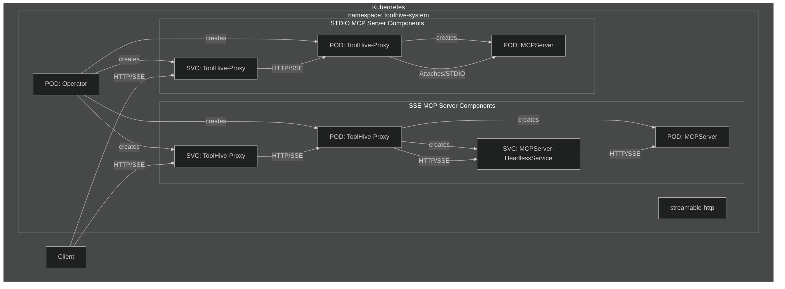

# ToolHive Kubernetes Operator

The ToolHive Kubernetes Operator manages MCP (Model Context Protocol) servers in Kubernetes clusters. It allows you to define MCP servers as Kubernetes resources and automates their deployment and management.

This operator is built using [Kubebuilder](https://book.kubebuilder.io/), a framework for building Kubernetes APIs using Custom Resource Definitions (CRDs).

## Overview

The operator introduces a new Custom Resource Definition (CRD) called `MCPServer` that represents an MCP server in Kubernetes. When you create an `MCPServer` resource, the operator automatically:

1. Creates a Deployment to run the MCP server
2. Sets up a Service to expose the MCP server
3. Configures the appropriate permissions and settings
4. Manages the lifecycle of the MCP server



## Installation

## Running Operator Unit & Integration Tests

To run the basic operator-only tests (unit and integration), use the following command from the root of the project:

```bash
task operator:operator-test
```

This will run all Go tests in the operator codebase.

## Running Operator E2E Tests

The `task` commands for the operator are designed to be run from the root of the project.

### E2E Test Prerequisites

To run the Operator end-to-end (E2E) tests locally, ensure you have the following installed:

- [Go](https://golang.org/doc/install)
- [Kind](https://kind.sigs.k8s.io/)
- [Kind Load Balancer](https://kind.sigs.k8s.io/docs/user/loadbalancer/)
- [Task](https://taskfile.dev/#/installation)
- [Chainsaw](https://github.com/kubernetes-sigs/chainsaw) (automatically installed by the Taskfile for local runs)

### Steps

1. **Set up the Kind cluster:**
  ```bash
  task operator:kind-setup
  ```

2. **Run the Operator E2E tests:**
  ```bash
  task operator:operator-e2e-test
  ```

Note: The Taskfile will ensure Chainsaw is installed locally if not present. In CI, Chainsaw is installed via the GitHub Action.

### Prerequisites

- Kubernetes cluster (v1.19+)
- kubectl configured to communicate with your cluster

### Installing the Operator via Helm

1. Install the CRD:

```bash
helm upgrade -i toolhive-operator-crds oci://ghcr.io/stacklok/toolhive/toolhive-operator-crds
```

2. Install the operator:

```bash
helm upgrade -i <release_name> oci://ghcr.io/stacklok/toolhive/toolhive-operator --version=<version> -n toolhive-system --create-namespace
```

## Usage

### Creating an MCP Server

To create an MCP server, define an `MCPServer` resource and apply it to your cluster:

```yaml
apiVersion: toolhive.stacklok.dev/v1alpha1
kind: MCPServer
metadata:
  name: fetch
spec:
  image: docker.io/mcp/fetch
  transport: stdio
  port: 8080
  permissionProfile:
    type: builtin
    name: network
  resources:
    limits:
      cpu: "100m"
      memory: "128Mi"
    requests:
      cpu: "50m"
      memory: "64Mi"
```

Apply this resource:

```bash
kubectl apply -f your-mcpserver.yaml
```

### Using Secrets

For MCP servers that require authentication tokens or other secrets:

```yaml
apiVersion: toolhive.stacklok.dev/v1alpha1
kind: MCPServer
metadata:
  name: github
  namespace: toolhive-system
spec:
  image: ghcr.io/github/github-mcp-server
  transport: stdio
  port: 8080
  permissionProfile:
    type: builtin
    name: network
  secrets:
    - name: github-token
      key: token
      targetEnvName: GITHUB_PERSONAL_ACCESS_TOKEN
```

First, create the secret:

```bash
kubectl create secret generic github-token -n toolhive-system --from-literal=token=<YOUR_GITHUB_TOKEN>
```

Then apply the MCPServer resource.

The `secrets` field has the following parameters:
- `name`: The name of the Kubernetes secret (required)
- `key`: The key in the secret itself (required)
- `targetEnvName`: The environment variable to be used when setting up the secret in the MCP server (optional). If left unspecified, it defaults to the key.

### Checking MCP Server Status

To check the status of your MCP servers:

```bash
kubectl get mcpservers
```

This will show the status, URL, and age of each MCP server.

For more details about a specific MCP server:

```bash
kubectl describe mcpserver <name>
```

## Configuration Reference

### MCPServer Spec

| Field               | Description                                      | Required | Default |
|---------------------|--------------------------------------------------|----------|---------|
| `image`             | Container image for the MCP server               | Yes      | -       |
| `transport`         | Transport method (stdio, streamable-http or sse) | No       | stdio   |
| `port`              | Port to expose the MCP server on                 | No       | 8080    |
| `targetPort`        | Port that MCP server listens to                  | No       | -       |
| `args`              | Additional arguments to pass to the MCP server   | No       | -       |
| `env`               | Environment variables to set in the container    | No       | -       |
| `volumes`           | Volumes to mount in the container                | No       | -       |
| `resources`         | Resource requirements for the container          | No       | -       |
| `secrets`           | References to secrets to mount in the container  | No       | -       |
| `permissionProfile` | Permission profile configuration                 | No       | -       |
| `tools`             | Allow-list filter on the list of tools           | No       | -       |

### Kagent Integration

The ToolHive operator supports optional integration with [kagent](https://kagent.dev), allowing kagent agents to discover and use MCP servers managed by ToolHive. When enabled, the operator automatically creates kagent ToolServer resources that reference the ToolHive-managed MCP servers.

#### Enabling Kagent Integration

To enable kagent integration, set the following Helm value when installing the operator:

```bash
helm upgrade -i toolhive-operator oci://ghcr.io/stacklok/toolhive/toolhive-operator \
  --set kagentIntegration.enabled=true \
  -n toolhive-system --create-namespace
```

Or add it to your values file:

```yaml
kagentIntegration:
  enabled: true
```

#### How It Works

When kagent integration is enabled:

1. For each ToolHive MCPServer resource created, the operator automatically creates a corresponding kagent ToolServer resource
2. The ToolServer resource references the ToolHive-managed MCP server service URL
3. The ToolServer is owned by the MCPServer, ensuring it's deleted when the MCPServer is removed
4. Kagent agents can then discover and use these ToolServers to access the MCP servers

The kagent ToolServer resources are created with:
- Name: `toolhive-<mcpserver-name>`
- Namespace: Same as the MCPServer
- Transport configuration: Mapped from ToolHive transport types (sse → sse, streamable-http → streamableHttp, stdio → sse)
- Service URL: Points to the ToolHive proxy service

#### Requirements

- Kagent must be installed in your cluster
- The operator needs permissions to manage kagent ToolServer resources (automatically configured when integration is enabled)

#### Example

When you create a ToolHive MCPServer:

```yaml
apiVersion: toolhive.stacklok.dev/v1alpha1
kind: MCPServer
metadata:
  name: github
  namespace: toolhive-system
spec:
  image: ghcr.io/github/github-mcp-server
  transport: sse
  port: 8080
```

With kagent integration enabled, the operator automatically creates:

```yaml
apiVersion: kagent.dev/v1alpha1
kind: ToolServer
metadata:
  name: toolhive-github
  namespace: toolhive-system
  labels:
    toolhive.stacklok.dev/managed-by: toolhive-operator
    toolhive.stacklok.dev/mcpserver: github
spec:
  description: "ToolHive MCP Server: github"
  config:
    type: sse
    sse:
      url: http://mcp-github-proxy.toolhive-system.svc.cluster.local:8080
```

Kagent agents can then reference this ToolServer to use the GitHub MCP server in their workflows.

### Permission Profiles

Permission profiles can be configured in two ways:

1. Using a built-in profile:

```yaml
permissionProfile:
  type: builtin
  name: network  # or "none"
```

2. Using a ConfigMap:

```yaml
permissionProfile:
  type: configmap
  name: my-permission-profile
  key: profile.json
```

The ConfigMap should contain a JSON permission profile.

## Examples

See the `examples/operator/mcp-servers/` directory for example MCPServer resources.

## Development

### Building the Operator

To build the operator:

```bash
go build -o bin/thv-operator cmd/thv-operator/main.go
```

### Running Locally

For development, you can run the operator locally:

```bash
go run cmd/thv-operator/main.go
```

This will use your current kubeconfig to connect to the cluster.

### Using Kubebuilder

This operator is scaffolded using Kubebuilder. If you want to make changes to the API or controller, you can use Kubebuilder commands to help you.

#### Prerequisites

- Install Kubebuilder: https://book.kubebuilder.io/quick-start.html#installation

#### Common Commands

Generate CRD manifests:
```bash
kubebuilder create api --group toolhive --version v1alpha1 --kind MCPServer
```

Update CRD manifests after changing API types:
```bash
task operator-manifests
```

Run the controller locally:
```bash
task operator-run
```

#### Project Structure

The Kubebuilder project structure is as follows:

- `api/v1alpha1/`: Contains the API definitions for the CRDs
- `controllers/`: Contains the reconciliation logic for the controllers
- `config/`: Contains the Kubernetes manifests for deploying the operator
- `PROJECT`: Kubebuilder project configuration file

For more information on Kubebuilder, see the [Kubebuilder Book](https://book.kubebuilder.io/).
