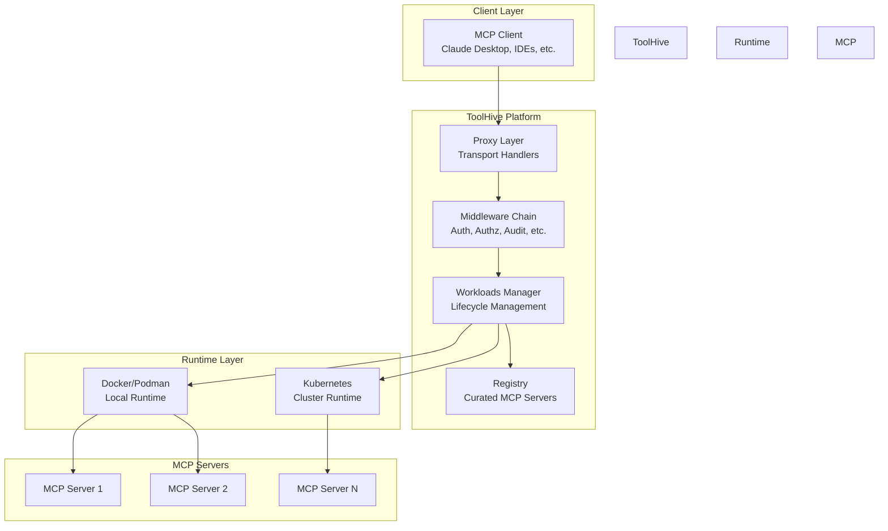
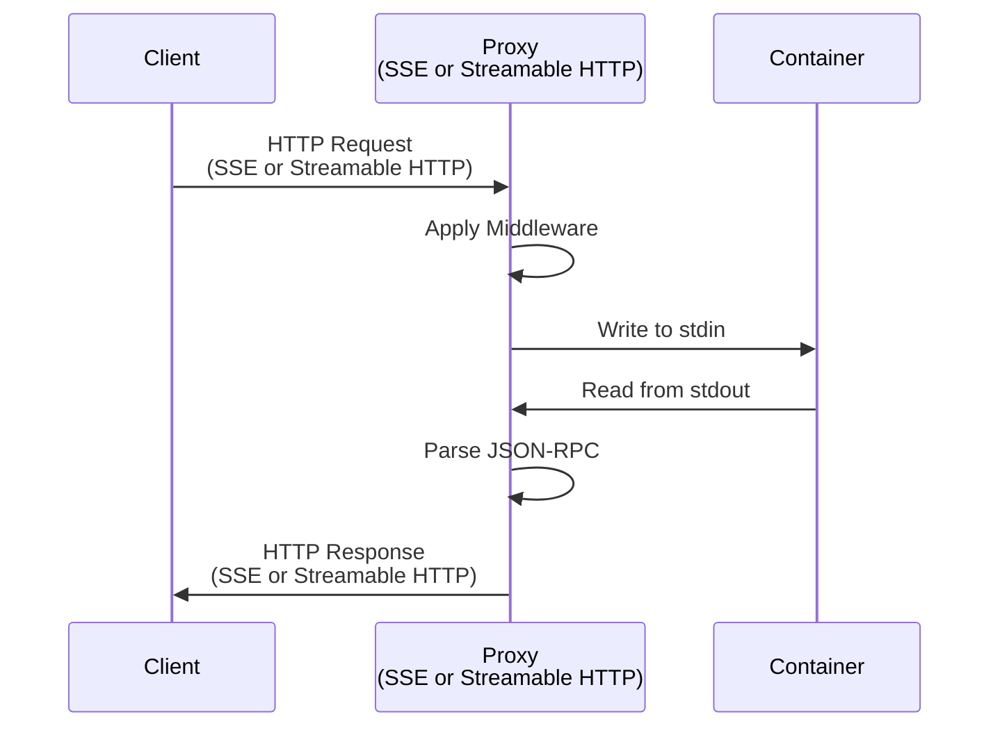
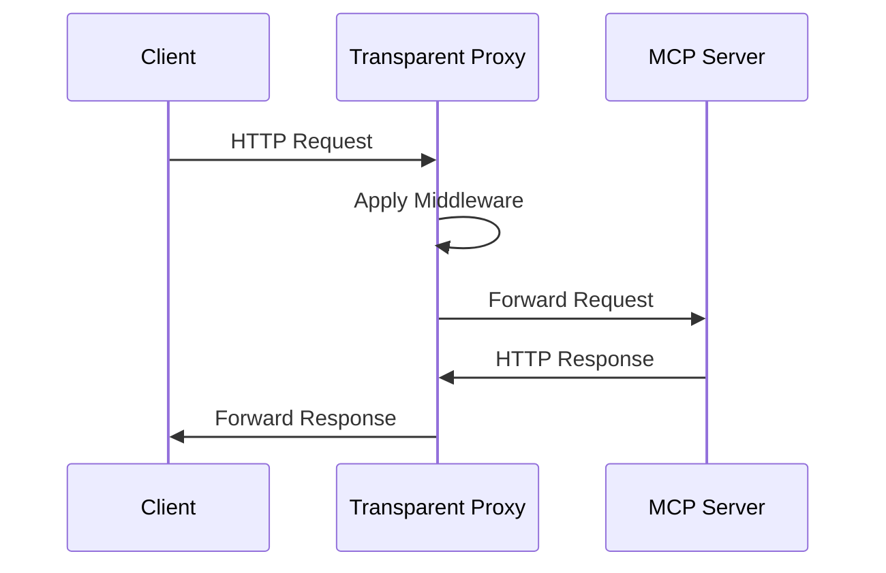

# ToolHive Architecture Overview

## Introduction

ToolHive is a lightweight, secure platform for managing MCP (Model Context Protocol) servers. It provides a comprehensive infrastructure that goes beyond simple container orchestration, offering rich middleware capabilities, security features, and flexible deployment options.

## What is ToolHive?

ToolHive is a **platform** - not just a container runner. It provides the building blocks needed to:

- **Securely deploy** MCP servers with network isolation and permission profiles
- **Proxy and enhance** MCP server communications with middleware
- **Aggregate and compose** multiple MCP servers into unified interfaces
- **Manage at scale** using Kubernetes operators or local deployments
- **Curate and distribute** trusted MCP server registries

The platform is designed to be extensible, allowing developers to build on top of its proxy and middleware capabilities.

## High-Level Architecture



## Key Components

### 1. Command-Line Interface (thv)

The primary CLI tool for managing MCP servers locally. Located in `cmd/thv/`.

**Key responsibilities:**
- Start, stop, restart, and manage MCP server workloads
- Configure middleware, authentication, and authorization
- Export and import workload configurations
- Manage groups and client configurations

**Usage patterns:**
```bash
# Run from registry
thv run server-name

# Run from container image
thv run ghcr.io/example/mcp-server:latest

# Run using protocol schemes
thv run uvx://package-name
thv run npx://package-name
thv run go://package-name
```

### 2. Kubernetes Operator (thv-operator)

Manages MCP servers in Kubernetes clusters. Located in `cmd/thv-operator/`.

**Key responsibilities:**
- Watch and reconcile MCP server custom resources
- Create Deployments, StatefulSets, and Services
- Manage lifecycle of MCP server workloads in Kubernetes
- Provide operator-specific configuration through CRDs

**Key CRDs:**
- `MCPServer` - Defines an MCP server deployment
- `MCPRegistry` - Manages MCP server registries
- `ToolConfig` - Configures tool filtering and overrides

### 3. Proxy Runner (thv-proxyrunner)

A specialized binary used by the Kubernetes operator. Located in `cmd/thv-proxyrunner/`.

**Key responsibilities:**
- Run as proxy container in Kubernetes Deployments
- Create and manage MCP server containers via StatefulSets
- Handle transport-specific proxying (SSE, streamable-http, stdio)
- Apply middleware chain to incoming requests

**Deployment pattern:**
```
Deployment (proxy-runner) -> StatefulSet (MCP server)
```

### 4. Registry API Server (thv-registry-api)

A registry API server for hosting custom MCP server registries. Located in `cmd/thv-registry-api/`.

**Key responsibilities:**
- Serve MCP server registry data
- Support ToolHive's registry format
- Future support for upstream MCP registry format
- Provide file-based and Kubernetes ConfigMap storage

## Core Concepts

### Workloads

A **workload** in ToolHive represents a complete deployment unit that includes:
- Primary MCP server container
- Proxy process (for non-stdio transports)
- Network configurations
- Permission profiles and security policies
- Middleware configuration

**Related files:**
- `pkg/workloads/manager.go:38` - Workload manager interface
- `pkg/container/runtime/types.go:125` - Runtime abstraction

### Transports

ToolHive supports multiple MCP transport protocols as defined in the [MCP specification](https://modelcontextprotocol.io/specification):

1. **stdio** - Standard input/output communication
2. **SSE (Server-Sent Events)** - HTTP-based streaming
3. **streamable-http** - Bidirectional HTTP streaming

**Related files:**
- `pkg/transport/stdio.go` - Stdio transport implementation
- `pkg/transport/proxy/httpsse/http_proxy.go` - SSE proxy
- `pkg/transport/proxy/streamable/streamable_proxy.go` - Streamable HTTP proxy

### Middleware

A layered middleware architecture that provides:
- **Authentication** - JWT token validation
- **Token Exchange** - OAuth 2.0 token exchange
- **MCP Parsing** - JSON-RPC request parsing
- **Tool Filtering** - Control which tools are exposed
- **Authorization** - Cedar policy evaluation
- **Audit** - Request logging and compliance
- **Telemetry** - OpenTelemetry instrumentation

**Related files:**
- `docs/middleware.md` - Complete middleware documentation
- `pkg/runner/middleware.go:15` - Middleware factory registration

### RunConfig

The **RunConfig** is ToolHive's standard configuration format for running MCP servers. It's a serializable JSON/YAML structure that contains all necessary information to deploy an MCP server.

**Key features:**
- Portable and exportable
- Version-controlled schema
- Contains middleware configuration
- Includes permission profiles
- Part of ToolHive's API contract

**Related files:**
- `pkg/runner/config.go:34` - RunConfig struct definition

### Permission Profiles

Security configurations that define:
- **Read/Write mounts** - File system access controls
- **Network permissions** - Outbound/inbound connection rules
- **Privileged mode** - Host device access (use with caution)

**Built-in profiles:**
- `none` - No permissions (default)
- `network` - Allow all network access

**Related files:**
- `pkg/permissions/profile.go:22` - Profile struct definition

### Groups

Logical groupings of MCP servers that share a common purpose or use case. Groups serve as the foundation for:
- **Virtual MCP servers** - Aggregate multiple MCP servers into one
- **Organizational structure** - Group related servers together
- **Access control** - Apply policies at the group level

**Related files:**
- PR #2106 - Virtual MCP server proposal

### Registry

ToolHive ships with a curated registry of trusted MCP servers built from [toolhive-registry](https://github.com/stacklok/toolhive-registry).

**Features:**
- Predefined server configurations
- Version management
- Custom registry support (JSON file or remote endpoint)
- Future support for upstream [MCP registry format](https://github.com/modelcontextprotocol/registry)

**Related files:**
- `cmd/thv-registry-api/` - Registry API server

## Deployment Modes

### Local Mode

ToolHive can run locally in two ways:

#### 1. CLI Mode

Direct command-line usage via `thv` binary:
- Spawns MCP servers as detached processes
- Uses Docker/Podman/Colima for container runtime
- Stores state locally in `~/.toolhive/` or equivalent

#### 2. UI Mode

Via [ToolHive Studio](https://github.com/stacklok/toolhive-studio):
- Spawns a ToolHive API server (`thv serve`)
- Exposes RESTful API for UI operations
- Uses Docker/Podman/Rancher Desktop for containers
- Provides web-based management interface

### Kubernetes Mode

Everything is driven by `thv-operator`:
- Listens for Kubernetes custom resources
- Creates Kubernetes-native resources (Deployments, StatefulSets, Services)
- Uses `thv-proxyrunner` binary (not `thv`)
- Provides cluster-scale management

**Deployment pattern:**
```
Deployment (thv-proxyrunner) -> StatefulSet (MCP server container)
```

## How ToolHive Proxies MCP Traffic

### For Stdio Transport



### For SSE/Streamable HTTP Transports



## Protocol Builds

ToolHive supports automatic containerization of packages using protocol schemes:

- `uvx://package-name` - Python packages via `uv`
- `npx://package-name` - Node.js packages via `npx`
- `go://package-name` - Go packages
- `go://./local-path` - Local Go projects

These are automatically converted to container images at runtime.

## Five Ways to Run an MCP Server

1. **From Registry**: `thv run server-name`
2. **From Container Image**: `thv run ghcr.io/example/mcp:latest`
3. **Using Protocol Scheme**: `thv run uvx://package-name`
4. **From Exported Config**: `thv run --from-config path/to/config.json`
5. **Remote MCP Server**: `thv run <URL>`

## Project Structure

```
toolhive/
├── cmd/
│   ├── thv/                    # Main CLI binary
│   ├── thv-operator/           # Kubernetes operator
│   ├── thv-proxyrunner/        # Proxy runner for K8s
│   └── thv-registry-api/       # Registry API server
├── pkg/
│   ├── api/                    # REST API server
│   ├── auth/                   # Authentication
│   ├── authz/                  # Authorization (Cedar)
│   ├── audit/                  # Audit logging
│   ├── client/                 # Client configuration
│   ├── container/              # Container runtime abstraction
│   ├── permissions/            # Permission profiles
│   ├── registry/               # Registry management
│   ├── runner/                 # MCP server execution
│   ├── transport/              # Transport implementations
│   ├── workloads/              # Workload lifecycle
│   └── ...
├── docs/
│   ├── arch/                   # Architecture documentation
│   └── middleware.md           # Middleware documentation
└── deploy/
    └── charts/                 # Helm charts
```

## Related Documentation

- [Deployment Modes](01-deployment-modes.md) - Detailed deployment patterns
- [Core Concepts](02-core-concepts.md) - Deep dive into nouns and verbs
- [Transport Architecture](03-transport-architecture.md) - Transport handlers and proxies
- [Middleware](../middleware.md) - Middleware chain and extensibility
- [RunConfig and Permissions](05-runconfig-and-permissions.md) - Configuration schema
- [Registry System](06-registry-system.md) - Registry architecture
- [Groups](07-groups.md) - Groups and organization
- [Workloads Lifecycle](08-workloads-lifecycle.md) - Workload management
- [Operator Architecture](09-operator-architecture.md) - Kubernetes operator design

## Getting Started

For developers building on ToolHive, start with:

1. Read [Core Concepts](02-core-concepts.md) to understand terminology
2. Review [Middleware](../middleware.md) to extend functionality
3. Explore [RunConfig and Permissions](05-runconfig-and-permissions.md) for configuration
4. Check [Deployment Modes](01-deployment-modes.md) for platform-specific implementations

## Contributing

When contributing to ToolHive's architecture:

1. Ensure changes maintain the platform abstraction
2. Add middleware as composable components
3. Keep RunConfig as part of the API contract (versioned schema)
4. Follow the factory pattern for runtime-specific implementations
5. Update architecture documentation when adding new concepts
