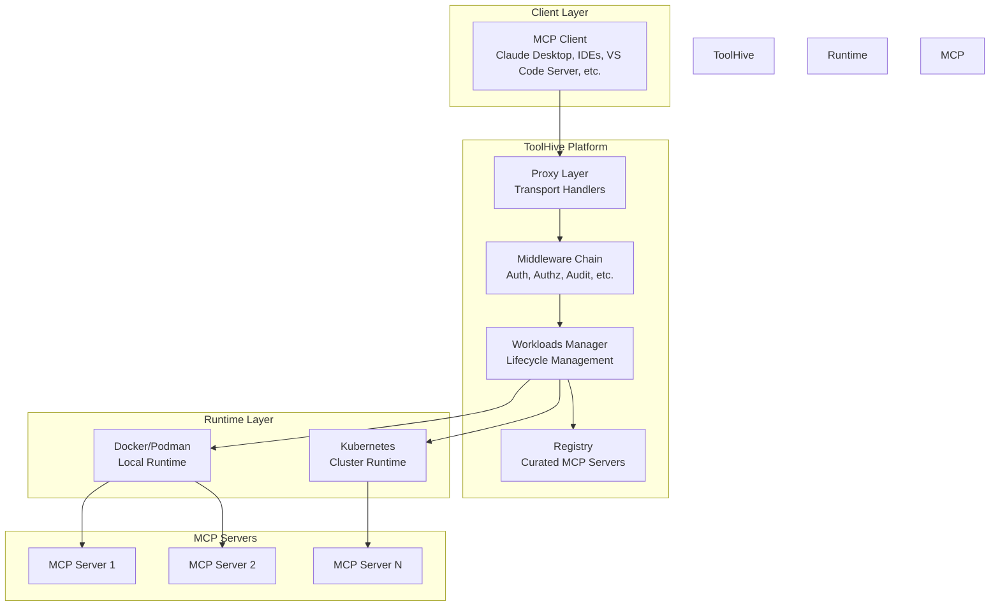
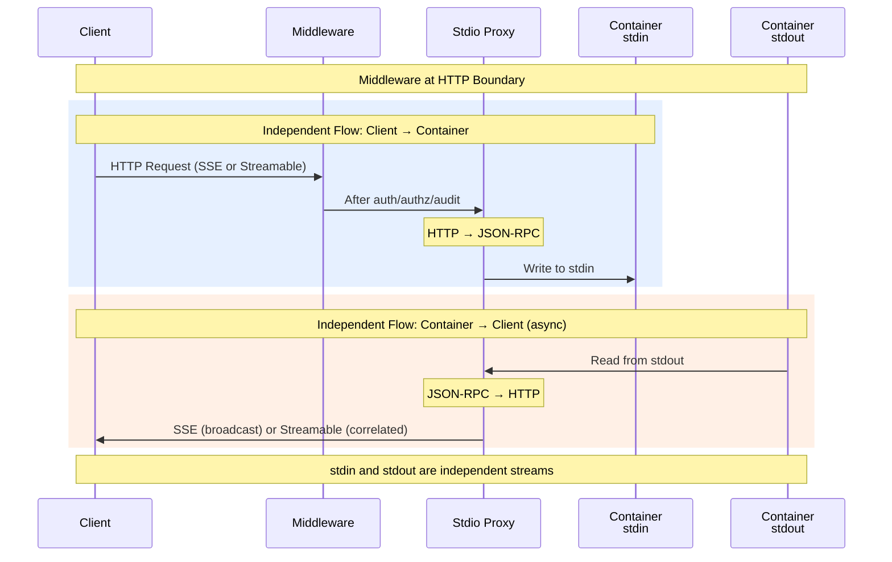
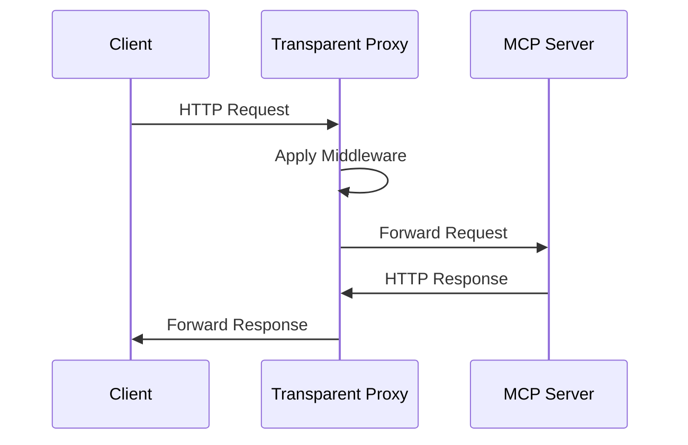

# ToolHive Architecture Overview

## Introduction

ToolHive is a lightweight, secure platform for managing MCP (Model Context Protocol) servers. It provides a comprehensive infrastructure that goes beyond simple container orchestration, offering rich middleware capabilities, security features, and flexible deployment options.

## What is ToolHive?

ToolHive is a **platform** - not just a container runner. It provides the building blocks needed to:

- **Securely deploy** MCP servers with network isolation and permission profiles
- **Proxy and enhance** MCP server communications with middleware
- **Aggregate and compose** multiple MCP servers into unified interfaces
- **Manage at scale** using Kubernetes operators or local deployments
- **Curate and distribute** trusted MCP server registries

The platform is designed to be extensible, allowing developers to build on top of its proxy and middleware capabilities.

## High-Level Architecture



## Key Components

### 1. Command-Line Interface (thv)

The primary CLI tool for managing MCP servers locally. Located in `cmd/thv/`.

**Key responsibilities:**
- Start, stop, restart, and manage MCP server workloads
- Configure middleware, authentication, and authorization
- Export and import workload configurations
- Manage groups and client configurations

**Usage patterns:**
```bash
# Run from registry
thv run server-name

# Run from container image
thv run ghcr.io/example/mcp-server:latest

# Run using protocol schemes
thv run uvx://package-name
thv run npx://package-name
thv run go://package-name
```

### 2. Kubernetes Operator (thv-operator)

Manages MCP servers in Kubernetes clusters using custom resources.

The operator watches for `MCPServer`, `MCPRegistry`, `MCPToolConfig`, `MCPExternalAuthConfig`, `MCPGroup`, and `VirtualMCPServer` CRDs, reconciling them into Kubernetes resources (Deployments, StatefulSets, Services).

**For details**, see:
- [`cmd/thv-operator/README.md`](../../cmd/thv-operator/README.md) - Operator overview and usage
- [`cmd/thv-operator/DESIGN.md`](../../cmd/thv-operator/DESIGN.md) - Design decisions and patterns
- [`docs/operator/crd-api.md`](../operator/crd-api.md) - Complete CRD API reference
- [Operator Architecture](09-operator-architecture.md) - Architecture documentation

### 3. Proxy Runner (thv-proxyrunner)

A specialized binary used by the Kubernetes operator. Located in `cmd/thv-proxyrunner/`.

**Key responsibilities:**
- Run as proxy container in Kubernetes Deployments
- Dynamically create and manage MCP server StatefulSets via the Kubernetes API
- Handle transport-specific proxying (SSE, streamable-http, stdio)
- Apply middleware chain to incoming requests

**Deployment pattern:**
```
Deployment (proxy-runner) -> StatefulSet (MCP server)
```

### 4. Registry Server (thv-registry-api)

For enterprise registry deployments, [ToolHive Registry Server](https://github.com/stacklok/toolhive-registry-server) implements the MCP Registry API.

**Key capabilities:**
- Multiple registry types (Git, API, File, Managed, Kubernetes)
- PostgreSQL backend for scalable storage
- Enterprise OAuth 2.0/OIDC authentication
- Background synchronization with automatic updates

ToolHive CLI connects to registry servers via `thv config set-registry <url>`. For details, see [Registry System](06-registry-system.md).

### 5. Virtual MCP Server (vmcp)

An MCP Gateway that aggregates multiple backend MCP servers into a single unified interface. Located in `cmd/vmcp/`.

**Key responsibilities:**
- Aggregate tools, resources, and prompts from multiple backends
- Resolve naming conflicts when backends expose duplicate tool names
- Execute composite workflows across multiple backends
- Handle two-boundary authentication (incoming clients and outgoing backends)

**For details**, see [Virtual MCP Server Architecture](10-virtual-mcp-architecture.md).

## Core Concepts

For detailed definitions and relationships, see [Core Concepts](02-core-concepts.md).

**Key concepts:**
- **Workloads** - Complete deployment units (container + proxy + config)
- **Transports** - Communication protocols (stdio, SSE, streamable-http)
- **Middleware** - Composable request processing layers
- **RunConfig** - Portable configuration format
- **Permission Profiles** - Security policies
- **Groups** - Logical server collections
- **Registry** - Catalog of trusted MCP servers
- **Virtual MCP Server** - Aggregates multiple backends into unified interface

## Deployment Modes

### Local Mode

ToolHive can run locally in two ways:

#### 1. CLI Mode

Direct command-line usage via `thv` binary:
- Spawns MCP servers as detached processes
- Uses Docker/Podman/Colima/Rancher Desktop for container runtime
- Stores state using XDG Base Directory Specification (typically `~/.config/toolhive/`, `~/.local/state/toolhive/`)

#### 2. UI Mode

Via [ToolHive Studio](https://github.com/stacklok/toolhive-studio):
- Spawns a ToolHive API server (`thv serve`)
- Exposes RESTful API for UI operations
- Uses Docker/Podman/Colima/Rancher Desktop for containers
- Provides web-based management interface

### Kubernetes Mode

Everything is driven by `thv-operator`:
- Listens for Kubernetes custom resources
- Creates Kubernetes-native resources (Deployments, StatefulSets, Services)
- Uses `thv-proxyrunner` binary (not `thv`)
- Provides cluster-scale management

**Deployment pattern:**
```
Deployment (thv-proxyrunner) -> StatefulSet (MCP server container)
```

## How ToolHive Proxies MCP Traffic

### For Stdio Transport



### For SSE/Streamable HTTP Transports



## Protocol Builds

ToolHive supports automatic containerization of packages using protocol schemes:

- `uvx://package-name` - Python packages via `uv`
- `npx://package-name` - Node.js packages via `npx`
- `go://package-name` - Go packages
- `go://./local-path` - Local Go projects

These are automatically converted to container images at runtime.

## Five Ways to Run an MCP Server

1. **From Registry**: `thv run server-name`
2. **From Container Image**: `thv run ghcr.io/example/mcp:latest`
3. **Using Protocol Scheme**: `thv run uvx://package-name`
4. **From Exported Config**: `thv run --from-config path/to/config.json` - Useful for sharing configurations, migrating workloads, or version-controlling server setups
5. **Remote MCP Server**: `thv run <URL>`

## Related Documentation

- [Deployment Modes](01-deployment-modes.md) - Detailed deployment patterns
- [Core Concepts](02-core-concepts.md) - Deep dive into nouns and verbs
- [Transport Architecture](03-transport-architecture.md) - Transport handlers and proxies
- [Middleware](../middleware.md) - Middleware chain and extensibility
- [RunConfig and Permissions](05-runconfig-and-permissions.md) - Configuration schema
- [Registry System](06-registry-system.md) - Registry architecture
- [Groups](07-groups.md) - Groups and organization
- [Workloads Lifecycle](08-workloads-lifecycle.md) - Workload management
- [Operator Architecture](09-operator-architecture.md) - Kubernetes operator design
- [Virtual MCP Server Architecture](10-virtual-mcp-architecture.md) - MCP Gateway and aggregation
- [Auth Server Storage](11-auth-server-storage.md) - Memory and Redis Sentinel storage backends

## Getting Started

For developers building on ToolHive, start with:

1. Read [Core Concepts](02-core-concepts.md) to understand terminology
2. Review [Middleware](../middleware.md) to extend functionality
3. Explore [RunConfig and Permissions](05-runconfig-and-permissions.md) for configuration
4. Check [Deployment Modes](01-deployment-modes.md) for platform-specific implementations

## Contributing

When contributing to ToolHive's architecture:

1. Ensure changes maintain the platform abstraction
2. Add middleware as composable components
3. Keep RunConfig as part of the API contract (versioned schema)
4. Follow the factory pattern for runtime-specific implementations
5. Update architecture documentation when adding new concepts
