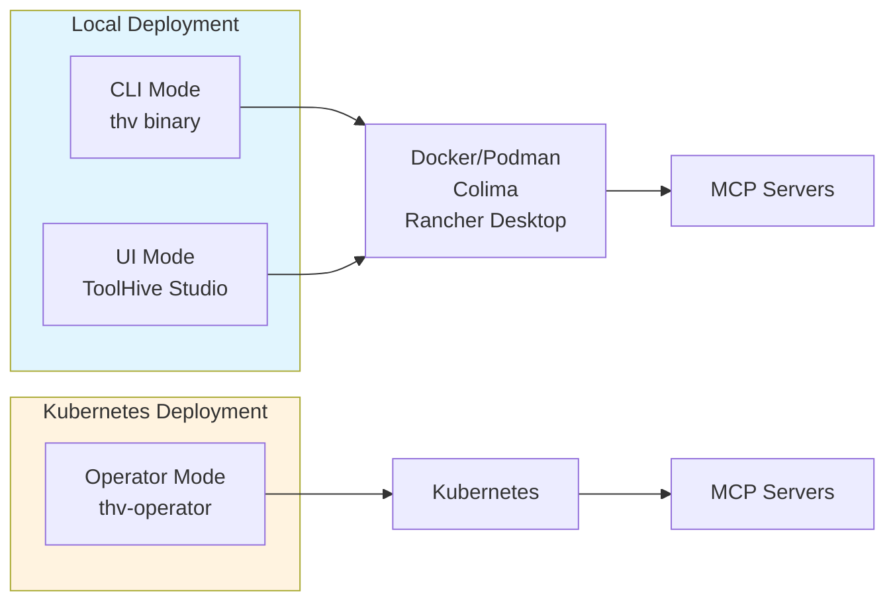
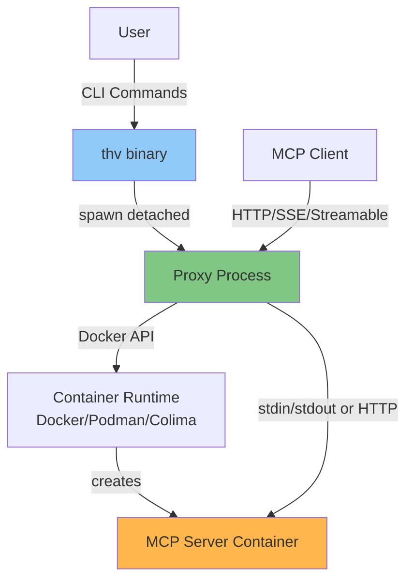
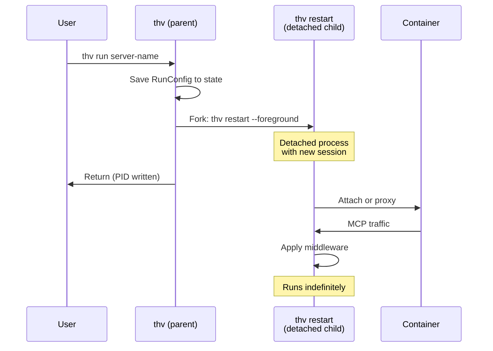
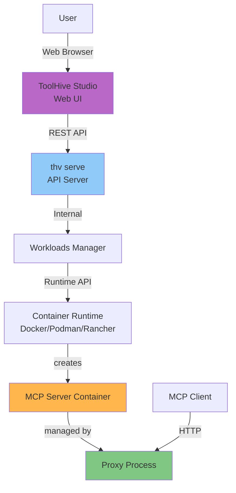
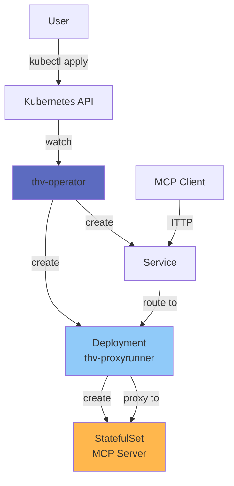
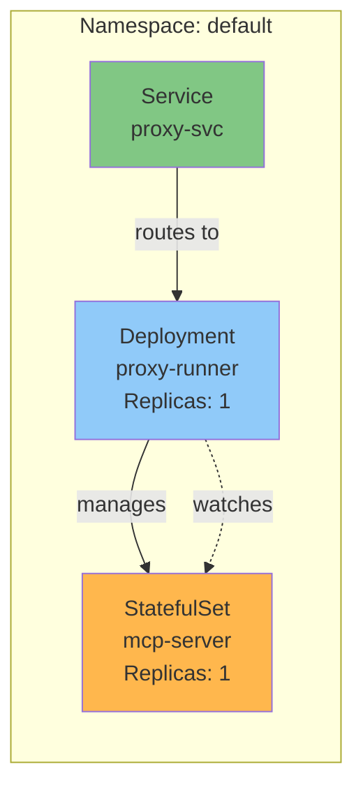
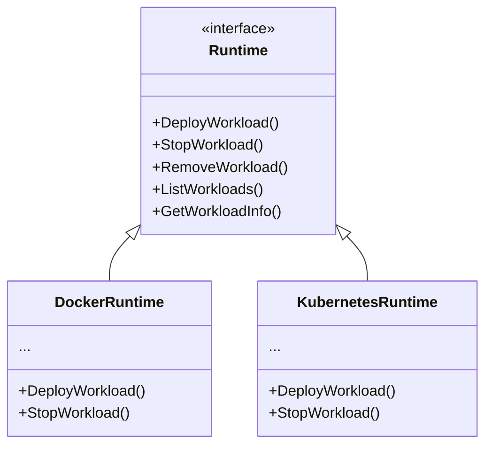

# Deployment Modes

ToolHive supports three distinct deployment modes, each optimized for different use cases and environments. This document provides a detailed explanation of how ToolHive operates in each mode.

## Overview



## Mode Comparison

| Feature | Local CLI | Local UI | Kubernetes |
|---------|-----------|----------|------------|
| **Binary** | `thv` | `thv` (API server) | `thv-operator` + `thv-proxyrunner` |
| **Container Runtime** | Docker/Podman/Colima | Docker/Podman/Rancher | Kubernetes |
| **Process Management** | Detached processes | API-managed | Operator-managed |
| **State Storage** | Local filesystem | Local filesystem | etcd (K8s API) |
| **Scaling** | Single machine | Single machine | Cluster-wide |
| **Best For** | Developers, CLI users | UI users, beginners | Production, multi-tenant |

## Local Mode: CLI

### Architecture



### How It Works

1. **User executes command**: `thv run server-name`

2. **ToolHive CLI (`cmd/thv/main.go`)**:
   - Parses command-line arguments
   - Loads or creates RunConfig
   - Instantiates workloads API (`pkg/workloads/manager.go:38`)

3. **Workload Manager**:
   - Detects available container runtime (Podman → Colima → Docker)
   - Creates container via Runtime API
   - Spawns detached proxy process

4. **Proxy Process**:
   - Runs as independent process (via `thv restart --foreground`)
   - Attaches to container (for stdio) or forwards HTTP traffic
   - Applies middleware chain
   - Exposes local HTTP endpoint for MCP clients

5. **State Management**:
   - RunConfig saved to `~/.toolhive/state/` (or XDG equivalent)
   - PID file for process management
   - Status file for workload state tracking

### Container Runtime Selection

**Implementation**: `pkg/container/factory.go`

The CLI automatically detects container runtimes in this order:

1. **Podman** - Checks for Podman socket at:
   - `$TOOLHIVE_PODMAN_SOCKET`
   - `$XDG_RUNTIME_DIR/podman/podman.sock`
   - `/run/podman/podman.sock`

2. **Colima** - Checks for Colima socket at:
   - `$TOOLHIVE_COLIMA_SOCKET`
   - `~/.colima/default/docker.sock`

3. **Docker** - Checks for Docker socket at:
   - `$TOOLHIVE_DOCKER_SOCKET`
   - `/var/run/docker.sock`

### Detached Process Model

When running in detached mode (`thv run` without `--foreground`):



**Key Implementation**:
- `pkg/workloads/manager.go:357` - `RunWorkloadDetached` method
- Uses `exec.Command` with `SysProcAttr` to detach
- Sets `TOOLHIVE_DETACHED=true` environment variable
- Redirects stdout/stderr to log file: `~/.toolhive/logs/<workload>.log`

### File Locations

| Purpose | Path (Linux) | Path (macOS) |
|---------|--------------|--------------|
| State files | `~/.local/state/toolhive/` | `~/Library/Application Support/toolhive/` |
| Config files | `~/.config/toolhive/` | `~/Library/Application Support/toolhive/` |
| Cache files | `~/.cache/toolhive/` | `~/Library/Caches/toolhive/` |
| Log files | `~/.local/state/toolhive/logs/` | `~/Library/Application Support/toolhive/logs/` |

**Implementation**: Uses `adrg/xdg` package for XDG Base Directory compliance.

## Local Mode: UI

### Architecture



### How It Works

1. **User starts UI**: ToolHive Studio application launches

2. **Studio spawns API server**: `thv serve`
   - Starts HTTP API server on configurable port (default: 8080)
   - Exposes RESTful endpoints for workload management

3. **API Server (`pkg/api/server.go`)**:
   - Handles HTTP requests from UI
   - Delegates to Workloads Manager
   - Returns JSON responses

4. **Workload Operations**:
   - Create: `POST /api/v1/workloads`
   - List: `GET /api/v1/workloads`
   - Stop: `POST /api/v1/workloads/{name}/stop`
   - Delete: `DELETE /api/v1/workloads/{name}`
   - Logs: `GET /api/v1/workloads/{name}/logs`

5. **Runtime Selection**:
   - Picks runtime driver based on environment
   - Docker, Podman, or Rancher Desktop
   - Uses driver API to spawn containers

### API Endpoints

Full API documentation available at:
- OpenAPI spec: `pkg/api/openapi.go`
- Interactive docs: `http://localhost:8080/scalar` (Scalar UI)

**Key endpoints:**
- `/api/v1/workloads` - Workload management
- `/api/v1/registry` - Registry browsing
- `/api/v1/clients` - Client configuration
- `/api/v1/groups` - Group management

### Differences from CLI Mode

| Aspect | CLI Mode | UI Mode |
|--------|----------|---------|
| **Process Model** | Detached child process | Managed by API server |
| **State Access** | Direct filesystem | Via API server |
| **Authentication** | None (local user) | Optional (configurable) |
| **Middleware Config** | CLI flags or config file | API requests |
| **Runtime Selection** | Automatic detection | User selectable in UI |

## Kubernetes Mode: Operator

### Architecture



### How It Works

1. **User applies CRD**: `kubectl apply -f mcpserver.yaml`

2. **Operator watches resources** (`cmd/thv-operator/controllers/mcpserver_controller.go`):
   - Watches for `MCPServer` custom resources
   - Reconciles desired state vs actual state

3. **Operator creates Deployment**:
   - Runs `thv-proxyrunner` container
   - Mounts RunConfig as ConfigMap or secret
   - Applies middleware configuration

4. **Proxy runner creates StatefulSet**:
   - Uses Kubernetes API (in-cluster client)
   - Creates StatefulSet with MCP server container
   - Manages container lifecycle

5. **Proxy runner proxies traffic**:
   - Receives requests on exposed port
   - Applies middleware chain
   - Forwards to StatefulSet pod(s)

6. **Operator creates Service**:
   - Exposes proxy runner Deployment
   - LoadBalancer, ClusterIP, or NodePort
   - Routes external traffic to proxy

### Why Two Binaries?

**`thv-operator`** (`cmd/thv-operator/`):
- Watches Kubernetes API for CRDs
- Reconciles desired vs actual state
- Creates Kubernetes resources (Deployments, Services, ConfigMaps)
- Does NOT run the proxy or create containers directly

**`thv-proxyrunner`** (`cmd/thv-proxyrunner/`):
- Runs as a container in the Deployment
- Creates containers via Kubernetes API (StatefulSets)
- Applies middleware and proxies MCP traffic
- Handles transport-specific communication

**Why not use `thv` in Kubernetes?**
- `thv` is optimized for local Docker/Podman API usage
- Kubernetes requires different container creation logic (StatefulSets vs standalone containers)
- Separation of concerns: operator manages K8s resources, proxy-runner manages MCP traffic

### Deployment Pattern



### Custom Resource Definitions

**MCPServer** (`cmd/thv-operator/api/v1alpha1/mcpserver_types.go`):
```yaml
apiVersion: mcp.stacklok.com/v1alpha1
kind: MCPServer
metadata:
  name: my-mcp-server
spec:
  image: ghcr.io/example/mcp-server:latest
  transport: sse
  port: 8080
  permissionProfile:
    name: network
  middleware:
    - type: auth
      parameters:
        oidcConfig:
          issuerURL: https://auth.example.com
    - type: authz
      parameters:
        policies: |
          permit(...);
```

**MCPRegistry** (`cmd/thv-operator/api/v1alpha1/mcpregistry_types.go`):
```yaml
apiVersion: mcp.stacklok.com/v1alpha1
kind: MCPRegistry
metadata:
  name: my-registry
spec:
  source:
    type: git
    git:
      url: https://github.com/example/mcp-registry
      branch: main
      path: registry.json
  syncPolicy:
    automatic: true
    interval: 1h
```

### Operator Design Decisions

See `cmd/thv-operator/DESIGN.md` for detailed decision documentation.

**Key principles:**
- Use CRD attributes for business logic affecting reconciliation
- Use PodTemplateSpec for infrastructure concerns (node selection, resources)
- Separate sync decision logic from sync execution
- Batch status updates to reduce API server load

### State Management

Unlike local mode, Kubernetes mode stores state in:
- **etcd** (via Kubernetes API)
- **ConfigMaps** for RunConfig
- **Secrets** for sensitive data (OIDC client secrets, etc.)
- **Status subresources** for workload state

No local filesystem state required.

### Scaling Considerations

**Proxy runner:**
- Typically runs with 1 replica
- Can be scaled for HA (with session affinity)

**MCP server (StatefulSet):**
- Scales independently from proxy
- Persistent volumes attached per replica
- Stable network identities

**Operator:**
- Single instance with leader election
- Watches cluster-wide or namespace-scoped

## Mode-Specific Implementation Details

### Workloads API Abstraction

The workloads API (`pkg/workloads/manager.go:38`) provides a unified interface across all modes:

```go
type Manager interface {
    RunWorkload(ctx context.Context, runConfig *runner.RunConfig) error
    RunWorkloadDetached(ctx context.Context, runConfig *runner.RunConfig) error
    StopWorkloads(ctx context.Context, names []string) (*errgroup.Group, error)
    DeleteWorkloads(ctx context.Context, names []string) (*errgroup.Group, error)
    ListWorkloads(ctx context.Context, listAll bool, labelFilters ...string) ([]core.Workload, error)
    GetWorkload(ctx context.Context, workloadName string) (core.Workload, error)
    // ... more methods
}
```

**Mode-specific behavior** is abstracted through:
- **Runtime interface** (`pkg/container/runtime/types.go:125`)
- **Factory pattern** for runtime selection (`pkg/container/factory.go`)

### Runtime Abstraction



**Implementation files:**
- Docker: `pkg/container/runtime/docker/` (implementation details in Docker engine integration)
- Kubernetes: Operator uses Kubernetes API directly, not the Runtime interface

### RunConfig Portability

The **RunConfig** format (`pkg/runner/config.go:34`) is designed to be portable across all modes:

**Local → Local**: Direct JSON export/import via:
- `thv export <workload>` → saves RunConfig JSON
- `thv run --from-config <file>` → loads RunConfig JSON

**Local → Kubernetes**: Manual conversion:
- Export RunConfig from local workload
- Convert to MCPServer CRD YAML (tool support planned)
- Apply to cluster

**Kubernetes → Kubernetes**: Direct CRD replication

### Environment Detection

**Implementation**: `pkg/container/runtime/types.go:291`

ToolHive automatically detects runtime environment:

```go
func IsKubernetesRuntime() bool {
    // Check TOOLHIVE_RUNTIME env var
    if runtimeEnv := os.Getenv("TOOLHIVE_RUNTIME"); runtimeEnv == "kubernetes" {
        return true
    }
    // Check if running in K8s pod
    return os.Getenv("KUBERNETES_SERVICE_HOST") != ""
}
```

This allows the same codebase to behave appropriately in different environments.

## Choosing a Deployment Mode

### Use Local CLI Mode When:
- Developing MCP servers locally
- Quick testing and iteration
- Single-user environment
- No need for web UI

### Use Local UI Mode When:
- Non-technical users need access
- Visual management preferred
- Local development with GUI
- Multiple users on same machine (API can be shared)

### Use Kubernetes Mode When:
- Production deployments
- Multi-tenant requirements
- Need horizontal scaling
- HA and resilience required
- Integration with existing K8s infrastructure
- Centralized management of many MCP servers

## Migration Paths

### Local → Kubernetes

1. Export RunConfig: `thv export my-server > runconfig.json`
2. Convert to MCPServer CRD (manual or tool-assisted)
3. Apply to cluster: `kubectl apply -f mcpserver.yaml`

### Kubernetes → Local

1. Get MCPServer spec: `kubectl get mcpserver my-server -o yaml`
2. Extract relevant fields to RunConfig format
3. Import locally: `thv run --from-config runconfig.json`

## Related Documentation

- [Core Concepts](02-core-concepts.md) - Workloads, transports, and more
- [Transport Architecture](03-transport-architecture.md) - How proxying works
- [RunConfig and Permissions](05-runconfig-and-permissions.md) - Configuration format
- [Operator Architecture](09-operator-architecture.md) - Kubernetes operator details
