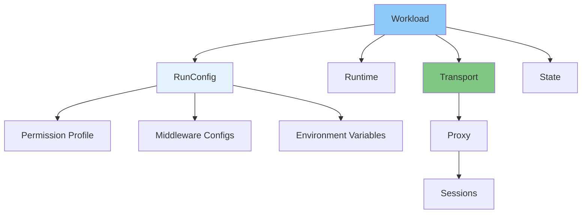
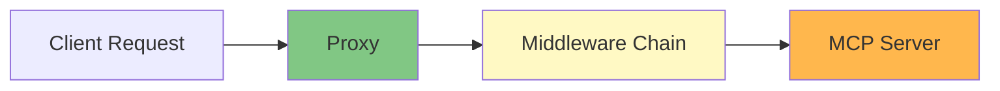

# Core Concepts

This document defines the key concepts, terminology, and abstractions used throughout ToolHive. Understanding these concepts is essential for working with the platform.

## Platform Philosophy

ToolHive is not just a container runner - it's a **platform** that provides:
- Proxy infrastructure with middleware
- Security and isolation
- Configuration management
- Registry and distribution
- Aggregation and composition

## Nouns (Things)

### Workload

A **workload** is the fundamental deployment unit in ToolHive. It represents everything needed to run an MCP server:

**Components:**
- Primary MCP server (container or remote endpoint)
- Proxy process (for non-stdio transports or detached mode)
- Network configuration and port mappings
- Permission profile and security policies
- Middleware configuration
- State and metadata

**Types:**
1. **Container Workload**: MCP server running in a container
2. **Remote Workload**: MCP server running on a remote host

**Lifecycle States:**
- `starting` - Workload is being created
- `running` - Workload is active and serving requests
- `stopping` - Workload is being stopped
- `stopped` - Workload is stopped but can be restarted
- `removing` - Workload is being deleted
- `error` - Workload encountered an error
- `unhealthy` - Workload is running but unhealthy
- `unauthenticated` - Remote workload cannot authenticate (expired tokens)

**Implementation:**
- Interface: `pkg/workloads/manager.go`
- Status: `pkg/container/runtime/types.go`
- Core type: `pkg/core/workload.go`

**Related concepts:** Transport, Permission Profile, RunConfig

### Transport

A **transport** defines how MCP clients communicate with MCP servers. It encapsulates the protocol and proxy implementation.

**Three types:**

1. **stdio**: Standard input/output communication
   - Container speaks stdin/stdout
   - Proxy translates HTTP ↔ stdio
   - Two proxy modes: SSE or Streamable HTTP

2. **sse**: Server-Sent Events over HTTP
   - Container speaks HTTP with SSE
   - Transparent HTTP proxy
   - Server-initiated messages supported

3. **streamable-http**: Bidirectional HTTP streaming
   - Container speaks HTTP with `/mcp` endpoint
   - Transparent HTTP proxy (same as SSE)
   - Session management via headers

**Implementation:**
- Interface: `pkg/transport/types/transport.go`
- Types: `pkg/transport/types/transport.go`
- Factory: `pkg/transport/factory.go`

**Related concepts:** Proxy, Middleware, Session

### Proxy

A **proxy** is the component that sits between MCP clients and MCP servers, forwarding traffic while applying middleware.

**Two proxy types:**

1. **Transparent Proxy**: Used by SSE and Streamable HTTP transports
   - Location: `pkg/transport/proxy/transparent/transparent_proxy.go`
   - Uses `httputil.ReverseProxy`
   - No protocol-specific logic
   - Forwards HTTP directly

2. **Protocol-Specific Proxy**: Used by stdio transport
   - SSE mode: `pkg/transport/proxy/httpsse/http_proxy.go`
   - Streamable mode: `pkg/transport/proxy/streamable/streamable_proxy.go`
   - Parses JSON-RPC messages
   - Implements MCP transport protocol

**Proxy responsibilities:**
- Apply middleware chain
- Handle sessions
- Forward requests/responses
- Health checking (for containers)
- Expose telemetry and auth info endpoints

**Implementation:**
- Interface: `pkg/transport/types/transport.go`

**Related concepts:** Transport, Middleware, Session

### Middleware

**Middleware** is a composable layer in the request processing chain. Each middleware can inspect, modify, or reject requests.

**Middleware types:**

- **Authentication** (`auth`) - JWT token validation
- **Token Exchange** (`tokenexchange`) - OAuth token exchange
- **MCP Parser** (`mcp-parser`) - JSON-RPC parsing
- **Tool Filter** (`tool-filter`) - Filter and override tools in `tools/list` responses
- **Tool Call Filter** (`tool-call-filter`) - Validate and map `tools/call` requests
- **Usage Metrics** (`usagemetrics`) - Anonymous usage metrics for ToolHive development (opt-out: `thv config usage-metrics disable`)
- **Telemetry** (`telemetry`) - OpenTelemetry instrumentation
- **Authorization** (`authorization`) - Cedar policy evaluation
- **Audit** (`audit`) - Request logging

**Execution order (request flow):**
Middleware applied in reverse configuration order. Requests flow through: Audit* → Authorization* → Telemetry* → Usage Metrics* → Parser → Token Exchange* → Auth → Tool Call Filter* → Tool Filter* → MCP Server

(*optional middleware, only present if configured)

**Implementation:**
- Interface: `pkg/transport/types/transport.go`
- Factory: `pkg/runner/middleware.go`
- Documentation: `docs/middleware.md`

**Related concepts:** Proxy, Authentication, Authorization

### RunConfig

**RunConfig** is ToolHive's standard configuration format for running MCP servers. It's a JSON/YAML structure that contains everything needed to deploy a workload.

**Configuration categories:**
- **Execution**: `image`, `cmdArgs`, `transport`, `name`, `containerName`
- **Networking**: `host`, `port`, `targetPort`, `targetHost`, `isolateNetwork`, `proxyMode`
- **Security**: `permissionProfile`, `secrets`, `oidcConfig`, `authzConfig`, `trustProxyHeaders`
- **Observability**: `auditConfig`, `telemetryConfig`, `debug`
- **Customization**: `envVars`, `volumes`, `toolsFilter`, `toolsOverride`, `ignoreConfig`
- **Organization**: `group`, `containerLabels`
- **Middleware**: `middlewareConfigs` - Dynamic middleware chain configuration
- **Remote servers**: `remoteURL`, `remoteAuthConfig`
- **Kubernetes**: `k8sPodTemplatePatch`

See `pkg/runner/config.go` for complete field reference.

**Schema version:** `v0.1.0` (current)

**Portability:**
- Export: `thv export <workload>` → JSON file
- Import: `thv run --from-config <file>`
- API contract: Format is versioned and stable

**Implementation:**
- Definition: `pkg/runner/config.go`
- Schema version: `pkg/runner/config.go`

**Related concepts:** Workload, Permission Profile, Middleware

### Permission Profile

A **permission profile** defines security boundaries for MCP servers:

**Three permission types:**

1. **File System Access**:
   - `read` - Mount paths as read-only
   - `write` - Mount paths as read-write
   - Mount declaration formats: `path`, `host:container`, `scheme://resource:container-path`

2. **Network Access**:
   - `outbound.insecure_allow_all` - Allow all outbound connections
   - `outbound.allow_host` - Whitelist specific hosts
   - `outbound.allow_port` - Whitelist specific ports
   - `inbound.allow_host` - Whitelist inbound connections

3. **Privileged Mode**:
   - `privileged` - Run with host device access (dangerous!)

**Built-in profiles:**
- `none` - No permissions (default)
- `network` - Full network access

**Implementation:**
- Definition: `pkg/permissions/profile.go`
- Network: `pkg/permissions/profile.go`
- Mount declarations: `pkg/permissions/profile.go`

**Related concepts:** RunConfig, Workload, Security

### Group

A **group** is a logical collection of MCP servers that share a common purpose or use case.

**Use cases:**
- Organizational structure (e.g., "data-analysis" group)
- Virtual MCP servers (aggregate multiple MCPs into one)
- Access control (apply policies at group level)
- Client configuration (configure clients to use groups)

**Operations:**
- Create group: `thv group create <name>` or add workloads with `--group` flag
- List all groups: `thv group list`
- List workloads in group: `thv list --group <name>`
- Remove group: `thv group rm <name>`

**Implementation:**
- Group management: `pkg/groups/`
- Workload group field: `pkg/runner/config.go`

**Related concepts:** Virtual MCP Server, Workload, Client

### Virtual MCP Server

A **Virtual MCP Server** aggregates multiple MCP servers from a group into a single unified interface with advanced composition and orchestration capabilities.

**Purpose:**
- Combine tools from multiple specialized MCP servers into one endpoint
- Resolve naming conflicts between backends
- Create composite tools that orchestrate multiple backend operations
- Provide unified authentication and authorization
- Enable token exchange and caching for backend authentication

**Key capabilities:**

1. **Backend Aggregation**:
   - Automatically discovers MCPServers from an MCPGroup
   - Aggregates tools, resources, and prompts from all backends
   - Tracks backend health status
   - Handles backend failures gracefully

2. **Conflict Resolution**:
   - `prefix` - Prefix tool names with backend identifier (e.g., `github.create_issue`)
   - `priority` - First backend in priority list wins conflicts
   - `manual` - Explicitly map conflicting tools to specific backends

3. **Tool Filtering and Rewriting**:
   - Allow/deny lists for selective tool exposure
   - Tool renaming and description overrides
   - Per-tool backend selection

4. **Composite Tools**:
   - Define new tools that call multiple backend tools in sequence
   - Parameter mapping between composite tool and backend tools
   - Response aggregation from multiple backend calls
   - Complex workflow orchestration

5. **Authentication and Security**:
   - Incoming: OIDC authentication for clients
   - Outgoing: Automatic token exchange for backend authentication
   - Token caching with configurable TTL and capacity
   - Cedar authorization policies

**Example use case:**
```yaml
# Combine GitHub, Slack, and Jira into one "team-tools" virtual server
apiVersion: mcp.stacklok.dev/v1alpha1
kind: VirtualMCPServer
metadata:
  name: team-tools
spec:
  groupRef:
    name: team-backend-group  # Contains github, slack, jira servers
  aggregation:
    conflictResolution: prefix
    tools:
    - filter:
        allow: ["create_issue", "update_issue"]
      toolConfigRef:
        name: jira-tool-config
```

**Deployment:**
- Kubernetes: Via VirtualMCPServer CRD managed by the operator
  - Creates Deployment, Service, and ConfigMap
  - Mounts vmcp configuration as ConfigMap
  - Uses `thv-proxyrunner` to run vmcp binary
- CLI: Standalone via the `vmcp` binary for development or non-Kubernetes environments

**Implementation:**
- CRD: `cmd/thv-operator/api/v1alpha1/virtualmcpserver_types.go`
- Controller: `cmd/thv-operator/controllers/virtualmcpserver_controller.go`
- Binary: `cmd/vmcp/` (virtual MCP server runtime)

**For architecture details**, see [Virtual MCP Server Architecture](10-virtual-mcp-architecture.md).

**Related concepts:** Group, MCPServer (Kubernetes), Workload, Client

### Registry

A **registry** is a catalog of MCP server definitions with metadata, configuration, and provenance information.

**Registry types:**

1. **Built-in Registry**: Curated by Stacklok
   - Source: https://github.com/stacklok/toolhive-registry
   - Embedded in the binary
   - Trusted and verified servers

2. **Custom Registry**: User-provided
   - Configured via config file
   - JSON file or remote URL
   - Organization-specific servers

3. **Registry API**: MCP Registry API endpoint
   - Connect to any MCP Registry API-compliant server
   - Stacklok provides [toolhive-registry-server](https://github.com/stacklok/toolhive-registry-server) for enterprise deployments
   - Supports PostgreSQL, multiple registry types, enterprise authentication

**Registry entry types:**
- `servers` - Container-based MCP servers
- `remoteServers` - Remote MCP servers (HTTPS endpoints)
- `groups` - Predefined groups of servers

**Implementation:**
- Registry types: `pkg/registry/types.go`
- Provider abstraction: `pkg/registry/provider.go`, `pkg/registry/factory.go`
- Local provider: `pkg/registry/provider_local.go`
- Remote provider: `pkg/registry/provider_remote.go`
- API client: `pkg/registry/api/client.go`
- API provider: `pkg/registry/provider_api.go`

**Related concepts:** Image Metadata, Remote Server Metadata

### Session

A **session** tracks state for MCP client connections, particularly for transports that require session management.

**Session types:**

1. **SSE Session**: For stdio transport with SSE proxy mode
   - Tracks connected SSE clients (multiple clients can connect, but share single stdio connection to container)
   - Message queue per client
   - Endpoint URL generation
   - Note: stdio transport has single connection/session to container

2. **Streamable Session**: For stdio transport with streamable proxy mode
   - Tracks `Mcp-Session-Id` header
   - Request/response correlation
   - Ephemeral sessions for sessionless requests

3. **MCP Session** (`SessionTypeMCP`): For transparent proxy (SSE/Streamable transports when containers speak HTTP natively)
   - Session ID detection from headers
   - Session ID detection from SSE body
   - Minimal state tracking
   - Note: Distinct from stdio transport + SSE/Streamable proxy modes which use `SSESession`/`StreamableSession`

**Session lifecycle:**
- Created on first request or explicit initialize
- Tracked via session manager with TTL
- Cleaned up after inactivity or explicit deletion

**Implementation:**
- Session manager: `pkg/transport/session/manager.go`
- Session implementations: `pkg/transport/session/sse_session.go`, `streamable_session.go`, `proxy_session.go`
- Storage abstraction: `pkg/transport/session/storage.go`

**Related concepts:** Transport, Proxy

### Runtime

A **runtime** is an abstraction over container orchestration systems. It provides a unified interface for container operations.

**Runtime types:**

1. **Docker Runtime**: Docker Engine API
2. **Podman Runtime**: Podman socket API
3. **Colima Runtime**: Docker-compatible (uses Docker runtime)
4. **Kubernetes Runtime**: Kubernetes API (StatefulSets)

**Runtime interface:**
- `DeployWorkload` - Create and start workload
- `StopWorkload` - Stop workload
- `RemoveWorkload` - Delete workload
- `ListWorkloads` - List all workloads
- `GetWorkloadInfo` - Get workload details
- `GetWorkloadLogs` - Retrieve logs
- `AttachToWorkload` - Attach to stdin/stdout (stdio only)
- `IsWorkloadRunning` - Check if running

**Runtime detection:**
Order: Podman → Colima → Docker → Kubernetes (via env)

**Implementation:**
- Interface: `pkg/container/runtime/types.go`
- Factory: `pkg/container/factory.go`
- Detection: `pkg/container/runtime/types.go`

**Related concepts:** Deployer, Workload, Container

### Client

An **MCP client** is an application that uses MCP servers (e.g., Claude Desktop, IDEs, AI tools).

**Client types:**
- `claude-code` - Claude Code
- `cursor` - Cursor editor
- `vscode` - VS Code
- `cline` - Cline extension
- `windsurf` - Windsurf editor
- Many more...

**Client configuration:**
ToolHive can automatically configure clients to use MCP servers:
- Reads client config files
- Adds server URLs
- Updates on workload start/stop
- Supports multiple config formats

**Client discovery and management:**
- Automatic client detection through platform-specific directories
- Client-specific server configurations
- Configuration migration support for version upgrades

**Implementation:**
- Configuration: `pkg/client/config.go`
- Manager: `pkg/client/manager.go`
- Discovery: `pkg/client/discovery.go`

**Related concepts:** Workload, Group

## Verbs (Actions)

### Deploy

**Deploy** creates and starts a workload with all its components.

**For containers:**
1. Create container with image
2. Configure networking and ports
3. Apply permission profile
4. Start container
5. Attach streams (if stdio)
6. Start proxy
7. Apply middleware
8. Update state

**For remote servers:**
1. Validate remote URL
2. Start proxy
3. Configure authentication (if needed)
4. Apply middleware
4. Update state

**Commands:**
- `thv run <image|url>` - Deploy and start
- `thv run --from-config <file>` - Deploy from config

**Implementation:**
- CLI: `cmd/thv/app/run.go`
- Workloads: `pkg/workloads/manager.go`
- Runtime: `pkg/container/runtime/types.go`

**Related concepts:** Workload, Runtime, Transport

### Proxy

**Proxy** forwards MCP traffic between clients and servers while applying middleware.

**Proxy types:**
- **Transparent**: Forwards HTTP without parsing
- **Protocol-specific**: Parses and translates messages

**Proxy operations:**
1. Start HTTP server on proxy port
2. Apply middleware chain to requests
3. Forward to destination (container or remote)
4. Return responses to clients
5. Track sessions
6. Expose telemetry and health endpoints

**Implementation:**
- Transparent: `pkg/transport/proxy/transparent/transparent_proxy.go`
- SSE: `pkg/transport/proxy/httpsse/http_proxy.go`
- Streamable: `pkg/transport/proxy/streamable/streamable_proxy.go`

**Related concepts:** Transport, Middleware, Session

### Attach

**Attach** connects to a container's stdin/stdout streams for stdio transport.

**Attach process:**
1. Container must be running
2. Request attach from runtime
3. Receive stdin (`WriteCloser`) and stdout (`ReadCloser`)
4. Start message processing goroutines
5. Read JSON-RPC from stdout
6. Write JSON-RPC to stdin

**Framing:**
- Newline-delimited JSON-RPC messages
- Each message ends with `\n`

**Implementation:**
- Transport: `pkg/transport/stdio.go`
- Runtime interface: `pkg/container/runtime/types.go`

**Related concepts:** Stdio Transport, Runtime

### Parse

**Parse** extracts structured information from JSON-RPC MCP messages for middleware processing.

**Parsing includes:**
- Message type (request, response, notification)
- Method name (e.g., `tools/call`, `resources/read`)
- Request ID
- Parameters
- Resource ID (for resource operations)
- Arguments (for tool calls)

**Parsed data stored in context:**
- Available to downstream middleware
- Used by authorization for policy evaluation
- Used by audit for event logging

**Implementation:**
- Parser implementation: `pkg/mcp/parser.go`
- Middleware: `pkg/mcp/middleware.go`
- Tool filtering: `pkg/mcp/tool_filter.go`

**Related concepts:** Middleware, Authorization, Audit

### Filter and Override

**Filter and override** controls which tools are available to MCP clients and how they are presented.

**Two complementary operations:**

1. **Tool Filtering**: Whitelist specific tools by name
   - Configured via `--tool` flags or `toolsFilter` config
   - Tools not in filter list are hidden from clients
   - Empty filter list means all tools are available

2. **Tool Overriding**: Customize tool presentation
   - Configured via `toolsOverride` map in config file
   - Override tool names and/or descriptions
   - Maps actual tool name to user-visible name/description

**Two middlewares for consistency:**

- **Tool Filter middleware**: Processes outgoing `tools/list` responses
- **Tool Call Filter middleware**: Processes incoming `tools/call` requests

Both middlewares share the same configuration to ensure clients only see tools they can call, and can only call tools they see.

**Configuration:**
- `toolsFilter` - List of allowed tool names (from `--tool` flags)
- `toolsOverride` - Map from actual name to override (from config file)

**Implementation:**
- Middleware factories: `pkg/mcp/middleware.go`
- Filter logic: `pkg/mcp/tool_filter.go`
- Configuration: `pkg/runner/config.go`

**Related concepts:** Middleware, Authorization

### Authorize

**Authorize** evaluates Cedar policies to determine if requests are permitted.

**Authorization process:**
1. Get parsed MCP data from context
2. Get JWT claims from auth middleware
3. Create Cedar entities (Principal, Action, Resource)
4. Evaluate Cedar policies
5. Allow or deny request

**Policy language:**
Cedar policies use:
- `principal` - Who is making the request (from JWT)
- `action` - What operation (from MCP method)
- `resource` - What is being accessed (from MCP resource ID)

**Example policy:**
```cedar
permit(
  principal == Client::"user@example.com",
  action == Action::call_tool,
  resource == Tool::"web-search"
);
```

**Implementation:**
- Authz middleware: `pkg/authz/middleware.go`
- Policy engine: Cedar (external library)

**Related concepts:** Middleware, Authentication, Parse

### Audit

**Audit** logs MCP operations for compliance, monitoring, and debugging.

**Audit event categories:**
- Connection events (initialization, SSE connections)
- Operation events (tool calls, resource reads, prompt retrieval)
- List operations (tools, resources, prompts)
- Notification events (MCP notifications, ping, logging, completion)
- Generic fallback events (unrecognized MCP requests, HTTP requests)

See `pkg/audit/mcp_events.go` for complete list of event types.

**Event data:**
- Timestamp, source, outcome
- Subjects (user, session)
- Target (endpoint, method, resource)
- Request/response data (configurable)
- Duration and metadata

**Implementation:**
- Audit middleware: `pkg/audit/middleware.go`
- Event types: `pkg/audit/event.go`, `pkg/audit/mcp_events.go`
- Auditor: `pkg/audit/auditor.go`
- Config: `pkg/audit/config.go`

**Related concepts:** Middleware, Authorization, Parse

### Export

**Export** serializes a workload's RunConfig to a portable JSON file.

**Export process:**
1. Load workload state from disk
2. Read RunConfig
3. Serialize to JSON with formatting
4. Write to file or stdout

**Exported format:**
- JSON with schema version
- All configuration fields
- Permission profile included
- Middleware configuration included

**Commands:**
- `thv export <workload> <path>` - Export to file

**Example:** `thv export my-server ./my-server-config.json`

**Implementation:**
- CLI: `cmd/thv/app/export.go`
- Serialization: `pkg/runner/config.go`

**Related concepts:** RunConfig, Import, State

### Import

**Import** creates a workload from an exported RunConfig file.

**Import process:**
1. Read JSON file
2. Deserialize to RunConfig
3. Validate schema version
4. Deploy workload with configuration

**Commands:**
- `thv run --from-config <file>` - Import and run

**Implementation:**
- CLI: `cmd/thv/app/run.go`
- Deserialization: `pkg/runner/config.go`

**Related concepts:** RunConfig, Export, Deploy

### Monitor

**Monitor** watches container health and lifecycle events.

**Monitoring includes:**
- Container exit detection
- Health checks (via MCP ping)
- Automatic proxy shutdown on container exit

**Health checking:**
- Send MCP `ping` request periodically
- Check for valid response
- Shutdown if unhealthy

**Implementation:**
- Monitor: `pkg/container/docker/monitor.go`
- Health checker: `pkg/healthcheck/healthcheck.go`

**Related concepts:** Workload, Transport, Proxy

## Relationships

### Workload Composition



### Request Flow



Requests pass through up to 9 middleware components (Auth, Token Exchange, Tool Filter, Tool Call Filter, Parser, Usage Metrics, Telemetry, Authorization, Audit). See `docs/middleware.md` for complete middleware architecture and execution order.

### Data Hierarchy

```
Registry
├── Servers (Container-based)
│   └── ImageMetadata
│       ├── image
│       ├── transport
│       ├── envVars
│       └── permissionProfile
├── RemoteServers (Remote)
│   └── RemoteServerMetadata
│       ├── url
│       ├── transport
│       ├── headers
│       └── oauthConfig
└── Groups
    ├── servers (map)
    └── remoteServers (map)
```

## Terminology Quick Reference

| Term | One-line Definition |
|------|---------------------|
| **Workload** | A deployed MCP server with all its components |
| **Transport** | Protocol for MCP client-server communication |
| **Proxy** | Component that forwards traffic + applies middleware |
| **Middleware** | Composable request processing layer |
| **RunConfig** | Portable JSON configuration for workloads |
| **Permission Profile** | Security policy (filesystem, network, privileges) |
| **Group** | Logical collection of related MCP servers |
| **Virtual MCP Server** | Aggregates multiple MCP servers into unified interface |
| **Registry** | Catalog of MCP server definitions |
| **Session** | State tracking for MCP connections |
| **Runtime** | Abstraction over container systems |
| **Client** | Application that uses MCP servers |
| **Deploy** | Create and start a workload |
| **Proxy** (verb) | Forward traffic with middleware |
| **Attach** | Connect to container stdin/stdout |
| **Parse** | Extract structured info from JSON-RPC |
| **Filter and Override** | Control available tools and how they're presented |
| **Authorize** | Evaluate Cedar policies |
| **Audit** | Log operations for compliance |
| **Export** | Serialize RunConfig to JSON |
| **Import** | Create workload from JSON |
| **Monitor** | Watch container health |

## Related Documentation

- [Architecture Overview](00-overview.md) - Platform overview
- [Deployment Modes](01-deployment-modes.md) - How concepts work in each mode
- [Transport Architecture](03-transport-architecture.md) - Transport and proxy details
- [RunConfig and Permissions](05-runconfig-and-permissions.md) - Configuration schema
- [Middleware](../middleware.md) - Middleware system
- [Virtual MCP Server Architecture](10-virtual-mcp-architecture.md) - vMCP aggregation details
