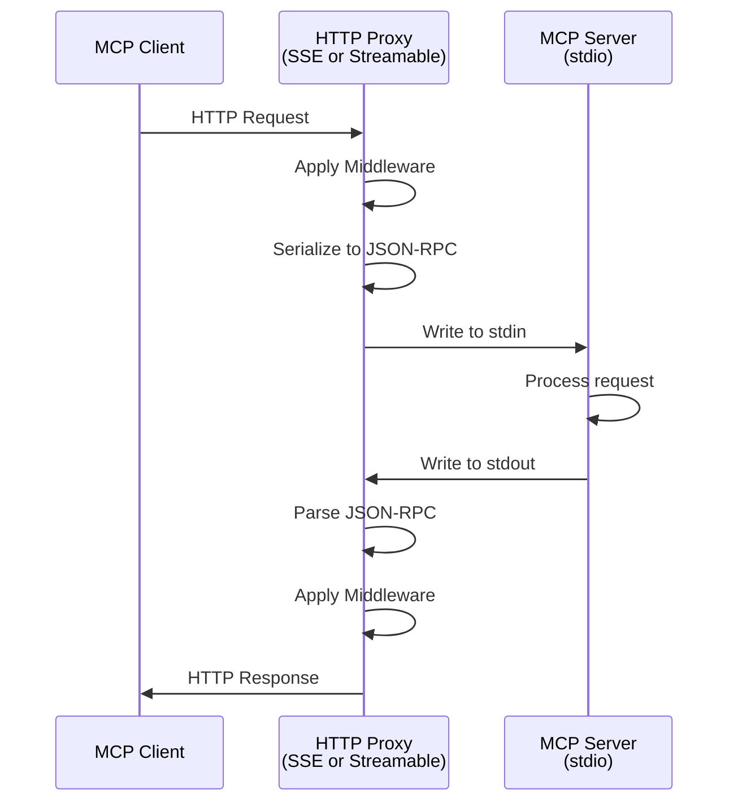
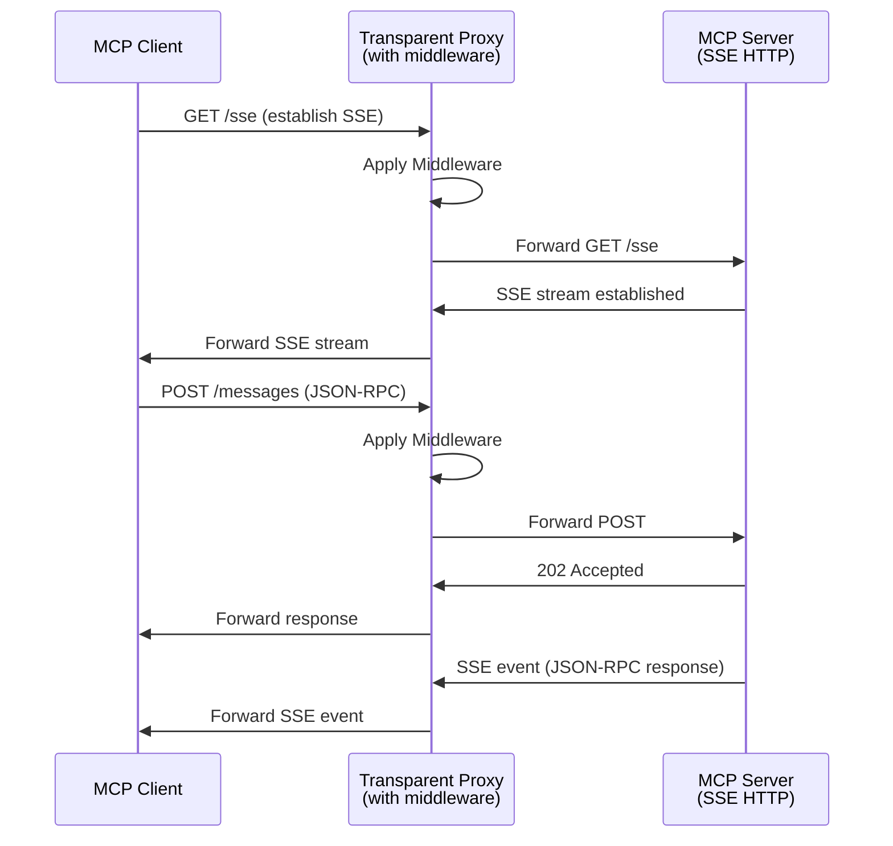
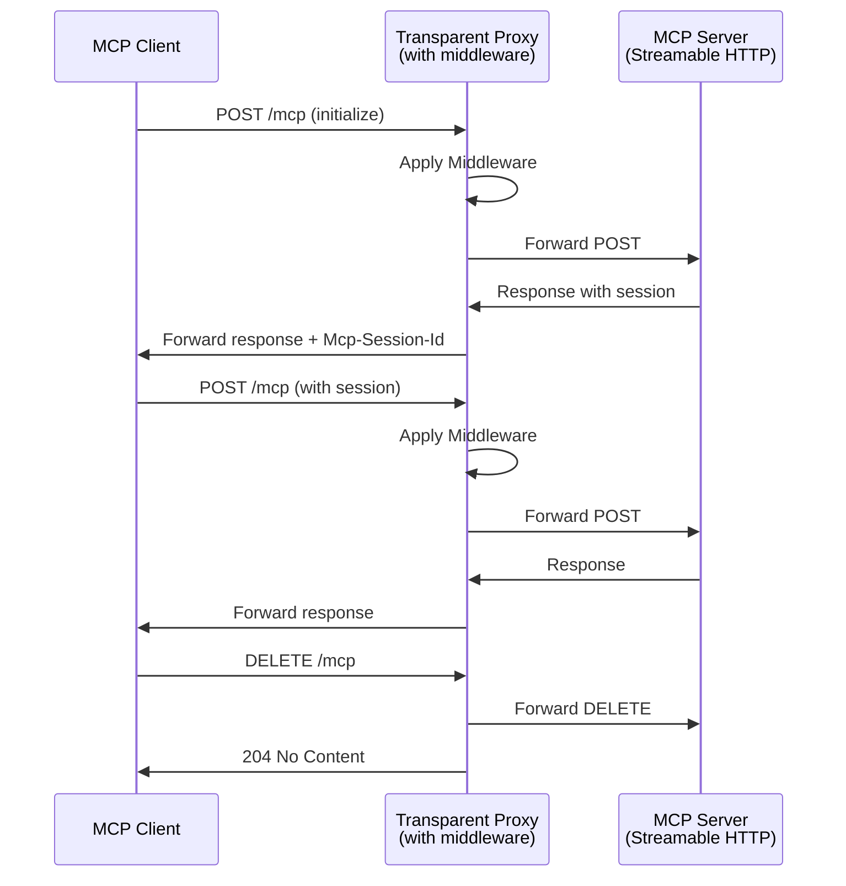
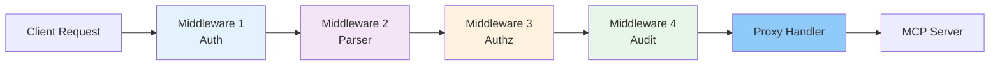
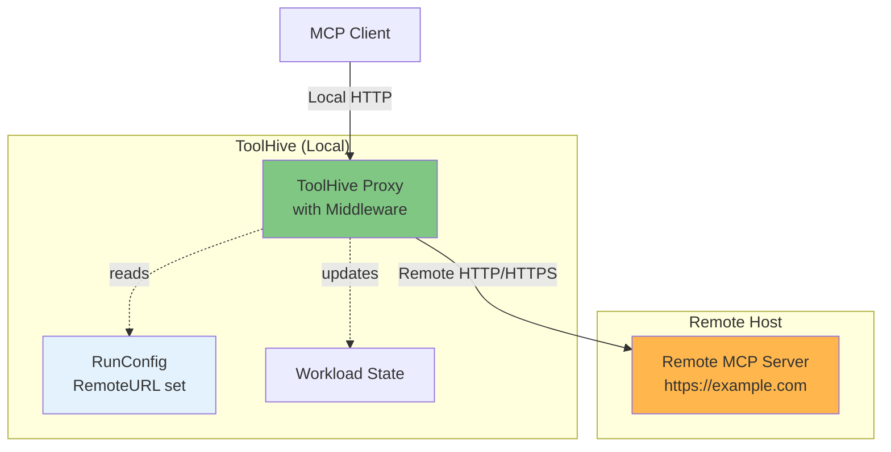

# Transport Architecture

ToolHive's transport layer provides a flexible proxy architecture that handles communication between MCP clients and MCP servers. This document explains how ToolHive proxies MCP traffic, supports multiple transport types, and enables remote MCP server proxying.

## Overview

ToolHive doesn't just run containers - it **proxies** all MCP traffic through a middleware-enabled layer. This enables:

- Authentication and authorization
- Request logging and audit
- Tool filtering and remapping
- Telemetry and monitoring
- Remote server proxying
- Protocol translation (for stdio transport)

## Transport Types

ToolHive supports three MCP transport protocols as defined in the [MCP Specification](https://modelcontextprotocol.io/specification/2025-06-18/basic/transports):

### 1. Stdio Transport

**Use case**: Direct stdin/stdout communication with containerized MCP servers

**How it works:**
- Container runs with stdio transport (`MCP_TRANSPORT=stdio`)
- ToolHive attaches to container's stdin/stdout
- Proxy layer translates between HTTP (client) and stdio (container)
- User chooses proxy mode: SSE or Streamable HTTP



**Implementation:**
- `pkg/transport/stdio.go` - Stdio transport
- `pkg/transport/proxy/httpsse/http_proxy.go` - SSE proxy for stdio
- `pkg/transport/proxy/streamable/streamable_proxy.go` - Streamable HTTP proxy for stdio

**Key features:**
- Bi-directional JSON-RPC over stdin/stdout
- Proxy mode selection (SSE or streamable-http)
- Automatic newline-delimited message framing
- Container monitoring and restart on exit

### 2. SSE (Server-Sent Events) Transport

**Use case**: Container runs HTTP server with SSE endpoints

**How it works:**
- Container runs HTTP server listening on target port
- Container handles SSE protocol internally
- ToolHive uses **transparent proxy** to forward HTTP traffic
- Middleware applied to all requests



**Implementation:**
- `pkg/transport/http.go` - HTTP transport (SSE + Streamable HTTP)
- `pkg/transport/proxy/transparent/transparent_proxy.go` - Transparent HTTP proxy

**Key features:**
- Transparent HTTP proxying (no protocol awareness needed)
- Middleware applied to all requests
- Session tracking from headers
- Keep-alive support

### 3. Streamable HTTP Transport

**Use case**: Container runs HTTP server with `/mcp` endpoint

**How it works:**
- Container runs HTTP server listening on target port
- Container implements [Streamable HTTP spec](https://modelcontextprotocol.io/specification/2025-03-26/basic/transports#streamable-http)
- ToolHive uses **transparent proxy** (same as SSE)
- Middleware applied to all requests



**Implementation:**
- `pkg/transport/http.go` - HTTP transport (SSE + Streamable HTTP)
- `pkg/transport/proxy/transparent/transparent_proxy.go` - Transparent HTTP proxy (same as SSE)

**Key features:**
- Transparent HTTP proxying
- Session management via `Mcp-Session-Id` header
- Batch request support
- Notification and client response handling

## Proxy Architecture

### Key Insight: Two Proxy Types

ToolHive uses two different proxy implementations:

#### 1. Transparent Proxy (for SSE and Streamable HTTP)

**Used by:** SSE transport, Streamable HTTP transport

**Location:** `pkg/transport/proxy/transparent/transparent_proxy.go`

**How it works:**
- Uses Go's `httputil.ReverseProxy`
- Forwards HTTP requests/responses without protocol-specific logic
- Applies middleware to all traffic
- Detects session IDs from headers/body for tracking
- No JSON-RPC parsing needed

**Why transparent:**
- Container already speaks HTTP
- MCP protocol handled by container
- Proxy just routes traffic + applies middleware

#### 2. Protocol-Specific Proxies (for Stdio)

**Used by:** Stdio transport only

**Locations:**
- SSE mode: `pkg/transport/proxy/httpsse/http_proxy.go`
- Streamable mode: `pkg/transport/proxy/streamable/streamable_proxy.go`

**How it works:**
- Reads JSON-RPC from container stdout
- Parses and validates messages
- Exposes HTTP endpoints for clients
- Translates between HTTP and stdio
- Manages sessions explicitly

**Why protocol-specific:**
- Container speaks stdio (not HTTP)
- Proxy must implement MCP transport protocol
- Must parse/serialize JSON-RPC messages

### Proxy Mode Selection (Stdio Transport)

When using stdio transport, choose the HTTP protocol for clients:

**SSE Mode** (default for backward compatibility):
```bash
thv run --transport stdio my-server
# or explicitly
thv run --transport stdio --proxy-mode sse my-server
```

**Streamable HTTP Mode**:
```bash
thv run --transport stdio --proxy-mode streamable-http my-server
```

**Implementation:**
- `pkg/runner/config.go:139` - ProxyMode configuration
- `pkg/transport/stdio.go:82` - SetProxyMode method

### Transport Decision Matrix

| Transport | Container Protocol | Proxy Type | Proxy Implementation |
|-----------|-------------------|------------|---------------------|
| **stdio** | stdin/stdout | Protocol-specific (SSE or Streamable) | `http_proxy.go` or `streamable_proxy.go` |
| **sse** | HTTP (SSE) | Transparent | `transparent_proxy.go` |
| **streamable-http** | HTTP (Streamable) | Transparent | `transparent_proxy.go` |

### Middleware Integration

All proxy types integrate with the middleware chain:



**Implementation:**
- `pkg/transport/types/transport.go:20` - MiddlewareFunction type
- Middleware applied in reverse order (last registered = outermost)
- Each transport type accepts `[]MiddlewareFunction` in constructor

## Remote MCP Server Proxying

ToolHive can proxy to **remote MCP servers** without running containers. This is a fifth way to run MCP servers.

### Architecture



### How Remote Proxying Works

**Running a remote MCP server:**

```bash
thv run https://mcp.example.com/sse --name my-remote-server
```

**What happens:**

1. **No container created** - ToolHive recognizes URL as remote endpoint
2. **Proxy started** - Local HTTP proxy on specified port (or auto-assigned)
3. **Transparent proxy used** - Same proxy as SSE/Streamable transports
4. **RunConfig saved** - Contains `RemoteURL` field: `pkg/runner/config.go:45`
5. **Middleware applied** - Auth, authz, audit, etc. applied to remote traffic
6. **Client config generated** - Local clients use local proxy URL

**Implementation:**
- `pkg/transport/http.go:100` - `SetRemoteURL` method
- `pkg/transport/http.go:164` - Remote detection in Setup
- `pkg/transport/http.go:274` - Remote URL handling in Start
- `pkg/transport/proxy/transparent/transparent_proxy.go:142` - Host header fix for remote

### Remote Authentication

Remote MCP servers can require OAuth 2.0 authentication:

```bash
thv run https://mcp.example.com \
  --name my-remote-server \
  --remote-auth-client-id <client-id> \
  --remote-auth-client-secret <client-secret> \
  --remote-auth-scopes "read write" \
  --remote-auth-issuer https://auth.example.com
```

**What happens:**

1. **OAuth flow initiated** - Authorization code or device flow
2. **Access token obtained** - Token stored securely
3. **Token injection middleware** - Created via `pkg/transport/http.go:111`
4. **Token added to requests** - Bearer token injected into Authorization header
5. **Token refresh** - Automatic refresh using refresh token

**Implementation:**
- `pkg/runner/config.go:439` - `RemoteAuthConfig` struct
- `pkg/transport/http.go:106` - `SetTokenSource` method

### Remote vs Container Workloads

| Feature | Container Workload | Remote Workload |
|---------|-------------------|-----------------|
| **Container Created** | Yes | No |
| **Proxy Process** | Yes | Yes |
| **Proxy Type** | Depends on transport | Transparent |
| **Middleware** | Yes | Yes |
| **State Saved** | Yes | Yes (`RemoteURL` set) |
| **Client Config** | Yes | Yes |
| **Start/Stop/Restart** | Yes | Yes (proxy only) |
| **Logs** | Container logs | N/A |
| **Permission Profile** | Yes | N/A |

### Kubernetes Support for Remote MCPs

**Proposal**: [PR #2151](https://github.com/stacklok/toolhive/pull/2151)

Remote MCP servers will be supported in Kubernetes mode by:

1. **MCPServer CRD** with `remoteURL` field
2. **Operator creates Deployment** with proxy-runner
3. **No StatefulSet created** - proxy forwards to remote URL
4. **Service exposes proxy** - Clients use ClusterIP/LoadBalancer

**Example CRD:**
```yaml
apiVersion: mcp.stacklok.com/v1alpha1
kind: MCPServer
metadata:
  name: remote-mcp
spec:
  remoteURL: https://mcp.example.com/sse
  transport: sse
  port: 8080
  remoteAuth:
    clientID: my-client-id
    clientSecretRef:
      name: mcp-auth-secret
      key: client-secret
    issuerURL: https://auth.example.com
  middleware:
    - type: authz
      parameters:
        policies: |
          permit(...);
```

## Transport Selection Guide

### Use Stdio When:
- Container only provides stdio interface
- Maximum portability (no HTTP server in container)
- Simplest container implementation

### Use SSE When:
- Container provides HTTP server
- Need server-initiated messages
- Want to avoid stdio complexity
- Following traditional SSE patterns

### Use Streamable HTTP When:
- Container provides HTTP server
- Need bidirectional streaming
- Want modern HTTP/2+ features
- Following MCP Streamable HTTP spec

### Use Remote When:
- MCP server runs on different host
- No container control/access
- Want to apply middleware to existing server
- Need to proxy to cloud-hosted MCP

## Port Management

### Host Port Selection

**Implementation**: `pkg/runner/config.go:245`

ToolHive assigns ports as follows:

1. **User-specified port**: If `--port` provided, verify availability
2. **Random port**: If not specified, find available port
3. **Validation**: In CLI mode, check port availability before use
4. **No validation in K8s**: Ports are container ports, not host ports

**Port conflicts**:
- If requested port unavailable, error returned (no fallback)
- Use `--port 0` to request random available port

### Target Port (SSE/Streamable HTTP)

For SSE and Streamable HTTP transports:

- **ProxyPort (HostPort)**: Port where proxy listens (host)
- **TargetPort (ContainerPort)**: Port where MCP server listens (container)

**Example:**
```bash
thv run --transport sse --port 8080 --target-port 3000 my-server
```

Result:
- Proxy listens on host port 8080
- Container exposes port 3000
- Port mapping: 8080 (host) → 3000 (container)

### MCP Environment Variables

**Implementation**: `pkg/transport/http.go:177`

Environment variables set automatically:

- `MCP_TRANSPORT`: Transport type (stdio, sse, streamable-http)
- `MCP_PORT`: Target port (for SSE/Streamable HTTP)
- `MCP_HOST`: Target host (usually 0.0.0.0 for containers)
- `FASTMCP_PORT`: Alias for `MCP_PORT` (legacy support)

**Merge strategy**:
- User-provided values take precedence
- ToolHive sets defaults if not provided

**Reference**: PR #1890 - Runtime Authoring Guide

## Container Attach (Stdio Transport)

For stdio transport, ToolHive attaches to container stdin/stdout:

**Implementation**: `pkg/transport/stdio.go:162`

```go
stdin, stdout, err := t.deployer.AttachToWorkload(ctx, t.containerName)
```

**What happens:**

1. **Container created** with `AttachStdin=true`, `AttachStdout=true`
2. **Container started** by runtime
3. **Streams opened** - stdin (write), stdout (read)
4. **Message loop** - Read from stdout, write to stdin
5. **Framing** - Newline-delimited JSON-RPC messages

**Monitoring:**
- Container monitor detects exit: `pkg/container/monitor.go`
- Proxy automatically stopped on container exit
- Workload status updated

## Session Management

### SSE/Streamable HTTP Transports (Transparent Proxy)

**Implementation**: `pkg/transport/proxy/transparent/transparent_proxy.go:227`

- Session ID detection from headers (`Mcp-Session-Id`)
- Session ID detection from SSE body (`sessionId` field)
- Automatic session tracking via `pkg/transport/session/manager.go`
- Session cleanup after TTL

### Stdio Transport - SSE Mode

**Implementation**: `pkg/transport/session/sse_session.go`

- Unique client ID per connection
- Message channel per client
- Pending messages queued for reconnection
- Automatic cleanup after TTL

### Stdio Transport - Streamable Mode

**Implementation**: `pkg/transport/session/streamable_session.go`

- Session ID in `Mcp-Session-Id` header
- Request ID correlation per session
- Ephemeral sessions for sessionless requests
- DELETE `/mcp` to explicitly close session

## Error Handling

### Connection Failures

**Stdio Transport:**
- Container exit → Proxy stops
- Stdin/stdout errors → Logged, proxy continues
- JSON-RPC parse errors → Skipped, logged

**SSE/Streamable HTTP Transports:**
- Upstream connection failure → 502 Bad Gateway
- Upstream timeout → 504 Gateway Timeout
- Middleware rejection → Appropriate HTTP status

**Remote Servers:**
- DNS resolution failure → 502 Bad Gateway
- TLS errors → 502 Bad Gateway with details
- Authentication failures → Forwarded from remote

### Middleware Errors

- **Authentication failure** → 401 Unauthorized
- **Authorization failure** → 403 Forbidden
- **Parse error** → Request continues (best effort)
- **Audit error** → Logged, request continues

## Performance Considerations

### Buffering

**Stdio transport:**
- **Message channel size**: 100 (configurable)
- **Response channel size**: 100 (configurable)
- **Backpressure**: Channels block when full

**Transparent proxy:**
- **No buffering**: Direct streaming via `httputil.ReverseProxy`
- **Flush interval**: -1 (flush immediately)

### Connection Pooling

**Transparent proxy:**
- Uses `http.DefaultTransport`
- Keep-alive enabled by default
- Connection reuse across requests
- Idle timeout: 90 seconds (Go default)

### Throughput

- **No artificial rate limiting** - Middleware can add rate limiting
- **Async processing**: Requests processed concurrently
- **Streamable HTTP**: Pipelined requests supported

## Security

### Network Isolation

**Implementation**: `pkg/permissions/profile.go`

- MCP servers can run in isolated networks
- Egress proxy for allowed destinations
- No internet access by default (unless using `network` profile)

### TLS Support

**Current state:**
- HTTPS for remote MCP servers (certificate validation)
- Local proxy uses HTTP (localhost only)

**Configuration:**
```bash
# Remote server with HTTPS
thv run https://secure-mcp.example.com

# Custom CA bundle
thv run https://mcp.example.com --ca-bundle /path/to/ca.pem
```

### Trust Proxy Headers

**Implementation**: `pkg/transport/proxy/transparent/transparent_proxy.go`

For deployment behind reverse proxy, transparent proxy respects forwarded headers.

**Security**: Only enable if ToolHive is behind trusted reverse proxy.

## Transport Factory

**Implementation**: `pkg/transport/factory.go:19`

```go
func (*Factory) Create(config types.Config) (types.Transport, error) {
    switch config.Type {
    case types.TransportTypeStdio:
        // Create stdio transport with proxy mode
        tr := NewStdioTransport(...)
        tr.SetProxyMode(config.ProxyMode)
        return tr, nil
    case types.TransportTypeSSE:
        // Create HTTP transport (transparent proxy)
        return NewHTTPTransport(types.TransportTypeSSE, ...), nil
    case types.TransportTypeStreamableHTTP:
        // Create HTTP transport (transparent proxy)
        return NewHTTPTransport(types.TransportTypeStreamableHTTP, ...), nil
    }
}
```

**Key insight**: SSE and Streamable HTTP use the same `NewHTTPTransport` function, which creates a transparent proxy.

## Related Documentation

- [Middleware](../middleware.md) - Middleware chain details
- [Deployment Modes](01-deployment-modes.md) - How transports work in each mode
- [RunConfig and Permissions](05-runconfig-and-permissions.md) - Transport configuration
- [Core Concepts](02-core-concepts.md) - Transport concepts and terminology
