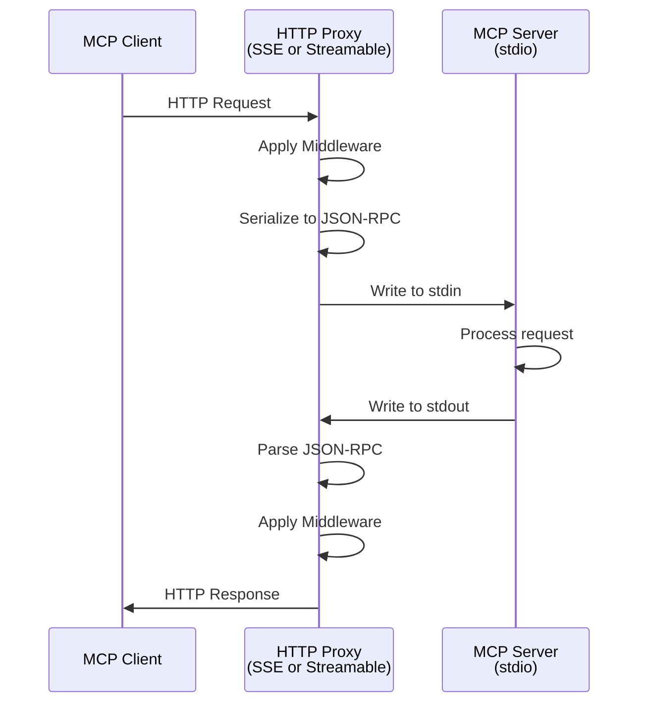
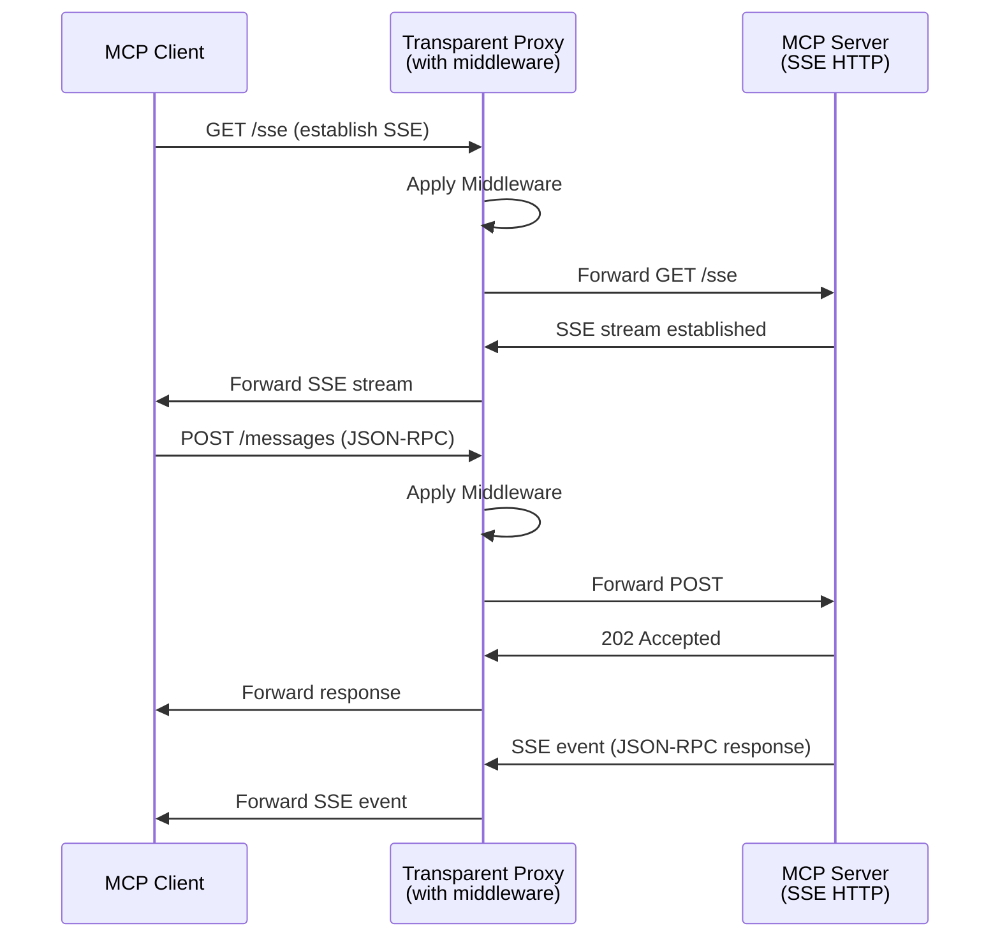
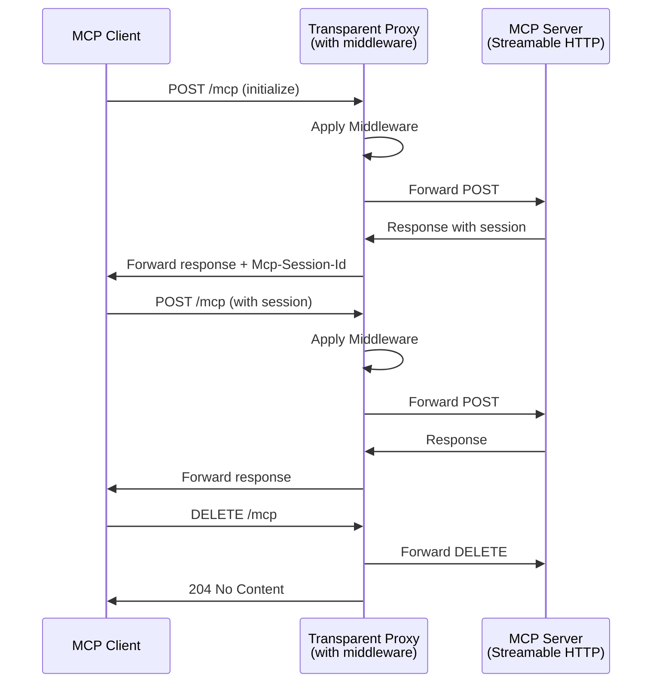
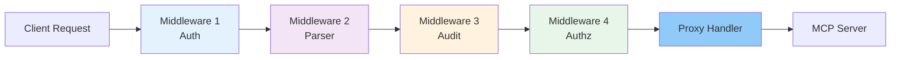
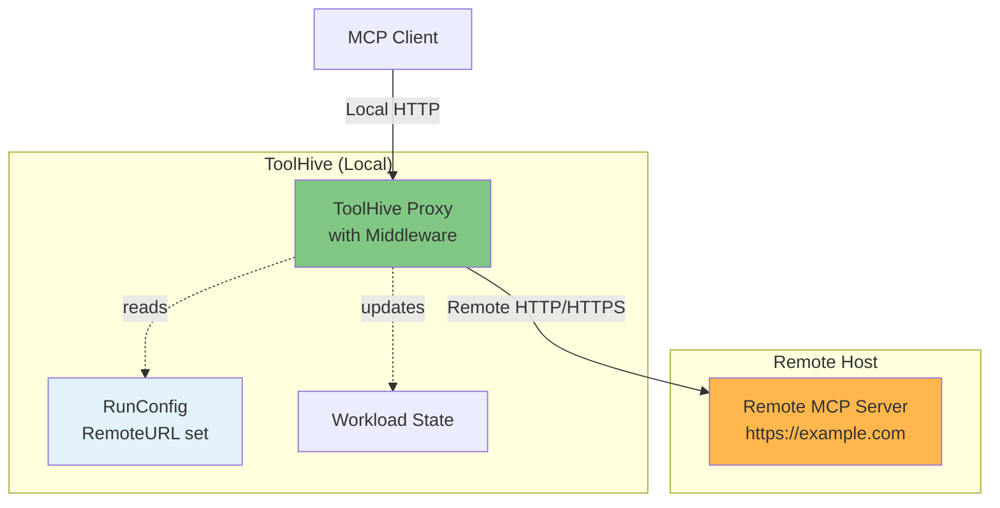

# Transport Architecture

ToolHive's transport layer provides a flexible proxy architecture that handles communication between MCP clients and MCP servers. This document explains how ToolHive proxies MCP traffic, supports multiple transport types, and enables remote MCP server proxying.

## Overview

ToolHive doesn't just run containers - it **proxies** all MCP traffic through a middleware-enabled layer. This enables:

- Authentication and authorization
- Request logging and audit
- Tool filtering and remapping
- Telemetry and monitoring
- Remote server proxying
- Protocol translation (for stdio transport)

## Transport Types

ToolHive supports three MCP transport protocols as defined in the [MCP Specification](https://modelcontextprotocol.io/specification/2025-06-18/basic/transports):

### 1. Stdio Transport

**Use case**: Direct stdin/stdout communication with containerized MCP servers

**How it works:**
- Container runs with stdio transport (`MCP_TRANSPORT=stdio`)
- ToolHive attaches to container's stdin/stdout
- Proxy layer translates between HTTP (client) and stdio (container)
- User chooses proxy mode: SSE or Streamable HTTP


```mermaid
sequenceDiagram
    participant Client as MCP Client
    participant Proxy as HTTP Proxy<br/>(SSE or Streamable)
    participant Container as MCP Server<br/>(stdio)

    Client->>Proxy: HTTP Request
    Proxy->>Proxy: Apply Middleware
    Proxy->>Proxy: Serialize to JSON-RPC
    Proxy->>Container: Write to stdin
    Container->>Container: Process request
    Container->>Proxy: Write to stdout
    Proxy->>Proxy: Parse JSON-RPC
    Proxy->>Proxy: Apply Middleware
    Proxy->>Client: HTTP Response
```

**Implementation:**
- `pkg/transport/stdio.go` - Stdio transport
- `pkg/transport/proxy/httpsse/http_proxy.go` - SSE proxy for stdio
- `pkg/transport/proxy/streamable/streamable_proxy.go` - Streamable HTTP proxy for stdio

**Key features:**
- Bi-directional JSON-RPC over stdin/stdout
- Proxy mode selection (SSE or streamable-http)
- Automatic newline-delimited message framing
- Container monitoring and restart on exit

### 2. SSE (Server-Sent Events) Transport

> **Note**: SSE transport is deprecated in the MCP specification in favor of streamable-http. ToolHive will continue to support SSE but may transition away from it in future releases.

**Use case**: Container runs HTTP server with SSE endpoints

**How it works:**
- Container runs HTTP server listening on target port
- Container handles SSE protocol internally
- ToolHive uses **transparent proxy** to forward HTTP traffic
- Middleware applied to all requests


```mermaid
sequenceDiagram
    participant Client as MCP Client
    participant Proxy as Transparent Proxy<br/>(with middleware)
    participant Container as MCP Server<br/>(SSE HTTP)

    Client->>Proxy: GET /sse (establish SSE)
    Proxy->>Proxy: Apply Middleware
    Proxy->>Container: Forward GET /sse
    Container->>Proxy: SSE stream established
    Proxy->>Client: Forward SSE stream

    Client->>Proxy: POST /messages (JSON-RPC)
    Proxy->>Proxy: Apply Middleware
    Proxy->>Container: Forward POST
    Container->>Proxy: 202 Accepted
    Proxy->>Client: Forward response

    Container->>Proxy: SSE event (JSON-RPC response)
    Proxy->>Client: Forward SSE event
```

**Implementation:**
- `pkg/transport/http.go` - HTTP transport (SSE + Streamable HTTP)
- `pkg/transport/proxy/transparent/transparent_proxy.go` - Transparent HTTP proxy

**Key features:**
- Transparent HTTP proxying (no protocol awareness needed)
- Middleware applied to all requests
- Session tracking from headers
- Keep-alive support

### 3. Streamable HTTP Transport

**Use case**: Container runs HTTP server with `/mcp` endpoint

**How it works:**
- Container runs HTTP server listening on target port
- Container implements [Streamable HTTP spec](https://modelcontextprotocol.io/specification/2025-03-26/basic/transports#streamable-http)
- ToolHive uses **transparent proxy** (same as SSE)
- Middleware applied to all requests


```mermaid
sequenceDiagram
    participant Client as MCP Client
    participant Proxy as Transparent Proxy<br/>(with middleware)
    participant Container as MCP Server<br/>(Streamable HTTP)

    Client->>Proxy: POST /mcp (initialize)
    Proxy->>Proxy: Apply Middleware
    Proxy->>Container: Forward POST
    Container->>Proxy: Response with session
    Proxy->>Client: Forward response + Mcp-Session-Id

    Client->>Proxy: POST /mcp (with session)
    Proxy->>Proxy: Apply Middleware
    Proxy->>Container: Forward POST
    Container->>Proxy: Response
    Proxy->>Client: Forward response

    Client->>Proxy: DELETE /mcp
    Proxy->>Container: Forward DELETE
    Proxy->>Client: 204 No Content
```

**Implementation:**
- `pkg/transport/http.go` - HTTP transport (SSE + Streamable HTTP)
- `pkg/transport/proxy/transparent/transparent_proxy.go` - Transparent HTTP proxy (same as SSE)

**Key features:**
- Transparent HTTP proxying
- Session management via `Mcp-Session-Id` header
- Batch request support
- Notification and client response handling

## Proxy Architecture

### Key Insight: Two Proxy Types

ToolHive uses two different proxy implementations:

#### 1. Transparent Proxy (for SSE and Streamable HTTP)

**Used by:** SSE transport, Streamable HTTP transport

**Location:** `pkg/transport/proxy/transparent/transparent_proxy.go`

**How it works:**
- Uses Go's `httputil.ReverseProxy`
- Forwards HTTP requests/responses without protocol-specific logic
- Applies middleware to all traffic
- Detects session IDs from headers/body for tracking
- No JSON-RPC parsing needed

**Why transparent:**
- Container already speaks HTTP
- MCP protocol handled by container
- Proxy just routes traffic + applies middleware

#### 2. Protocol-Specific Proxies (for Stdio)

**Used by:** Stdio transport only

**Locations:**
- SSE mode: `pkg/transport/proxy/httpsse/http_proxy.go`
- Streamable mode: `pkg/transport/proxy/streamable/streamable_proxy.go`

**How it works:**
- Reads JSON-RPC from container stdout
- Parses and validates messages
- Exposes HTTP endpoints for clients
- Translates between HTTP and stdio
- Manages sessions explicitly

**Why protocol-specific:**
- Container speaks stdio (not HTTP)
- Proxy must implement MCP transport protocol
- Must parse/serialize JSON-RPC messages

### Proxy Mode Selection (Stdio Transport)

When stdio transport is selected, the proxy mode determines which HTTP protocol clients use to communicate:

- **Streamable HTTP Mode**: Default mode, modern streaming protocol following MCP specification
- **SSE Mode**: Legacy mode (deprecated), provides SSE endpoints for clients

**Implementation:**
- `pkg/runner/config.go` - ProxyMode configuration
- `pkg/transport/stdio.go` - SetProxyMode method

### Transport Decision Matrix

| Transport | Container Protocol | Proxy Type | Proxy Implementation |
|-----------|-------------------|------------|---------------------|
| **stdio** | stdin/stdout | Protocol-specific (SSE or Streamable) | `http_proxy.go` or `streamable_proxy.go` |
| **sse** | HTTP (SSE) | Transparent | `transparent_proxy.go` |
| **streamable-http** | HTTP (Streamable) | Transparent | `transparent_proxy.go` |

### Middleware Integration

All proxy types integrate with the middleware chain:


```mermaid
graph LR
    Client[Client Request] --> MW1[Middleware 1<br/>Auth]
    MW1 --> MW2[Middleware 2<br/>Parser]
    MW2 --> MW3[Middleware 3<br/>Audit]
    MW3 --> MW4[Middleware 4<br/>Authz]
    MW4 --> Proxy[Proxy Handler]
    Proxy --> Container[MCP Server]

    style MW1 fill:#e3f2fd
    style MW2 fill:#f3e5f5
    style MW3 fill:#fff3e0
    style MW4 fill:#e8f5e9
    style Proxy fill:#90caf9
```

**Implementation:**
- `pkg/transport/types/transport.go` - `MiddlewareFunction` and `NamedMiddleware` types
- Middleware wraps the handler in reverse registration order, so the first registered entry is the outermost wrapper and runs first at request time
- Each transport type accepts `[]NamedMiddleware` in constructor (each wraps a `MiddlewareFunction` with its name for logging)

## Remote MCP Server Proxying

ToolHive can proxy to **remote MCP servers** without running containers. This is a fifth way to run MCP servers.

### Architecture


```mermaid
graph TB
    Client[MCP Client] -->|Local HTTP| Proxy[ToolHive Proxy<br/>with Middleware]
    Proxy -->|Remote HTTP/HTTPS| Remote[Remote MCP Server<br/>https://example.com]

    subgraph "ToolHive (Local)"
        Proxy
        Config[RunConfig<br/>RemoteURL set]
        State[Workload State]
    end

    subgraph "Remote Host"
        Remote
    end

    Proxy -.->|reads| Config
    Proxy -.->|updates| State

    style Proxy fill:#81c784
    style Remote fill:#ffb74d
    style Config fill:#e3f2fd
```

### How Remote Proxying Works

**Remote server architecture:**

When a remote URL is configured in RunConfig:

**What happens:**

1. **No container created** - ToolHive recognizes URL as remote endpoint
2. **Proxy started** - Local HTTP proxy on specified port (or auto-assigned)
3. **Transparent proxy used** - Same proxy as SSE/Streamable transports
4. **RunConfig saved** - Contains `RemoteURL` field: `pkg/runner/config.go`
5. **Middleware applied** - Auth, authz, audit, etc. applied to remote traffic
6. **Client config generated** - Local clients use local proxy URL

**Implementation:**
- `pkg/transport/http.go` - `SetRemoteURL` method
- `pkg/transport/http.go` - Remote detection in Setup
- `pkg/transport/http.go` - Remote URL handling in Start
- `pkg/transport/proxy/transparent/transparent_proxy.go` - Host header fix for remote

### Remote Authentication

Remote MCP servers can require OAuth 2.0 authentication. The architecture uses:

**Token management pattern:**

1. **OAuth flow initiated** - Authorization code or device flow
2. **TokenSource pattern** - Access tokens managed in-memory by `oauth2.ReuseTokenSource`
3. **Automatic refresh** - Tokens refreshed on-demand using refresh tokens (not persisted)
4. **Token injection middleware** - Bearer token added to Authorization header
5. **Client credentials storage** - Only OAuth client secrets stored in secrets provider (not access tokens)

**Implementation:**
- `pkg/runner/config.go` - `RemoteAuthConfig` struct
- `pkg/transport/http.go` - `SetTokenSource` method
- `pkg/auth/oauth/flow.go` - OAuth flow and TokenSource creation

### Remote vs Container Workloads

| Feature | Container Workload | Remote Workload |
|---------|-------------------|-----------------|
| **Container Created** | Yes | No |
| **Proxy Process** | Yes | Yes |
| **Proxy Type** | Depends on transport | Transparent |
| **Middleware** | Yes | Yes |
| **State Saved** | Yes | Yes (`RemoteURL` set) |
| **Client Config** | Yes | Yes |
| **Start/Stop/Restart** | Yes | Yes (proxy only) |
| **Logs** | Container logs | N/A |
| **Permission Profile** | Yes | N/A |
| **Health Checks** | Always enabled | Disabled by default (opt-in via env var) |

### Health Checks for Remote Workloads

**Implementation**: `pkg/transport/http.go:shouldEnableHealthCheck`

ToolHive performs health checks to verify that workloads are running and responding correctly. The behavior differs based on workload type:

**Local workloads (containers):**
- Health checks are **always enabled**
- Verifies container is running and responding
- Critical for detecting container failures

**Remote workloads:**
- Health checks are **disabled by default**
- Rationale: Avoid unnecessary network traffic to remote servers
- Can be enabled with environment variable: `TOOLHIVE_REMOTE_HEALTHCHECKS=true` or `TOOLHIVE_REMOTE_HEALTHCHECKS=1`
- Useful when you want to monitor remote server availability through ToolHive

**Usage example:**
```bash
# Enable health checks for remote workloads
export TOOLHIVE_REMOTE_HEALTHCHECKS=true
thv proxy --remote-url https://example.com/mcp my-remote-server
```

### Proxy Request Timeout (Stdio Transport)

**Implementation**: `pkg/transport/proxy/streamable/streamable_proxy.go:resolveRequestTimeout`

The streamable HTTP proxy (used by stdio transport) has a configurable timeout for MCP requests.

**Default:** 60 seconds — consistent with the [MCP SDK default](https://github.com/modelcontextprotocol/typescript-sdk/blob/b0ef89ffaf6db8b3c52cd8919e8949b0f1da9ca4/packages/core/src/shared/protocol.ts#L110).

**Override:** Set `TOOLHIVE_PROXY_REQUEST_TIMEOUT` to any valid Go duration string (e.g., `2m`, `120s`). Invalid or non-positive values are ignored with a warning, and the default is used.

**Usage example:**
```bash
# Use a 5-minute timeout for very slow MCP tools
export TOOLHIVE_PROXY_REQUEST_TIMEOUT=5m
thv run my-slow-server
```

**Note:** This timeout only affects the streamable HTTP proxy used with stdio transport. The transparent proxy used by SSE and streamable-http transports (where the container runs its own HTTP server) does not impose a request timeout.

### Health Check Tuning Parameters

**Implementation**: `pkg/transport/proxy/transparent/transparent_proxy.go`

The transparent proxy health check behavior can be tuned via environment variables. These control how the proxy detects and responds to unhealthy backends:

| Environment Variable | Description | Default | Type |
|---|---|---|---|
| `TOOLHIVE_HEALTH_CHECK_INTERVAL` | How often to run health checks | `10s` | duration |
| `TOOLHIVE_HEALTH_CHECK_PING_TIMEOUT` | Timeout for each health check ping | `5s` | duration |
| `TOOLHIVE_HEALTH_CHECK_RETRY_DELAY` | Delay between retry attempts after a failure | `5s` | duration |
| `TOOLHIVE_HEALTH_CHECK_FAILURE_THRESHOLD` | Consecutive failures before proxy shutdown | `5` | integer |

Duration values use Go's `time.ParseDuration` format (e.g., `10s`, `500ms`, `1m30s`). Invalid values are ignored with a warning log, and the default is used instead.

**Threshold of 1**: Setting `TOOLHIVE_HEALTH_CHECK_FAILURE_THRESHOLD=1` means the proxy shuts down on the first health check failure with no retries.

**Failure window**: With the defaults, the proxy tolerates roughly `(threshold-1) × (interval + retryDelay)` before shutting down — approximately 60 seconds with default values. This is designed to survive transient network disruptions without prematurely killing healthy backends. If `TOOLHIVE_HEALTH_CHECK_PING_TIMEOUT` exceeds `TOOLHIVE_HEALTH_CHECK_INTERVAL`, each health check cycle takes longer than one interval tick, extending the failure window beyond what the formula predicts.

**Usage example** (increase tolerance for a flaky network):
```bash
export TOOLHIVE_HEALTH_CHECK_FAILURE_THRESHOLD=10
export TOOLHIVE_HEALTH_CHECK_RETRY_DELAY=10s
```

> **Note**: These parameters only affect the transparent proxy (used by SSE and streamable HTTP transports). The stdio transport's streamable HTTP proxy uses separate timeout settings. The vMCP server uses its own circuit breaker pattern.

### Kubernetes Support for Remote MCPs

**Implementation**: [PR #2151](https://github.com/stacklok/toolhive/pull/2151)

Remote MCP servers will be supported in Kubernetes mode by:

1. **MCPServer CRD** with `remoteUrl` field
2. **Operator creates Deployment** with proxy-runner
3. **No StatefulSet created** - proxy forwards to remote URL
4. **Service exposes proxy** - Clients use ClusterIP/LoadBalancer

For complete CRD examples, see [`examples/operator/mcp-servers/`](../../examples/operator/mcp-servers/).

## Transport Selection Guide

### Use Stdio When:
- Container only provides stdio interface
- Maximum portability (no HTTP server in container)
- Simplest container implementation

### Use SSE When:
- Container provides HTTP server
- Need server-initiated messages
- Want to avoid stdio complexity
- Following traditional SSE patterns

### Use Streamable HTTP When:
- Container provides HTTP server
- Need bidirectional streaming
- Want modern HTTP/2+ features
- Following MCP Streamable HTTP spec

### Use Remote When:
- MCP server runs on different host
- No container control/access
- Want to apply middleware to existing server
- Need to proxy to cloud-hosted MCP

## Port Management

### Port Architecture

**Implementation**: `pkg/runner/config.go`

ToolHive uses two port concepts:

1. **Proxy Port (Host Port)**: Port where the proxy listens for client connections
   - User-specified or auto-assigned from available ports
   - Validated for availability in CLI mode
   - In Kubernetes: ClusterIP or LoadBalancer port

2. **Target Port (Container Port)**: Port where MCP server listens inside container
   - Specified by container image or runtime configuration
   - For SSE/Streamable HTTP transports only
   - Port mapping: ProxyPort (host) → TargetPort (container)

**Port assignment strategy:**
- If port specified in config, verify availability (CLI mode only)
- If not specified, find available port dynamically
- Random port selection: Request port 0 to get next available
- Kubernetes mode: No host port validation (uses service abstraction)

### MCP Environment Variables

**Implementation**: `pkg/environment/environment.go` sets `MCP_TRANSPORT`, `MCP_PORT`, and `FASTMCP_PORT` for the CLI/local path. `pkg/runtime/setup.go` sets all four variables (`MCP_TRANSPORT`, `MCP_PORT`, `FASTMCP_PORT`, and `MCP_HOST`) when deploying workloads through the runtime (used by both local and Kubernetes/proxy-runner paths). The `TargetHost` default of `127.0.0.1` (`transport.LocalhostIPv4`) is established by `WithTargetHost` in `pkg/runner/config_builder.go` (around line 204), not by the env-emitting code — both code paths simply read `RunConfig.TargetHost`.

Environment variables set automatically for container configuration:

- `MCP_TRANSPORT`: Transport type (stdio, sse, streamable-http)
- `MCP_PORT`: Target port (for SSE/Streamable HTTP)
- `MCP_HOST`: Target host - defaults to `127.0.0.1` (`transport.LocalhostIPv4`), with the default applied by `WithTargetHost` in `pkg/runner/config_builder.go` when `RunConfig.TargetHost` is empty
- `FASTMCP_PORT`: Alias for `MCP_PORT` (legacy support)

**Architecture distinction:**
- **Target host** (`MCP_HOST` env var): Where the container's MCP server listens - defaults to `127.0.0.1`
- **Proxy host**: Where the proxy binds - `127.0.0.1` in local mode, `0.0.0.0` in Kubernetes for cluster access

**Merge strategy**:
- User-provided values take precedence
- ToolHive sets deployment-appropriate defaults

## Container Attach (Stdio Transport)

For stdio transport, ToolHive attaches to container stdin/stdout:

**Implementation**: `pkg/transport/stdio.go`

```go
stdin, stdout, err := t.deployer.AttachToWorkload(ctx, t.containerName)
```

**What happens:**

1. **Container created** with `AttachStdin=true`, `AttachStdout=true`
2. **Container started** by runtime
3. **Streams opened** - stdin (write), stdout (read)
4. **Message loop** - Read from stdout, write to stdin
5. **Framing** - Newline-delimited JSON-RPC messages

**Monitoring:**
- Container monitor detects exit: `pkg/container/runtime/monitor.go`
- Proxy automatically stopped on container exit
- Workload status updated

## Session Management

### SSE/Streamable HTTP Transports (Transparent Proxy)

**Implementation**: `pkg/transport/proxy/transparent/transparent_proxy.go`

- Session ID detection from headers (`Mcp-Session-Id`)
- Session ID detection from SSE body (`sessionId` field)
- Automatic session tracking via `pkg/transport/session/manager.go`
- Session cleanup after TTL

### Stdio Transport - SSE Mode

**Implementation**: `pkg/transport/session/sse_session.go`

- Unique client ID per connection
- Message channel per client
- Pending messages queued for reconnection
- Automatic cleanup after TTL

### Stdio Transport - Streamable Mode

**Implementation**: `pkg/transport/session/streamable_session.go`

- Session ID in `Mcp-Session-Id` header
- Request ID correlation per session
- Ephemeral sessions for sessionless requests
- DELETE `/mcp` to explicitly close session

### Server->Client Routing (Streamable HTTP)

**Implementation**: `pkg/transport/proxy/streamable/streamable_proxy.go`,
`pkg/transport/proxy/streamable/dispatcher.go`,
`pkg/transport/proxy/streamable/dispatcher_streams.go`,
`pkg/transport/proxy/streamable/dispatcher_routing.go`

The streamable HTTP proxy sits in front of a single shared backend process
(one container, one stdio pipe -- see `pkg/transport/stdio.go`) that may be
serving many concurrent MCP sessions. Every server->client message the
backend emits arrives on one shared channel with **no built-in session
attribution**, so the proxy must reconstruct "which session does this belong
to" itself before it can deliver anything, and must drop -- never guess or
broadcast -- whatever it cannot attribute. `dispatchResponses`
(`dispatcher.go`) is the single place every such message passes through; it
routes by concrete JSON-RPC type and method:

- `*jsonrpc2.Response` -> the waiter-correlation path (`routeResponseToWaiter`,
  unchanged): responses are matched back to the in-flight HTTP request that
  sent them via a composite key (`compositeKey(sessID, idKey)`) baked into the
  outgoing request's wire ID and echoed back by the backend.
- `*jsonrpc2.Request` with no valid ID (a **notification**) -> routed by
  method (`routeNotification`), described in detail below.
- `*jsonrpc2.Request` with a valid ID (a server->client **request**, e.g.
  `sampling/createMessage`, `elicitation/create`) -> `rejectServerRequestToBackend`
  writes a JSON-RPC error (code `-32601`) back to the **backend** (not to any
  client) via `SendMessageToDestination`, so the backend's own blocking call
  unblocks instead of hanging until its own timeout. The shared-backend proxy
  has no way to route a client's reply back to the correct originating backend
  call across potentially many sessions, so it cannot forward this to any
  client without either guessing (misdelivery) or broadcasting (cross-session
  leakage). Per-session backends -- see the [Virtual MCP
  architecture](10-virtual-mcp-architecture.md) -- are the correct place to
  support server->client requests; tracked as a follow-up in #5744.

#### Notification routing table

| Method | Destination | Mechanism |
|---|---|---|
| `notifications/tools\|resources\|prompts/list_changed` | every connected session's standalone GET stream | `serverStreams.broadcast` -- GLOBAL, no session-specific payload |
| `notifications/progress` | the ONE originating request's POST SSE stream | `routeProgress` + `sessionRouter`'s progress-token table |
| `notifications/resources/updated` | only sessions subscribed to the notification's `uri` | `routeResourceUpdated` + `sessionRouter`'s subscription table |
| `notifications/message` (logging) | nobody -- **SECURE-DROP** | shared-backend log content is unattributable to any session |
| anything else | nobody | dropped, logged at Debug |

**Progress correlation.** A client that wants progress for a request sets
`params._meta.progressToken` and sends the request with
`Accept: text/event-stream` (`handleSingleRequestSSE`). Before forwarding
upstream, the proxy mints a fresh, proxy-only token (`ptGlobal`, a UUID),
rewrites `_meta.progressToken` to it (`rewriteMetaProgressToken`, which copies
rather than mutates the caller's request), and records a `progressRoute`
(delivery channel + the client's *original* token) keyed by `ptGlobal` in
`sessionRouter`. `handleSingleRequestSSE`'s response loop then `select`s over
both that delivery channel and the final response's waiter channel,
interleaving every progress notification the backend sends as its own SSE
`data:` frame (with the original client token restored) and only returning
once the final response (or a context/shutdown signal) arrives. The route is
dropped as soon as the request completes (`defer`), so it can never be reused
by a later, unrelated notification. A request with **no** `Accept:
text/event-stream` (a plain JSON POST) gets no progress route at all -- its
token is forwarded unrewritten, and any progress the backend sends for it is
correctly dropped (no route is ever registered for it), since a non-streaming
client has no channel to receive interim progress on anyway.

Because `ptGlobal` is unique per request regardless of what token value the
client chose, two different sessions asking for progress with the identical
client-visible token can never cross-deliver: each is keyed internally by its
own UUID.

**Subscriptions.** `resources/subscribe` and `resources/unsubscribe` are
ref-counted per `uri` in `sessionRouter`'s subscription table, for **Legacy,
session-bearing requests only** (a request with no real, persisted session --
Modern, or Legacy sessionless -- has nothing durable to track, so it always
forwards upstream unmodified). The interception happens in `handlePost`
*after* `applyMiddlewares`/authz has admitted the request, so an
authorization-denied subscribe is never recorded. A `resources/subscribe` for
a `uri` with no existing subscriber is forwarded upstream (`interceptSubscribe`,
via `doRequest`, under `uriLocks` for that `uri`), and is recorded in the
subscription table **only if that upstream call succeeds**: a backend
rejection, error, or timeout is returned to the client as-is and leaves no
trace in the subscription table, so a later session's subscribe for the same
`uri` is free to try again upstream rather than being dedup-served a
synthesized success for a subscription the backend never actually granted. A
`resources/subscribe` for a `uri` that already has a recorded subscriber is
answered with a locally synthesized success and never reaches the backend at
all, avoiding redundant upstream subscribe calls -- this dedup is safe
specifically because the entry it is deduping against is known to have
succeeded upstream. Symmetrically, `resources/unsubscribe` only reaches the
backend once the **last** subscriber for a `uri` leaves. `notifications/resources/updated`
is then delivered only to that `uri`'s current subscribers' standalone GET
streams (`serverStreams.deliverToMany`).

**Trust-boundary note.** Because identical-`uri` subscriptions are ref-counted
down to a single upstream `resources/subscribe`, a backend that performs its
*own* per-resource access control inside its subscribe handler only ever sees
and evaluates the **first** subscriber for a given `uri` -- sessions 2..N are
served a synthesized success without the backend's handler ever running for
them. ToolHive's own per-session middleware/authz still runs in front of
*every* subscribe attempt regardless of dedup (see the authz-non-bypass note
above), so this is not a bypass of ToolHive's own controls. It is a
characteristic of the shared-backend proxy design worth calling out
explicitly: any authorization a backend implements *inside its own
subscribe handler*, keyed on the resource `uri`, is not re-invoked for the
2nd..Nth subscriber of that `uri`. Deployments relying on backend-side,
per-resource access control for `resources/subscribe` should account for this
when sharing one backend across sessions with different resource
entitlements.

**Logging.** `logging/setLevel` is intercepted the same way: the client's
requested level is recorded per-session, and if it changes the **maximum**
verbosity requested across all sessions, a reconciled `logging/setLevel` is
sent upstream with that maximum (see `logLevelRank`, aligned with RFC 5424
syslog severity numbers) so no session is under-served by another session's
less-verbose request silently overriding it. The client always gets an
immediate synthesized success. The resulting `notifications/message` the
backend then emits is dropped per the routing table above -- there is
currently no way to safely forward it to the session that actually wanted
that verbosity.

**Lifecycle.** `sessionRouter`'s three tables (progress tokens, subscriptions,
log levels) each have their own mutex (no shared locking). Progress tokens are
request-scoped and dropped when their request completes.
Subscriptions/log-levels are session-scoped and are purged in two ways: (1)
explicitly, by `handleDelete` (`purgeSession`), and (2) periodically, by a
reaper goroutine (`reapRoutingState`, started alongside `dispatchResponses` in
`Start`) that ticks at `sessionTTL/2` (matching `session.Manager`'s own
cleanup cadence) and drops state for any session `session.Manager` no longer
reports as active. That liveness check is the session manager's ordinary
`Get`, which -- by design, to keep genuinely active sessions alive -- refreshes
the session's TTL on every call; using it here means a session that still owns
routing state can have its expiry delayed by up to one reap tick beyond actual
client inactivity. This is an accepted, documented tradeoff, not a leak: `Get`
on an already-deleted session simply returns false without refreshing
anything, so routing state can never outlive a session's true deletion.

Because the GET handler (and every POST) is registered through the same
`applyMiddlewares` chain, tool-filter and other response-shaping middleware
see every frame written to any stream -- there is no separate, unfiltered code
path for server->client messages.

**Behavior and configuration:**

- Standalone SSE is **on by default**. Pass `WithStandaloneSSE(false)` to
  restore the prior behavior (GET returns 405).
- Delivery is **best-effort and non-blocking** throughout: a stream (or
  progress delivery channel) whose buffer is full has its message dropped
  (logged) rather than blocking delivery to anything else.
- A notification dispatched while no GET stream is connected for its target
  session is dropped. There is no replay buffer or pending-message queue
  (unlike `httpsse`'s SSE proxy, which queues for reconnecting clients) -- a
  client that wants server->client notifications must keep a GET stream open.
- Per MCP 2025-11-25, a server MUST NOT deliver the same notification to a
  session more than once, so `serverStreamRegistry` allows **at most one
  stream per session**: a second concurrent GET for the same session evicts
  the first (its handler observes a closed per-stream `stop` signal and
  returns). Each registered stream has two channels: a buffered `data` channel
  that is **never closed** (only ever read from or sent to), and a `stop`
  channel closed exactly once -- by an evicting `register` call or by proxy
  `Stop`'s `closeAll` -- to signal the consumer to return. This avoids a
  send-on-closed-channel panic if a concurrent broadcast/dispatch races
  eviction/shutdown.

**Forward-compatibility note**: the 2026-07-28 (Modern) MCP revision (see
`mcp.MCPVersionModern` and `pkg/mcp/revision.go`) introduces
`subscriptions/listen`, a POST method whose response stream stays open for
server-pushed subscription events. `serverStreamRegistry` is a reasonable
decoupled fan-out seam to build a future Modern handler for this method on top
of, but it is **not** a drop-in reuse. Per the draft spec, real adaptation is
required: `subscriptions/listen` is a long-lived POST, not a GET; Modern has no
sessions, so streams must be keyed per-subscription-id rather than per session
ID; delivery requires per-notification-type AND per-URI opt-in filtering, not
blanket fan-out; an initial `notifications/subscriptions/acknowledged` must be
sent; and deliveries must be tagged with `io.modelcontextprotocol/subscriptionId`.
`dispatcher_streams.go` is intentionally kept transport-agnostic (no HTTP
types) so that this adaptation, when it happens, does not also require
rewriting the underlying fan-out primitives.

## Error Handling

### Connection Failures

**Stdio Transport:**
- Container exit → Proxy stops
- Stdin/stdout errors → Logged, proxy continues
- JSON-RPC parse errors → Skipped, logged

**SSE/Streamable HTTP Transports:**
- Upstream connection failure → 502 Bad Gateway
- Upstream timeout → 504 Gateway Timeout
- Middleware rejection → Appropriate HTTP status

**Remote Servers:**
- DNS resolution failure → 502 Bad Gateway
- TLS errors → 502 Bad Gateway with details
- Authentication failures → Forwarded from remote

### Middleware Errors

- **Authentication failure** → 401 Unauthorized
- **Authorization failure** → 403 Forbidden
- **Parse error** → Request continues (best effort)
- **Audit error** → Logged, request continues

## Performance Considerations

### Buffering

**Stdio transport:**
- **Message channel size**: 100 (configurable)
- **Response channel size**: 100 (configurable)
- **Backpressure**: Channels block when full

**Transparent proxy:**
- **No buffering**: Direct streaming via `httputil.ReverseProxy`
- **Flush interval**: -1 (flush immediately)

### Connection Pooling

**Transparent proxy:**
- Uses `http.DefaultTransport`
- Keep-alive enabled by default
- Connection reuse across requests
- Idle timeout: 90 seconds (Go default)

### Throughput

- **No artificial rate limiting** - Middleware can add rate limiting
- **Async processing**: Requests processed concurrently
- **Streamable HTTP**: Pipelined requests supported

## Security

### Network Isolation

**Implementation**: `pkg/permissions/profile.go`

- MCP servers can run in isolated networks
- Egress proxy for allowed destinations
- No internet access by default (unless using `network` profile)

### TLS Support

**Architecture:**
- **Remote MCP servers**: Full HTTPS support with certificate validation
- **Custom CA bundles**: Configurable via RunConfig for self-signed certificates
- **Local proxy**: HTTP only (localhost binding for security)
- **Trust store**: System CA bundle or custom CA bundle from configuration

### Trust Proxy Headers

**Implementation**: `pkg/transport/proxy/httpsse/http_proxy.go`, `pkg/transport/proxy/transparent/transparent_proxy.go`

For deployment behind reverse proxy, proxies respect X-Forwarded headers (Host, Port, Proto, Prefix).

**Security**: Only enable if ToolHive is behind trusted reverse proxy.

### SSE Endpoint URL Rewriting

**Problem**: When using path-based ingress routing that strips path prefixes:

1. Ingress receives `GET /playwright/sse`, rewrites to `GET /sse`
2. Backend MCP server responds with `event: endpoint\ndata: /sse?sessionId=abc`
3. Client constructs incorrect URL without prefix

**Solution**: The transparent proxy rewrites SSE endpoint URLs with the correct prefix.

**Priority order for prefix determination:**
1. Explicit `--endpoint-prefix` configuration (highest priority)
2. `X-Forwarded-Prefix` header (when `--trust-proxy-headers` is true)
3. No rewriting (default)

**Example:**
```bash
thv run --transport sse --endpoint-prefix /playwright playwright
```

**Kubernetes CRD:**
```yaml
apiVersion: toolhive.stacklok.dev/v1beta1
kind: MCPServer
spec:
  endpointPrefix: /playwright
  trustProxyHeaders: true
```

**Implementation**: `pkg/transport/proxy/transparent/sse_response_processor.go` - `rewriteEndpointURL()`, `getSSERewriteConfig()`

## Transport Factory

**Implementation**: `pkg/transport/factory.go`

```go
func (*Factory) Create(config types.Config) (types.Transport, error) {
    switch config.Type {
    case types.TransportTypeStdio:
        // Create stdio transport with proxy mode
        tr := NewStdioTransport(...)
        tr.SetProxyMode(config.ProxyMode)
        return tr, nil
    case types.TransportTypeSSE:
        // Create HTTP transport (transparent proxy)
        return NewHTTPTransport(types.TransportTypeSSE, ...), nil
    case types.TransportTypeStreamableHTTP:
        // Create HTTP transport (transparent proxy)
        return NewHTTPTransport(types.TransportTypeStreamableHTTP, ...), nil
    }
}
```

**Key insight**: SSE and Streamable HTTP use the same `NewHTTPTransport` function, which creates a transparent proxy.

## Related Documentation

- [Middleware](../middleware.md) - Middleware chain details
- [Deployment Modes](01-deployment-modes.md) - How transports work in each mode
- [RunConfig and Permissions](05-runconfig-and-permissions.md) - Transport configuration
- [Core Concepts](02-core-concepts.md) - Transport concepts and terminology
- [Operator Architecture](09-operator-architecture.md) - How the operator and proxy-runner set up transports in Kubernetes
