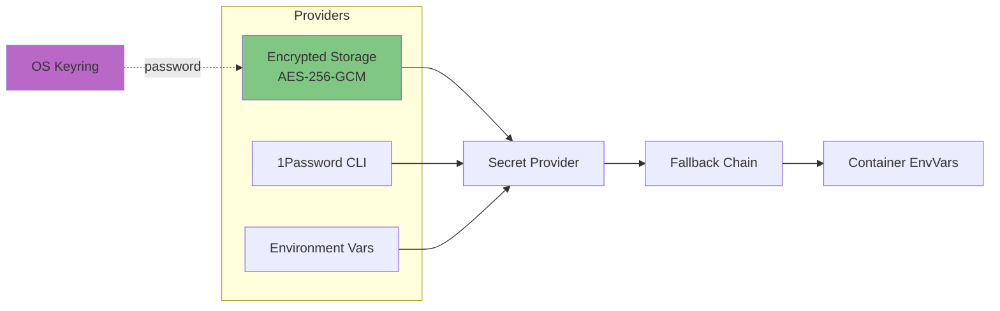

# Secrets Management

ToolHive provides a secrets management system for securely handling API keys, tokens, and other sensitive data needed by MCP servers.

## Architecture



## Provider Types

**Implementation**: `pkg/secrets/types.go:48`

### 1. Encrypted (Default)

- **Storage**: `~/.local/share/toolhive/secrets_encrypted` (Linux)
- **Encryption**: AES-256-GCM
- **Password**: Stored in OS keyring (keyctl/Keychain/DPAPI)
- **Capabilities**: Read, write, delete, list

**Implementation**: `pkg/secrets/encrypted.go`

### 2. 1Password

- **Storage**: 1Password vaults
- **Access**: Via `op` CLI
- **Capabilities**: Read-only, list

**Implementation**: `pkg/secrets/1password.go`

### 3. Environment

- **Storage**: Environment variables (`TOOLHIVE_SECRET_*`)
- **Use case**: CI/CD, stateless deployments
- **Capabilities**: Read-only

**Implementation**: `pkg/secrets/environment.go`

### 4. None

- **Storage**: None (testing only)
- **Capabilities**: All operations (no-op)

**Implementation**: `pkg/secrets/none.go`

## Secret Resolution

### Fallback Chain

**Default behavior** (can be disabled):

1. Primary provider (encrypted/1password)
2. Environment variable (`TOOLHIVE_SECRET_<NAME>`)
3. Error if not found

**Implementation**: `pkg/secrets/fallback.go`, `pkg/secrets/factory.go:259`

### Usage Pattern

**Command line:**
```bash
thv run my-server --secret "api-key,target=API_KEY"
```

**Process:**
1. Parse: `name=api-key`, `target=API_KEY`
2. Retrieve: `provider.GetSecret("api-key")`
3. Inject: `envVars["API_KEY"] = secretValue`
4. Container receives environment variable

**Implementation**: `pkg/runner/config.go:320`, `pkg/environment/`

## Security Model

**Encrypted provider:**
- Password in OS keyring (platform-specific secure storage)
- Secrets encrypted at rest (AES-256-GCM)
- File permissions: 0600
- Key derivation: SHA-256 of password

**Threat protection:**
- Plaintext on disk: ✅
- Accidental git commits: ✅
- Log exposure: ✅
- Malicious container: ❌ (has env access)

**Implementation**: `pkg/secrets/aes/aes.go`, `pkg/secrets/keyring/`

## Integration Points

### RunConfig

Secrets referenced, not embedded:
```json
{
  "secrets": ["api-key,target=API_KEY"]
}
```

Values resolved at runtime, not stored in RunConfig.

### Registry

Registry defines secret requirements:
```json
{
  "env_vars": [{
    "name": "API_KEY",
    "secret": true,
    "required": true
  }]
}
```

ToolHive prompts for value on first run.

### Detached Processes

**Challenge**: Cannot prompt for password

**Solution**: `pkg/workloads/manager.go:399`
- Parent process retrieves password
- Passed via `TOOLHIVE_SECRETS_PASSWORD` env var to child
- Child uses password without prompting

## Provider Selection

**Priority:**
1. `TOOLHIVE_SECRETS_PROVIDER` environment variable
2. Config file: `~/.config/toolhive/config.yaml`
3. Default: `encrypted`

**Implementation**: `pkg/secrets/factory.go:217`

## Related Documentation

- [RunConfig and Permissions](05-runconfig-and-permissions.md) - Secrets in configuration
- [Registry System](06-registry-system.md) - Secret requirements
- [Core Concepts](02-core-concepts.md) - Secret terminology
