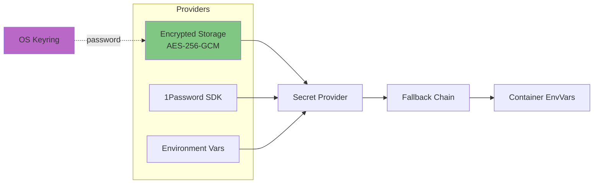

# Secrets Management

ToolHive provides a secrets management system for securely handling API keys, tokens, and other sensitive data needed by MCP servers.

## Architecture



## Provider Types

**Implementation**: `pkg/secrets/types.go`

### 1. Encrypted

- **Storage**: Platform-specific XDG data directory
  - Linux: `~/.local/share/toolhive/secrets_encrypted`
  - macOS: `~/Library/Application Support/toolhive/secrets_encrypted`
  - Windows: `%LOCALAPPDATA%/toolhive/secrets_encrypted`
- **Encryption**: AES-256-GCM
- **Password**: Stored in OS keyring (keyctl/Keychain/DPAPI)
- **Capabilities**: Read, write, delete, list

**Implementation**: `pkg/secrets/encrypted.go`

### 2. 1Password

- **Storage**: 1Password vaults
- **Access**: Via 1Password SDK (`github.com/1password/onepassword-sdk-go`)
- **Authentication**: Service account token (`OP_SERVICE_ACCOUNT_TOKEN`)
- **Capabilities**: Read-only, list

**Implementation**: `pkg/secrets/1password.go`

### 3. Environment

- **Storage**: Environment variables (`TOOLHIVE_SECRET_*`)
- **Use case**: CI/CD, stateless deployments
- **Capabilities**: Read-only (ListSecrets explicitly disabled for security)
- **Security**: Prevents enumeration of all environment variables

**Implementation**: `pkg/secrets/environment.go`

### 4. None

- **Storage**: None (testing only)
- **Capabilities**: All operations (no-op)

**Implementation**: `pkg/secrets/none.go`

## Kubernetes Mode

In Kubernetes/operator mode, ToolHive uses **native Kubernetes Secrets** instead of the provider system. This is a fundamentally different architecture from CLI mode.

### Secret References

MCPServer resources reference Kubernetes Secrets via `SecretRef`. Secrets are injected as environment variables using Kubernetes `SecretKeyRef`.

**Implementation**:
- CRD types: `cmd/thv-operator/api/v1alpha1/mcpserver_types.go`
- Pod builder: `cmd/thv-operator/controllers/mcpserver_podtemplatespec_builder.go`

### External Authentication Secrets

OAuth/OIDC client secrets are stored in Kubernetes Secrets and referenced by `MCPExternalAuthConfig` resources.

**Implementation**: `cmd/thv-operator/api/v1alpha1/mcpexternalauthconfig_types.go`

For examples, see [`examples/operator/mcp-servers/`](../../examples/operator/mcp-servers/).

### Third-Party Secret Management

For systems like HashiCorp Vault or External Secrets Operator, use `podTemplateMetadataOverrides` for annotations-based injection.

**Example**: `examples/operator/vault/mcpserver-github-with-vault.yaml`

## Secret Resolution

### Fallback Chain

**Default behavior** (can be disabled):

1. Primary provider (encrypted/1password)
2. Environment variable (`TOOLHIVE_SECRET_<NAME>`)
3. Error if not found

**Implementation**: `pkg/secrets/fallback.go`, `pkg/secrets/factory.go`

### Usage Pattern

**Command line:**
```bash
thv run my-server --secret "api-key,target=API_KEY"
```

**Process:**
1. Parse: `name=api-key`, `target=API_KEY`
2. Retrieve: `provider.GetSecret("api-key")`
3. Inject: `envVars["API_KEY"] = secretValue`
4. Container receives environment variable

**Implementation**: `pkg/runner/config.go`, `pkg/environment/`

## Security Model

**Encrypted provider:**
- Password in OS keyring (platform-specific secure storage)
- Secrets encrypted at rest (AES-256-GCM)
- File permissions: 0600
- Key derivation: SHA-256 of password

**Threat protection:**
- Plaintext on disk: ✅
- Accidental git commits: ✅
- Log exposure: ✅
- Malicious container: ❌ (has env access)

**Implementation**: `pkg/secrets/aes/aes.go`, `pkg/secrets/keyring/`

## Integration Points

### RunConfig

Secrets referenced, not embedded:
```json
{
  "secrets": ["api-key,target=API_KEY"]
}
```

Values resolved at runtime, not stored in RunConfig.

### Registry

Registry defines secret requirements:
```json
{
  "env_vars": [{
    "name": "API_KEY",
    "secret": true,
    "required": true
  }]
}
```

**Prompting behavior depends on execution context:**

- **CLI Interactive Mode**: ToolHive prompts for missing required secret values on first run. If a secrets manager is configured, it attempts to retrieve the secret first and only prompts if not found. Prompted values are automatically stored in the secrets manager for future use.

- **Detached/Background Mode**: Cannot prompt (no TTY). Missing required secrets cause an error. All secrets must be provided via `--secret` flag or pre-configured in secrets manager.

- **Kubernetes Operator**: Cannot prompt. All required secrets must be provided via Kubernetes Secret resources referenced in the workload specification.

### Detached Processes

**Challenge**: Cannot prompt for password

**Solution**: `pkg/workloads/manager.go`
- Parent process retrieves password
- Passed via `TOOLHIVE_SECRETS_PASSWORD` env var to child
- Child uses password without prompting

## Provider Selection

**Priority:**
1. `TOOLHIVE_SECRETS_PROVIDER` environment variable
2. Config file: `~/.config/toolhive/config.yaml`
3. Default: `encrypted`

**Implementation**: `pkg/secrets/factory.go`

## Related Documentation

- [RunConfig and Permissions](05-runconfig-and-permissions.md) - Secrets in configuration
- [Registry System](06-registry-system.md) - Secret requirements
- [Core Concepts](02-core-concepts.md) - Secret terminology
