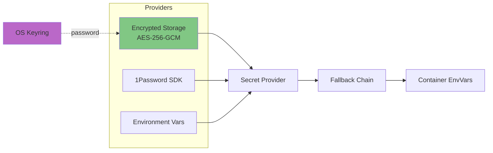

# Secrets Management

ToolHive provides a secrets management system for securely handling API keys, tokens, and other sensitive data needed by MCP servers.

## Architecture


```mermaid
graph LR
    subgraph "Providers"
        Encrypted[Encrypted Storage<br/>AES-256-GCM]
        OnePass[1Password SDK]
        Env[Environment Vars]
    end

    Provider[Secret Provider] --> Fallback[Fallback Chain]
    Encrypted --> Provider
    OnePass --> Provider
    Env --> Provider
    Fallback --> Container[Container EnvVars]

    Keyring[OS Keyring] -.->|password| Encrypted

    style Encrypted fill:#81c784
    style Keyring fill:#ba68c8
```

## Provider Types

**Implementation**:
- `pkg/secrets/factory.go` (`ProviderType` enum: `EncryptedType`, `OnePasswordType`, `EnvironmentType`)
- `pkg/secrets/types.go` defines the `Provider` interface (the contract every provider implements) and the `EnvVarPrefix` constant (`"TOOLHIVE_SECRET_"`) used by the environment provider

### 1. Encrypted

- **Storage**: Platform-specific XDG data directory
  - Linux: `~/.local/share/toolhive/secrets_encrypted`
  - macOS: `~/Library/Application Support/toolhive/secrets_encrypted`
  - Windows: `%LOCALAPPDATA%/toolhive/secrets_encrypted`
- **Encryption**: AES-256-GCM
- **Password**: Stored in OS keyring (keyctl/Keychain/DPAPI)
- **Capabilities**: Read, write, delete, list

**Implementation**: `pkg/secrets/encrypted.go`

### 2. 1Password

- **Storage**: 1Password vaults
- **Access**: Via 1Password SDK (`github.com/1password/onepassword-sdk-go`)
- **Authentication**: Service account token (`OP_SERVICE_ACCOUNT_TOKEN`)
- **Capabilities**: Read-only, list

**Implementation**: `pkg/secrets/1password.go`

### 3. Environment

- **Storage**: Environment variables (`TOOLHIVE_SECRET_*`)
- **Use case**: CI/CD, stateless deployments
- **Capabilities**: Read-only (ListSecrets explicitly disabled for security)
- **Security**: Prevents enumeration of all environment variables

**Implementation**: `pkg/secrets/environment.go`

## Kubernetes Mode

In Kubernetes/operator mode, ToolHive uses **native Kubernetes Secrets** instead of the provider system. This is a fundamentally different architecture from CLI mode.

### Secret References

MCPServer resources reference Kubernetes Secrets via `SecretRef`. Secrets are injected as environment variables using Kubernetes `SecretKeyRef`.

**Implementation**:
- CRD types: `cmd/thv-operator/api/v1beta1/mcpserver_types.go`
- Pod builder: `cmd/thv-operator/pkg/controllerutil/podtemplatespec_builder.go`

### External Authentication Secrets

OAuth/OIDC client secrets are stored in Kubernetes Secrets and referenced using `SecretKeyRef`:

1. **Token Exchange (MCPExternalAuthConfig)**: OAuth 2.0 client secrets for RFC-8693 token exchange flows
   - **Implementation**: `cmd/thv-operator/api/v1beta1/mcpexternalauthconfig_types.go`
   - **Secret injection**: `cmd/thv-operator/pkg/controllerutil/tokenexchange.go`

2. **OIDC Authentication (MCPOIDCConfig)**: OIDC client secrets for token introspection
   - **CRD field**: `spec.inline.clientSecretRef` on the `MCPOIDCConfig` resource (Go: `MCPOIDCConfig.Spec.Inline.ClientSecretRef`, where `Inline` is of type `*InlineOIDCSharedConfig`), defined in `cmd/thv-operator/api/v1beta1/mcpoidcconfig_types.go`
   - **Secret injection**: `cmd/thv-operator/pkg/controllerutil/oidc.go`
   - **Runtime loading**: `pkg/auth/token.go` (via `TOOLHIVE_OIDC_CLIENT_SECRET` environment variable)

**Pattern**: Secrets are injected as environment variables using Kubernetes `envFrom.secretKeyRef`, keeping them out of ConfigMaps and YAML manifests.

For examples, see [`examples/operator/mcp-servers/`](../../examples/operator/mcp-servers/).

### Third-Party Secret Management

For systems like HashiCorp Vault or External Secrets Operator, use `podTemplateMetadataOverrides` for annotations-based injection.

**Example**: `examples/operator/vault/mcpserver-github-with-vault.yaml`

## Secret Resolution

### Fallback Chain

**Default behavior** (can be disabled):

1. Primary provider (encrypted/1password)
2. Environment variable (`TOOLHIVE_SECRET_<NAME>`)
3. Error if not found

**Implementation**: `pkg/secrets/fallback.go`, `pkg/secrets/factory.go`

### Usage Pattern

**Command line:**
```bash
thv run my-server --secret "api-key,target=API_KEY"
```

**Process:**
1. Parse: `name=api-key`, `target=API_KEY`
2. Retrieve: `provider.GetSecret("api-key")`
3. Inject: `envVars["API_KEY"] = secretValue`
4. Container receives environment variable

**Implementation**: `pkg/runner/config.go`, `pkg/environment/`

## Security Model

**Encrypted provider:**
- Password in OS keyring (platform-specific secure storage)
- Secrets encrypted at rest (AES-256-GCM)
- File permissions: 0600
- Key derivation: Argon2id over the password with a per-file random salt (16 bytes).
  Cost parameters are the OWASP minimum for Argon2id (19 MiB, 2 iterations, 1 lane)
  and are fixed in code per format version, not stored in the file.

**Threat protection:**
- Plaintext on disk: ✅
- Accidental git commits: ✅
- Log exposure: ✅
- Malicious container: ❌ (has env access)

**Implementation**: `pkg/secrets/aes/aes.go` (AES-256-GCM), `pkg/secrets/keyring/` (OS keyring storage), `pkg/secrets/kdf.go` (Argon2id key derivation), `pkg/secrets/encrypted.go` (file framing and key caching)

**Secrets file format**: a header describing the key derivation, followed by the AES-GCM output.

```
magic    "THVSEC"  6 bytes
version  0x01      1 byte
salt               16 bytes
body               nonce|ciphertext|tag
```

The version selects the Argon2id cost parameters, which live in code. Keeping them
out of the file means no attacker-controllable value reaches Argon2id's memory
allocation, and raising the cost becomes an explicit new format version rather
than a silent per-file property.

Files written before this framing existed have no header and were keyed with an
unsalted SHA-256 of the password. They are detected by the absent magic prefix
and remain readable by current ToolHive releases. Ordinary reads, writes, and
cleanup preserve the legacy format so that older ToolHive binaries can continue
to access the same store. This applies only to existing legacy files: a new
store, including one recreated after the file is deleted, is always written in
the framed format and cannot be read by binaries that predate it.

**Upgrading protection**: run `thv secret upgrade-protection` to explicitly
upgrade a legacy file to the framed Argon2id format. The command requires a
confirmation (or `--yes` for automation), authenticates the legacy ciphertext
before making changes, atomically installs the upgraded file, and verifies it
before reporting success. If post-install verification fails, ToolHive makes a
best-effort atomic restoration of the original encrypted bytes and reports the
failure. An already framed file is left unchanged, and the command refuses to
run when there is no store (or an empty one) to upgrade.

After an upgrade, ToolHive binaries predating the framed format cannot read the
store. Stop or upgrade older local ToolHive processes — including `thv serve`
and detached proxies that persist OAuth refresh tokens — before upgrading.
Secrets already injected into running containers are unaffected. This does not
apply to the Kubernetes path, which uses Kubernetes Secrets rather than this
file.

**Recovering from a rollback**: an older binary opening an upgraded file reports
that the password is incorrect. That message predates this format and does not
indicate corruption — resetting the keyring or deleting the store is the wrong
first step and will lose secrets. The fix is to return to a binary that
understands the framed format. Rolling back to an older binary for real requires
a pre-upgrade copy of the file, kept as securely as the file itself, plus the
password that goes with it.

**Recovering from the pre-fix silent conversion (#6710)**: ToolHive releases
between the introduction of Argon2id (#6657) and this fix (#6710) upgraded a
legacy file to the framed format as a side effect of merely opening it — not
only via an explicit `upgrade-protection` run. If a store was already converted
this way before installing the fix, there is nothing to reverse and no data was
lost: keep the current secrets file and its OS keyring password exactly as they
are. What breaks is any *other* installation or already-running process still on
a binary that predates #6657 — a plain binary swap does not fix a process
already running, since it keeps the old binary loaded in memory. Recovery is:
upgrade every ToolHive installation that accesses this store to a version at or
after this fix, then restart (not just replace) every already-running process —
`thv serve`, detached proxies, and anything else holding the secrets file open —
so each one picks up the new binary. Do not delete the store or reset the
keyring for this; that only discards secrets the file already has.

**What upgrading does and does not protect**: only the live file is upgraded.
Backups taken before upgrade keep the unsalted SHA-256 derivation and stay
cheaply crackable offline. Because the password itself is unchanged, recovering
it from an old backup also decrypts the upgraded file — so retiring old backups
matters as much as the upgrade. Conversely, a backup of the upgraded file is not
a substitute for retaining the password or keyring entry; without them it cannot
be decrypted.

## Integration Points

### RunConfig

Secrets referenced, not embedded:
```json
{
  "secrets": ["api-key,target=API_KEY"]
}
```

Values resolved at runtime, not stored in RunConfig.

### Registry

Registry defines secret requirements:
```json
{
  "env_vars": [{
    "name": "API_KEY",
    "secret": true,
    "required": true
  }]
}
```

**Prompting behavior depends on execution context:**

- **CLI Interactive Mode**: ToolHive prompts for missing required secret values on first run. If a secrets manager is configured, it attempts to retrieve the secret first and only prompts if not found. Prompted values are automatically stored in the secrets manager for future use.

- **Detached/Background Mode**: Cannot prompt (no TTY). Missing required secrets cause an error. All secrets must be provided via `--secret` flag or pre-configured in secrets manager.

- **Kubernetes Operator**: Cannot prompt. All required secrets must be provided via Kubernetes Secret resources referenced in the workload specification.

### Detached Processes

**Challenge**: Cannot prompt for password

**Solution**: `pkg/workloads/manager.go`
- Parent process retrieves password
- Passed via `TOOLHIVE_SECRETS_PASSWORD` env var to child
- Child uses password without prompting

## Provider Selection

**Priority:**
1. `TOOLHIVE_SECRETS_PROVIDER` environment variable
2. Config file: `~/.config/toolhive/config.yaml`
3. Default: `encrypted`

**Implementation**: `pkg/secrets/factory.go`

## Related Documentation

- [RunConfig and Permissions](05-runconfig-and-permissions.md) - Secrets in configuration
- [Registry System](06-registry-system.md) - Secret requirements
- [Core Concepts](02-core-concepts.md) - Secret terminology
