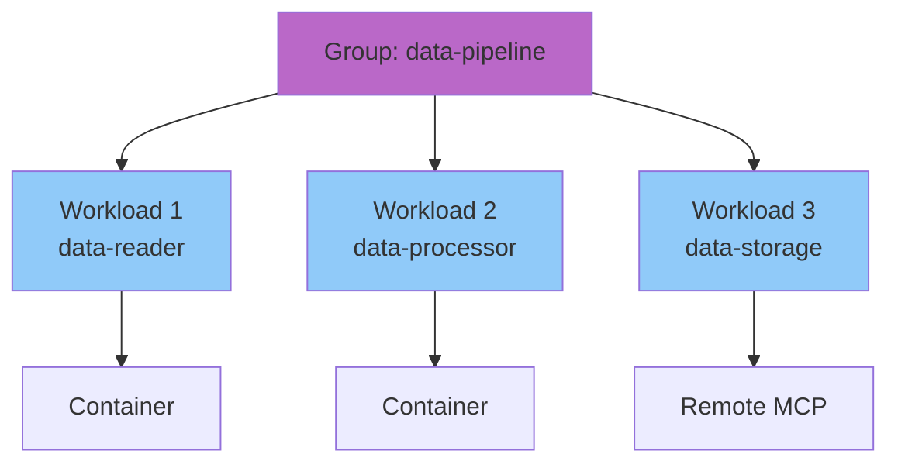

# Groups

Groups are a logical abstraction for organizing related MCP servers. They provide organizational structure and serve as a foundation for future features.

## Concept

A **group** is a named collection of MCP servers that share a common purpose or use case.

**Examples:**
- `data-pipeline` - Data ingestion, transformation, storage tools
- `development` - Code analysis, testing, deployment tools
- `research` - Web search, document retrieval, summarization tools

**Benefits:**
- Organizational structure for managing multiple servers
- Client configuration (configure clients to use all servers in a group)
- Foundation for future aggregation features
- Logical grouping for access control

## Architecture



## Implementation

### RunConfig Field

**Implementation**: `pkg/runner/config.go`

```json
{
  "name": "data-reader",
  "group": "data-pipeline",
  "image": "ghcr.io/example/data-reader:latest"
}
```

### Group Operations

Groups support standard lifecycle operations: create, list, and remove. Workloads can be assigned to groups at creation time using the `--group` flag. Moving workloads between groups is currently only supported internally (e.g., when removing a group) and is not exposed as a user-facing CLI command. When removing a group, workloads are by default moved to the `default` group rather than deleted.

**Implementation**:
- CLI commands: `cmd/thv/app/group.go`
- Group manager: `pkg/groups/`
- Workload integration: `pkg/workloads/manager.go`

## Registry Groups

Registry groups are predefined collections of servers that can be deployed together as a unit. These groups are defined in the registry schema and support both container-based and remote MCP servers.

**Architecture:**
- Registry groups are defined in the registry schema alongside individual servers
- Groups can contain heterogeneous workload types (containers + remote servers)
- Group deployment creates a runtime group with all member servers
- Each server maintains its individual identity and configuration

**Implementation**: `pkg/registry/types.go`

**Use case**: Deploy complete stacks (e.g., a full data processing pipeline) with a single command, ensuring all required components are available together.

**Note**: The default registry currently contains no predefined groups. This feature is available for custom registries or future additions to the default registry.

## Client Configuration Integration

Groups provide a logical boundary for client configuration. The client manager can configure MCP clients with all servers belonging to a specific group, simplifying setup when multiple related servers need to be available to a client.

**Architecture:**
- Client manager reads group membership from workload metadata
- All servers in a group can be added to client configuration as a unit
- Group membership is maintained in client configuration for organizational purposes

**Implementation**: `pkg/client/`

## Use Cases

### 1. Related Services

**Scenario**: Multiple MCP servers that work together

**Example**: Data processing pipeline
- `data-reader` - Reads from various sources
- `data-transformer` - Transforms data formats
- `data-writer` - Writes to destinations

**Group**: `data-pipeline`

### 2. Environment Separation

**Scenario**: Same tools in different environments

**Groups**:
- `production` - Production servers
- `staging` - Staging servers
- `development` - Dev servers

### 3. Team Organization

**Scenario**: Different teams manage different servers

**Groups**:
- `backend-team` - Backend development tools
- `frontend-team` - Frontend development tools
- `data-team` - Data analysis tools

## Future Features

Groups serve as the foundation for upcoming features:

- **Virtual MCP Servers**: Aggregate multiple servers in a group into a single unified interface (proposed, under consideration)
- **Group-level policies**: Apply authorization at group level
- **Group metrics**: Aggregate telemetry from all group members
- **Group health**: Overall health status of group

## Related Documentation

- [Core Concepts](02-core-concepts.md) - Group concept definition
- [Registry System](06-registry-system.md) - Groups in registry
- [Workloads Lifecycle](08-workloads-lifecycle.md) - Group operations
