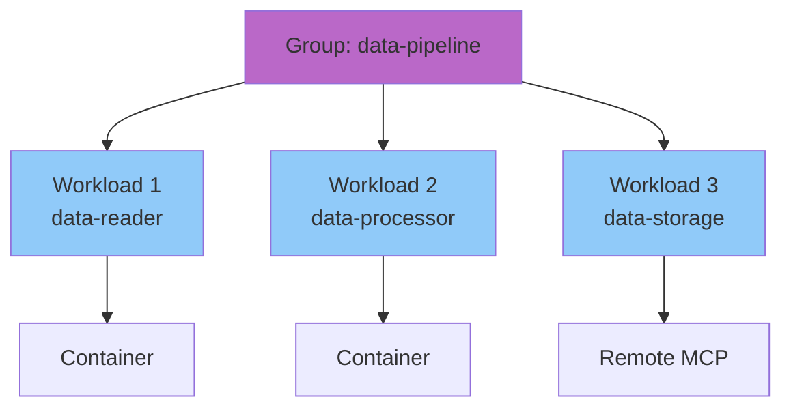

# Groups

Groups are a logical abstraction for organizing related MCP servers. They provide organizational structure and serve as a foundation for future features.

## Concept

A **group** is a named collection of MCP servers that share a common purpose or use case.

**Examples:**
- `data-pipeline` - Data ingestion, transformation, storage tools
- `development` - Code analysis, testing, deployment tools
- `research` - Web search, document retrieval, summarization tools

**Benefits:**
- Organizational structure for managing multiple servers
- Client configuration (configure clients to use all servers in a group)
- Foundation for future aggregation features
- Logical grouping for access control

## Architecture



## Implementation

### RunConfig Field

**Implementation**: `pkg/runner/config.go:148`

```json
{
  "name": "data-reader",
  "group": "data-pipeline",
  "image": "ghcr.io/example/data-reader:latest"
}
```

### Group Operations

**Create group by adding workloads:**
```bash
thv run server1 --group data-pipeline
thv run server2 --group data-pipeline
```

**List all groups:**
```bash
thv group list
```

**List workloads in group:**
```bash
thv group list data-pipeline
```

**Move workload between groups:**
```bash
thv group move server1 --from data-pipeline --to development
```

**Delete group (stops all workloads):**
```bash
thv group delete data-pipeline
```

**Implementation**: `cmd/thv/app/group.go`, `pkg/groups/`, `pkg/workloads/manager.go:1038`

## Registry Groups

Registry can define predefined groups:

**Implementation**: `pkg/registry/types.go:17`

```json
{
  "groups": [{
    "name": "data-pipeline",
    "description": "Complete data processing pipeline",
    "servers": {
      "data-reader": { /* ImageMetadata */ },
      "data-processor": { /* ImageMetadata */ }
    },
    "remote_servers": {
      "data-warehouse": { /* RemoteServerMetadata */ }
    }
  }]
}
```

**Deploy entire group:**
```bash
thv group run data-pipeline
```

This starts all servers defined in the registry group.

## Client Configuration

Groups simplify client setup:

**Configure client for group:**
```bash
thv client setup claude-code --group data-pipeline
```

**Result**: Client configured with all servers in the group

**Implementation**: Client manager reads group membership and configures all servers

## Use Cases

### 1. Related Services

**Scenario**: Multiple MCP servers that work together

**Example**: Data processing pipeline
- `data-reader` - Reads from various sources
- `data-transformer` - Transforms data formats
- `data-writer` - Writes to destinations

**Group**: `data-pipeline`

### 2. Environment Separation

**Scenario**: Same tools in different environments

**Groups**:
- `production` - Production servers
- `staging` - Staging servers
- `development` - Dev servers

### 3. Team Organization

**Scenario**: Different teams manage different servers

**Groups**:
- `backend-team` - Backend development tools
- `frontend-team` - Frontend development tools
- `data-team` - Data analysis tools

## Future Features

Groups serve as the foundation for upcoming features:

- **Virtual MCP Servers**: Aggregate group into single interface (proposal in PR #2106)
- **Group-level policies**: Apply authorization at group level
- **Group metrics**: Aggregate telemetry from all group members
- **Group health**: Overall health status of group

## Related Documentation

- [Core Concepts](02-core-concepts.md) - Group concept definition
- [Registry System](06-registry-system.md) - Groups in registry
- [Workloads Lifecycle](08-workloads-lifecycle.md) - Group operations
