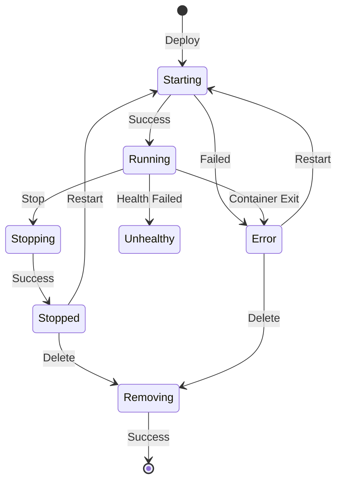

# Workloads Lifecycle Management

The workloads API provides a unified interface for managing MCP server deployments across different runtimes. This document explains how workloads are created, managed, and destroyed.

## Overview

The workloads manager abstracts lifecycle operations across:
- Local Docker/Podman deployments
- Remote MCP servers
- Kubernetes deployments (via operator)

**Implementation**: `pkg/workloads/manager.go:38`

## Workload Lifecycle



**States**: `pkg/container/runtime/types.go:17`
- `starting`, `running`, `stopping`, `stopped`
- `removing`, `error`, `unhealthy`

## Core Operations

### Deploy

**Foreground:**
```bash
thv run my-server --foreground
```

Creates transport → deploys container → starts proxy → blocks until shutdown

**Detached:**
```bash
thv run my-server
```

Saves state → forks process → returns immediately → child runs in background

**Implementation**: `pkg/workloads/manager.go:316`, `357`

### Stop

```bash
thv stop my-server
```

**Container workload**: Stops proxy process → stops container → preserves state

**Remote workload**: Stops proxy → preserves state

**Implementation**: `pkg/workloads/manager.go:196`, `242`, `288`

### Restart

```bash
thv restart my-server
```

Loads state → verifies not running → starts workload with saved config

**Implementation**: `pkg/workloads/manager.go:676`, `747`

### Delete

```bash
thv rm my-server
```

**Container workload**: Stops proxy → removes container → deletes state

**Remote workload**: Stops proxy → deletes state

**Implementation**: `pkg/workloads/manager.go:657`, `488`, `515`

### Update

```bash
thv update my-server --image new-version:v2
```

Stop → delete → save new config → start

**Implementation**: `pkg/workloads/manager.go:696`, `710`

### List

```bash
thv list
thv list --all  # Include stopped
thv list --filter "group=dev"
```

Combines container workloads (from runtime) + remote workloads (from state)

**Implementation**: `pkg/workloads/manager.go:175`

## Async Operations

Many operations run asynchronously for batch processing:

```bash
thv stop server1 server2 server3
```

All three stopped in parallel, result aggregated.

**Pattern**: Operations return `errgroup.Group`

**Timeout**: 5 minutes per operation

**Implementation**: Uses `golang.org/x/sync/errgroup`

## Container vs Remote

### Container Workloads

**Components:**
- Container (via runtime)
- Proxy process (detached mode)
- Permission profile
- Network isolation

**Available operations:** All

### Remote Workloads

**Components:**
- Proxy process only
- No container
- No permission profile

**Available operations:** Deploy, stop, restart, delete, list

**Detection**: `RunConfig.RemoteURL != ""`

**Implementation**: Logic in `pkg/workloads/manager.go:219-286`, `465-512`, `747-798`

## State Management

### Storage Locations

**RunConfig state:**
- Path: `~/.local/state/toolhive/state/<name>.json`
- Contains: Full RunConfig
- Used for: Restart, export

**Status file:**
- Path: `~/.local/state/toolhive/status/<name>.json`
- Contains: Status, PID, timestamps
- Used for: List, monitoring

**PID file** (container workloads only):
- Path: `~/.local/state/toolhive/pids/<name>.pid`
- Contains: Proxy process PID
- Used for: Stop operation

**Implementation**: `pkg/state/`, `pkg/workloads/statuses/`

### Status Manager

Provides atomic status updates:
- `SetWorkloadStatus` - Update status
- `GetWorkload` - Read status
- `SetWorkloadPID` - Set PID
- `DeleteWorkloadStatus` - Remove status

**Implementation**: `pkg/workloads/statuses/file_status.go`

## Labels and Filtering

### Standard Labels

Automatically added:
- `toolhive.stacklok.com/name`
- `toolhive.stacklok.com/base-name`
- `toolhive.stacklok.com/transport`
- `toolhive.stacklok.com/port`

**Implementation**: `pkg/labels/`, `pkg/runner/config.go:405`

### Custom Labels

```bash
thv run my-server --label "team=backend" --label "env=prod"
```

### Filtering

```bash
thv list --filter "team=backend"
thv list --filter "transport=sse"
```

**Implementation**: `pkg/workloads/types/labels.go`

## Related Documentation

- [Core Concepts](02-core-concepts.md) - Workload concept
- [Deployment Modes](01-deployment-modes.md) - Lifecycle per mode
- [Transport Architecture](03-transport-architecture.md) - Transport lifecycle
- [Groups](07-groups.md) - Group operations
