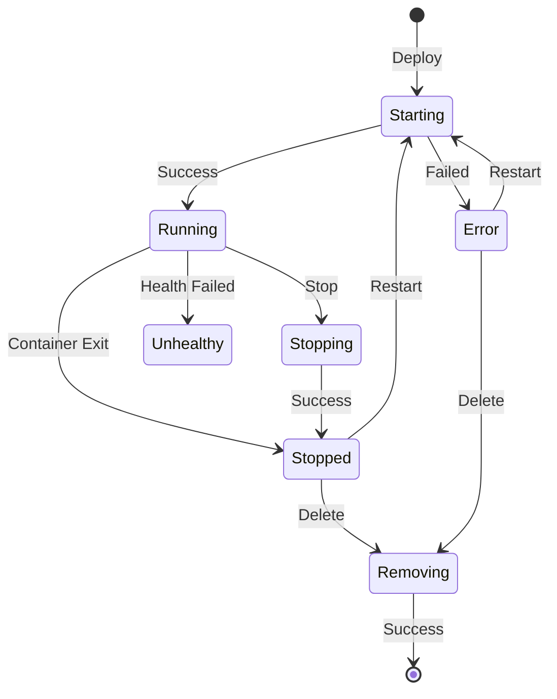

# Workloads Lifecycle Management

The workloads API provides a unified interface for managing MCP server deployments across different runtimes. This document explains how workloads are created, managed, and destroyed.

## Overview

The workloads manager abstracts lifecycle operations across:
- Local Docker/Podman deployments
- Remote MCP servers
- Kubernetes deployments (via operator)

**Implementation**: `pkg/workloads/manager.go`

## Workload Lifecycle



**States**: `pkg/container/runtime/types.go`
- `starting`, `running`, `stopping`, `stopped`
- `removing`, `error`, `unhealthy`

## Core Operations

### Deploy

**Foreground:**
```bash
thv run my-server --foreground
```

Creates transport → deploys container → starts proxy → blocks until shutdown

**Detached:**
```bash
thv run my-server
```

Saves state → forks process → returns immediately → child runs in background

**Implementation**: `pkg/workloads/manager.go`

### Stop

```bash
thv stop my-server
```

**Container workload**: Stops proxy process → stops container → preserves state

**Remote workload**: Stops proxy → preserves state

**Implementation**: `pkg/workloads/manager.go`

### Restart

```bash
thv restart my-server
```

Loads state → verifies not running → starts workload with saved config

**Implementation**: `pkg/workloads/manager.go`

### Delete

```bash
thv rm my-server
```

**Container workload**: Stops proxy → removes container → deletes state

**Remote workload**: Stops proxy → deletes state

**Implementation**: `pkg/workloads/manager.go`

### List

Listing combines container workloads from the runtime with remote workloads from persisted state. The manager can filter workloads by label or group, and can optionally include stopped workloads.

**Implementation**: `pkg/workloads/manager.go`

## Batch Operations

Some operations (stop, delete) support processing multiple workloads in a single invocation, handling each workload sequentially or in parallel as appropriate.

**Pattern**: Operations return `errgroup.Group`

**Timeout**: 5 minutes per operation

**Implementation**: Uses `golang.org/x/sync/errgroup`

## Container vs Remote

### Container Workloads

**Components:**
- Container (via runtime)
- Proxy process (detached mode)
- Permission profile
- Network isolation

**Available operations:** All

### Remote Workloads

**Components:**
- Proxy process only
- No container
- No permission profile

**Available operations:** Deploy, stop, restart, delete, list

**Detection**: `RunConfig.RemoteURL != ""`

**Implementation**: `pkg/workloads/manager.go`

## State Management

### Storage Locations

**RunConfig state:**
- Path: `$XDG_STATE_HOME/toolhive/runconfigs/<name>.json`
- Default: `~/.local/state/toolhive/runconfigs/<name>.json`
- Contains: Full RunConfig
- Used for: Restart, export

**Status file:**
- Path: `$XDG_DATA_HOME/toolhive/statuses/<name>.json`
- Default: `~/.local/share/toolhive/statuses/<name>.json`
- Contains: Status, PID, timestamps
- Used for: List, monitoring

**PID file** (container workloads only):
- Path: `$XDG_DATA_HOME/toolhive/pids/toolhive-<name>.pid`
- Default: `~/.local/share/toolhive/pids/toolhive-<name>.pid`
- Contains: Proxy process PID
- Used for: Stop operation

**Implementation**: `pkg/state/`, `pkg/workloads/statuses/`

### Status Manager

Provides atomic status updates:
- `SetWorkloadStatus` - Update status
- `GetWorkload` - Read status
- `SetWorkloadPID` - Set PID
- `DeleteWorkloadStatus` - Remove status

**Implementation**: `pkg/workloads/statuses/file_status.go`

## Labels and Filtering

### Standard Labels

The system automatically applies standard labels to workloads:
- `toolhive-name` - Full workload name
- `toolhive-basename` - Base name without timestamp
- `toolhive-transport` - Transport protocol type
- `toolhive-port` - Proxy port number

**Implementation**: `pkg/labels/`, `pkg/runner/config.go`

### Custom Labels

Users can apply custom labels for organizational purposes. Labels support filtering during list operations.

**Implementation**: `pkg/workloads/types/labels.go`

## Related Documentation

- [Core Concepts](02-core-concepts.md) - Workload concept
- [Deployment Modes](01-deployment-modes.md) - Lifecycle per mode
- [Transport Architecture](03-transport-architecture.md) - Transport lifecycle
- [Groups](07-groups.md) - Group operations
