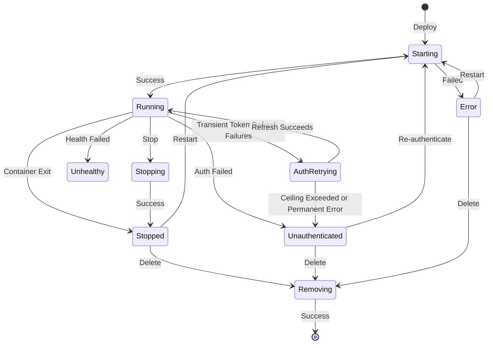

# Workloads Lifecycle Management

The workloads API provides a unified interface for managing MCP server deployments across different runtimes. This document explains how workloads are created, managed, and destroyed.

## Overview

The workloads manager abstracts lifecycle operations across:
- Local Docker/Podman deployments
- Remote MCP servers
- Kubernetes deployments (via operator)

**Implementation**: `pkg/workloads/manager.go`

## Workload Lifecycle


```mermaid
stateDiagram-v2
    [*] --> Starting: Deploy
    Starting --> Running: Success
    Starting --> Error: Failed

    Running --> Stopping: Stop
    Running --> Unhealthy: Health Failed
    Running --> Unauthenticated: Auth Failed
    Running --> AuthRetrying: Transient Token Refresh Failures
    Running --> Stopped: Container Exit

    Stopping --> Stopped: Success
    Stopped --> Starting: Restart
    Stopped --> Removing: Delete

    Unauthenticated --> Starting: Re-authenticate
    Unauthenticated --> Removing: Delete

    AuthRetrying --> Running: Refresh Succeeds
    AuthRetrying --> Unauthenticated: Ceiling Exceeded or Permanent Error

    Removing --> [*]: Success
    Error --> Starting: Restart
    Error --> Removing: Delete
```

**States**: `pkg/container/runtime/types.go`
- `starting`, `running`, `stopping`, `stopped`
- `removing`, `error`, `unhealthy`, `unauthenticated`, `auth_retrying`
- `policy_stopped`, `unknown`

The `auth_retrying` cadence and ceiling can be tuned via environment
variables on the proxy process:

- `TOOLHIVE_TOKEN_AUTH_RETRYING_TICK_INTERVAL` (default `10m`): cadence
  between background refresh attempts during the AuthRetrying window.
- `TOOLHIVE_TOKEN_AUTH_RETRYING_MAX_ELAPSED` (default `24h`): ceiling
  before the workload is finally marked `unauthenticated`.

## Core Operations

### Deploy

**Foreground:**
```bash
thv run my-server --foreground
```

Creates transport → deploys container → starts proxy → blocks until shutdown

**Detached:**
```bash
thv run my-server
```

Saves state → forks process → returns immediately → child runs in background

**Implementation**: `pkg/workloads/manager.go`

### Stop

```bash
thv stop my-server
```

**Container workload**: Stops proxy process → stops container → preserves state

**Remote workload**: Stops proxy → preserves state

**Implementation**: `pkg/workloads/manager.go`

### Start

```bash
thv start my-server
```
> Note: `thv restart` remains available as an alias for backward compatibility.

Loads state → verifies not running → starts workload with saved config

**Implementation**: `pkg/workloads/manager.go`

### Delete

```bash
thv rm my-server
```

**Container workload**: Stops proxy → removes container → deletes state

**Remote workload**: Stops proxy → deletes state

**Implementation**: `pkg/workloads/manager.go`

### Upgrade

```bash
thv upgrade check [my-server]      # offline metadata comparison, never pulls
thv upgrade apply my-server --yes  # verify + pull, then recreate
```

Upgrades apply only to **registry-sourced** workloads — those run by a registry entry name, which records `RunConfig.RegistryServerName`. A workload run from a raw image reference has no registry server name and is reported as `not-registry-sourced`.

**Check** is an offline comparison. The checker (`pkg/workloads/upgrade.Checker`) looks up the workload's `RegistryServerName` in the configured registry and compares the running image tag against the candidate the registry advertises (semver, conservative: a `latest` tag, a different repository, or non-comparable tags yield `unknown`). When the registry advertises a strictly newer tag the status is `upgrade-available`, and the result also surfaces **env-var drift** (variables the candidate now declares that the workload does not yet supply) and **posture drift** (transport, permission profile — network isolation is a local-only choice the registry cannot express, so it is not reported as drift). Checks never pull images.

**Apply** is the single security-critical path (`pkg/workloads/upgrade.Applier`). It re-derives the check against the registry on every apply (closing the time-of-check/time-of-use window — a `CheckResult` from an earlier `check` is never trusted), then, in order:

1. Resolves and **verifies** the candidate image's provenance (by registry server name).
2. Builds a merged `RunConfig` that **preserves the entire user configuration** — env vars, secrets, OIDC/authz/audit/telemetry, tool filters, middleware, transport/posture — and changes only the image, any merged env/secrets supplied via `--env`/`--secret`, and the registry source URLs.
3. Runs the policy gate and performs the verified **pull**.
4. Only then asks the manager to recreate the workload via `UpdateWorkload` (stop → delete → start with the new config).

Steps 1–3 all complete before any destruction, so a failure while preparing the candidate leaves the running workload untouched. **There is no automatic rollback**: once recreation begins, the previous image/config is not restored — recovery is a forward operation. Posture drift (transport, permission profile) is **surfaced as a warning, not converged**: the upgraded workload keeps its full existing posture, including transport, network isolation, and permission profile.

> Runtime boundary: the "verified pull before destruction" guarantee holds precisely for local container runtimes (the scope here). On Kubernetes the verification and policy gate still precede recreation, but the byte-level pull is delegated to the kubelet and happens after recreation.

The same `Applier` backs both the CLI (`thv upgrade apply`) and the API (`POST /api/v1beta/workloads/{name}/upgrade`, with `GET .../{name}/upgrade-check` and `GET .../upgrade-check` for single and bulk checks), so the verify-then-pull ordering lives in exactly one place. `thv list --check-upgrades` annotates the workload list with each workload's check result.

**Implementation**: `pkg/workloads/upgrade/`, `cmd/thv/app/upgrade.go`

### List

Listing combines container workloads from the runtime with remote workloads from persisted state. The manager can filter workloads by label or group, and can optionally include stopped workloads.

**Implementation**: `pkg/workloads/manager.go`

## Batch Operations

Some operations (stop, delete) support processing multiple workloads in a single invocation, handling each workload sequentially or in parallel as appropriate.

**Pattern**: Operations return a `CompletionFunc` (call to block until completion); internally uses `golang.org/x/sync/errgroup`

**Timeout**: 5 minutes per operation

## Container vs Remote

### Container Workloads

**Components:**
- Container (via runtime)
- Proxy process (detached mode)
- Permission profile
- Network isolation

**Available operations:** All

### Remote Workloads

**Components:**
- Proxy process only
- No container
- No permission profile

**Available operations:** Deploy, stop, restart, delete, list

**Detection**: `RunConfig.RemoteURL != ""`

**Implementation**: `pkg/workloads/manager.go`

## State Management

### Storage Locations

**RunConfig state:**
- Path: `$XDG_STATE_HOME/toolhive/runconfigs/<name>.json`
- Default: `~/.local/state/toolhive/runconfigs/<name>.json`
- Contains: Full RunConfig
- Used for: Restart, export

**Status file:**
- Path: `$XDG_DATA_HOME/toolhive/statuses/<name>.json`
- Default: `~/.local/share/toolhive/statuses/<name>.json`
- Contains: Status, PID, timestamps
- Used for: List, monitoring

**PID file** (container workloads only):
- Path: `$XDG_DATA_HOME/toolhive/pids/toolhive-<name>.pid`
- Default: `~/.local/share/toolhive/pids/toolhive-<name>.pid`
- Contains: Proxy process PID
- Used for: Stop operation

**Implementation**: `pkg/state/`, `pkg/workloads/statuses/`

### Status Manager

Provides atomic status updates:
- `SetWorkloadStatus` - Update status
- `GetWorkload` - Read status
- `SetWorkloadPID` - Set PID
- `DeleteWorkloadStatus` - Remove status

**Implementation**: `pkg/workloads/statuses/file_status.go`

## Labels and Filtering

### Standard Labels

The system automatically applies standard labels to workloads:
- `toolhive-name` - Full workload name
- `toolhive-basename` - Base name without timestamp
- `toolhive-transport` - Transport protocol type
- `toolhive-port` - Proxy port number

**Implementation**: `pkg/labels/`, `pkg/runner/config.go`

### Custom Labels

Users can apply custom labels for organizational purposes. Labels support filtering during list operations.

**Implementation**: `pkg/workloads/types/labels.go`

## Related Documentation

- [Core Concepts](02-core-concepts.md) - Workload concept
- [Deployment Modes](01-deployment-modes.md) - Lifecycle per mode
- [Transport Architecture](03-transport-architecture.md) - Transport lifecycle
- [Groups](07-groups.md) - Group operations
