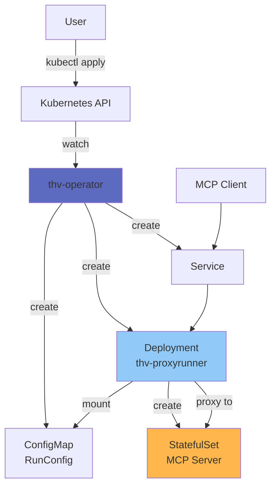
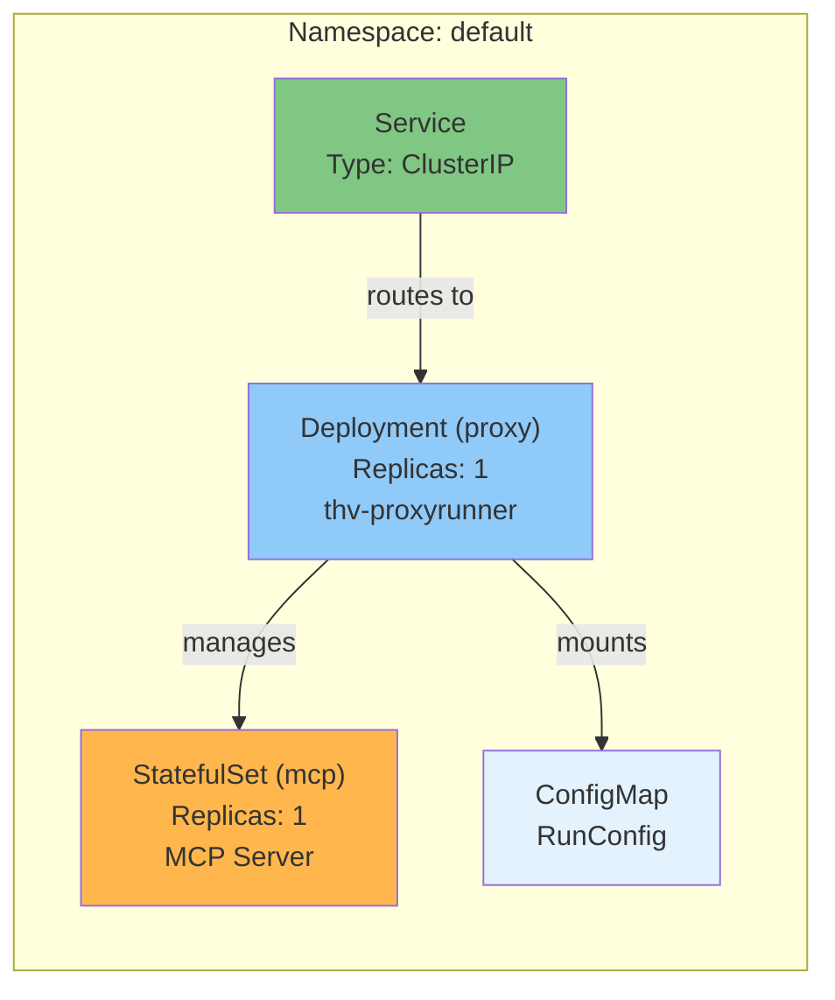
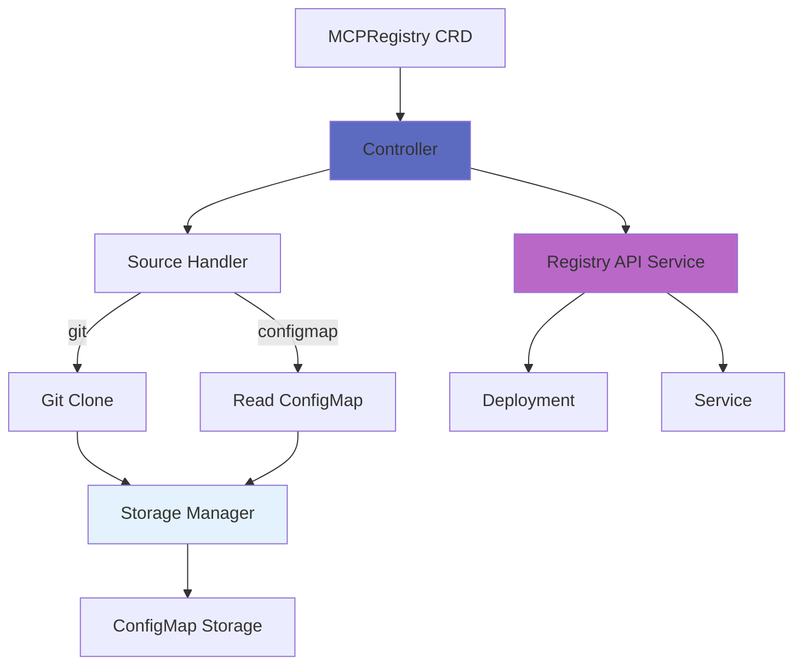

# Kubernetes Operator Architecture

The ToolHive operator manages MCP servers in Kubernetes clusters using custom resources and the operator pattern. This document explains the operator's design, components, and reconciliation logic.

## Overview

**Why two binaries?**

- **`thv-operator`**: Watches CRDs, reconciles Kubernetes resources
- **`thv-proxyrunner`**: Runs in pods, creates containers, proxies traffic

This separation provides clear responsibility boundaries and enables independent scaling.

**Implementation**: `cmd/thv-operator/`, `cmd/thv-proxyrunner/`

## Architecture



## Custom Resource Definitions

### MCPServer

Defines an MCP server deployment.

**Implementation**: `cmd/thv-operator/api/v1alpha1/mcpserver_types.go`

**Example:**
```yaml
apiVersion: mcp.stacklok.com/v1alpha1
kind: MCPServer
metadata:
  name: weather-server
spec:
  image: ghcr.io/example/weather:latest
  transport: sse
  port: 8080
  targetPort: 3000
  permissionProfile:
    type: builtin
    name: network
  oidcConfig:
    type: kubernetes
  authzConfig:
    type: inline
    inline:
      policies:
      - permit(principal, action, resource);
```

**Status:**
```yaml
status:
  phase: Running
  url: http://weather-server.default.svc.cluster.local:8080
```

### MCPRegistry

Manages MCP server registries in Kubernetes.

**Implementation**: `cmd/thv-operator/api/v1alpha1/mcpregistry_types.go`

**Example:**
```yaml
apiVersion: mcp.stacklok.com/v1alpha1
kind: MCPRegistry
metadata:
  name: company-registry
spec:
  source:
    type: git
    git:
      url: https://github.com/company/mcp-registry
      branch: main
  syncPolicy:
    automatic: true
    interval: 1h
  apiService:
    enabled: true
```

**Controller**: `cmd/thv-operator/controllers/mcpregistry_controller.go`

### ToolConfig

Defines tool filtering and override configuration.

**Implementation**: `cmd/thv-operator/api/v1alpha1/toolconfig_types.go`

**Example:**
```yaml
apiVersion: mcp.stacklok.com/v1alpha1
kind: ToolConfig
metadata:
  name: filtered-tools
spec:
  filter:
  - tool-a
  - tool-b
  override:
    tool-a:
      name: renamed-tool
      description: Custom description
```

**Referenced by MCPServer:**
```yaml
spec:
  toolConfigRef:
    name: filtered-tools
```

**Controller**: `cmd/thv-operator/controllers/toolconfig_controller.go`

## Operator Components

### Controller

**Reconciliation loop:**

1. **Watch** MCPServer resources
2. **Get** desired state from CRD spec
3. **Get** current state from cluster
4. **Compare** desired vs current
5. **Reconcile** - Create, update, or delete resources
6. **Update status** with result

**Implementation**: `cmd/thv-operator/controllers/mcpserver_controller.go`

### Resources Created

**For each MCPServer, operator creates:**

1. **Deployment** (proxy-runner)
   - Runs `thv-proxyrunner` image
   - Mounts RunConfig as ConfigMap
   - Applies middleware configuration

2. **StatefulSet** (MCP server)
   - Created by proxy-runner
   - Runs actual MCP server image
   - Stable network identity

3. **Service**
   - Exposes proxy deployment
   - Type: ClusterIP, LoadBalancer, or NodePort
   - Routes traffic to proxy

4. **ConfigMap** (RunConfig)
   - Contains serialized RunConfig
   - Mounted into proxy-runner pod

5. **ServiceAccount** (optional)
   - For RBAC permissions
   - Pod identity

## Deployment Pattern



## Proxy-Runner Binary

**Purpose**: Runs inside Deployment pod, creates and proxies to MCP server

**Responsibilities:**
1. Read RunConfig from mounted ConfigMap
2. Create StatefulSet with MCP server
3. Wait for StatefulSet to be ready
4. Start transport and proxy
5. Apply middleware chain
6. Forward traffic to StatefulSet pods

**Command:**
```bash
thv-proxyrunner run
```

**Environment:**
- `KUBERNETES_SERVICE_HOST` - Detects K8s environment
- RunConfig path from mount
- In-cluster Kubernetes client

**Implementation**: `cmd/thv-proxyrunner/app/commands.go`

## Design Principles

**From**: `cmd/thv-operator/DESIGN.md`

### CRD Attributes vs PodTemplateSpec

**Use CRD attributes for:**
- Business logic affecting reconciliation
- Validation requirements
- Cross-resource coordination
- Operator decision making

**Use PodTemplateSpec for:**
- Infrastructure concerns (node selection, resources, affinity)
- Sidecar containers
- Standard Kubernetes pod configuration
- Cluster admin configurations

**Examples:**

CRD attribute:
```yaml
spec:
  transport: sse  # Affects operator logic
  port: 8080      # Affects Service creation
```

PodTemplateSpec:
```yaml
spec:
  podTemplateSpec:
    spec:
      nodeSelector:
        disktype: ssd  # Infrastructure concern
```

### Status Management

**Pattern**: Batched updates via StatusCollector

**Why**: Prevents race conditions, reduces API calls

**Implementation**: `cmd/thv-operator/pkg/mcpregistrystatus/`

**Example:**
```go
statusCollector := NewCollector(mcpServer)
statusCollector.SetPhase(MCPServerPhaseRunning)
statusCollector.SetURL("http://...")
statusCollector.Apply(ctx, client)
```

## MCPRegistry Controller

**Architecture:**



### Source Handlers

**Git source**: `cmd/thv-operator/pkg/sources/git.go`
- Clones repository
- Reads registry.json
- Calculates hash for change detection

**ConfigMap source**: `cmd/thv-operator/pkg/sources/configmap.go`
- Reads from existing ConfigMap
- Watches for updates

**Interface**: `cmd/thv-operator/pkg/sources/types.go`

### Storage Manager

**Purpose**: Persist registry data in cluster

**Implementation**: `cmd/thv-operator/pkg/sources/storage_manager.go`

**Storage**: ConfigMap with owner reference

**Format:**
```yaml
data:
  registry.json: |
    { full registry data }
  sync_metadata.json: |
    { sync timestamp, hash }
```

### Sync Policy

**Automatic sync:**
```yaml
spec:
  syncPolicy:
    automatic: true
    interval: 1h
```

Operator syncs every hour.

**Manual sync:**
```yaml
spec:
  syncPolicy:
    automatic: false
```

Trigger: Add annotation `mcp.stacklok.com/sync=true`

### Registry API Service

When enabled, operator creates:
- Deployment running `thv-registry-api`
- Service exposing API
- ConfigMap mount with registry data

**Implementation**: `cmd/thv-operator/pkg/registryapi/service.go`

## Configuration References

### ConfigMap References

**OIDC config:**
```yaml
spec:
  oidcConfig:
    type: configMap
    configMap:
      name: oidc-config
      key: oidc.json
```

**Authz policies:**
```yaml
spec:
  authzConfig:
    type: configMap
    configMap:
      name: authz-policies
      key: policies.cedar
```

### Inline Configuration

**OIDC:**
```yaml
spec:
  oidcConfig:
    type: inline
    inline:
      issuer: https://auth.example.com
      audience: my-app
```

**Authz:**
```yaml
spec:
  authzConfig:
    type: inline
    inline:
      policies:
      - permit(principal, action, resource);
```

## Related Documentation

- [Deployment Modes](01-deployment-modes.md) - Kubernetes mode details
- [Core Concepts](02-core-concepts.md) - Operator concepts
- [Registry System](06-registry-system.md) - MCPRegistry CRD
- Operator Design: `cmd/thv-operator/DESIGN.md`
