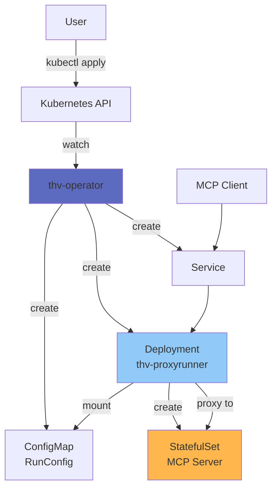
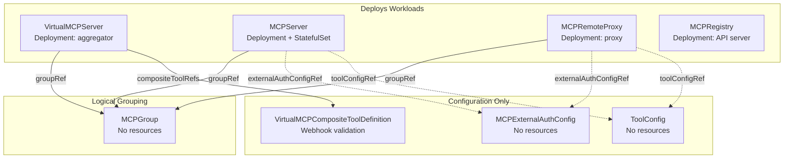
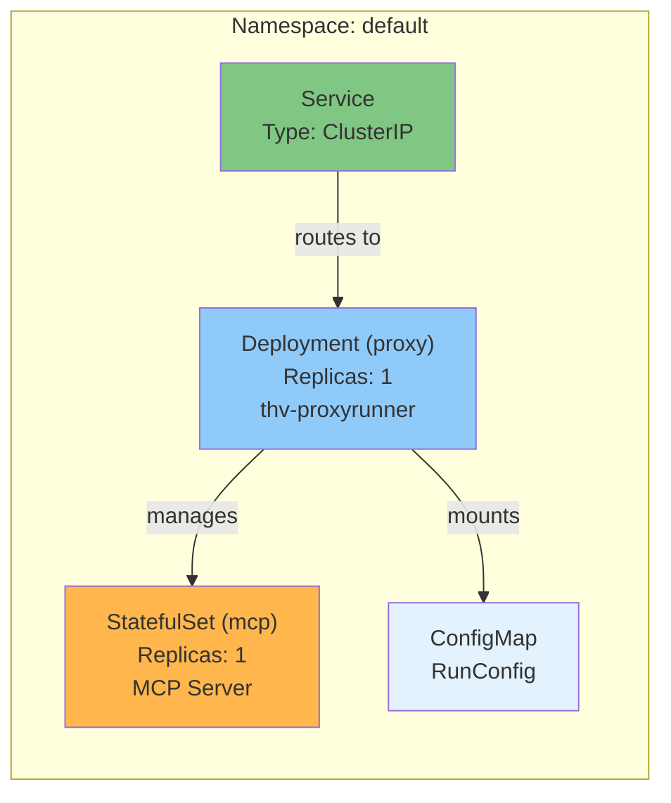
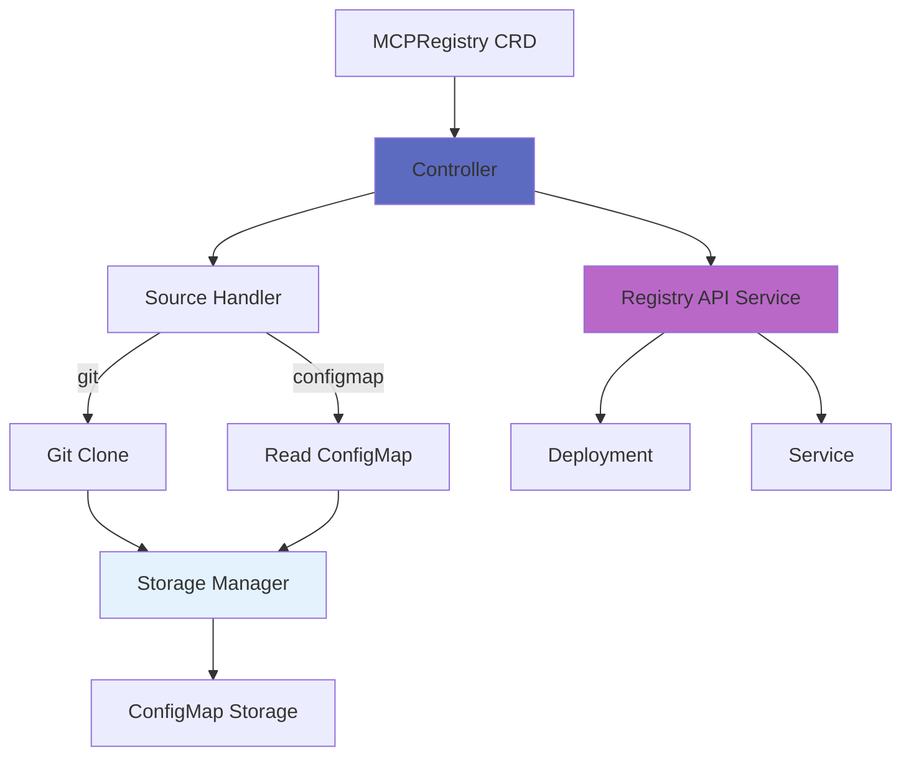

# Kubernetes Operator Architecture

The ToolHive operator manages MCP servers in Kubernetes clusters using custom resources and the operator pattern. This document explains the operator's design, components, and reconciliation logic.

## Overview

**Why two binaries?**

- **`thv-operator`**: Watches CRDs, reconciles Kubernetes resources
- **`thv-proxyrunner`**: Runs in pods, creates containers, proxies traffic

This separation provides clear responsibility boundaries and enables independent scaling.

**Implementation**: `cmd/thv-operator/`, `cmd/thv-proxyrunner/`

## Architecture



## Custom Resource Definitions

### CRD Overview

MCPServer is the fundamental building block. All other CRDs either **organize**, **aggregate**, **configure**, or help **discover** MCP servers.

```
                    ┌─────────────────────────────────────┐
                    │           DISCOVERY                 │
                    │          MCPRegistry                │
                    │  ┌───────────────────────────────┐  │
                    │  │       AGGREGATION             │  │
                    │  │    VirtualMCPServer           │  │
                    │  │    + CompositeToolDef         │  │
                    │  │  ┌─────────────────────────┐  │  │
                    │  │  │     ORGANIZATION        │  │  │
                    │  │  │       MCPGroup          │  │  │
                    │  │  │  ┌───────────────────┐  │  │  │
                    │  │  │  │      CORE         │  │  │  │
                    │  │  │  │    MCPServer      │  │  │  │
                    │  │  │  │  MCPRemoteProxy   │  │  │  │
                    │  │  │  └───────────────────┘  │  │  │
                    │  │  └─────────────────────────┘  │  │
                    │  └───────────────────────────────┘  │
                    └─────────────────────────────────────┘

        ┌──────────────────────────────────────────────────┐
        │              CONFIGURATION (attaches to any)     │
        │         ToolConfig    MCPExternalAuthConfig      │
        └──────────────────────────────────────────────────┘
```

| Layer | CRDs | Purpose |
|-------|------|---------|
| **Core** | MCPServer, MCPRemoteProxy | Run or proxy MCP servers |
| **Organization** | MCPGroup | Group related servers together |
| **Aggregation** | VirtualMCPServer, VirtualMCPCompositeToolDefinition | Combine multiple servers into one endpoint |
| **Discovery** | MCPRegistry | Help clients find available servers |
| **Configuration** | ToolConfig, MCPExternalAuthConfig | Shared config that attaches to any layer |

#### Workload CRDs (Deploy Running Pods)

| CRD | Deploys | Purpose |
|-----|---------|---------|
| **MCPServer** | Deployment + StatefulSet | Container-based MCP server with proxy |
| **MCPRemoteProxy** | Deployment | Proxy to external/remote MCP servers |
| **VirtualMCPServer** | Deployment | Aggregates multiple backends into one endpoint |
| **MCPRegistry** | Deployment | Registry API server for MCP discovery |

#### Logical/Configuration CRDs (No Pods)

| CRD | Purpose |
|-----|---------|
| **MCPGroup** | Logical grouping of workloads (status tracking only) |
| **ToolConfig** | Tool filtering and renaming configuration |
| **MCPExternalAuthConfig** | Token exchange / header injection configuration |
| **VirtualMCPCompositeToolDefinition** | Workflow definitions (webhook validation only) |

### CRD Relationships



### MCPServer

Defines an MCP server deployment, including container images, transports, middleware, and authentication configuration.

**Implementation**: `cmd/thv-operator/api/v1alpha1/mcpserver_types.go`

MCPServer resources support various transport types (stdio, SSE, streamable-http), permission profiles, OIDC authentication, and Cedar-based authorization policies. The operator reconciles these resources into Kubernetes Deployments, Services, and StatefulSets.

**Status fields** include phase (Running, Pending, Failed, Terminating) and the accessible URL for the MCP server.

For examples, see:
- [`examples/operator/mcp-servers/mcpserver_github.yaml`](../../examples/operator/mcp-servers/mcpserver_github.yaml) - Basic GitHub MCP server
- [`examples/operator/mcp-servers/mcpserver_with_configmap_oidc.yaml`](../../examples/operator/mcp-servers/mcpserver_with_configmap_oidc.yaml) - With OIDC authentication
- [`examples/operator/mcp-servers/mcpserver_with_pod_template.yaml`](../../examples/operator/mcp-servers/mcpserver_with_pod_template.yaml) - With pod customizations

### MCPRegistry

Manages MCP server registries in Kubernetes, supporting both Git-based and ConfigMap-based registry sources with automatic or manual synchronization.

**Implementation**: `cmd/thv-operator/api/v1alpha1/mcpregistry_types.go`

MCPRegistry resources can sync registry data from external sources and optionally deploy a registry API service for serving the registry data to other components.

**Controller**: `cmd/thv-operator/controllers/mcpregistry_controller.go`

For examples, see the [`examples/operator/`](../../examples/operator/) directory.

### MCPToolConfig

Defines tool filtering and override configuration.

**Implementation**: `cmd/thv-operator/api/v1alpha1/toolconfig_types.go`

MCPToolConfig allows you to filter which tools are exposed by an MCP server and customize tool metadata. See [`examples/operator/mcp-servers/mcpserver_fetch_tools_filter.yaml`](../../examples/operator/mcp-servers/mcpserver_fetch_tools_filter.yaml) for a complete example.

**Referenced by MCPServer** using `toolConfigRef`.

**Controller**: `cmd/thv-operator/controllers/toolconfig_controller.go`

### MCPExternalAuthConfig

Manages external authentication configurations that can be shared across multiple MCPServer resources.

**Implementation**: `cmd/thv-operator/api/v1alpha1/mcpexternalauthconfig_types.go`

MCPExternalAuthConfig allows you to define reusable OIDC authentication configurations that can be referenced by multiple MCPServer resources. This is useful for sharing authentication settings across servers. When using the embedded auth server type, the `storage` field supports configuring Redis Sentinel as a shared storage backend for horizontal scaling. See [Auth Server Storage](11-auth-server-storage.md) for details.

**Referenced by MCPServer** using `oidcConfig.type: external`.

**Controller**: `cmd/thv-operator/controllers/mcpexternalauthconfig_controller.go`

### MCPRemoteProxy

Defines a proxy for remote MCP servers with authentication, authorization, audit logging, and tool filtering.

**Key fields:**
- `remoteURL` - URL of the remote MCP server to proxy
- `oidcConfig` - OIDC authentication for incoming requests (required)
- `externalAuthConfigRef` - Token exchange for remote service authentication
- `authzConfig` - Authorization policies
- `toolConfigRef` - Tool filtering and renaming

**Implementation**: `cmd/thv-operator/api/v1alpha1/mcpremoteproxy_types.go`

**Controller**: `cmd/thv-operator/controllers/mcpremoteproxy_controller.go`

### MCPGroup

Logically groups MCPServer resources together for organizational purposes.

**Implementation**: `cmd/thv-operator/api/v1alpha1/mcpgroup_types.go`

MCPGroup resources allow grouping related MCP servers. Servers reference their group using the `groupRef` field in MCPServer spec. The group tracks member servers in its status.

**Status fields** include phase (Ready, Pending, Failed), list of server names, and server count.

**Referenced by MCPServer** using `spec.groupRef`.

**Controller**: `cmd/thv-operator/controllers/mcpgroup_controller.go`

### VirtualMCPServer

Aggregates multiple MCPServer resources from an MCPGroup into a single unified MCP server interface with advanced composition capabilities.

**Implementation**: `cmd/thv-operator/api/v1alpha1/virtualmcpserver_types.go`

VirtualMCPServer creates a virtual MCP server that aggregates tools, resources, and prompts from multiple backend MCPServers. It provides:

**Key capabilities:**
- **Backend Discovery**: Automatically discovers MCPServers from a referenced MCPGroup
- **Tool Aggregation**: Aggregates tools from multiple backends with configurable conflict resolution (prefix, priority, manual)
- **Tool Filtering**: Selective tool exposure with allow/deny lists and rewriting rules
- **Composite Tools**: Create new tools that orchestrate calls across multiple backend tools
- **Incoming Authentication**: OIDC and authorization policies for clients connecting to the virtual server
- **Outgoing Authentication**: Automatic token exchange and authentication to backend servers
- **Token Caching**: Configurable token caching with TTL and capacity limits
- **Operational Controls**: Health check intervals, failure handling, and backend retry logic

**Architecture:**
```
┌─────────────┐
│   Clients   │
└──────┬──────┘
       │
       │ (OIDC auth)
       ▼
┌────────────────────────┐
│  VirtualMCPServer      │
│  - Tool Aggregation    │
│  - Conflict Resolution │
│  - Composite Tools     │
│  - Token Exchange      │
└────────┬───────────────┘
         │
         ├──────────┬──────────┬──────────┐
         ▼          ▼          ▼          ▼
    ┌────────┐ ┌────────┐ ┌────────┐ ┌────────┐
    │Backend1│ │Backend2│ │Backend3│ │Backend4│
    │MCPSrvr │ │MCPSrvr │ │MCPSrvr │ │MCPSrvr │
    └────────┘ └────────┘ └────────┘ └────────┘
         (Discovered from MCPGroup)
```

**Status fields** include:
- Phase (Ready, Degraded, Pending, Failed)
- URL for accessing the virtual server
- Discovered backends with individual health status
- Backend count
- Detailed conditions for validation, discovery, and readiness

**References**: MCPGroup (via `spec.config.groupRef`)

**Controller**: `cmd/thv-operator/controllers/virtualmcpserver_controller.go`

**Key features:**

1. **Conflict Resolution Strategies**:
   - `prefix`: Prefix tool names with backend identifier
   - `priority`: First backend in priority order wins conflicts
   - `manual`: Explicitly define which backend wins each conflict

2. **Composite Tools**: Define new tools that orchestrate multiple backend tool calls with parameter mapping and response aggregation

3. **Watch Optimization**: Targeted reconciliation - only reconciles VirtualMCPServers affected by backend changes, not all servers in the namespace

4. **Status Reconciliation**: Robust status updates with conflict handling following Kubernetes optimistic concurrency control patterns

5. **Backend Health Monitoring**: Periodic health checks with configurable intervals and automatic status updates

### VirtualMCPCompositeToolDefinition

Defines reusable composite tool workflows that can be shared across multiple VirtualMCPServers.

**Implementation**: `cmd/thv-operator/api/v1alpha1/virtualmcpcompositetooldefinition_types.go`

Composite tools orchestrate calls to multiple backend tools in sequence or parallel, enabling complex workflows without client awareness of the underlying backends. Workflow steps form a DAG (Directed Acyclic Graph) with support for conditional execution and error handling.

**Referenced by**: VirtualMCPServer (via `spec.compositeToolRefs`)

**Status fields** track validation status and which VirtualMCPServers reference the definition.

For examples, see the [`examples/operator/`](../../examples/operator/) directory.

For complete examples of all CRDs, see the [`examples/operator/mcp-servers/`](../../examples/operator/mcp-servers/) directory.

## Operator Components

### Controller

**Reconciliation loop:**

1. **Watch** MCPServer resources
2. **Get** desired state from CRD spec
3. **Get** current state from cluster
4. **Compare** desired vs current
5. **Reconcile** - Create, update, or delete resources
6. **Update status** with result

**Implementation**: `cmd/thv-operator/controllers/mcpserver_controller.go`

### Resources Created

**For each MCPServer, operator creates:**

1. **Deployment** (proxy-runner)
   - Runs `thv-proxyrunner` image
   - Mounts RunConfig as ConfigMap
   - Applies middleware configuration

2. **StatefulSet** (MCP server)
   - Created by proxy-runner
   - Runs actual MCP server image
   - Stable network identity

3. **Service**
   - Exposes proxy deployment
   - Type: ClusterIP, LoadBalancer, or NodePort
   - Routes traffic to proxy

4. **ConfigMap** (RunConfig)
   - Contains serialized RunConfig
   - Mounted into proxy-runner pod

5. **ServiceAccount** (optional)
   - For RBAC permissions
   - Pod identity

## Deployment Pattern



## Proxy-Runner Binary

**Purpose**: Runs inside Deployment pod, creates and proxies to MCP server

**Responsibilities:**
1. Read RunConfig from mounted ConfigMap
2. Create StatefulSet with MCP server
3. Wait for StatefulSet to be ready
4. Start transport and proxy
5. Apply middleware chain
6. Forward traffic to StatefulSet pods

**Command:**
```bash
thv-proxyrunner run
```

**Environment:**
- `KUBERNETES_SERVICE_HOST` - Detects K8s environment
- RunConfig path from mount
- In-cluster Kubernetes client

**Implementation**: `cmd/thv-proxyrunner/app/commands.go`

## Design Principles

**From**: `cmd/thv-operator/DESIGN.md`

### CRD Attributes vs PodTemplateSpec

**Use CRD attributes for:**
- Business logic affecting reconciliation
- Validation requirements
- Cross-resource coordination
- Operator decision making

**Use PodTemplateSpec for:**
- Infrastructure concerns (node selection, resources, affinity)
- Sidecar containers
- Standard Kubernetes pod configuration
- Cluster admin configurations

**Examples:**

CRD attribute:
```yaml
spec:
  transport: sse  # Affects operator logic
  port: 8080      # Affects Service creation
```

PodTemplateSpec:
```yaml
spec:
  podTemplateSpec:
    spec:
      nodeSelector:
        disktype: ssd  # Infrastructure concern
```

### Status Management

**Pattern**: Batched updates via StatusCollector

**Why**: Prevents race conditions, reduces API calls

**Implementation**: `cmd/thv-operator/pkg/mcpregistrystatus/`

## MCPRegistry Controller

**Architecture:**



### Source Handlers

**Git source**: `cmd/thv-operator/pkg/sources/git.go`
- Clones repository
- Reads registry.json
- Calculates hash for change detection

**ConfigMap source**: `cmd/thv-operator/pkg/sources/configmap.go`
- Reads from existing ConfigMap
- Watches for updates

**Storage Manager**: `cmd/thv-operator/pkg/sources/storage_manager.go`
- Creates ConfigMap with key `registry.json` containing full registry data
- Sync metadata (timestamp, hash, attempt count) stored in MCPRegistry CRD status field `SyncStatus`

**Interface**: `cmd/thv-operator/pkg/sources/types.go`

### Storage Manager

**Purpose**: Persist registry data in cluster

**Implementation**: `cmd/thv-operator/pkg/sources/storage_manager.go`

**Storage**: ConfigMap with owner reference

**Format:**
```yaml
data:
  registry.json: |
    { full registry data }
```

Sync metadata (timestamp, hash, attempt count) is stored in the MCPRegistry CRD status field `SyncStatus`, not in the ConfigMap.

### Sync Policy

**Automatic sync:**
```yaml
spec:
  syncPolicy:
    interval: 1h
```

Operator syncs every hour. The presence of `syncPolicy` with an `interval` enables automatic synchronization.

**Manual sync:**

Omit the `syncPolicy` field entirely.

Trigger: Add or update annotation `toolhive.stacklok.dev/sync-trigger=<unique-value>` where the value can be any non-empty string. The operator triggers sync when this value changes, allowing multiple manual syncs by using different values (e.g., timestamps, counters).

### Registry API Service

When enabled, operator creates:
- Deployment running `thv-registry-api`
- Service exposing API
- ConfigMap mount with registry data

**Implementation**: `cmd/thv-operator/pkg/registryapi/service.go`

## Configuration References

### ConfigMap References

**OIDC config:**

Both patterns are supported:
```yaml
# Pattern 1: Direct data fields (as shown in examples/operator/mcp-servers/mcpserver_with_configmap_oidc.yaml)
# ConfigMap contains: issuer, audience, clientId as direct fields
spec:
  oidcConfig:
    type: configMap
    configMap:
      name: oidc-config

# Pattern 2: JSON file with key parameter
# ConfigMap contains a JSON file at the specified key
spec:
  oidcConfig:
    type: configMap
    configMap:
      name: oidc-config
      key: oidc.json  # defaults to oidc.json if omitted
```

**Authz policies:**
```yaml
spec:
  authzConfig:
    type: configMap
    configMap:
      name: authz-policies
      key: authz.json  # defaults to authz.json if omitted
```

### Inline Configuration

**OIDC:**
```yaml
spec:
  oidcConfig:
    type: inline
    inline:
      issuer: https://auth.example.com
      audience: my-app
```

**Authz:**
```yaml
spec:
  authzConfig:
    type: inline
    inline:
      policies:
      - permit(principal, action, resource);
```

## Related Documentation

- [Deployment Modes](01-deployment-modes.md) - Kubernetes mode details
- [Core Concepts](02-core-concepts.md) - Operator concepts
- [Registry System](06-registry-system.md) - MCPRegistry CRD
- [Virtual MCP Server Architecture](10-virtual-mcp-architecture.md) - VirtualMCPServer details
- Operator Design: `cmd/thv-operator/DESIGN.md`
