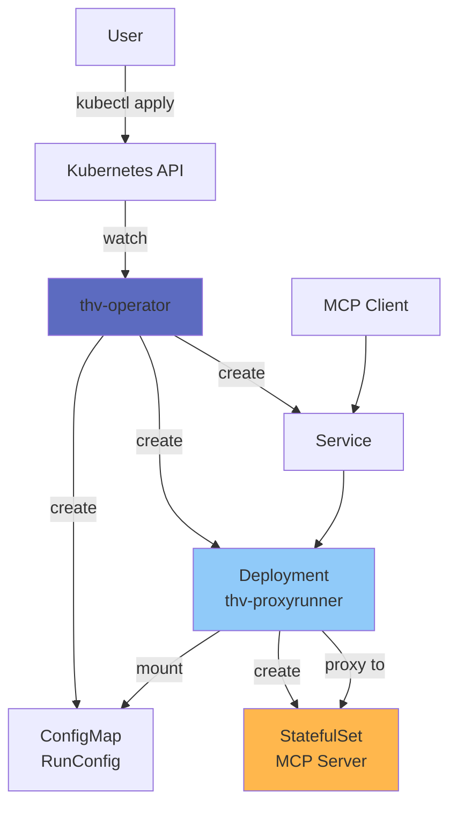
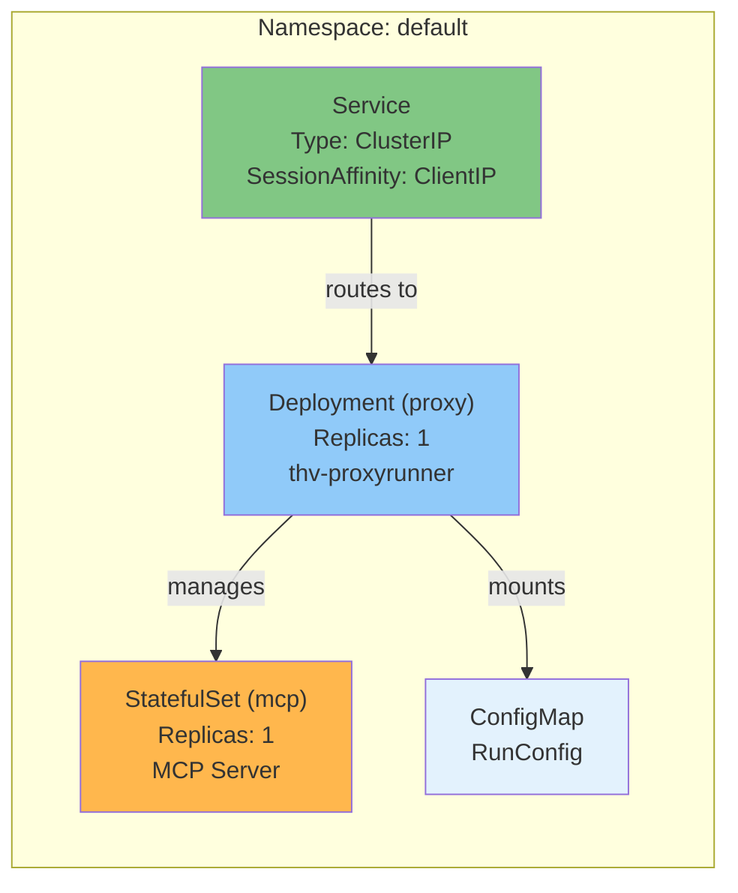
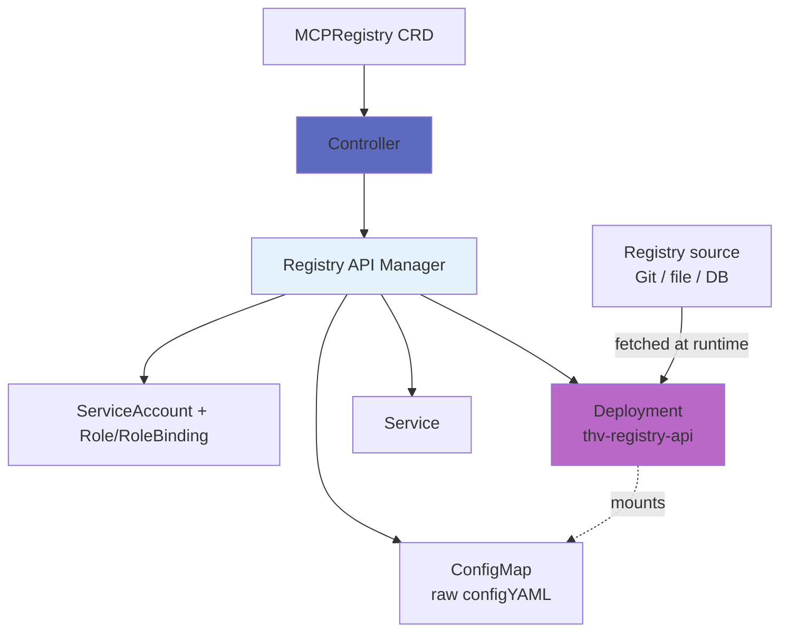

# Kubernetes Operator Architecture

The ToolHive operator manages MCP servers in Kubernetes clusters using custom resources and the operator pattern. This document explains the operator's design, components, and reconciliation logic.

## Overview

**Why two binaries?**

- **`thv-operator`**: Watches CRDs, reconciles Kubernetes resources
- **`thv-proxyrunner`**: Runs in pods, creates containers, proxies traffic

This separation provides clear responsibility boundaries and enables independent scaling.

**Implementation**: `cmd/thv-operator/`, `cmd/thv-proxyrunner/`

## Architecture


```mermaid
graph TB
    User[User] -->|kubectl apply| API[Kubernetes API]
    API -->|watch| Operator[thv-operator]

    Operator -->|create| Deploy[Deployment<br/>thv-proxyrunner]
    Operator -->|create| SVC[Service]
    Operator -->|create| CM[ConfigMap<br/>RunConfig]

    Deploy -->|mount| CM
    Deploy -->|create| STS[StatefulSet<br/>MCP Server]
    Deploy -->|proxy to| STS

    Client[MCP Client] --> SVC
    SVC --> Deploy

    style Operator fill:#5c6bc0
    style Deploy fill:#90caf9
    style STS fill:#ffb74d
```

## Custom Resource Definitions

### CRD Overview

MCPServer is the fundamental building block. All other CRDs either **organize**, **aggregate**, **configure**, or help **discover** MCP servers.

```
                    ┌─────────────────────────────────────┐
                    │           DISCOVERY                 │
                    │          MCPRegistry                │
                    │  ┌───────────────────────────────┐  │
                    │  │       AGGREGATION             │  │
                    │  │    VirtualMCPServer           │  │
                    │  │    + CompositeToolDef         │  │
                    │  │  ┌─────────────────────────┐  │  │
                    │  │  │     ORGANIZATION        │  │  │
                    │  │  │       MCPGroup          │  │  │
                    │  │  │  ┌───────────────────┐  │  │  │
                    │  │  │  │      CORE         │  │  │  │
                    │  │  │  │    MCPServer      │  │  │  │
                    │  │  │  │  MCPRemoteProxy   │  │  │  │
                    │  │  │  │  MCPServerEntry   │  │  │  │
                    │  │  │  └───────────────────┘  │  │  │
                    │  │  └─────────────────────────┘  │  │
                    │  └───────────────────────────────┘  │
                    └─────────────────────────────────────┘

        ┌──────────────────────────────────────────────────┐
        │              CONFIGURATION (attaches to any)     │
        │  ToolConfig   MCPExternalAuthConfig              │
        │  MCPOIDCConfig   MCPTelemetryConfig              │
        │  MCPWebhookConfig                                │
        └──────────────────────────────────────────────────┘

        ┌──────────────────────────────────────────────────┐
        │              AUXILIARY                           │
        │  EmbeddingServer                                 │
        └──────────────────────────────────────────────────┘
```

| Layer | CRDs | Purpose |
|-------|------|---------|
| **Core** | MCPServer, MCPRemoteProxy, MCPServerEntry | Run, proxy, or declare MCP servers |
| **Organization** | MCPGroup | Group related servers together |
| **Aggregation** | VirtualMCPServer, VirtualMCPCompositeToolDefinition | Combine multiple servers into one endpoint |
| **Discovery** | MCPRegistry | Help clients find available servers |
| **Configuration** | MCPToolConfig, MCPExternalAuthConfig, MCPOIDCConfig, MCPTelemetryConfig, MCPWebhookConfig | Shared config that attaches to any layer |
| **Auxiliary** | EmbeddingServer | Supporting infrastructure (e.g., embedding inference for vMCP) |

#### Workload CRDs (Deploy Running Pods)

| CRD | Deploys | Purpose |
|-----|---------|---------|
| **MCPServer** | Deployment + StatefulSet | Container-based MCP server with proxy |
| **MCPRemoteProxy** | Deployment | Proxy to external/remote MCP servers |
| **VirtualMCPServer** | Deployment | Aggregates multiple backends into one endpoint |
| **MCPRegistry** | Deployment | Registry API server for MCP discovery |
| **EmbeddingServer** | StatefulSet | HuggingFace text-embeddings-inference server (e.g., for vMCP semantic search) |

#### Logical/Configuration CRDs (No Pods)

| CRD | Purpose |
|-----|---------|
| **MCPServerEntry** | Zero-infrastructure declaration of a remote MCP endpoint |
| **MCPGroup** | Logical grouping of workloads (status tracking only) |
| **MCPToolConfig** | Tool filtering and renaming configuration |
| **MCPExternalAuthConfig** | Token exchange / header injection configuration |
| **MCPOIDCConfig** | Shared OIDC provider settings referenced by workload CRDs |
| **MCPTelemetryConfig** | Shared OpenTelemetry/Prometheus settings referenced by workload CRDs |
| **MCPWebhookConfig** | Validating/mutating webhook middleware definitions referenced by MCPServer |
| **VirtualMCPCompositeToolDefinition** | Workflow definitions (webhook validation only) |

### CRD Relationships


```mermaid
graph TB
    subgraph "Deploys Workloads"
        VMCP[VirtualMCPServer<br/>Deployment: aggregator]
        Server[MCPServer<br/>Deployment + StatefulSet]
        Proxy[MCPRemoteProxy<br/>Deployment: proxy]
        Registry[MCPRegistry<br/>Deployment: API server]
    end

    subgraph "Zero-Infrastructure"
        Entry[MCPServerEntry<br/>No resources]
    end

    subgraph "Logical Grouping"
        Group[MCPGroup<br/>No resources]
    end

    subgraph "Configuration Only"
        CTD[VirtualMCPCompositeToolDefinition<br/>Webhook validation]
        ExtAuth[MCPExternalAuthConfig<br/>No resources]
        ToolCfg[MCPToolConfig<br/>No resources]
        OIDCCfg[MCPOIDCConfig<br/>No resources]
        TelCfg[MCPTelemetryConfig<br/>No resources]
        WebhookCfg[MCPWebhookConfig<br/>No resources]
    end

    VMCP -->|groupRef| Group
    VMCP -->|config.compositeToolRefs| CTD
    VMCP -.->|incomingAuth.oidcConfigRef| OIDCCfg
    VMCP -.->|telemetryConfigRef| TelCfg

    Server -->|groupRef| Group
    Server -.->|externalAuthConfigRef| ExtAuth
    Server -.->|authServerRef| ExtAuth
    Server -.->|toolConfigRef| ToolCfg
    Server -.->|oidcConfigRef| OIDCCfg
    Server -.->|telemetryConfigRef| TelCfg
    Server -.->|webhookConfigRef| WebhookCfg

    Proxy -->|groupRef| Group
    Proxy -.->|externalAuthConfigRef| ExtAuth
    Proxy -.->|authServerRef| ExtAuth
    Proxy -.->|toolConfigRef| ToolCfg
    Proxy -.->|oidcConfigRef| OIDCCfg
    Proxy -.->|telemetryConfigRef| TelCfg

    Entry -->|groupRef| Group
    Entry -.->|externalAuthConfigRef| ExtAuth
    Entry -.->|caBundleRef| ConfigMap[ConfigMap<br/>CA bundle]
```

### MCPServer

Defines an MCP server deployment, including container images, transports, middleware, and authentication configuration.

**Implementation**: `cmd/thv-operator/api/v1beta1/mcpserver_types.go`

MCPServer resources support various transport types (stdio, SSE, streamable-http), permission profiles, OIDC authentication, and Cedar-based authorization policies. The operator reconciles these resources into Kubernetes Deployments, Services, and StatefulSets.

MCPServer supports referencing shared configuration CRDs:
- `oidcConfigRef` — references an MCPOIDCConfig for shared OIDC settings
- `telemetryConfigRef` — references an MCPTelemetryConfig for shared telemetry settings
- `externalAuthConfigRef` — references an MCPExternalAuthConfig for outgoing auth (token exchange, AWS STS, bearer token injection, etc.)
- `authServerRef` — references an MCPExternalAuthConfig of type `embeddedAuthServer` for incoming auth (the embedded OAuth 2.0/OIDC authorization server that authenticates MCP clients). This is the preferred path for configuring the embedded auth server, keeping incoming auth separate from `externalAuthConfigRef` which handles outgoing auth.

**Backward compatibility**: Existing configurations using `externalAuthConfigRef` with `type: embeddedAuthServer` continue to work. The `authServerRef` field is optional and additive.

**Status fields** include phase (Ready, Pending, Failed, Terminating), the accessible URL, and config hashes (`oidcConfigHash`, `telemetryConfigHash`, `authServerConfigHash`) for change detection on referenced CRDs.

For examples, see:
- [`examples/operator/mcp-servers/mcpserver_github.yaml`](../../examples/operator/mcp-servers/mcpserver_github.yaml) - Basic GitHub MCP server
- [`examples/operator/mcp-servers/mcpserver_with_oidcconfig_ref.yaml`](../../examples/operator/mcp-servers/mcpserver_with_oidcconfig_ref.yaml) - With shared MCPOIDCConfig reference
- [`examples/operator/mcp-servers/mcpserver_fetch_otel.yaml`](../../examples/operator/mcp-servers/mcpserver_fetch_otel.yaml) - With shared MCPTelemetryConfig reference
- [`examples/operator/mcp-servers/mcpserver_with_pod_template.yaml`](../../examples/operator/mcp-servers/mcpserver_with_pod_template.yaml) - With pod customizations

### MCPRegistry

Deploys a registry API server that serves MCP server metadata to clients. The registry server itself handles fetching, parsing, and refreshing registry data from upstream sources (Git, files, etc.) — the operator is responsible only for running the server and feeding it configuration.

**Implementation**: `cmd/thv-operator/api/v1beta1/mcpregistry_types.go`

**Key fields:**
- `configYAML` (required) — the complete `config.yaml` for the registry server. The operator stores this verbatim in a ConfigMap mounted at `/config/config.yaml` and does NOT parse, validate, or transform it.
- `volumes` / `volumeMounts` — additional volumes the registry server needs (e.g., a Secret containing Git credentials referenced by file path from `configYAML`).
- `pgpassSecretRef` — dedicated field for PostgreSQL `.pgpass` credentials (handled via an init container because libpq requires mode 0600).
- `podTemplateSpec` — pod-level customizations (resources, affinity, tolerations).
- `imagePullSecrets` — applied to both the Deployment and the operator-managed ServiceAccount.

**Security note**: `configYAML` is stored in a ConfigMap, so credentials must NOT be inlined there. Reference them by file path and mount the corresponding Secret via `volumes` / `volumeMounts`.

**Controller**: `cmd/thv-operator/controllers/mcpregistry_controller.go`

For examples, see the [`examples/operator/`](../../examples/operator/) directory.

### MCPToolConfig

Defines tool filtering and override configuration.

**Implementation**: `cmd/thv-operator/api/v1beta1/toolconfig_types.go`

MCPToolConfig allows you to filter which tools are exposed by an MCP server and customize tool metadata. See [`examples/operator/mcp-servers/mcpserver_fetch_tools_filter.yaml`](../../examples/operator/mcp-servers/mcpserver_fetch_tools_filter.yaml) for a complete example.

**Referenced by MCPServer** using `toolConfigRef`.

**Controller**: `cmd/thv-operator/controllers/toolconfig_controller.go`

### MCPExternalAuthConfig

Manages external authentication configurations that can be shared across multiple MCPServer resources.

**Implementation**: `cmd/thv-operator/api/v1beta1/mcpexternalauthconfig_types.go`

MCPExternalAuthConfig allows you to define reusable authentication configurations that can be referenced by multiple MCPServer and MCPRemoteProxy resources. When using the embedded auth server type, the `storage` field supports configuring Redis Sentinel as a shared storage backend for horizontal scaling. See [Auth Server Storage](11-auth-server-storage.md) for details.

MCPExternalAuthConfig resources can be referenced via two paths:
- `externalAuthConfigRef` — for outgoing auth types (token exchange, AWS STS, bearer token injection). This is the original reference path.
- `authServerRef` — for the embedded auth server type (`embeddedAuthServer`) only. This dedicated reference path makes it possible to configure both incoming auth (embedded auth server) and outgoing auth (e.g., AWS STS) on the same workload resource.

**Referenced by MCPServer and MCPRemoteProxy** using `externalAuthConfigRef` or `authServerRef`.

**Controller**: `cmd/thv-operator/controllers/mcpexternalauthconfig_controller.go`

### MCPOIDCConfig

Defines shared OIDC provider configuration that can be referenced by multiple workload CRDs (MCPServer, MCPRemoteProxy, VirtualMCPServer) in the same namespace.

**Implementation**: `cmd/thv-operator/api/v1beta1/mcpoidcconfig_types.go`

MCPOIDCConfig eliminates OIDC configuration duplication — define an identity provider once and reference it from any number of workloads. A single issuer URL change updates all referencing workloads automatically.

**Configuration source variants** (mutually exclusive, CEL enforced):
- `kubernetesServiceAccount` — Uses Kubernetes service account tokens with auto-discovered JWKS
- `inline` — Explicit issuer, JWKS URL, client credentials (secrets via `clientSecretRef`)

**Per-server overrides** live in the workload's `oidcConfigRef` field (not the shared spec):
- `audience` (required) — Must be unique per server to prevent token replay
- `scopes` (optional) — Defaults to `["openid"]`
- `resourceUrl` (optional) — Public URL for OAuth protected resource metadata (RFC 9728); defaults to internal service URL

**Status fields** include a `Ready` condition, `configHash` for change detection, and `referencingWorkloads` tracking which resources reference this config. Deletion is blocked while references exist (finalizer pattern).

**Referenced by**: MCPServer and MCPRemoteProxy (via `spec.oidcConfigRef`); VirtualMCPServer (via `spec.incomingAuth.oidcConfigRef`)

**Controller**: `cmd/thv-operator/controllers/mcpoidcconfig_controller.go`

For examples, see [`examples/operator/mcp-servers/mcpserver_with_oidcconfig_ref.yaml`](../../examples/operator/mcp-servers/mcpserver_with_oidcconfig_ref.yaml).

### MCPTelemetryConfig

Defines shared OpenTelemetry and Prometheus configuration that can be referenced by multiple MCPServer resources in the same namespace.

**Implementation**: `cmd/thv-operator/api/v1beta1/mcptelemetryconfig_types.go`

MCPTelemetryConfig centralises telemetry infrastructure settings (collector endpoint, sampling rate, headers) so they can be managed once for a fleet of MCP servers.

**Key features:**
- `SensitiveHeader` type with `SecretKeyRef` for credential headers (no inline secrets)
- CEL validation prevents header name overlap between `headers` and `sensitiveHeaders`
- Per-server `serviceName` override in the workload's `telemetryConfigRef` (since `service.name` must be unique per server)

**Status fields** include a `Ready` condition, `configHash` for change detection, and `referencingWorkloads` tracking.

**Referenced by**: MCPServer, VirtualMCPServer, MCPRemoteProxy (via `telemetryConfigRef`)

**Controller**: `cmd/thv-operator/controllers/mcptelemetryconfig_controller.go`

For examples, see [`examples/operator/mcp-servers/mcpserver_fetch_otel.yaml`](../../examples/operator/mcp-servers/mcpserver_fetch_otel.yaml).

### MCPWebhookConfig

Defines reusable validating and mutating webhook middleware configurations that can be referenced by MCPServer resources.

**Implementation**: `cmd/thv-operator/api/v1beta1/mcpwebhookconfig_types.go`

MCPWebhookConfig declares one or more `validating` and/or `mutating` webhooks (URL, timeout, failure policy, optional TLS, optional HMAC signing). At least one webhook must be defined (CEL-enforced). The MCPServer references it via `spec.webhookConfigRef`, and the proxy-runner injects the corresponding middleware into the request chain.

**Key features:**
- Per-webhook `failurePolicy` (`fail` or `ignore`) for handling webhook errors
- Optional `tlsConfig` with CA bundle, mTLS client cert, or `insecureSkipVerify`
- Optional `hmacSecretRef` adds the `X-Toolhive-Signature` header to outgoing payloads

**Status fields** include a `Ready` condition, `configHash` for change detection, and `referencingWorkloads`.

**Referenced by**: MCPServer (via `webhookConfigRef`)

**Controller**: `cmd/thv-operator/controllers/mcpwebhookconfig_controller.go`

### EmbeddingServer

Deploys a HuggingFace text-embeddings-inference container as a StatefulSet, used by VirtualMCPServer for features such as semantic tool search.

**Implementation**: `cmd/thv-operator/api/v1beta1/embeddingserver_types.go`

EmbeddingServer encapsulates the model (defaulting to `BAAI/bge-small-en-v1.5`), image, port, optional HuggingFace token, and an optional persistent model cache. The operator reconciles each EmbeddingServer into a StatefulSet plus Service.

**Controller**: `cmd/thv-operator/controllers/embeddingserver_controller.go`

### MCPRemoteProxy

Defines a proxy for remote MCP servers with authentication, authorization, audit logging, and tool filtering.

**Key fields:**
- `remoteUrl` - URL of the remote MCP server to proxy
- `oidcConfigRef` - Reference to shared MCPOIDCConfig (with per-server `audience`, `scopes`, and `resourceUrl`)
- `externalAuthConfigRef` - Outgoing auth for remote service authentication (token exchange, AWS STS, bearer token injection)
- `authServerRef` - Incoming auth via the embedded OAuth 2.0/OIDC authorization server (references an MCPExternalAuthConfig of type `embeddedAuthServer`)
- `authzConfig` - Authorization policies
- `telemetryConfigRef` - Reference to shared MCPTelemetryConfig (replaces deprecated inline `telemetry`)
- `toolConfigRef` - Tool filtering and renaming

OIDC is optional — omit `oidcConfigRef` for unauthenticated proxies.

**Combined auth pattern**: `authServerRef` and `externalAuthConfigRef` can be used together on the same MCPRemoteProxy to enable both incoming client authentication (embedded auth server) and outgoing remote service authentication (e.g., AWS STS) simultaneously. This is the primary use case for `authServerRef` on MCPRemoteProxy. If both fields point to an `embeddedAuthServer` resource, the controller produces a validation error.

```yaml
# MCPRemoteProxy with embedded auth server (incoming) + AWS STS (outgoing)
apiVersion: toolhive.stacklok.dev/v1beta1
kind: MCPRemoteProxy
metadata:
  name: bedrock-proxy
spec:
  remoteUrl: https://bedrock-mcp.example.com
  authServerRef:
    kind: MCPExternalAuthConfig
    name: my-auth-server          # type: embeddedAuthServer
  externalAuthConfigRef:
    name: bedrock-sts-config      # type: awsSts
```

**Implementation**: `cmd/thv-operator/api/v1beta1/mcpremoteproxy_types.go`

**Controller**: `cmd/thv-operator/controllers/mcpremoteproxy_controller.go`

### MCPServerEntry

Declares a remote MCP endpoint as a zero-infrastructure catalog entry. Unlike MCPServer and MCPRemoteProxy, MCPServerEntry never creates a Deployment, Service, or Pod. vMCP connects directly to the declared remote URL.

**Key fields:**
- `remoteUrl` - URL of the remote MCP server (required)
- `groupRef` - MCPGroup membership for discovery by VirtualMCPServer
- `externalAuthConfigRef` - Token exchange for remote service authentication
- `caBundleRef` - Reference to a ConfigMap containing CA certificate data for TLS verification

The MCPServerEntry controller is validation-only: it validates that referenced resources (groupRef, externalAuthConfigRef, caBundleRef ConfigMap) exist and updates status conditions accordingly. It never probes the remote URL or creates infrastructure.

MCPServerEntry backends are discovered by vMCP in both static mode (listed at startup) and dynamic mode (watched by the BackendReconciler). In dynamic mode, ConfigMap changes trigger re-reconciliation of affected MCPServerEntry backends via a field-indexed watch on `spec.caBundleRef.configMapRef.name`.

**Implementation**: `cmd/thv-operator/api/v1beta1/mcpserverentry_types.go`

**Controller**: `cmd/thv-operator/controllers/mcpserverentry_controller.go`

### MCPGroup

Logically groups MCPServer resources together for organizational purposes.

**Implementation**: `cmd/thv-operator/api/v1beta1/mcpgroup_types.go`

MCPGroup resources allow grouping related MCP servers. Servers reference their group using the `groupRef` typed struct (`MCPGroupRef`) in MCPServer spec. The group tracks member servers in its status.

**Status fields** include phase (Ready, Pending, Failed), list of server names, and server count.

**Referenced by**: MCPServer, MCPRemoteProxy, MCPServerEntry, and VirtualMCPServer using `spec.groupRef.name`.

**Controller**: `cmd/thv-operator/controllers/mcpgroup_controller.go`

### VirtualMCPServer

Aggregates multiple MCPServer resources from an MCPGroup into a single unified MCP server interface with advanced composition capabilities.

**Implementation**: `cmd/thv-operator/api/v1beta1/virtualmcpserver_types.go`

VirtualMCPServer creates a virtual MCP server that aggregates tools, resources, and prompts from multiple backend MCPServers. It provides:

**Key capabilities:**
- **Backend Discovery**: Automatically discovers MCPServers from a referenced MCPGroup
- **Tool Aggregation**: Aggregates tools from multiple backends with configurable conflict resolution (prefix, priority, manual)
- **Tool Filtering**: Selective tool exposure with allow/deny lists and rewriting rules
- **Composite Tools**: Create new tools that orchestrate calls across multiple backend tools
- **Incoming Authentication**: OIDC and authorization policies for clients connecting to the virtual server
- **Outgoing Authentication**: Automatic token exchange and authentication to backend servers
- **Token Caching**: Configurable token caching with TTL and capacity limits
- **Operational Controls**: Health check intervals, failure handling, and backend retry logic

**Architecture:**
```
┌─────────────┐
│   Clients   │
└──────┬──────┘
       │
       │ (OIDC auth)
       ▼
┌────────────────────────┐
│  VirtualMCPServer      │
│  - Tool Aggregation    │
│  - Conflict Resolution │
│  - Composite Tools     │
│  - Token Exchange      │
└────────┬───────────────┘
         │
         ├──────────┬──────────┬──────────┐
         ▼          ▼          ▼          ▼
    ┌────────┐ ┌────────┐ ┌────────┐ ┌────────┐
    │Backend1│ │Backend2│ │Backend3│ │Backend4│
    │MCPSrvr │ │MCPSrvr │ │MCPSrvr │ │MCPSrvr │
    └────────┘ └────────┘ └────────┘ └────────┘
         (Discovered from MCPGroup)
```

**Status fields** include:
- Phase (Ready, Degraded, Pending, Failed)
- URL for accessing the virtual server
- Discovered backends with individual health status
- Backend count
- Detailed conditions for validation, discovery, and readiness

**References**: MCPGroup (via `spec.groupRef.name`)

**Controller**: `cmd/thv-operator/controllers/virtualmcpserver_controller.go`

**Key features:**

1. **Conflict Resolution Strategies**:
   - `prefix`: Prefix tool names with backend identifier
   - `priority`: First backend in priority order wins conflicts
   - `manual`: Explicitly define which backend wins each conflict

2. **Composite Tools**: Define new tools that orchestrate multiple backend tool calls with parameter mapping and response aggregation

3. **Watch Optimization**: Targeted reconciliation - only reconciles VirtualMCPServers affected by backend changes, not all servers in the namespace

4. **Status Reconciliation**: Robust status updates with conflict handling following Kubernetes optimistic concurrency control patterns

5. **Backend Health Monitoring**: Periodic health checks with configurable intervals and automatic status updates

### VirtualMCPCompositeToolDefinition

Defines reusable composite tool workflows that can be shared across multiple VirtualMCPServers.

**Implementation**: `cmd/thv-operator/api/v1beta1/virtualmcpcompositetooldefinition_types.go`

Composite tools orchestrate calls to multiple backend tools in sequence or parallel, enabling complex workflows without client awareness of the underlying backends. Workflow steps form a DAG (Directed Acyclic Graph) with support for conditional execution and error handling.

**Referenced by**: VirtualMCPServer (via `spec.config.compositeToolRefs`)

**Status fields** track validation status and which VirtualMCPServers reference the definition.

For examples, see the [`examples/operator/`](../../examples/operator/) directory.

For complete examples of all CRDs, see the [`examples/operator/mcp-servers/`](../../examples/operator/mcp-servers/) directory.

## Operator Components

### Entry Point

The operator binary's `main` package delegates to `cmd/thv-operator/app/app.go`. `Run()` performs flag parsing, manager construction, and leader-election setup, then calls `setupControllersAndWebhooks`, which fans out to `setupServerControllers` (MCPServer, MCPRemoteProxy, MCPServerEntry, MCPGroup, and shared config CRDs), `setupRegistryController` (MCPRegistry), and `setupAggregationControllers` (VirtualMCPServer, VirtualMCPCompositeToolDefinition, EmbeddingServer). Webhooks are registered alongside their controllers.

### Controller

**Reconciliation loop:**

1. **Watch** MCPServer resources
2. **Get** desired state from CRD spec
3. **Get** current state from cluster
4. **Compare** desired vs current
5. **Reconcile** - Create, update, or delete resources
6. **Update status** with result

**Implementation**: `cmd/thv-operator/controllers/mcpserver_controller.go`

### Resources Created

**For each MCPServer, operator creates:**

1. **Deployment** (proxy-runner)
   - Runs `thv-proxyrunner` image
   - Mounts RunConfig as ConfigMap
   - Applies middleware configuration

2. **StatefulSet** (MCP server)
   - Created by proxy-runner
   - Runs actual MCP server image
   - Stable network identity

3. **Service**
   - Exposes proxy deployment
   - Type: ClusterIP, LoadBalancer, or NodePort
   - SessionAffinity: ClientIP (ensures stateful MCP sessions reach the same pod)
   - Routes traffic to proxy

4. **ConfigMap** (RunConfig)
   - Contains serialized RunConfig
   - Mounted into proxy-runner pod

5. **ServiceAccount** (optional)
   - For RBAC permissions
   - Pod identity

## Deployment Pattern


```mermaid
graph LR
    subgraph "Namespace: default"
        Deploy["Deployment (proxy)<br/>Replicas: 1<br/>thv-proxyrunner"]
        SVC["Service<br/>Type: ClusterIP<br/>SessionAffinity: ClientIP"]
        STS["StatefulSet (mcp)<br/>Replicas: 1<br/>MCP Server"]
        CM["ConfigMap<br/>RunConfig"]
    end

    Deploy -->|manages| STS
    Deploy -->|mounts| CM
    SVC -->|routes to| Deploy

    style Deploy fill:#90caf9
    style STS fill:#ffb74d
    style SVC fill:#81c784
    style CM fill:#e3f2fd
```

## Proxy-Runner Binary

**Purpose**: Runs inside Deployment pod, creates and proxies to MCP server

**Responsibilities:**
1. Read RunConfig from mounted ConfigMap
2. Create StatefulSet with MCP server
3. Wait for StatefulSet to be ready
4. Start transport and proxy
5. Apply middleware chain
6. Forward traffic to StatefulSet pods

**Container invocation:**

The operator sets `Container.Args` (not `Command`) on the proxy-runner Deployment. The image's default entrypoint runs the `thv-proxyrunner` binary; the operator passes `run` as the first argument, optionally followed by `--k8s-pod-patch=<json>` when the user supplied a `podTemplateSpec`, then the MCP image reference. See `deploymentForMCPServer` in `cmd/thv-operator/controllers/mcpserver_controller.go`.

**Environment:**
- `KUBERNETES_SERVICE_HOST` - Detects K8s environment
- RunConfig path from mount
- In-cluster Kubernetes client

**Implementation**: `cmd/thv-proxyrunner/app/commands.go` (cobra wiring), `cmd/thv-proxyrunner/app/run.go` (`run` command logic)

## Design Principles

**From**: `cmd/thv-operator/DESIGN.md`

### CRD Attributes vs PodTemplateSpec

**Use CRD attributes for:**
- Business logic affecting reconciliation
- Validation requirements
- Cross-resource coordination
- Operator decision making

**Use PodTemplateSpec for:**
- Infrastructure concerns (node selection, resources, affinity)
- Sidecar containers
- Standard Kubernetes pod configuration
- Cluster admin configurations

**Examples:**

CRD attribute:
```yaml
spec:
  transport: sse        # Affects operator logic
  proxyPort: 8080       # Affects Service creation
```

PodTemplateSpec:
```yaml
spec:
  podTemplateSpec:
    spec:
      nodeSelector:
        disktype: ssd  # Infrastructure concern
```

### Status Management

**Pattern**: Direct status update matching MCPServer workload pattern

**Why**: Simple Phase + Ready condition + ReadyReplicas + URL, enables `kubectl wait --for=condition=Ready`

**Implementation**: `cmd/thv-operator/pkg/controllerutil/status.go` (`MutateAndPatchStatus` merge-patch helper used by all CRD controllers)

## MCPRegistry Controller

**Architecture:**


```mermaid
graph TB
    MCPReg[MCPRegistry CRD] --> Controller[Controller]
    Controller --> Manager[Registry API Manager]

    Manager --> CM[ConfigMap<br/>raw configYAML]
    Manager --> SA[ServiceAccount + Role/RoleBinding]
    Manager --> Deploy[Deployment<br/>thv-registry-api]
    Manager --> SVC[Service]

    Deploy -.mounts.-> CM

    Source[Registry source<br/>Git / file / DB] -->|fetched at runtime| Deploy

    style Controller fill:#5c6bc0
    style Manager fill:#e3f2fd
    style Deploy fill:#ba68c8
```

The operator is intentionally thin: it materialises a Deployment, Service, ServiceAccount, RBAC, and a config ConfigMap. All registry-source logic (Git cloning, file watching, database access, refresh scheduling) lives in the registry-api server and is driven entirely by the `configYAML` the user supplies.

### Registry API Manager

The MCPRegistry controller delegates workload management to a Manager that creates the ConfigMap, ServiceAccount, RBAC, Deployment, and Service for the registry-api server.

**Implementation entry point**: `cmd/thv-operator/pkg/registryapi/manager.go`

Supporting files in `cmd/thv-operator/pkg/registryapi/`:
- `deployment.go` — builds the registry-api Deployment
- `service.go` — builds the Service
- `rbac.go` — builds the ServiceAccount, Role, and RoleBinding
- `podtemplatespec.go` — merges user-supplied `podTemplateSpec` into the generated PodSpec
- `config/raw_config.go` — wraps the raw `configYAML` in a ConfigMap (no parsing)

### Config Delivery

The operator passes `spec.configYAML` verbatim into a ConfigMap (`<registry-name>-registry-server-config`) and mounts it at `/config/config.yaml`. A content-checksum annotation on the ConfigMap triggers Deployment rollouts when the YAML changes.

```yaml
data:
  config.yaml: |
    { raw user-supplied configYAML }
```

### Refresh Behavior

Refresh policy, source location, and credentials are all defined inside `configYAML` and interpreted by the registry-api server. The operator does not poll, schedule, or trigger registry syncs.

## Configuration References

### Shared Configuration CRDs (Preferred)

The preferred approach is to define OIDC and telemetry settings in dedicated configuration CRDs and reference them from workloads. This eliminates duplication and enables fleet-wide configuration changes from a single resource.

**MCPOIDCConfig reference:**
```yaml
# Define shared OIDC config once
apiVersion: toolhive.stacklok.dev/v1beta1
kind: MCPOIDCConfig
metadata:
  name: corporate-idp
spec:
  type: inline
  inline:
    issuer: "https://auth.example.com"
    clientId: "my-client-id"
    clientSecretRef:
      name: oidc-secret
      key: client-secret
---
# Reference from any MCPServer, MCPRemoteProxy, or VirtualMCPServer
spec:
  oidcConfigRef:
    name: corporate-idp
    audience: my-server      # per-server, prevents token replay
    scopes: ["openid"]       # optional, defaults to ["openid"]
    resourceUrl: https://mcp.example.com  # optional, defaults to internal service URL
```

**MCPTelemetryConfig reference:**
```yaml
# Define shared telemetry config once
apiVersion: toolhive.stacklok.dev/v1beta1
kind: MCPTelemetryConfig
metadata:
  name: shared-otel
spec:
  openTelemetry:
    enabled: true
    endpoint: otel-collector:4318
    insecure: true
    tracing:
      enabled: true
      samplingRate: "0.1"
    metrics:
      enabled: true
---
# Reference from MCPServer
spec:
  telemetryConfigRef:
    name: shared-otel
    serviceName: my-server   # per-server, must be unique
```

**Authz policies:**
```yaml
spec:
  authzConfig:
    type: configMap
    configMap:
      name: authz-policies
      key: authz.json  # defaults to authz.json if omitted
```

**Authz (inline):**
```yaml
spec:
  authzConfig:
    type: inline
    inline:
      policies:
      - permit(principal, action, resource);
```

## Related Documentation

- [Deployment Modes](01-deployment-modes.md) - Kubernetes mode details
- [Core Concepts](02-core-concepts.md) - Operator concepts
- [Registry System](06-registry-system.md) - MCPRegistry CRD
- [Virtual MCP Server Architecture](10-virtual-mcp-architecture.md) - VirtualMCPServer details
- [Transport Architecture](03-transport-architecture.md) - Transport and proxy setup the proxy-runner performs in-cluster
- Operator Design: `cmd/thv-operator/DESIGN.md`
