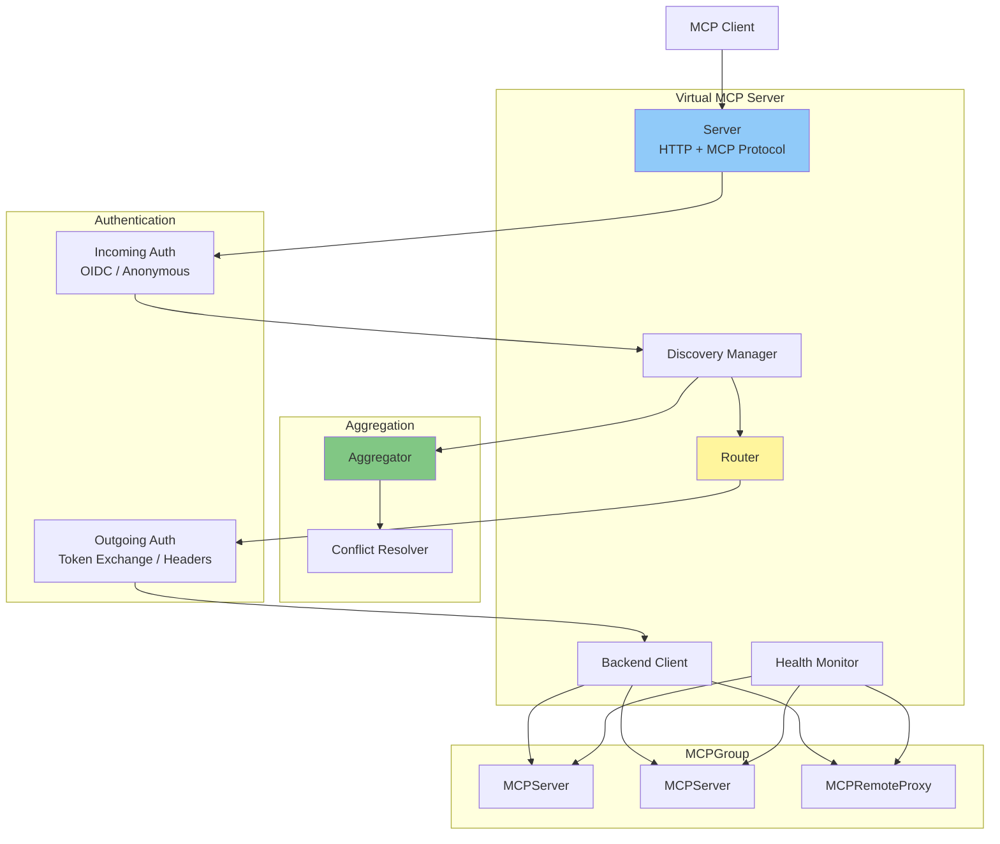
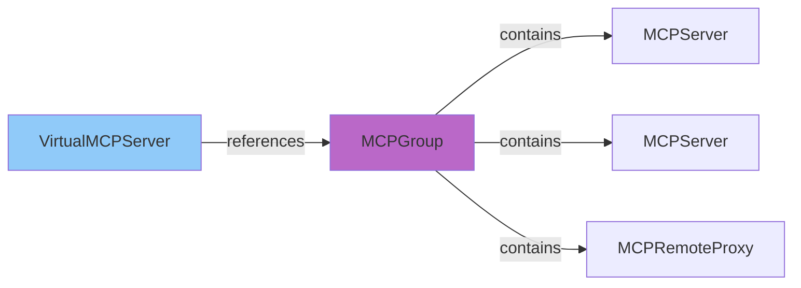
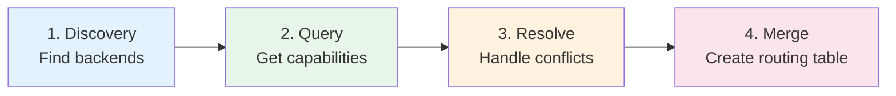
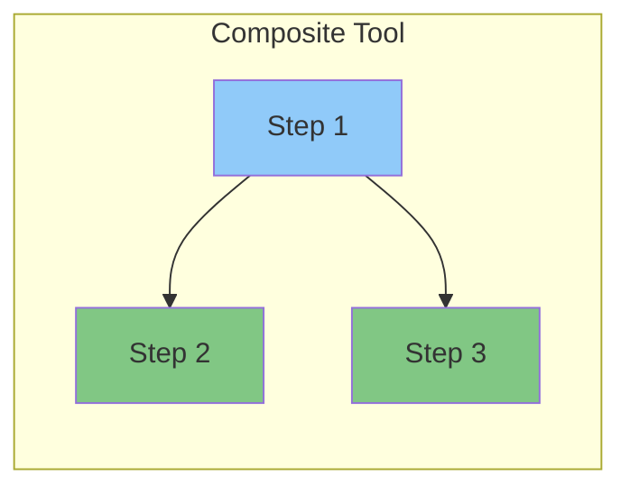
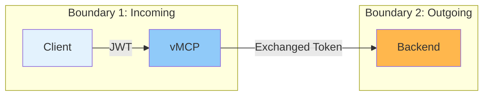
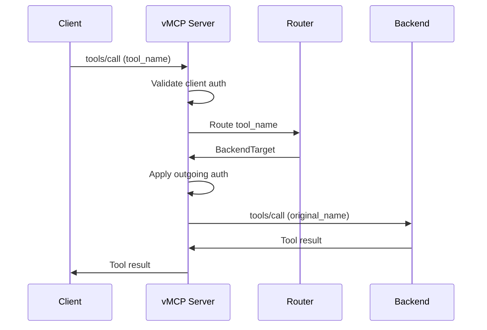

# Virtual MCP Server Architecture

The Virtual MCP Server (vMCP) aggregates multiple MCP servers from a ToolHive group into a single unified interface. This document explains the architecture and design of vMCP.

## Overview

vMCP solves the problem of **MCP server sprawl**. As organizations deploy more specialized MCP servers, clients need to connect to multiple endpoints. vMCP provides:

- **Unified endpoint** - One URL for clients to access many backends
- **Tool aggregation** - Combine tools from multiple servers
- **Conflict resolution** - Handle duplicate tool names automatically
- **Composite workflows** - Create new tools that orchestrate multiple backends
- **Centralized security** - Single authentication and authorization point
- **Token management** - Exchange and cache tokens for backend access

## Architecture

The vmcp package follows Domain-Driven Design principles with clear separation into bounded contexts:

### Core Concepts

| Concept | Purpose |
|---------|---------|
| **Routing** | Forward MCP requests (tools, resources, prompts) to appropriate backends |
| **Aggregation** | Discover capabilities, resolve conflicts, merge into unified view |
| **Authentication** | Two-boundary model: incoming (client → vMCP) and outgoing (vMCP → backend) |
| **Composition** | Execute multi-step workflows across multiple backends |
| **Caching** | Reduce auth overhead by caching exchanged tokens |

**Implementation**: `pkg/vmcp/` (discovery: `pkg/vmcp/discovery/`, routing: `pkg/vmcp/router/`)

## Backend Discovery

vMCP discovers backends from an **MCPGroup**. The group acts as a container for related MCP servers that should be exposed together.

**Discovery process:**
1. VirtualMCPServer references an MCPGroup by name
2. All MCPServers and MCPRemoteProxies in that group are discovered
3. For each backend, URL, transport type, and auth config are extracted
4. vMCP queries each backend for available tools, resources, and prompts

**Implementation**: `pkg/vmcp/aggregator/`

## Aggregation Pipeline

Aggregation happens in three stages:

1. **Discovery** - Find all backends in the MCPGroup
2. **Query** - Ask each backend for its tools, resources, and prompts (parallel)
3. **Resolve** - Handle naming conflicts using configured strategy
4. **Merge** - Create unified routing table mapping names to backends

### Conflict Resolution

When backends expose tools with the same name, vMCP resolves the conflict using one of three strategies:

| Strategy | Behavior |
|----------|----------|
| **prefix** | Prepend backend name to all tools (e.g., `github_create_issue`) |
| **priority** | First backend in priority order wins, others hidden |
| **manual** | Explicit mapping for each conflict |

### Tool Filtering

Beyond conflict resolution, vMCP can filter which tools are exposed through allow/deny lists, renaming, and description overrides.

**Implementation**: `pkg/vmcp/aggregator/`

## Composite Tools

Composite tools are new tools defined in vMCP that orchestrate calls to multiple backend tools. They enable complex workflows without client awareness of the underlying backends.

Step dependencies form a DAG (Directed Acyclic Graph). Steps without dependencies execute in parallel, while dependent steps wait for prerequisites.

**Implementation**: `pkg/vmcp/composer/`

## Two-Boundary Authentication

vMCP uses separate authentication for incoming clients and outgoing backend calls:

### Incoming Authentication

Validates clients connecting to vMCP using OIDC token validation or anonymous access.

### Outgoing Authentication

Authenticates vMCP to backend MCP servers using:
- **Token exchange** - RFC 8693 exchange of client token for backend-specific token
- **Header injection** - Static API key or header injection
- **Unauthenticated** - For internal/trusted backends

Exchanged tokens are cached to avoid repeated exchange calls.

**Implementation**: `pkg/vmcp/auth/`, `pkg/vmcp/cache/`

## Request Flow

**Key insight**: If a tool was renamed during conflict resolution (e.g., `github_create_issue`), vMCP translates it back to the original name (`create_issue`) when calling the backend.

## Health Monitoring

vMCP monitors backend health with configurable intervals. Health status (healthy, degraded, unhealthy, unauthenticated, unknown) affects routing decisions and is reported in VirtualMCPServer status.

**Implementation**: `pkg/vmcp/health/`

## Deployment

vMCP can be deployed two ways:

- **Kubernetes** - Via the VirtualMCPServer CRD managed by the operator
- **CLI** - Standalone via the `vmcp` binary for development or non-Kubernetes environments

**Implementation**:
- Kubernetes: `cmd/thv-operator/controllers/virtualmcpserver_controller.go`
- CLI: `cmd/vmcp/`

## Related Documentation

- [Core Concepts](02-core-concepts.md) - Virtual MCP Server concept
- [Groups](07-groups.md) - MCPGroup for backend organization
- [Operator Architecture](09-operator-architecture.md) - CRD details
- [Transport Architecture](03-transport-architecture.md) - Transport types used by backends
