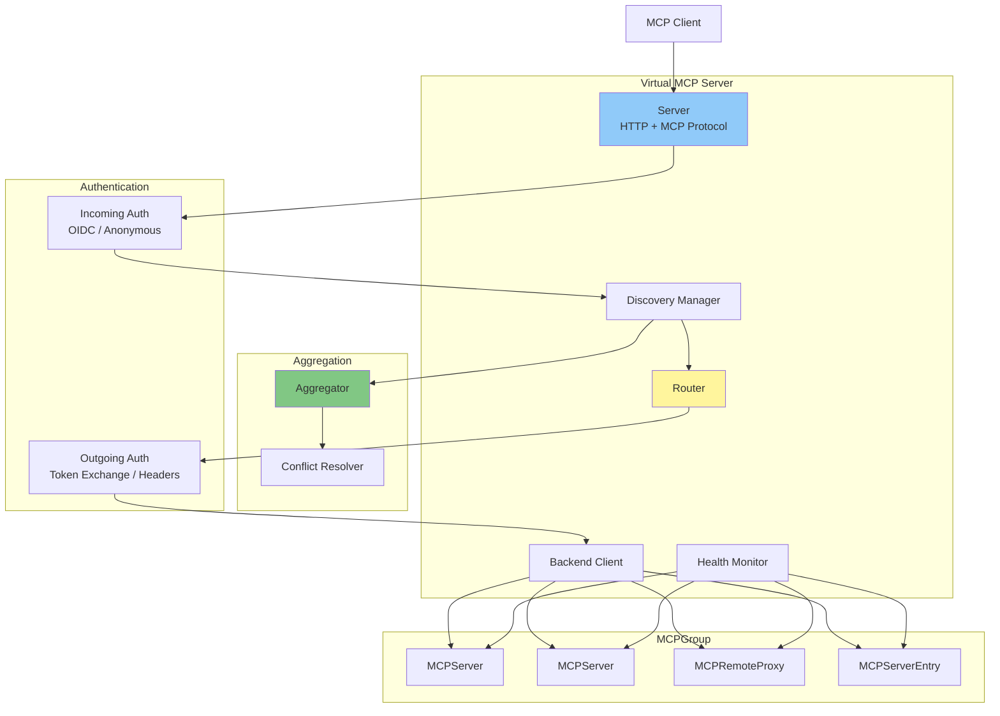
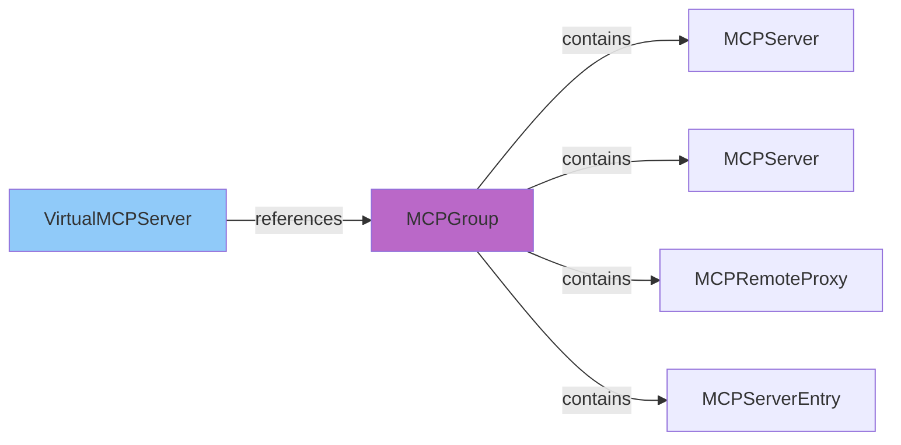
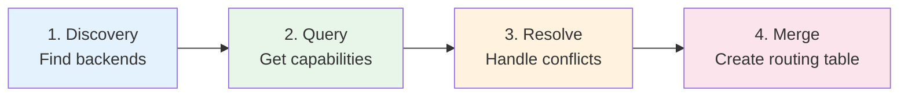
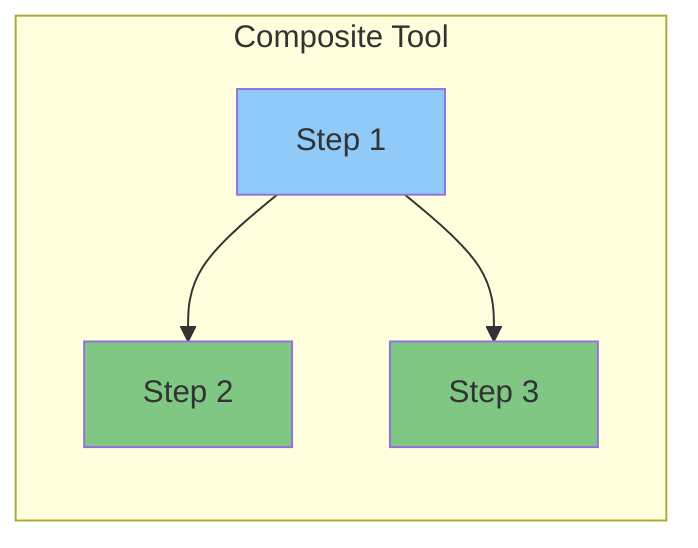
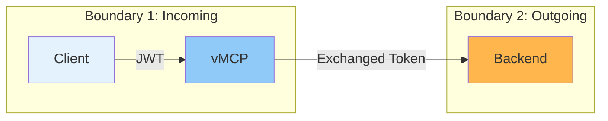
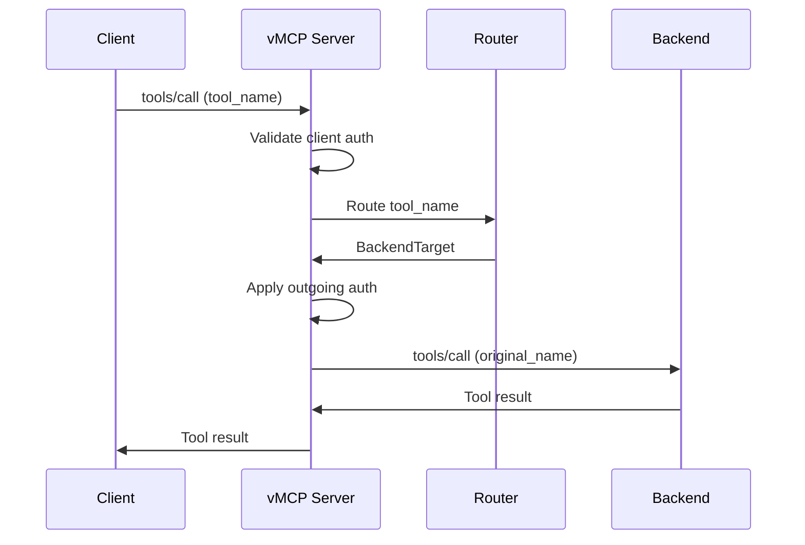

# Virtual MCP Server Architecture

The Virtual MCP Server (vMCP) aggregates multiple MCP servers from a ToolHive group into a single unified interface. This document explains the architecture and design of vMCP.

## Overview

vMCP solves the problem of **MCP server sprawl**. As organizations deploy more specialized MCP servers, clients need to connect to multiple endpoints. vMCP provides:

- **Unified endpoint** - One URL for clients to access many backends
- **Tool aggregation** - Combine tools from multiple servers
- **Conflict resolution** - Handle duplicate tool names automatically
- **Composite workflows** - Create new tools that orchestrate multiple backends
- **Centralized security** - Single authentication and authorization point
- **Token management** - Exchange and cache tokens for backend access
- **Shared telemetry** - Reference an MCPTelemetryConfig via `telemetryConfigRef` for fleet-wide OpenTelemetry settings

## Architecture

The vmcp package follows Domain-Driven Design principles with clear separation into bounded contexts:


```mermaid
graph TB
    subgraph "Virtual MCP Server"
        Server[Server<br/>HTTP + MCP Protocol]
        Discovery[Discovery Manager]
        Router[Router]
        BackendClient[Backend Client]
        Health[Health Monitor]
    end

    subgraph "Aggregation"
        Aggregator[Aggregator]
        Conflict[Conflict Resolver]
    end

    subgraph "Authentication"
        InAuth[Incoming Auth<br/>OIDC / Anonymous]
        OutAuth[Outgoing Auth<br/>Token Exchange / Headers]
    end

    subgraph "MCPGroup"
        B1[MCPServer]
        B2[MCPServer]
        B3[MCPRemoteProxy]
        B4[MCPServerEntry]
    end

    Client[MCP Client] --> Server
    Server --> InAuth
    InAuth --> Discovery
    Discovery --> Aggregator
    Aggregator --> Conflict
    Discovery --> Router
    Router --> OutAuth
    OutAuth --> BackendClient
    BackendClient --> B1
    BackendClient --> B2
    BackendClient --> B3
    BackendClient --> B4
    Health --> B1
    Health --> B2
    Health --> B3
    Health --> B4

    style Server fill:#90caf9
    style Aggregator fill:#81c784
    style Router fill:#fff59d
```

### Core Concepts

| Concept | Purpose |
|---------|---------|
| **Routing** | Forward MCP requests (tools, resources, prompts) to appropriate backends |
| **Aggregation** | Discover capabilities, resolve conflicts, merge into unified view |
| **Authentication** | Two-boundary model: incoming (client → vMCP) and outgoing (vMCP → backend) |
| **Composition** | Execute multi-step workflows across multiple backends |
| **Caching** | Reduce auth overhead by caching exchanged tokens |

**Implementation**: `pkg/vmcp/` (discovery: `pkg/vmcp/discovery/`, routing: `pkg/vmcp/router/`)

## Backend Discovery

vMCP discovers backends from an **MCPGroup**. The group acts as a container for related MCP servers that should be exposed together.


```mermaid
graph LR
    vMCP[VirtualMCPServer] -->|references| Group[MCPGroup]
    Group -->|contains| S1[MCPServer]
    Group -->|contains| S2[MCPServer]
    Group -->|contains| R1[MCPRemoteProxy]
    Group -->|contains| E1[MCPServerEntry]

    style vMCP fill:#90caf9
    style Group fill:#ba68c8
```

**Discovery process:**
1. VirtualMCPServer references an MCPGroup by name
2. All MCPServers, MCPRemoteProxies, and MCPServerEntries in that group are discovered
3. For each backend, URL, transport type, and auth config are extracted
4. vMCP queries each backend for available tools, resources, and prompts

MCPServerEntry backends connect directly to remote MCP servers without deploying a proxy pod. They are zero-infrastructure catalog entries that declare a remote endpoint URL, optional external auth, and an optional CA bundle for TLS verification. CA bundle data is fetched from Kubernetes ConfigMaps at discovery time. In dynamic mode, the BackendReconciler watches ConfigMap changes and uses a field index on `spec.caBundleRef.configMapRef.name` to efficiently re-reconcile only the MCPServerEntry backends affected by a given ConfigMap update.

**Implementation**: `pkg/vmcp/aggregator/`

## Aggregation Pipeline

Aggregation happens in three stages:


```mermaid
graph LR
    A[1. Discovery<br/>Find backends] --> B[2. Query<br/>Get capabilities]
    B --> C[3. Resolve<br/>Handle conflicts]
    C --> D[4. Merge<br/>Create routing table]

    style A fill:#e3f2fd
    style B fill:#e8f5e9
    style C fill:#fff3e0
    style D fill:#fce4ec
```

1. **Discovery** - Find all backends in the MCPGroup
2. **Query** - Ask each backend for its tools, resources, and prompts (parallel)
3. **Resolve** - Handle naming conflicts using configured strategy
4. **Merge** - Create unified routing table mapping names to backends

### Conflict Resolution

When backends expose tools with the same name, vMCP resolves the conflict using one of three strategies:

| Strategy | Behavior |
|----------|----------|
| **prefix** | Prepend backend name to all tools (e.g., `github_create_issue`) |
| **priority** | First backend in priority order wins, others hidden |
| **manual** | Explicit mapping for each conflict |

### Tool Filtering

Beyond conflict resolution, vMCP can filter which tools are exposed through allow/deny lists, renaming, and description overrides.

**Implementation**: `pkg/vmcp/aggregator/`

## Composite Tools

Composite tools are new tools defined in vMCP that orchestrate calls to multiple backend tools. They enable complex workflows without client awareness of the underlying backends.


```mermaid
graph LR
    subgraph "Composite Tool"
        Step1[Step 1]
        Step2[Step 2]
        Step3[Step 3]
    end

    Step1 --> Step2
    Step1 --> Step3

    style Step1 fill:#90caf9
    style Step2 fill:#81c784
    style Step3 fill:#81c784
```

Step dependencies form a DAG (Directed Acyclic Graph). Steps without dependencies execute in parallel, while dependent steps wait for prerequisites.

Steps can be of three types:
- **tool**: Execute a backend tool
- **elicitation**: Request user input via MCP elicitation protocol
- **forEach**: Iterate over a collection from a previous step, executing an inner tool step per item with bounded parallelism

**Implementation**: `pkg/vmcp/composer/`

## Served MCP Capabilities

Beyond tools, vMCP aggregates and serves the full complement of MCP capabilities. Every served capability flows through the domain **core** (`pkg/vmcp/core`), so the same admission decision that filters `tools/list` also gates reads, gets, and completions.

| Capability | Served? | Notes |
|------------|---------|-------|
| Tools (`tools/list`, `tools/call`) | Yes | Aggregated, conflict-resolved, admission-filtered; a backend's asynchronous `notifications/tools/list_changed` is propagated to already-registered sessions — see below |
| Resources (`resources/list`, `resources/read`) | Yes | Admission-filtered per identity; a backend's asynchronous `notifications/resources/list_changed` propagates ADDITIONS (not removals) to already-registered sessions — see below |
| Resource templates (`resources/templates/list`) | Yes | Templated reads route through the same `ReadResource` path; the router matches an expanded URI against the aggregated templates, and an exact template-string key routes to its backend; covered by the same `notifications/resources/list_changed` propagation as resources (MCP 2025-11-25 has no separate wire method for template changes) |
| Prompts (`prompts/list`, `prompts/get`) | Yes | Served per-session; a backend's asynchronous `notifications/prompts/list_changed` propagates ADDITIONS (not removals) to already-registered sessions — see below |
| Completions (`completion/complete`) | Yes | A `ref/prompt` routes via the prompts table; a `ref/resource` carries the URI-template string per the spec and routes via the resource-templates table (exact template-string key, with exact-resource and template-expansion fallbacks). Unroutable refs return an empty result (lenient completion); admission denial returns an error |
| Resource subscriptions (`resources/subscribe`, `resources/unsubscribe`) | Ack-level only | vMCP accepts and records the subscription (after session-binding and resource-admission checks) but does **not** yet forward backend `notifications/resources/updated` — see the limitation below |

The completion handler is a single global handler installed via `WithCompletionHandler`, so it recovers the session from the SDK request context rather than a per-session closure. Setting it makes the shim auto-advertise the `completions` capability at initialize.

### Subscription limitation (ack-level)

vMCP advertises `resources.subscribe: true` and answers `resources/subscribe` / `resources/unsubscribe` at **ack level**: the request is accepted (enforcing session binding and validating the URI is an advertised, admitted resource), and go-sdk records the subscription. vMCP does **not** currently propagate backend `notifications/resources/updated` to the subscribed client — doing so requires persistent per-session backend connections, which is out of scope. Clients that subscribe will receive a success ack but no update stream yet.

### Tools/resources/prompts list_changed propagation (#5748, #5969)

Unlike the per-call backend client (`pkg/vmcp/client`), the **persistent**
per-session backend connection (`pkg/vmcp/session/internal/backend`) stays
open for the session's lifetime, so it can observe a backend's asynchronous
(out-of-band) notifications rather than only mid-call traffic. When a
non-nil `ListChangedSink` is supplied at connection time, the connector:

- Enables `WithContinuousListening()` on streamable-HTTP backends (opens a
  standalone GET stream) — gated **strictly** on a non-nil sink, because some
  backends hang when this stream is opened against them. SSE backends need no
  extra option: their whole session is already one continuous stream.
- Registers an `OnNotification` handler that dispatches
  `notifications/tools/list_changed` (`kind=KindTools`),
  `notifications/resources/list_changed` (`kind=KindResources` — also covers
  resource templates, since MCP 2025-11-25 has no separate wire method for
  template changes), and `notifications/prompts/list_changed`
  (`kind=KindPrompts`) to the sink — `ChangeKind` is a typed constant rather
  than a bare string so a typo is a compile error — and logs
  `notifications/message` received out-of-call (log-only; no relay).

The sink is built once per session, at registration (`pkg/vmcp/server`'s
`buildListChangedSink`), closing over the SDK `ClientSession`, the session ID,
and the caller's identity **and per-request forwarded headers** captured **at
registration time** (a deliberate snapshot, not re-resolved per firing — see
the token-staleness note below). It is threaded through
`MultiSessionFactory.MakeSessionWithID` / `SessionManager.CreateSession` (a
single nilable `ListChangedSink` parameter) down to every backend connector
opened for that session.

`buildListChangedSink` builds **one coalescing worker per `ChangeKind`**
(`KindTools`, `KindResources`, `KindPrompts`) rather than a single shared
worker: a tools notification resyncs only the session's tool store, without
forcing a redundant re-apply (and possible spurious downstream
`list_changed`) of its resources or prompts overlay, and vice versa.

**The sink is non-blocking (runs on the backend receive-loop goroutine).** It
must not do real work inline: the mcpcompat client dispatches notifications
synchronously on its receive loop, so a blocking sink would stall that
backend's notification delivery and let a misbehaving backend amplify one
notification into unbounded work. The sink therefore only hands off to the
matching **per-(session, kind) coalescing worker** (`listChangedResyncWorker`):
`trigger()` sets a dirty flag and, at most, starts **one** worker goroutine —
never one goroutine per notification. At most one resync runs at a time per
(session, kind); notifications that arrive while a resync is in flight
collapse into a single follow-up run, so a notification storm is bounded to
O(1) concurrent work per (session, kind) — up to 3 concurrent resyncs per
session in the worst case, one per kind. Each worker goroutine exits when
idle, so an idle session holds no goroutine.

Each worker's resync body (`runListChangedResync`), off the receive loop:

1. **Liveness guard** — looks the session up via `GetMultiSession` and returns
   immediately if it was terminated/expired, so a storm of notifications for a
   dead session drives no work.
2. **Reconstructs the request context** — starts from a server-lifetime base
   context (`Server.resyncBaseCtx`, cancelled on `Stop` so in-flight backend
   sweeps never outlive the server) and layers on the captured identity
   (`auth.WithIdentity`) and forwarded headers
   (`headerforward.WithForwardedHeaders`). This is **security-critical**: the
   capability cache key and the outbound backend authentication are derived
   from the **context** (not from an explicit identity argument), so without
   this the resync would enumerate backends *unauthenticated* — advertising
   metadata the principal's own credentials would not surface, or wrongly
   dropping credential-gated tools/resources/prompts, while replacing the
   correctly-scoped registration-time set.
3. Calls `core.InvalidateCapabilityCache()`, which purges the **entire**
   per-identity capability cache (`aggregator.CacheInvalidator`), covering all
   capability kinds together (tools, resources, resource templates, prompts
   share one cached `AggregatedCapabilities` per identity). This is coarse (not
   scoped to the one backend that changed): the LRU key is a hash of identity +
   forwarded headers + backend-set, so per-backend invalidation would need a
   reverse index that is disproportionate here. The coalescing above already
   bounds the purge to at most once per resync burst per kind, and a purge
   only forces the next call per identity to re-sweep — an accepted de-opt /
   follow-up. An aggregator that does not implement `CacheInvalidator`
   WARN-logs instead of silently no-opping.
4. Re-derives and **replaces** — not merges — the session's advertised set for
   the notification's kind, from the (now cold) cache: `KindTools` re-derives
   via `serveSessionTools` and replaces the tool store
   (`SessionWithTools.SetSessionTools`); `KindResources` re-derives via
   `coreSessionResources`/`coreSessionResourceTemplates` and replaces BOTH the
   resource store (`SessionWithResources.SetSessionResources`) and the
   resource-template store
   (`SessionWithResourceTemplates.SetSessionResourceTemplates`) — one
   notification method covers both, per MCP 2025-11-25; `KindPrompts`
   re-derives via `coreSessionPrompts` and replaces the prompt store
   (`SessionWithPrompts.SetSessionPrompts`). Replacing (rather than merging)
   means a tool the backend removed disappears rather than lingering from the
   registration-time merge — but see the add-only caveat below for resources
   and prompts.

The go-sdk server auto-emits the corresponding `list_changed` notification
(`notifications/tools/list_changed`, `notifications/resources/list_changed`,
or `notifications/prompts/list_changed`) to the downstream client whenever the
matching `SetSession*` call changes something, now that
`WithToolCapabilities(true)`, `WithResourceCapabilities(true, true)`, and
`WithPromptCapabilities(true)` are all set (`pkg/vmcp/server/serve.go`).

**Identity staleness (B1)**: each worker reuses the identity captured at
registration for its re-aggregation and admission view. If that identity's
upstream tokens are refreshed later (see #5323), the resync's
`core.ListTools`/`ListResources`/`ListPrompts` call authorizes/aggregates
against the (potentially stale) captured tokens, not the live per-request
ones. This only affects the *accuracy of the asynchronous resync's own view*
— every live call still authenticates via the fresh per-request identity
through `enforceSessionBinding`, so staleness here cannot grant a call that
would otherwise be denied.

**Registration-time emission (R1)**: go-sdk's own `AddTool`/`RemoveTools` (and
the resource/prompt equivalents) debounce (10ms) and then broadcast the
corresponding `list_changed` notification to **every** session currently
connected to the shared `*gosdk.Server` — not only the session whose overlay
changed — and a session is eligible for that broadcast from the moment its
transport connects (`Server.bind`), before its own
`initialize`/`notifications/initialized` round-trip completes. go-sdk's own
source documents this as a known upstream gap ("potential spec violation...
when the feature list changes before the session ... is initialized"). This
means every session's registration-time per-session `AddTool`/resource/prompt
calls (`setSessionToolsDirect`/`setSessionResourcesDirect`/
`setSessionResourceTemplatesDirect`/`setSessionPromptsDirect`) now cause a
broadcast to every other already-connected session too. There is no supported
hook to scope or suppress this without patching the vendored SDK, so it is
accepted as a benign nuisance for all three capability kinds: MCP
notifications are inherently a "you may want to refetch" hint, so an extra one
only costs an idempotent list round-trip — it never changes what any given
session's own list actually returns.

**Scope**: additions AND removals propagate for tools. For resources
(including resource templates) and prompts, only **additions** propagate
today: toolhive-core's mcpcompat per-session sync for resources/resource
templates/prompts (`syncSessionResources`/`syncSessionResourceTemplates`/
`syncSessionPrompts` in `mcpcompat/server/session.go`) is add-only — unlike
`syncSessionTools`, which also calls `RemoveTools` — so a backend-removed
resource/template/prompt stays registered on the session's go-sdk server
(listed until re-initialize) even though the overlay this PR replaces no
longer contains it. `resyncSessionResources`/`resyncSessionPrompts` still
REPLACE (not merge) their overlay, so once toolhive-core gains removal
reconciliation ([stacklok/toolhive-core#184](https://github.com/stacklok/toolhive-core/issues/184)),
removals start propagating with no change needed on the vMCP side. Advertising
`listChanged: true` stays honest in the meantime — notifications ARE emitted on
change (except that a pure removal which EMPTIES the overlay issues no `Add*`
and therefore triggers no downstream `list_changed`, since go-sdk notifies only
via `Add*`/`RemoveTools`); `listChanged` promises notification, not list
minimization — but until that follow-up lands, a refetch after a pure removal
returns a stale superset for resources/templates/prompts. Cross-pod session
restore (`RestoreSession`) does not thread a sink at all for any kind (no live
`ClientSession` to resync there).

**Implementation**: `pkg/vmcp/session/internal/backend/mcp_session.go`
(`ChangeKind`/`KindTools`/`KindResources`/`KindPrompts`, `ListChangedSink`,
connector wiring), `pkg/vmcp/aggregator/aggregator.go` and
`caching_aggregator.go` (`CacheInvalidator`), `pkg/vmcp/core/core_vmcp.go`
(`InvalidateCapabilityCache`), `pkg/vmcp/server/serve_list_changed.go`
(`listChangedResyncWorker` coalescing, `buildListChangedSink`,
`runListChangedResync`, `resyncSessionTools`, `resyncSessionResources`,
`resyncSessionPrompts`) with `Server.resyncBaseCtx` cancelled on `Stop`.

### Mid-call forwarding (elicitation / sampling / progress / logging)

While a backend `tools/call` (or other request) is in flight, the backend may issue **server-initiated** requests and notifications back toward the client: elicitation, sampling, progress, and logging. vMCP forwards these mid-call in both directions through a per-call forwarder that bridges the backend connection to the originating client session, so a backend that needs user input (elicitation) or model completions (sampling), or that emits progress/log notifications, reaches the real client transparently. This is distinct from composite-tool elicitation (which the composer drives during a workflow); the mid-call forwarder handles the general request-scoped case for a single backend call.

**Implementation**: `pkg/vmcp/forwarding.go`, `pkg/vmcp/client/forwarding.go`, `pkg/vmcp/server/serve_handlers.go`

**Known limitation (logging level)**: forwarded backend logging is not yet filtered to the downstream client's requested `logging/setLevel`. vMCP requests debug-level logging from the backend so it emits `notifications/message`, and every such notification is forwarded — the downstream client's own level preference is not applied to the relayed stream.

**Known limitation (resource-template authorization)**: a resource template is advertised on the template-string entity (e.g. `file:///logs/{date}.txt`), but a concrete read is admission-checked on the **expanded** URI (e.g. `file:///logs/2025-01-01.txt`). Operators should therefore author resource authorization policies against concrete URI patterns, not the template string.

## Two-Boundary Authentication

vMCP uses separate authentication for incoming clients and outgoing backend calls:


```mermaid
graph LR
    subgraph "Boundary 1: Incoming"
        Client[Client] -->|JWT| vMCP[vMCP]
    end

    subgraph "Boundary 2: Outgoing"
        vMCP -->|Exchanged Token| Backend[Backend]
    end

    style Client fill:#e3f2fd
    style vMCP fill:#90caf9
    style Backend fill:#ffb74d
```

### Incoming Authentication

Validates clients connecting to vMCP using OIDC token validation or anonymous access.

### Outgoing Authentication

Authenticates vMCP to backend MCP servers using:
- **Token exchange** - RFC 8693 exchange of client token for backend-specific token
- **Header injection** - Static API key or header injection
- **Unauthenticated** - For internal/trusted backends

Exchanged tokens are cached to avoid repeated exchange calls.

**Implementation**: `pkg/vmcp/auth/`, `pkg/vmcp/cache/`

## Request Flow


```mermaid
sequenceDiagram
    participant Client
    participant Server as vMCP Server
    participant Router
    participant Backend

    Client->>Server: tools/call (tool_name)
    Server->>Server: Validate client auth
    Server->>Router: Route tool_name
    Router->>Server: BackendTarget
    Server->>Server: Apply outgoing auth
    Server->>Backend: tools/call (original_name)
    Backend->>Server: Tool result
    Server->>Client: Tool result
```

**Key insight**: If a tool was renamed during conflict resolution (e.g., `github_create_issue`), vMCP translates it back to the original name (`create_issue`) when calling the backend.

## Request Processing Pipeline

vMCP uses a middleware chain to process incoming requests. The chain is configured in `pkg/vmcp/server/server.go`.

### Middleware Execution Order

Middleware is applied by wrapping handlers, so execution order is outer-to-inner:

| Order | Middleware | Required | Purpose |
|-------|------------|----------|---------|
| 1 | Recovery | Always | Catches panics, returns HTTP 500 |
| 2 | WriteTimeout | Always | Clears the server `WriteTimeout` for qualifying SSE connections |
| 3 | Header Validation | Always | Rejects GETs without `Accept: text/event-stream` before they reach the MCP handler |
| 4 | Authentication (+ MCP parsing) | Optional | Validates incoming credentials (OIDC/local/anonymous); MCP parsing is composed inside so downstream layers see `ParsedMCPRequest` |
| 5 | Audit | Optional | Logs request events for compliance |
| 6 | Discovery | Always | Aggregates backend capabilities per session |
| 7 | Annotation Enrichment | Optional | Injects tool annotations into context for annotation-aware authz (only when Authorization is configured) |
| 8 | Authorization | Optional | Evaluates Cedar policies after discovery and annotation enrichment |
| 9 | Backend Enrichment | Optional | Adds backend name to audit context (only when Audit is configured) |
| 10 | MCP Parsing | Always | Second application is a no-op when auth already parsed; ensures telemetry can label metrics with `mcp_method` when auth is nil |
| 11 | Telemetry | Optional | OpenTelemetry instrumentation |
| 12 | Pre-dispatch authorization gate | Optional | Innermost: runs inside the Streamable HTTP transport before session validation and SDK dispatch. Rejects a Cedar-denied `tools/call` / `resources/read` / `prompts/get` with HTTP 403 + JSON-RPC code 403, reusing the core admission decision. Installed only when Authorization is configured. See "Authorization Enforcement" below. |

> On the New/Serve path, authorization is enforced by the **core admission seam**, not by rows 6–8 as standalone HTTP middleware; row 12 is the transport-level projection of that decision. See [Authorization Enforcement](#authorization-enforcement-core-admission-seam--pre-dispatch-gate).

### Discovery Middleware

The Discovery middleware (`pkg/vmcp/discovery/middleware.go`) is central to vMCP's multi-tenant design:

- **Initialize requests** (no session ID): Discovers capabilities from all backends in the MCPGroup, stores routing table in session
- **Subsequent requests** (with session ID): Retrieves cached capabilities from session

This lazy per-session discovery ensures:
- Deterministic behavior within a session
- Support for dynamic backends (Kubernetes)
- No notification spam from redundant capability updates

**Timeouts**: Discovery has a 15-second timeout. Timeout returns HTTP 504, discovery failure returns HTTP 503.

### Backend Enrichment Middleware

When Audit is configured, the Backend Enrichment middleware (`pkg/vmcp/server/backend_enrichment.go`) parses the MCP request to determine which backend will handle it:

| MCP Method | Lookup |
|------------|--------|
| `tools/call` | `name` → `RoutingTable.Tools` |
| `resources/read` | `uri` → `RoutingTable.Resources` |
| `prompts/get` | `name` → `RoutingTable.Prompts` |

This enriches audit events with the backend name for better observability.

### Authentication Composition

`pkg/vmcp/auth/factory/incoming.NewIncomingAuthMiddleware()` returns two separate middlewares:

- `authMw`: Authentication composed with MCP Parsing (parsing runs immediately after auth so downstream layers see `ParsedMCPRequest`).
- `authzMw`: Authorization, returned independently so the server can place it after discovery and annotation enrichment in the chain.

The server wires them around discovery/annotation-enrichment so the effective execution order is:

```
Authentication → MCP Parsing → Audit → Discovery → Annotation Enrichment → Authorization → Next Handler
```

**Implementation**: `pkg/vmcp/server/server.go`, `pkg/vmcp/discovery/middleware.go`, `pkg/vmcp/auth/factory/`

### Authorization Enforcement (core admission seam + pre-dispatch gate)

On the New/Serve path, authorization is enforced by the **core admission seam**
(`pkg/vmcp/core`), not by HTTP middleware. The seam applies one Cedar decision to both
the list side (`ListTools`/`ListResources`/`ListPrompts` filter the advertised set) and
the call side (`CallTool`/`ReadResource`/`GetPrompt` deny before dispatch), closing the
"list says yes / call says no" gap.

Because the SDK maps a call-side deny to a tool result, a raw denied `tools/call` would
otherwise return **HTTP 200** (either the SDK's `-32602 "not found"` for a list-filtered
tool, or a `200 + IsError` tool result for an argument-gated deny). To make a denial a
first-class wire rejection, Serve installs a **pre-dispatch authorization gate**
(`pkg/vmcp/server/call_gate.go`) on the Streamable HTTP transport, but only when Cedar
policies are configured:

- The gate re-runs the core admission decision for `tools/call`, `resources/read`, and
  `prompts/get` via `core.CheckToolCall` / `CheckResourceRead` / `CheckPromptGet` — the
  same helpers the call path uses, so a pre-check and the call can never drift. Non-gated
  methods (e.g. `initialize`, `tools/list`) are admitted untouched.
- A denial is rejected as **HTTP 403 + JSON-RPC error code 403** (`pkg/mcp.JSONRPCCodeDenied`)
  with a kind-only message (`"call denied by authorization policy"`,
  `"read denied by authorization policy"`, `"prompt denied by authorization policy"`) —
  identical to the single-server `thv run` authorization response. The message never
  names the capability or reveals advertised-vs-nonexistent, so a denial is not an
  **enumeration oracle**: a filtered tool, an argument-gated deny, and a nonexistent tool
  under a default-deny policy all converge on the same 403.
- The gate runs **before session validation** (403-before-404): a denial is determinable
  from the caller's own identity without session state.
- It sits **inside the audit middleware**, so a denied call is audited with outcome
  `denied` (403 → `OutcomeDenied`) with no audit-layer changes.
- An authorizer error fails **closed** (treated as a denial); a non-authorization
  (infrastructure) error admits, so the call path surfaces it through existing mapping —
  the gate never converts a plumbing fault into a 403.
- **One decode per `tools/call`**: dispatch (`coreToolHandler`) prefers the transport
  parse (`pkg/mcp`) the gate authorized on — via `gateParsedArgs`, keyed on matching
  method + tool — so the gated decision, the enforced call-path decision, and the
  forwarded backend arguments all derive from a single decoded map. Where no matching
  parse exists (batch, embedders bypassing the transport, method/tool mismatch), dispatch
  falls back to the SDK decode and makes a single decision on that single map, so no path
  can produce an allow-then-deny split between gate and call.
- **Code mode carve-out**: `execute_tool_script` is not in the admission seam (the feature
  flag is the grant, and each inner tool call the script makes is re-authorized by its real
  name), so the codemode decorator's `CheckToolCall` admits it while delegating every other
  name to the inner core. A backend that advertised a tool named `execute_tool_script`
  would be silently shadowed by the virtual tool and skip its own Cedar admission, so the
  decorator fails **loud** (`ErrReservedToolName`) on that collision — `ListTools`,
  `LookupTool`, and the `CallTool` script-binding path all refuse to serve rather than mask it.

The `Call*` methods keep their internal admission checks as defense-in-depth for other
embedders and misconfigured gates.

**Implementation**: `pkg/vmcp/core/core_checks.go`, `pkg/vmcp/server/call_gate.go`,
`pkg/vmcp/server/serve_handlers.go`, `pkg/vmcp/codemode/decorator.go`, `pkg/mcp/errors.go`

## Health Monitoring

vMCP monitors backend health with configurable intervals. Health status (healthy, degraded, unhealthy, unauthenticated, unknown) affects routing decisions and is reported in VirtualMCPServer status.

**Implementation**: `pkg/vmcp/health/`

## Deployment

vMCP can be deployed in three ways:

- **Kubernetes** - Via the VirtualMCPServer CRD managed by the operator
- **Local CLI (`thv vmcp`)** - Recommended path for local and non-Kubernetes use; built into the main `thv` binary
- **Standalone `vmcp` binary** - Preserved for backwards compatibility and advanced CLI use

**Implementation**:
- Kubernetes: `cmd/thv-operator/controllers/virtualmcpserver_controller.go`
- Local CLI: `cmd/thv/app/vmcp.go`, `pkg/vmcp/cli/`
- Standalone binary: `cmd/vmcp/`

## Local CLI Mode

`thv vmcp` is the recommended way to run a vMCP server outside of Kubernetes. It provides the same aggregation, tool routing, and optimizer capabilities as the Kubernetes-managed VirtualMCPServer, but runs as a local foreground process driven by Cobra CLI flags.

Key features:

- **Zero-config quick mode**: `thv vmcp serve --group <name>` generates an in-memory config from a running ToolHive group — no YAML file required.
- **Config-file workflow**: `thv vmcp init` → `thv vmcp validate` → `thv vmcp serve --config` for reproducible deployments.
- **Optimizer tiers**: optional FTS5 keyword search (Tier 1) and managed TEI semantic search (Tier 2) reduce tool count for MCP clients.
- **Loopback-only binding**: quick mode enforces a loopback-only host via `ServeConfig.validateQuickModeHost` — `localhost`, `127.0.0.1`, `::1`, or any other loopback IP is accepted; non-loopback addresses are rejected.

See [Local vMCP CLI Mode](vmcp-local.md) for the full architecture, optimizer tier table, and TEI container lifecycle documentation.

## Status Reporting

Status reporting enables vMCP runtime to report operational status directly instead of relying on the operator to infer state. Status reporting is optional and pluggable so different environments can consume status (CLI vs Kubernetes) without duplicating discovery logic.

### Why Status Reporting

- **Avoid duplicate backend discovery**: vMCP already discovers backends for capability aggregation; we reuse that data for status instead of having the operator rediscover.
- **Provide authoritative runtime view**: backend availability, phase, and conditions are produced at runtime by the component that actually talks to backends.
- **Enable multiple sinks**: logging for CLI, Kubernetes CRD status for clusters, future file/metrics reporters.

### Key Concepts

- `Reporter` interface (`pkg/vmcp/status/reporter.go`); set via `Config.StatusReporter` field: `ReportStatus(ctx, *vmcp.Status)` and `Start(ctx)` returning shutdown func.
- Status model (`pkg/vmcp/types.go`):
  - Phase: Pending, Ready, Degraded, Failed
  - Conditions: `metav1.Condition` (ready, backends discovered, auth configured) using shared constants
  - DiscoveredBackends: backend URL/auth type/health with timestamps
- CLI reporter: Logging-only reporter (no persistence) logs status updates at Debug level (visible when `--debug` is set).
- Lifecycle hook: server starts the reporter, collects shutdown funcs, and stops them during graceful shutdown.

### Integration in vMCP Runtime

- Server config (`pkg/vmcp/server/server.go`): optional `StatusReporter`; nil disables status reporting.
- Startup: reporter `Start` is invoked; failure is treated as fatal when configured. Shutdown funcs are collected and run on `Stop`.
- Reporting: runtime components call `ReportStatus` as discovery and health change.

### Extensibility

- Additional reporters can be added under `pkg/vmcp/status/` implementing `Reporter` and using shared `vmcp.Status` types.
- Future sinks: Kubernetes status writer, file-based reporter for CLI (`thv status`), metrics exporter.

**Implementation**: `pkg/vmcp/status/`

## Related Documentation

- [Core Concepts](02-core-concepts.md) - Virtual MCP Server concept
- [Groups](07-groups.md) - MCPGroup for backend organization
- [Operator Architecture](09-operator-architecture.md) - CRD details
- [Transport Architecture](03-transport-architecture.md) - Transport types used by backends
- [Middleware Architecture](../middleware.md) - Shared middleware system (Authentication, Audit, Telemetry, etc.)
- [Local vMCP CLI Mode](vmcp-local.md) - `thv vmcp` CLI surface, optimizer tiers, and TEI lifecycle
- [vMCP Library Embedding](vmcp-library.md) - Embedding `pkg/vmcp/` in downstream Go projects
- [vMCP Scalability Limits and Constraints](13-vmcp-scalability.md) - Per-pod session cap, TTL mechanics, Redis sizing, and pod restart behaviour
- [Deployment Modes](01-deployment-modes.md) - Where vMCP fits among local and Kubernetes deployment patterns
