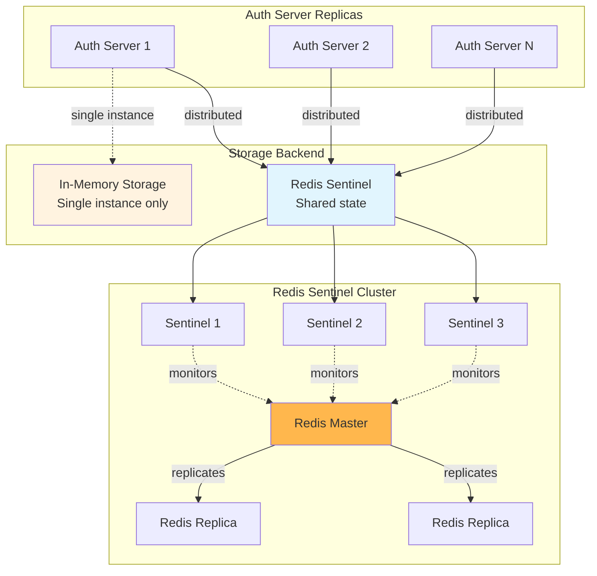

# Auth Server Storage Architecture

The embedded authorization server uses a pluggable storage backend to persist OAuth 2.0 state. This document describes the storage architecture, the available backends, and the Redis Sentinel implementation.

## Overview

The auth server stores OAuth 2.0 protocol state including access tokens, refresh tokens, authorization codes, PKCE challenges, client registrations, user accounts, and upstream IDP tokens. Two storage backends are available:

1. **Memory** (default): In-process storage with mutex-based concurrency. Suitable for single-instance deployments.
2. **Redis Sentinel**: Shared storage using Redis with Sentinel for high availability. Required for horizontal scaling across multiple auth server replicas.



## Storage Interface

The storage layer implements multiple interfaces from the [fosite](https://github.com/ory/fosite) OAuth 2.0 framework, plus ToolHive-specific extensions:

**Fosite interfaces:**
- `oauth2.AuthorizeCodeStorage` — Authorization code grant
- `oauth2.AccessTokenStorage` — Access token persistence
- `oauth2.RefreshTokenStorage` — Refresh token with rotation
- `oauth2.TokenRevocationStorage` — Token revocation (RFC 7009)
- `pkce.PKCERequestStorage` — PKCE challenge/verifier (RFC 7636)

**ToolHive extensions:**
- `ClientRegistry` — Dynamic client registration (RFC 7591)
- `UpstreamTokenStorage` — Upstream IDP token caching with user binding
- `PendingAuthorizationStorage` — In-flight authorization tracking
- `UserStorage` — Internal user accounts and provider identity linking

**Implementation:**
- Interface definitions: `pkg/authserver/storage/types.go`
- Memory backend: `pkg/authserver/storage/memory.go`
- Redis backend: `pkg/authserver/storage/redis.go`

## Memory Backend

The in-memory backend uses Go maps protected by `sync.RWMutex` for thread safety. A background goroutine runs periodic cleanup of expired entries.

**Characteristics:**
- Zero external dependencies
- State is lost on restart
- Cannot be shared across replicas
- Suitable for development and single-instance deployments

**Implementation:** `pkg/authserver/storage/memory.go`

## Redis Sentinel Backend

The Redis backend stores all OAuth 2.0 state as JSON-serialized values in Redis, using the Sentinel protocol for automatic master discovery and failover.

### Connection Architecture

The client connects to Redis through Sentinel using `redis.NewFailoverClient()` from the `go-redis` library. Sentinel handles:
- Master discovery: Finding the current master node
- Automatic failover: Detecting master failure and promoting a replica
- Configuration notification: Updating clients when the master changes

### Multi-Tenancy

Each auth server instance has a unique key prefix derived from its Kubernetes namespace and name:

```
thv:auth:{namespace:name}:
```

The `{namespace:name}` portion is a Redis hash tag. Although ToolHive only supports Sentinel deployments, the hash tag format ensures keys remain co-located in the same hash slot if the deployment were ever migrated to Redis Cluster. In Sentinel mode, hash tags have no functional effect but impose no overhead.

**Implementation:** `pkg/authserver/storage/redis_keys.go`

### Key Design

Keys follow the pattern `{prefix}{type}:{id}`:

```
thv:auth:{default:my-server}:access:abc123
thv:auth:{default:my-server}:refresh:def456
thv:auth:{default:my-server}:user:user-uuid
```

Secondary indexes use Redis Sets to enable reverse lookups:

```
thv:auth:{default:my-server}:reqid:access:{request-id}  → {sig1, sig2}
thv:auth:{default:my-server}:user:upstream:{user-id}     → {session1, session2}
```

### Consistency Model

The implementation uses different strategies based on consistency requirements:

- **Lua scripts** for strict atomicity: upstream token storage with user reverse-index cleanup, last-used timestamp updates
- **Pipelines** (`MULTI`/`EXEC`) for batched operations: authorization code invalidation, token session creation with secondary index updates
- **Individual commands** with best-effort cleanup: token revocation, refresh token rotation — partial failures are safe since orphaned keys expire via TTL

### Serialization

All values are stored as JSON. The implementation uses defensive copies on read and write to prevent caller mutations from affecting stored data.

### TTL Management

Redis TTL (`SETEX`) is used for all time-bounded data. TTL values are derived from OAuth 2.0 token lifetimes:

| Data Type | Default TTL |
|---|---|
| Access tokens | 1 hour |
| Refresh tokens | 30 days |
| Authorization codes | 10 minutes |
| PKCE requests | 10 minutes |
| Invalidated codes | 30 minutes |
| Public clients (DCR) | 30 days |
| Users / Providers | No expiry |

## Configuration

### CRD Configuration

In Kubernetes, storage is configured via the `MCPExternalAuthConfig` CRD:

```
MCPExternalAuthConfig
  └── spec.embeddedAuthServer.storage
        ├── type: "memory" | "redis"
        └── redis
              ├── sentinelConfig
              │     ├── masterName
              │     ├── sentinelAddrs[] (or sentinelService)
              │     └── db
              ├── aclUserConfig
              │     ├── usernameSecretRef
              │     └── passwordSecretRef
              └── timeouts (dial, read, write)
```

**Implementation:** `cmd/thv-operator/api/v1alpha1/mcpexternalauthconfig_types.go`

### RunConfig Serialization

When passing configuration across process boundaries (operator → proxy-runner), the CRD configuration is converted to `RunConfig` format where Secret references become environment variable references.

**Implementation:** `pkg/authserver/storage/config.go`

## Security Considerations

- **ACL authentication only**: Redis ACL users (Redis 6+) provide fine-grained access control. Legacy `requirepass` authentication is not supported.
- **Key prefix isolation**: Each auth server is restricted to its own key prefix via Redis ACL rules (`~thv:auth:*`).
- **Credential handling**: In Kubernetes, credentials are stored in Secrets and injected as environment variables. They are never written to disk or logged.
- **No TLS currently**: TLS/mTLS for Redis connections is not yet supported and is planned as a future enhancement.

## Related Documentation

- [Redis Storage Configuration Guide](../redis-storage.md) — User-facing setup guide
- [Operator Architecture](09-operator-architecture.md) — CRD and controller design
- [Core Concepts](02-core-concepts.md) — Platform terminology
