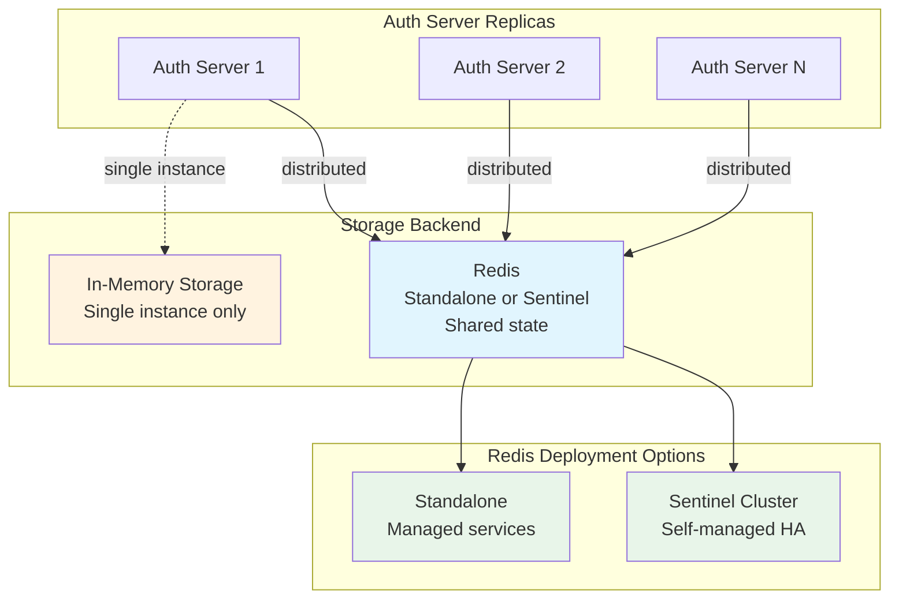

# Auth Server Storage Architecture

The embedded authorization server uses a pluggable storage backend to persist OAuth 2.0 state. This document describes the storage architecture, the available backends, and the Redis Sentinel implementation.

## Overview

The auth server stores OAuth 2.0 protocol state including access tokens, refresh tokens, authorization codes, PKCE challenges, client registrations, user accounts, and upstream IDP tokens. Two storage backends are available:

1. **Memory** (default): In-process storage with mutex-based concurrency. Suitable for single-instance deployments.
2. **Redis**: Shared storage backed by Redis. Supports standalone mode (single endpoint, suitable for managed services like GCP Memorystore and AWS ElastiCache) and Sentinel mode (high-availability with automatic failover). Required for horizontal scaling across multiple auth server replicas.


```mermaid
graph TB
    subgraph "Auth Server Replicas"
        AS1[Auth Server 1]
        AS2[Auth Server 2]
        AS3[Auth Server N]
    end

    subgraph "Storage Backend"
        direction TB
        Memory[In-Memory Storage<br/>Single instance only]
        Redis[Redis<br/>Standalone or Sentinel<br/>Shared state]
    end

    AS1 -.->|single instance| Memory
    AS1 -->|distributed| Redis
    AS2 -->|distributed| Redis
    AS3 -->|distributed| Redis

    subgraph "Redis Deployment Options"
        Standalone[Standalone<br/>Managed services]
        Sentinel[Sentinel Cluster<br/>Self-managed HA]
    end

    Redis --> Standalone
    Redis --> Sentinel

    style Memory fill:#fff3e0
    style Redis fill:#e1f5fe
    style Standalone fill:#e8f5e9
    style Sentinel fill:#e8f5e9
```

## Storage Interface

The storage layer implements multiple interfaces from the [fosite](https://github.com/ory/fosite) OAuth 2.0 framework, plus ToolHive-specific extensions:

**Fosite interfaces:**
- `oauth2.AuthorizeCodeStorage` — Authorization code grant
- `oauth2.AccessTokenStorage` — Access token persistence
- `oauth2.RefreshTokenStorage` — Refresh token with rotation
- `oauth2.TokenRevocationStorage` — Token revocation (RFC 7009)
- `pkce.PKCERequestStorage` — PKCE challenge/verifier (RFC 7636)

**ToolHive extensions:**
- `ClientRegistry` — Dynamic client registration (RFC 7591)
- `UpstreamTokenStorage` — Upstream IDP token caching with user binding
- `PendingAuthorizationStorage` — In-flight authorization tracking
- `UserStorage` — Internal user accounts and provider identity linking

**Implementation:**
- Interface definitions: `pkg/authserver/storage/types.go`
- Memory backend: `pkg/authserver/storage/memory.go`
- Redis backend: `pkg/authserver/storage/redis.go`

## Identity resolution for pure OAuth2 providers

For pure OAuth 2.0 upstream providers (`OAuth2Config`), OIDC is unavailable and there is no ID token. `BaseOAuth2Provider.ExchangeCodeForIdentity` resolves user identity through a three-way priority chain. Each path has distinct implications for `UserStorage`, `UpstreamTokenStorage`, and the Redis secondary index.

### IdentityFromToken (priority 1)

An operator opt-in path that extracts identity claims directly from the token endpoint response body, skipping the userinfo HTTP call entirely.

**When the path triggers.** `IdentityFromToken` is configured on the upstream provider (`p.config.IdentityFromToken != nil`). The `tokenResponseRewriter` intercepts the token endpoint response and runs extraction against the raw pre-rewrite body; the result is available to `ExchangeCodeForIdentity` without an additional round-trip.

**Subject format.** Real, stable subject string extracted from the token response body via a gjson dot-notation path (e.g. `username`, `authed_user.id`). For token responses that embed a JWT, the `@upstreamjwt` modifier decodes the payload for further drilling (e.g. `access_token|@upstreamjwt|sub`). The `@upstreamjwt` modifier performs no signature verification — it is intended only for JWTs received directly from the upstream token endpoint over a TLS-authenticated channel. The returned `*Identity` carries `Synthetic = false`. Path semantics and trust-model notes are documented on the runtime config struct `IdentityFromTokenConfig` in `pkg/authserver/upstream/identity_from_token.go`. The corresponding CRD type (`cmd/thv-operator/api/v1beta1.IdentityFromTokenConfig`) is defined in a sibling PR; operator-to-runner translation of this config lands separately.

**`UserResolver` interaction.** Because `Identity.Synthetic` is false, `callback.go` takes the normal path: `UserResolver.ResolveUser` runs, a row is created (or looked up) in `UserStorage`, a provider-identities entry is written, and `UpdateLastAuthenticated` is called. `UpstreamTokens.UserID` carries the resolved internal user UUID, not the raw operator-supplied subject string.

**Reverse-index implication (Redis backend).** Stable user IDs mean `KeyTypeUserUpstream` works as designed — one set per user accumulates session IDs across re-authentications. No set churn.

**Operator visibility.** The `IdentitySynthesized` condition does not fire for upstreams using `IdentityFromToken`. However, `SyntheticIdentityUpstreams()` (the controller-side predicate that drives the condition) currently checks only for `userInfo == nil` and does not yet inspect `IdentityFromToken`. Until the CRD type and controller logic land in a follow-up, an upstream with `IdentityFromToken` configured but no `userInfo` will still trigger `IdentitySynthesizedActive` — even though synthesis is not reached at runtime.

**Implementation.**
- `pkg/authserver/upstream/oauth2.go` — `ExchangeCodeForIdentity` priority 1 branch
- `pkg/authserver/upstream/identity_from_token.go` — `IdentityFromTokenConfig`, `extractIdentityFromTokenResponse`, `@upstreamjwt` modifier
- `pkg/authserver/upstream/token_exchange.go` — `tokenResponseRewriter.RoundTrip` extracts identity from the raw pre-rewrite body

### UserInfo endpoint (priority 2)

Existing behavior. When `IdentityFromToken` is unconfigured and `userInfo` is set, `fetchUserInfo` is called with the upstream access token. Subject, name, and email come from the userinfo response. `UserResolver.ResolveUser` runs normally, `Identity.Synthetic` is false.

### Synthesis-mode subjects (priority 3)

Reached when both `IdentityFromToken` is unconfigured AND `userInfo` is absent. The embedded auth server synthesizes a non-PII subject by hashing the upstream access token. The mode changes what `UserStorage` and `UpstreamTokenStorage` see and is observable to operators inspecting stored state.

**When the path triggers.** Pure OAuth 2.0 upstream provider (`OAuth2Config`) where both `IdentityFromToken` and `userInfo` are unconfigured. Reached at `BaseOAuth2Provider.ExchangeCodeForIdentity` as the final fallback. OIDC providers and OAuth2 providers with either `IdentityFromToken` or `userInfo` configured are not affected.

**Subject format.** `tk-` followed by 32 lowercase hex characters (the first 16 bytes of `SHA-256(accessToken)`), e.g. `tk-89abcdef0123456789abcdef01234567`. The output is opaque: assuming the upstream issues opaque (non-JWT) bearer tokens, the digest reveals nothing about the input that an attacker holding a candidate token could not already confirm by re-hashing. The returned `*Identity` carries `Synthetic = true`; the `upstream.IsSynthesizedSubject(string)` predicate lets bare-string consumers recognize the prefix.

**`UserResolver` bypass.** The bypass is gated on `Identity.Synthetic` in `callback.go` — synthesis is the only path that sets this field. Synthetic identities skip `UserResolver.ResolveUser` entirely — no row is created in `UserStorage`, no entry is written to provider-identities, and `UpdateLastAuthenticated` is not called. The synthesized subject rotates per access token, so persisting it would create a fresh `users` row on every re-authentication. `UpstreamTokens.UserID` therefore carries the `tk-…` value directly rather than a stable internal UUID.

**Reverse-index implication (Redis backend).** The `KeyTypeUserUpstream` secondary-index set under `thv:auth:{ns:name}:user:upstream:{userID}` is designed around stable user IDs — one set per user, holding all of that user's session IDs. Under synthesis the userID rotates with every re-authentication, so each session lands in its own one-element set. Reads continue to work, but set churn is much higher than under OIDC. The existing TODO at `pkg/authserver/storage/redis.go:43-45` to scan and clean up stale secondary-index entries applies, and synthesis-mode workloads make a periodic scan more important.

**Operator visibility.** When at least one configured OAuth2 upstream has `userInfo == nil`, the controller surfaces the `IdentitySynthesized` condition on the `MCPExternalAuthConfig` and `VirtualMCPServer` status (Reason `IdentitySynthesizedActive`, naming the affected upstreams). The condition flips to `False` (Reason `IdentitySynthesizedInactive`) once every upstream has `userInfo` configured. Note: the controller predicate (`SyntheticIdentityUpstreams`) checks only for `userInfo == nil` and does not yet account for `IdentityFromToken`; see the known gap noted under priority 1.

**Implementation.**
- `pkg/authserver/upstream/oauth2.go` — `synthesizeIdentity`, `synthesizeSubjectFromAccessToken`, `IsSynthesizedSubject`
- `pkg/authserver/upstream/types.go` — `Identity.Synthetic`
- `pkg/authserver/server/handlers/callback.go` — `UserResolver` bypass on `Identity.Synthetic`
- `cmd/thv-operator/controllers/mcpexternalauthconfig_controller.go` and `cmd/thv-operator/controllers/virtualmcpserver_controller.go` — `IdentitySynthesized` advisory condition

## Memory Backend

The in-memory backend uses Go maps protected by `sync.RWMutex` for thread safety. A background goroutine runs periodic cleanup of expired entries.

**Characteristics:**
- Zero external dependencies
- State is lost on restart
- Cannot be shared across replicas
- Suitable for development and single-instance deployments

**Implementation:** `pkg/authserver/storage/memory.go`

## Redis Backend

The Redis backend stores all OAuth 2.0 state as JSON-serialized values in Redis.

### Connection Architecture

Two connection modes are supported:

- **Standalone** (`redis.NewClient()`): A single endpoint for managed Redis services. The caller is responsible for endpoint availability (the managed service handles HA internally).
- **Sentinel** (`redis.NewFailoverClient()`): Connects via Sentinel for self-managed high-availability deployments. Sentinel handles master discovery, automatic failover, and configuration updates.

### Multi-Tenancy

Each auth server instance has a unique key prefix derived from its Kubernetes namespace and name:

```
thv:auth:{namespace:name}:
```

The `{namespace:name}` portion is a Redis hash tag. In standalone and Sentinel modes, hash tags have no functional effect but impose no overhead. The format ensures keys remain co-located in the same hash slot if the deployment were ever migrated to Redis Cluster.

**Implementation:** `pkg/authserver/storage/redis_keys.go`

### Key Design

Keys follow the pattern `{prefix}{type}:{id}`:

```
thv:auth:{default:my-server}:access:abc123
thv:auth:{default:my-server}:refresh:def456
thv:auth:{default:my-server}:user:user-uuid
```

Secondary indexes use Redis Sets to enable reverse lookups:

```
thv:auth:{default:my-server}:reqid:access:{request-id}  → {sig1, sig2}
thv:auth:{default:my-server}:user:upstream:{user-id}     → {session1, session2}
```

### Consistency Model

The implementation uses different strategies based on consistency requirements:

- **Lua scripts** for strict atomicity: upstream token storage with user reverse-index cleanup, last-used timestamp updates
- **Pipelines** (`MULTI`/`EXEC`) for batched operations: authorization code invalidation, token session creation with secondary index updates
- **Individual commands** with best-effort cleanup: token revocation, refresh token rotation — partial failures are safe since orphaned keys expire via TTL

### Serialization

All values are stored as JSON. The implementation uses defensive copies on read and write to prevent caller mutations from affecting stored data.

### TTL Management

Redis TTL is used for all time-bounded data. TTL values are derived from OAuth 2.0 token lifetimes:

| Data Type | Default TTL |
|---|---|
| Access tokens | 1 hour |
| Refresh tokens | 30 days |
| Authorization codes | 10 minutes |
| PKCE requests | 10 minutes |
| Invalidated codes | 30 minutes |
| Public clients (DCR) | 30 days |
| Users / Providers | No expiry |

## Configuration

### CRD Configuration

In Kubernetes, storage is configured via the `MCPExternalAuthConfig` CRD:

```
MCPExternalAuthConfig
  └── spec.embeddedAuthServer.storage
        ├── type: "memory" | "redis"
        └── redis
              ├── addr (standalone)  ─── mutually exclusive ───  sentinelConfig
              │                                                         ├── masterName
              │                                                         ├── sentinelAddrs[] (or sentinelService)
              │                                                         └── db
              ├── aclUserConfig
              │     ├── usernameSecretRef  (optional; omit for password-only AUTH)
              │     └── passwordSecretRef
              ├── tls (optional)
              │     ├── caCertSecretRef
              │     └── insecureSkipVerify
              └── timeouts (dial, read, write)
```

**Implementation:** `cmd/thv-operator/api/v1beta1/mcpexternalauthconfig_types.go`

### RunConfig Serialization

When passing configuration across process boundaries (operator → proxy-runner), the CRD configuration is converted to `RunConfig` format where Secret references become environment variable references.

**Implementation:** `pkg/authserver/storage/config.go`

## Security Considerations

- **ACL or legacy authentication**: Redis ACL users (Redis 6+) provide fine-grained access control. When a username is omitted, go-redis sends legacy password-only `AUTH`, which is required for managed Redis tiers that do not expose an ACL subsystem (e.g. GCP Memorystore Basic/Standard HA, Azure Cache for Redis).
- **Key prefix isolation**: Each auth server is restricted to its own key prefix via Redis ACL rules (`~thv:auth:*`).
- **Credential handling**: In Kubernetes, credentials are stored in Secrets and injected as environment variables. They are never written to disk or logged.
- **TLS support**: TLS is supported for both master and Sentinel connections via `tls` and `sentinelTLS` in the CRD. For managed services with private CAs (e.g. GCP Memorystore), provide the CA certificate via `caCertSecretRef`.

## Related Documentation

- [Redis Storage Configuration Guide](../redis-storage.md) — User-facing setup guide
- [Operator Architecture](09-operator-architecture.md) — CRD and controller design
- [Core Concepts](02-core-concepts.md) — Platform terminology
