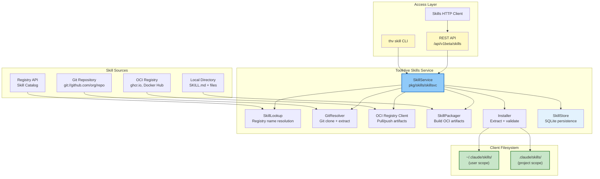
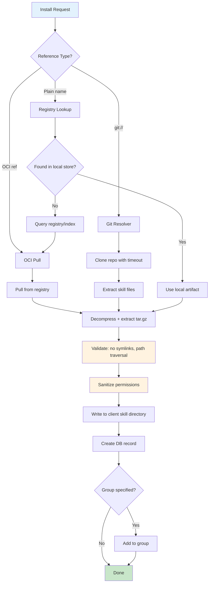

# Skills System

The skills system lets ToolHive discover, build, distribute, install, and manage **Agent Skills** for AI coding assistants like Claude Code. Skills are not MCP servers -- they are markdown-based instructions (SKILL.md files) that extend an AI assistant's capabilities, packaged and distributed as OCI artifacts through the same registry infrastructure that serves MCP servers.

## Why This Exists

MCP servers provide tools and resources that AI assistants can call. Skills fill a different gap: they provide **instructions and knowledge** that shape how an AI assistant approaches tasks. A skill might teach Claude Code how to review PRs in your organization's style, how to run your test suite, or how to follow your team's coding conventions.

Without ToolHive's skill system, teams would need to manually copy SKILL.md files between machines, track versions by hand, and have no central catalog for discovery. ToolHive brings the same managed lifecycle to skills that it already provides for MCP servers: a registry for discovery, OCI for distribution, scoped installation, and multi-client support.

**Key design decision:** Skills and MCP servers are separate systems that share infrastructure (registry, groups, OCI distribution) but have distinct purposes, formats, and lifecycles.

| Aspect | Skills | MCP Servers |
|--------|--------|-------------|
| **Purpose** | Agent instructions and knowledge | Remote tools and resources |
| **Protocol** | Agent Skills spec (SKILL.md) | Model Context Protocol (JSON-RPC) |
| **Format** | Markdown with YAML frontmatter | Container images or remote endpoints |
| **Runtime** | Read by AI client at prompt time | Executed as running processes |
| **Distribution** | OCI artifacts (tar.gz layers) | Container images |

## Architecture



## Core Concepts

### SKILL.md Format

A skill is defined by a `SKILL.md` file with YAML frontmatter and a markdown body:

```markdown
---
name: code-review
description: Reviews code for best practices and security patterns
version: 1.0.0
allowed-tools: Read Glob Grep
toolhive.requires: ghcr.io/org/base-skill:v1
license: Apache-2.0
compatibility: claude-code >= 1.0
metadata:
  author: team-name
---

# Code Review Skill

Instructions for how the AI assistant should perform code reviews...
```

**Frontmatter fields:**

| Field | Required | Description |
|-------|----------|-------------|
| `name` | Yes | 2-64 chars; lowercase alphanumeric and hyphens; must start and end with alphanumeric; no consecutive hyphens |
| `description` | Yes | Human-readable description (max 1024 chars) |
| `version` | No | Semantic version |
| `allowed-tools` | No | Space or comma-delimited tool names |
| `toolhive.requires` | No | OCI references for skill dependencies |
| `license` | No | SPDX license identifier |
| `compatibility` | No | Client compatibility string (max 500 chars) |
| `metadata` | No | Arbitrary string-keyed, string-valued metadata |

**Implementation:** `pkg/skills/types.go` (SkillFrontmatter), `pkg/skills/parser.go`, `pkg/skills/validator.go`

### Installation Scopes

Skills install to one of two scopes:

**User scope** (`~/.claude/skills/<skill-name>/SKILL.md`):
- Available across all projects for the current user
- Default scope when no `--scope` flag is provided
- Useful for general-purpose skills (code review, testing, etc.)

**Project scope** (`<project-root>/.claude/skills/<skill-name>/SKILL.md`):
- Available only within a specific project
- Requires `--project-root` or auto-detected git root
- Useful for project-specific conventions and workflows

**Implementation:** `pkg/skills/types.go` (Scope, PathResolver)

### Multi-Client Support

Skills can be installed for multiple AI clients simultaneously. Each client has its own skill directory structure, so installing a skill for `claude-code` places files differently than for `cursor`.

```bash
# Install for all skill-supporting clients (default)
thv skill install code-review

# Install for specific clients
thv skill install code-review --clients claude-code
```

The `PathResolver` interface maps (client, skill-name, scope, project-root) to the correct filesystem path for each client.

**Implementation:** `pkg/skills/types.go` (PathResolver), `pkg/client/`

## Skill Lifecycle

### 1. Discovery

Skills are discovered through the registry system:

- **Registry API**: The `SkillsClient` queries the ToolHive Registry API at `/v0.1/x/dev.toolhive/skills` with pagination and search support.
- **Browsing API**: The `GET /registry/{name}/v0.1/x/dev.toolhive/skills` endpoint on the local API server exposes skills from the configured registry provider.
- **Local catalog**: The embedded registry includes curated skills.

**Implementation:** `pkg/registry/api/skills_client.go` (SkillsClient), `pkg/api/v1/registry_v01_skills.go`

### 2. Building

Build a local skill directory into an OCI artifact:

```bash
thv skill build ./my-skill/         # Build with auto-detected tag
thv skill build ./my-skill/ --tag v1.0.0
```

**Build process:**
1. Load and parse `SKILL.md` from the directory
2. Validate the skill definition (name, frontmatter, filesystem safety)
3. Package all files into a tar.gz OCI layer
4. Store in the local OCI store with the specified tag

**Implementation:** `pkg/skills/skillsvc/build.go` (Build), `toolhive-core/oci/skills` (SkillPackager)

### 3. Publishing

Push a locally-built artifact to a remote OCI registry:

```bash
thv skill push ghcr.io/org/my-skill:v1.0.0
```

**Implementation:** `pkg/skills/skillsvc/build.go` (Push), `toolhive-core/oci/skills` (RegistryClient)

### 4. Installation

```bash
thv skill install code-review                          # By name (registry lookup)
thv skill install ghcr.io/org/skill:v1.0.0             # By OCI reference
thv skill install git://github.com/org/repo@v1#skills/my-skill  # From git
```

**Installation flow:**



**Key details:**

1. **Reference parsing**: The service determines the source type from the reference format:
   - Starts with `git://` -> git resolver
   - Contains `/`, `:`, or `@` -> OCI reference
   - Otherwise -> plain name (registry lookup)

2. **Per-skill locking**: A mutex map keyed by (scope, name, projectRoot) prevents concurrent installs of the same skill.

3. **Supply chain validation**: For OCI installs, the skill name in the artifact must match the repository name in the reference.

4. **Client targeting**: When no `--clients` flag is provided, all skill-supporting clients detected on the host are targeted by default. Specify `--clients claude-code` to target a particular client.

**Implementation:** `pkg/skills/skillsvc/install.go` (Install)

### 5. Uninstallation

```bash
thv skill uninstall code-review
```

Removes the skill files from the filesystem, deletes the database record, and removes the skill from all groups.

**Implementation:** `pkg/skills/skillsvc/uninstall.go` (Uninstall), `pkg/groups/skills.go` (RemoveSkillFromAllGroups)

## Git-Based Skill Resolution

Skills can be installed directly from git repositories using the `git://` scheme:

```
git://github.com/org/repo                    # Repo root, default branch
git://github.com/org/repo@v1.0.0             # Specific tag
git://github.com/org/repo#skills/my-skill    # Subdirectory
git://github.com/org/repo@main#skills/my-skill  # Branch + subdirectory
```

**Resolution process:**
1. Parse the git reference (host, repo, ref, path)
2. Resolve authentication (`GITHUB_TOKEN` for github.com, `GITLAB_TOKEN` for gitlab.com — both host-scoped to prevent credential exfiltration; `GIT_TOKEN` as an unscoped fallback sent to any host)
3. Clone the repository (2-minute timeout; shallow clone when a branch or tag is specified)
4. Extract the skill directory files
5. Validate and install as normal

**Security:** The resolver validates hosts against SSRF (no localhost, no private IPs unless in dev mode), validates refs against shell injection, and rejects path traversal.

**Implementation:** `pkg/skills/gitresolver/`

## Storage

Skill installation records are persisted in SQLite across four tables. The `entries` table is a shared parent for all entry types (skills share it with future entry kinds); `installed_skills` holds skill-specific columns and references `entries` via a foreign key; `oci_tags` is reserved for caching OCI reference-to-digest mappings but is not currently populated:

```
entries table
├── id             (INTEGER PRIMARY KEY)
├── entry_type     (TEXT, e.g. "skill")
├── name           (TEXT, skill name)
├── created_at     (TEXT, ISO 8601)
├── updated_at     (TEXT, ISO 8601)
└── UNIQUE(entry_type, name)

installed_skills table
├── id             (INTEGER PRIMARY KEY)
├── entry_id       (FK → entries.id, CASCADE delete)
├── scope          (user | project)
├── project_root   (path, empty for user scope)
├── reference      (OCI ref or git URL)
├── tag            (OCI tag)
├── digest         (OCI digest for upgrade detection)
├── version        (semantic version)
├── description    (TEXT)
├── author         (TEXT)
├── tags           (BLOB, JSONB-encoded []string)
├── client_apps    (BLOB, JSONB-encoded []string)
├── status         (installed | pending | failed)
├── installed_at   (TEXT, ISO 8601)
├── managed        (INTEGER, 0/1 — tracked in the project's toolhive.lock.yaml; see below)
└── UNIQUE(entry_id, scope, project_root)

skill_dependencies table
├── installed_skill_id  (FK → installed_skills.id, CASCADE delete)
├── dep_name            (TEXT)
├── dep_reference       (OCI ref)
├── dep_digest          (TEXT)
└── PRIMARY KEY(installed_skill_id, dep_reference)

oci_tags table (reserved; not currently populated)
├── reference  (TEXT, PRIMARY KEY — OCI reference string)
└── digest     (TEXT NOT NULL — content digest)
```

**Implementation:** `pkg/storage/sqlite/skill_store.go`, `pkg/storage/interfaces.go` (SkillStore), `pkg/storage/sqlite/migrations/001_create_entries_and_skills.sql`, `003_add_managed_flag.sql`

## Project Lock File

RFC [THV-0080](https://github.com/stacklok/toolhive-rfcs/blob/main/rfcs/THV-0080-skills-lock-file.md) adds a project-level `toolhive.lock.yaml`, committed at the project root, that pins the exact content of every project-scoped skill install — the same guarantee `package-lock.json`, `Cargo.lock`, and `go.sum` provide elsewhere. Two teammates (or a CI runner) cloning the same repo restore identical skill content via `thv skill sync`, rather than whatever the source currently resolves to.

### Rollout

The feature is gated behind the `TOOLHIVE_SKILLS_LOCK_ENABLED` environment variable (`skills.LockFileFeatureEnabled()`) while it lands across a stack of PRs, following the existing `TOOLHIVE_DEV` precedent for staged rollouts (`pkg/skills/gitresolver/reference.go`). With the flag unset, project-scope installs behave exactly as they did before this RFC — no lock file is written, no `toolhive.requires` materialization happens, `sync`/`upgrade` refuse with a clear "experimental" error.

### Schema

```yaml
version: 1
skills:
  - name: code-review
    version: "1.0.0"
    source: code-review                          # exactly what the user/registry resolver requested; never rewritten
    resolvedReference: ghcr.io/org/code-review:1.0.0
    digest: sha256:9f2b1e...                      # the pin: OCI manifest digest or git commit hash
    contentDigest: sha256:a1b2c3d4...              # deterministic dirhash of the materialized files, for on-disk integrity
    requiredBy: [parent-skill]                    # present only for transitively materialized toolhive.requires deps
    explicit: true                                 # false for a dependency that was never directly installed by name
```

Entries are sorted by name for stable diffs. `source` is never rewritten by `sync` or `upgrade` — only `upgrade` re-resolves it, and only to decide whether newer content exists.

**Implementation:** `pkg/skills/lockfile/` (schema, load/save, atomic writes via `os.Root`, `contentDigest` dirhash algorithm)

### Install and Uninstall Hooks

For project-scope installs (with the feature enabled), `skillsvc.Install`'s single existing choke point (`installAndRegister` — every dispatch path, OCI or git, direct or registry-resolved, converges there) additionally:

1. Computes `contentDigest` from the extracted files.
2. Materializes `toolhive.requires` dependencies recursively — reading `SKILL.md` back from disk (not from the resolver's own parse, so this works uniformly across OCI and git sources), with a `Visited` set guarding cycles and `skills.MaxDependencies` bounding the whole tree.
3. Upserts the lock entry, merging `requiredBy` when a dependency is shared by multiple parents.

**A lock-write failure fails the entire install** (rolling back the DB record, matching the existing group-registration failure/rollback pattern) — RFC THV-0080 treats "installed but unpinned" as worse than "not installed."

`Uninstall` mirrors this: for a lock-managed skill, it removes the skill's own lock entry and cascades to any dependency that consequently loses its last requiring parent (and is not itself `explicit`), via `Lockfile.RemoveParentFromRequiredBy` — itself cycle-safe.

**Implementation:** `pkg/skills/skillsvc/lock.go`, `pkg/skills/skillsvc/install.go`, `pkg/skills/skillsvc/uninstall.go`

### Sync

`thv skill sync` reconciles installed skills against the lock file:

| Lock file vs. installed state | Outcome |
|---|---|
| Digest and contentDigest both match | Reported as up to date |
| DB record exists but digest or contentDigest differs | Drifted — reinstalled at the pinned reference (`--check`: reported only, nothing written) |
| No DB record for a locked entry | Missing — installed fresh at the pinned reference |
| Installed, `managed`, but no lock entry | Removed from lock — reported (`--prune`: uninstalled) |
| Installed, not `managed`, no lock entry | Never managed — reported (`--adopt`: lock entry written from current state) |

Reinstalling *at the pinned reference* (never re-resolving `source`) uses `buildPinnedReference` (`pkg/skills/skillsvc/pin.go`) to rewrite the entry's `resolvedReference` with its pinned digest substituted in (an OCI digest reference, or a git reference with the commit hash spliced in as the ref). A subtlety this surfaced: reinstalling at an *unchanged* digest — the normal case when repairing on-disk drift — would otherwise hit the install path's "same digest means content is already correct" fast path and silently skip re-extraction. An internal `InstallOptions.SyncRestore` flag bypasses that fast path specifically for this case.

**Implementation:** `pkg/skills/skillsvc/sync.go`, `pkg/skills/skillsvc/pin.go`

### Upgrade

`thv skill upgrade [name...]` re-resolves each targeted entry's `source` (via the same git/OCI/registry dispatch order `Install` uses, stopping short of extraction — `resolveLatestState`) and installs newer content when the resolved digest changed. Entries pinned to an immutable reference (an OCI digest, or a git reference already pinned to a full commit hash — `isImmutableSource`) are reported not-upgradable. `--preview` reports what would change without persisting it (an OCI preview still pulls the artifact into the local store — there's no lighter "digest only" primitive — so it is not fully side-effect-free, matching the RFC's own caveat). `--allow-ref-change` permits the resolved reference itself changing; `--fail-on-changes` gives CI a freshness gate.

**Implementation:** `pkg/skills/skillsvc/upgrade.go`

### CLI Confirmation and Exit Codes

Because skill content is a set of AI-followed instructions, `sync` and `upgrade` gate real installs behind a confirmation prompt (skipped by `--check`/`--preview`, which never install anything). On a non-interactive terminal without `--yes`, the command refuses outright rather than silently proceeding.

Exit codes follow a CI-oriented contract distinct from the generic `1` used elsewhere in the CLI:

| Code | Meaning |
|---|---|
| `0` | Success |
| `1` | Generic/unclassified error (cobra's default) |
| `2` | Check/freshness failure — `sync --check` found drift, or `upgrade --fail-on-changes` found available changes |
| `3` | Partial failure — some, but not all, targeted skills failed |
| `4` | Policy rejection — the confirmation gate declined a non-interactive run, or `--allow-ref-change` blocked a reference change |

**Implementation:** `cmd/thv/app/exitcode.go`, `cmd/thv/app/skill_confirm.go`, `cmd/thv/app/skill_sync.go`, `cmd/thv/app/skill_upgrade.go`

## API

### REST Endpoints

**Skill management** (mounted at `/api/v1beta/skills`):

| Method | Path | Description |
|--------|------|-------------|
| `GET` | `/` | List installed skills (filter by scope, client, project_root, group) |
| `POST` | `/` | Install a skill |
| `GET` | `/{name}` | Get skill info |
| `DELETE` | `/{name}` | Uninstall a skill |
| `POST` | `/validate` | Validate a SKILL.md |
| `POST` | `/build` | Build skill to OCI artifact |
| `POST` | `/push` | Push built skill to registry |
| `GET` | `/builds` | List local builds |
| `DELETE` | `/builds/{tag}` | Delete a local build |
| `GET` | `/content` | Get a skill's SKILL.md body and file listing for a reference |
| `POST` | `/sync` | Restore project skills to match the lock file ([Project Lock File](#project-lock-file), RFC THV-0080) |
| `POST` | `/upgrade` | Re-resolve project skills and install newer pinned content ([Project Lock File](#project-lock-file), RFC THV-0080) |

`/sync` and `/upgrade` are served only when the configured `SkillService` also implements `skills.SkillLockService` (as `skillsvc.New`'s does) — otherwise they return `501 Not Implemented`.

**Implementation:** `pkg/api/v1/skills.go`

**Skill browsing** (mounted at `/registry/{name}/v0.1/x/dev.toolhive/skills`):

| Method | Path | Description |
|--------|------|-------------|
| `GET` | `/` | List available skills from registry (search, pagination) |
| `GET` | `/{namespace}/{skillName}` | Get a specific skill from registry |

**Implementation:** `pkg/api/v1/registry_v01_skills.go`

### CLI Commands

```
thv skill
├── install [name]       Install a skill from registry, OCI, or git
├── uninstall [name]     Remove an installed skill
├── list                 List installed skills (text or JSON output)
├── info [name]          Show detailed skill information
├── validate [path]      Validate a SKILL.md file
├── build [path]         Build skill to OCI artifact
├── push [reference]     Push built skill to registry
├── builds               List locally-built OCI artifacts
├── builds remove [tag]  Delete a locally-built artifact
├── sync                 Restore project skills to match the lock file
└── upgrade [name...]    Re-resolve project skills and install newer pinned content
```

**Implementation:** `cmd/thv/app/skill*.go`

### HTTP Client

The `pkg/skills/client/` package provides an HTTP client that implements the `SkillService` interface, allowing remote skill management through the REST API. It auto-discovers the API server via `TOOLHIVE_API_URL` or a local discovery file.

## Group Integration

Skills can be organized into groups alongside MCP servers:

```bash
thv skill install code-review --group dev-tools
thv skill list --group dev-tools
```

- `AddSkillToGroup()` adds a skill name to a group's Skills slice (deduplicated)
- `RemoveSkillFromAllGroups()` cleans up group references on uninstall

Groups provide a shared organizational model for both skills and workloads.

**Implementation:** `pkg/groups/skills.go`

## Security Model

The skills system applies defense-in-depth across multiple layers:

### Archive Extraction Safety
- **Size limits**: 500MB total decompressed, 100MB per file, 1000 files max
- **Symlink rejection**: Archives containing symlinks or hardlinks are rejected
- **Path traversal prevention**: No `..` components, no absolute paths in archives
- **Permission sanitization**: Strips setuid/setgid/sticky bits, caps at 0644
- **Pre-extraction validation**: Walks parent path components checking for symlinks before writing
- **Post-extraction verification**: Scans the extracted directory for filesystem anomalies

### Dangerous Path Protection
- Refuses to remove filesystem roots, home directories, or shallow paths (< 4 components)
- Uses `Lstat` (not `Stat`) to detect symlinks without following them
- Resolves symlinks in parent components before applying depth checks

### Supply Chain
- OCI artifact skill name must match the last path component of the OCI repository
- Git authentication is host-scoped (GitHub token only sent to github.com)
- SSRF prevention: rejects localhost and private IPs in git references

### Input Validation
- Skill names: 2-64 chars, lowercase alphanumeric + hyphens, no consecutive hyphens
- Frontmatter size limit: 64KB
- Dependency limit: 100 per skill
- Git refs validated against shell injection characters

**Implementation:** `pkg/skills/installer.go`, `pkg/skills/validator.go`, `pkg/skills/gitresolver/reference.go`, `pkg/skills/gitresolver/auth.go`

## Dependency on toolhive-core

The skills system depends on `github.com/stacklok/toolhive-core` for shared primitives:

| Package | Purpose |
|---------|---------|
| `oci/skills.Store` | Local OCI artifact storage |
| `oci/skills.SkillPackager` | Building OCI artifacts from skill files |
| `oci/skills.RegistryClient` | Push/pull artifacts to/from OCI registries |
| `oci/skills.DecompressWithLimit` | Safe gzip decompression with size bounds |
| `oci/skills.ExtractTarWithLimit` | Safe tar extraction rejecting symlinks/traversal |
| `registry/types.Skill` | Canonical skill type for registry discovery |

ToolHive owns the installation lifecycle, scoping model, CLI/API interfaces, and group integration. toolhive-core owns the OCI artifact format, registry protocol types, and low-level extraction utilities.

## Key Files

| Responsibility | Files |
|---|---|
| Type definitions | `pkg/skills/types.go` |
| Service interface | `pkg/skills/service.go` |
| Service implementation | `pkg/skills/skillsvc/` |
| Options / DTOs | `pkg/skills/options.go` |
| Validation | `pkg/skills/validator.go` |
| Parsing | `pkg/skills/parser.go` |
| Extraction | `pkg/skills/installer.go` |
| Git resolution | `pkg/skills/gitresolver/` |
| Storage interface | `pkg/storage/interfaces.go` |
| SQLite backend | `pkg/storage/sqlite/skill_store.go` |
| REST API | `pkg/api/v1/skills.go` |
| Registry browsing API | `pkg/api/v1/registry_v01_skills.go` |
| HTTP client | `pkg/skills/client/` |
| CLI commands | `cmd/thv/app/skill*.go` |
| Group integration | `pkg/groups/skills.go` |
| Lock file schema | `pkg/skills/lockfile/` |
| Lock file rollout gate | `pkg/skills/feature_gate.go` |
| Install/uninstall lock hooks | `pkg/skills/skillsvc/lock.go` |
| Sync | `pkg/skills/skillsvc/sync.go`, `pkg/skills/skillsvc/pin.go` |
| Upgrade | `pkg/skills/skillsvc/upgrade.go` |
| CLI exit codes / confirmation | `cmd/thv/app/exitcode.go`, `cmd/thv/app/skill_confirm.go` |

## Related Documentation

- [Core Concepts](02-core-concepts.md) - Platform nouns and verbs
- [Registry System](06-registry-system.md) - Registry architecture shared by skills and servers
- [Groups](07-groups.md) - Group concept used to organize skills and workloads
- [Architecture Overview](00-overview.md) - Platform overview
- [Plugins System](14-plugins-system.md) - Sibling distribution system (OCI artifacts, multi-client install)
