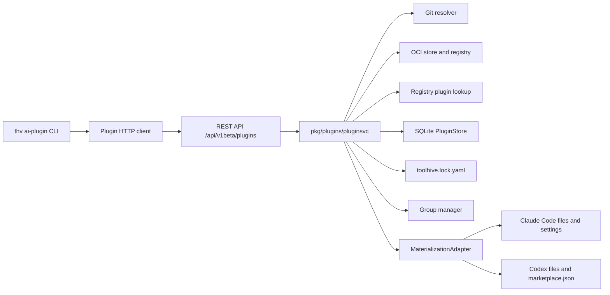

# Plugins System

## Why This Exists

An **AI-tool plugin** is a multi-component bundle described by
`.claude-plugin/plugin.json`. It may contain commands, agents, skills, hooks,
MCP server declarations, and LSP server declarations. A plugin is installed as
one versioned unit; a [skill](12-skills-system.md) is one `SKILL.md`-based
instruction component with its own lifecycle. Neither is a ToolHive plugin or
an MCP server workload.

ToolHive discovers, packages, distributes, verifies, records, and materializes
AI-tool plugins for supported clients. The plugin source tree is distributed as
an OCI artifact, or resolved directly from git. Client adapters place that tree
and the required marketplace metadata into each client's layout.

## Architecture



The CLI is an HTTP client even for local operation. `pkg/api/v1/plugins.go`
translates REST requests to `PluginService` and `PluginLockService` calls;
`pkg/plugins/pluginsvc` owns resolution, verification, locking, persistence,
rollback, and lifecycle behavior. `MaterializationAdapter` isolates the
client-specific filesystem and registration rules.

The API exposes install, uninstall, list, info, validate, build, push, local
build listing/removal, content inspection, sync, and upgrade. `/sync` and
`/upgrade` return `501 Not Implemented` only when an injected service does not
implement `PluginLockService`; the normal `pluginsvc.New` service does.

## Core Concepts

### Plugin Manifest

`.claude-plugin/plugin.json` supplies the plugin's name, version, description,
author, license, and keywords. Names are validated as kebab-case. Build and git
installation parse this manifest before packaging or materialization.

### Component Inventory

The OCI config records counts for `commands`, `agents`, `skills`, `hooks`,
`mcpServers`, and `lspServers`. Adapters expose a client capability list so
`info` can report plugin-declared components that the client does not load.

That capability report is not a file filter: adapters extract the complete
plugin tree, including component directories outside their capability list.
ToolHive does not start, configure, or lifecycle-manage plugin-declared MCP or
LSP servers as ToolHive workloads. Whether a client interprets any declared
component is client behavior.

### Installation Scopes

- **User scope** is the default and installs for the current user.
- **Project scope** requires a git project root, writes a `plugins:` entry to
  the project's `toolhive.lock.yaml`, and applies signature verification.

Installed records are keyed by plugin name, scope, and project root. An empty
client selection, or `all`, targets every detected plugin-supporting client;
explicit client names are validated against configured materializers.

### Multi-Client Materialization

| Client | Materialized layout | Registration and loading |
|---|---|---|
| Claude Code | `~/.claude/plugins/<name>/` or `<project>/.claude/plugins/<name>/` | ToolHive maintains the shared `.claude-plugin/marketplace.json` and the `enabledPlugins` and `extraKnownMarketplaces.toolhive` entries in the scope's `settings.json`. |
| Codex | `~/.agents/plugins/toolhive/<name>/` or `<project>/.agents/plugins/toolhive/<name>/` | ToolHive maintains the scope's `.agents/plugins/marketplace.json`. It does not edit `config.toml` or invoke Codex; the user must run `codex plugin install <name>@toolhive`. |

`Materialize`, `Dematerialize`, `EnsureRegistered`, and `Health` make adapter
changes reversible and check both the source tree and required registration.
Shared JSON files are updated under a file lock and written atomically.

## Plugin Lifecycle

### 1. Discovery

`thv ai-plugin install` resolves input in this order:

1. a `git://...` reference;
2. an OCI reference;
3. a validated plain or namespace-qualified name.

A name checks the local OCI store first, then searches the configured ToolHive
registry. Search results are post-filtered for an exact, case-insensitive name
(and namespace, when supplied), plus the requested version when present. One
exact match is required: zero matches return not found and multiple matches are
rejected as ambiguous. ToolHive does not install the first fuzzy search result.
The resolved catalog entry must contain a usable OCI package.

Git and OCI installs also require the manifest name to match the repository's
last path component (or the git subdirectory name). This prevents accidental
name clobbering; it is not proof of publisher identity.

### 2. Building

`thv ai-plugin validate <path>` validates a local plugin tree. `thv ai-plugin
build <path>` parses the manifest, packages the complete tree as one tar.gz OCI
layer, records the component inventory in the OCI config, and writes the
artifact to the local plugin OCI store. Local-build metadata distinguishes
builds from artifacts cached by pull or content inspection.

### 3. Publishing

`thv ai-plugin push <reference>` publishes a local build. Push is signed by
default, keylessly unless a key is given: an OIDC identity token can be supplied
with `--identity-token`, acquired from GitHub Actions OIDC, or acquired through
an interactive browser sign-in, and `--key` signs with a cosign private key
instead. `--no-sign` is the explicit unsigned alternative.

A signed push stages content at its immutable digest, attaches the signature,
and only then promotes the requested tag. A signing failure therefore does not
leave the requested tag resolving to unsigned content. Neither credential — the
identity token or the key-signing capability — is sent over non-loopback HTTP,
and credential-bearing requests do not follow redirects.

### 4. Installation

User-scoped operations acquire a per-plugin lock. Project-scoped install,
uninstall, sync, and upgrade share the skills project transaction keyed by the
canonical project root. Its in-process mutex and advisory state lock cover the
whole mutation, including resolution, materialization, persistence, group and
dependency changes, lock-file writes, and compensation. The advisory lock
retains the historical `skills-project-locks` state-directory name so plugin
mutations coordinate with older ToolHive processes that only know the skills
implementation.

After acquiring the applicable lock, installation verifies project-scoped
content, materializes each target client, persists the installed record,
updates group membership, and writes the project lock entry. Existing trees and
registration state are snapshotted when the client manager is available. A
later extraction, database, group, or lock-file failure restores prior files,
registration, storage, and group state; compensation errors are returned with
the original failure.

A same-digest install can add newly requested clients without replacing the
other clients. Upgrades and sync repairs force rematerialization when required
to keep the recorded content digest and trust material aligned with the files
on disk.

### 5. Uninstallation

User-scope and otherwise unmanaged installs are dematerialized from each client,
removed from groups, and deleted from storage. Lock-managed project uninstall
fails closed: it snapshots the lock and client trees, removes the lock entry,
and restores the pin and materialization if a later step fails. Both paths make
repeated removal safe and join partial-cleanup errors rather than hiding them.

### 6. Info

`thv ai-plugin info` combines manifest metadata, the installed record, group
membership, and project trust state. `UnmaterializedComponents` is the static
difference between the plugin inventory and each adapter's capability list; it
does not assert those files were omitted. `ProjectScopeDegradedClients` reports
scope degradation declared by adapters (neither current adapter degrades).

## Lock, Sync, and Upgrade

Project installs share `toolhive.lock.yaml` with skills but use the `plugins:`
key. Each entry pins the original source, resolved reference, artifact digest,
on-disk content digest, and trust decision. Target clients remain part of the
installed-plugin record. The schema and common
atomic lock-file mechanics are documented in [Project Lock File](12-skills-system.md#project-lock-file).

`thv ai-plugin sync` restores the pinned state without re-resolving the source:

- missing or drifted installs are reinstalled at the pinned digest;
- `--check` reports drift without writing;
- `--adopt` records eligible unmanaged project installs, and
  `--public-key <PUBLIC_KEY_PATH>` verifies and anchors a key-pair-signed OCI
  install during adoption;
- `--prune` removes managed installs absent from the lock file;
- real changes require confirmation, or `--yes` in non-interactive use.

Sync checks artifact and content digests, expected clients, adapter health, and
stored OCI signature material. Git signatures live on commits, so unchanged git
entries have no stored bundle to re-verify offline; the recorded identity is
rechecked when git content is resolved again.

`thv ai-plugin upgrade [name...]` re-resolves each mutable lock source and
installs changed content. Full git commit pins are not upgradable. An immutable
OCI digest has no content update, but its separately attached signatures can
still produce a trust-only update when you pass
`--allow-signer-change --public-key <PUBLIC_KEY_PATH>`. `--preview` and
`--fail-on-changes` plan content and trust changes without installing. OCI
candidates are still fetched because there is no digest-only planning
primitive.

`--allow-ref-change` permits a repository move. Even when the digest is
unchanged, an allowed move follows the complete pinned install path so that the
installed record, resolved reference, signature bundle, and trust decision
remain aligned. `--allow-signer-change` permits supported trust transitions.
For a key-pair re-anchor, it must be combined with
`--public-key <PUBLIC_KEY_PATH>`; a replacement key without signer-change
consent is rejected. Public-key re-anchoring applies only to OCI registry
artifacts, so Git and local-store entries selected by the same request report a
validation failure; target OCI plugins by name when a project mixes source
types. Upgrade tries the recorded key first and retains it when it verifies.
Only a conclusive mismatch allows the replacement key or the existing keyless
transition policy to be considered. Registry, transport, and context failures
do not count as signer evidence and leave the old anchor unchanged.

A successful signature-only refresh records `trust-updated`; changing the
anchor records `trust_anchor_changed`. Both update the stored bundle and lock
trust state without reinstalling unchanged content. The lock update is
compare-and-swap protected against a concurrently changed plan.
An unsigned candidate under an entry that records a signer is not a trust
transition but a failure (`unsigned-rejected`): upgrade has no unsigned-consent
flag, and `--allow-signer-change` re-verifies from scratch, which an unsigned
artifact still fails, so the failure names the project-scoped reinstall with
`--allow-unsigned` that records the exception explicitly.

## Storage

`pkg/storage/sqlite/plugin_store.go` persists installed plugins and dependency
metadata in `installed_plugins` and `plugin_dependencies` (migration 002),
sharing the `entries` namespace with other managed objects. The local OCI store
holds builds and pulled artifacts separately from installation records.

Plugin dependencies are parsed and stored, but ToolHive does not currently
materialize plugin-declared dependencies. Every project plugin lock entry is
therefore explicit; `requiredBy` is reserved for future use.

## Group Integration

`groups.Group.Plugins` stores plugin names alongside workload and skill
membership. Installation can add a plugin with `--group`; listing can filter by
group; uninstall removes the plugin from all groups. Group updates participate
in install/uninstall rollback. Groups organize resources but do not merge the
plugin lifecycle with MCP workload lifecycle.

## Security Model

### Trust Model

Project-scoped installs verify signatures and record a trust decision in the
lock file. User-scoped installs deliberately bypass lock-backed verification;
they also reject `--public-key` rather than accepting a key that would not be
used.

For keyless OCI signatures and gitsign commits, first project install records
the observed certificate identity (TOFU) and displays it. When a plugin is
resolved by registry name and its catalog entry declares provenance, each
non-empty `signer_identity`, `cert_issuer`, `repository_uri`, `repository_ref`,
and `runner_environment` constraint is enforced on true first use instead of
unconstrained TOFU. A non-empty `sigstore_url` or an attestation constraint
fails closed because plugin verification cannot enforce those fields. Any
existing lock entry, including a legacy entry with no trust state, takes
precedence over the catalog. Subsequent install, sync, and upgrade enforce the
recorded signer and available certificate fields. Git trust is marked
provisional because signing-time transparency proof is not yet validated.

For a key-pair-signed OCI artifact, the first project install requires
`--public-key <cosign.pub>`. ToolHive verifies against that key and pins its DER
SPKI representation in the lock entry. A registry entry with any supported
catalog provenance constraint cannot be installed with `--public-key` because
a key-pair signature carries no certificate identity that can satisfy the
catalog policy. Sync normally reuses the pinned key. An unmanaged OCI install
can be adopted with `sync --adopt --public-key <PUBLIC_KEY_PATH>` after its
stored bundle and installed digest verify against that key. Upgrade can replace
an existing anchor only when the caller explicitly combines
`--allow-signer-change` with the new public key and the candidate verifies
against it.

Re-anchor decisions use one complete OCI signature snapshot. ToolHive first
tests the recorded key against that snapshot, then considers a replacement
anchor only after a conclusive mismatch. Discovery or retrieval failures abort
the decision instead of presenting a partial bundle set as proof of a signer
change. Because OCI signature attachments can change independently of content,
the same rule applies to digest-pinned and same-digest upgrades.

The [skills trust tiers](12-skills-system.md#trust-tiers) explain why key-pair
signing provides lower assurance than keyless signing; the same limits apply to
plugins.

`--allow-unsigned` applies only when content has no signature and records
`unsigned: true` as an explicit project policy exception. It does not permit an
invalid, damaged, wrong-key, or otherwise unverifiable signature, and it does
not turn a signed artifact into an unsigned one. Lock-driven restore honors an
existing unsigned decision. A legacy entry with neither provenance nor
`unsigned: true` is drift and fails closed until sync can verify it or the user
explicitly runs `sync --allow-unsigned` for genuinely unsigned content.

Plugin publishing carries the same two signing paths as skills. `thv ai-plugin
push --key` signs with a cosign key pair; because the public key is recoverable
from neither the artifact nor its bundle, consumers must receive it out of band
and pass `--public-key` on their first project-scoped install. Keyless signing
needs no such step, since the signer identity is verifiable from the artifact
itself.

Key signing is accepted only through automatic local server discovery. The
owner-protected discovery file supplies a separate random capability that the
CLI sends with the key-bearing request; loopback or IPC transport alone is not
authorization, because a public reverse proxy can make an untrusted caller
appear local. Remote and manually configured API URLs must use keyless signing
instead.

The lock file is repository-editable policy. Review changes to `provenance`,
`publicKey`, `unsigned`, `digest`, and `resolvedReference` as carefully as the
plugin content. In particular, changing a signed entry to `unsigned: true` is a
trust downgrade that sync will honor.

### Archive Extraction Safety

Adapters use the shared skills installer, which bounds decompressed size and
file count, rejects symlinks and hardlinks, validates containment and parent
symlinks before writing, and checks the resulting filesystem. Git clone storage
is bounded to 100 MB and 10,000 files. Plugin names are validated before path
construction so they cannot escape the selected user or project root.

### Codex Marketplace Registration

ToolHive extracts the full source under the Codex marketplace root and maintains
`marketplace.json` with a relative `./toolhive/<name>` local source plus required
policy and category fields. It neither edits `~/.codex/config.toml` nor invokes
the `codex` executable. Marketplace discovery alone does not install the plugin
into Codex; complete the client-side step manually:

```bash
codex plugin install <name>@toolhive
```

### Claude Code Registration

ToolHive maintains one shared marketplace under the scope's plugins root and
adds `<name>@toolhive` to `enabledPlugins`. It removes only its own entries on
uninstall and removes the shared ToolHive marketplace registration only when no
ToolHive plugins remain.

## Key Files

| File | Purpose |
|---|---|
| `cmd/thv/app/ai_plugin*.go` | CLI commands and help |
| `pkg/api/v1/plugins.go` | REST routes |
| `pkg/plugins/service.go` | Service interfaces |
| `pkg/plugins/pluginsvc/` | Resolution, lifecycle, trust, lock, sync, and upgrade |
| `pkg/plugins/adapter.go` | Client materialization contract |
| `pkg/plugins/adapters/claudecode.go` | Claude Code materializer |
| `pkg/plugins/adapters/codex.go` | Codex filesystem and marketplace materializer |
| `pkg/plugins/client/` | HTTP client |
| `pkg/storage/sqlite/plugin_store.go` | Installed-plugin persistence |
| `pkg/registry/api/plugins_client.go` | Registry plugin search client |
| `pkg/groups/plugins.go` | Group membership integration |
| `pkg/skills/lockfile/` | Shared lock schema and atomic updates |

## Related Documentation

- [Core Concepts](02-core-concepts.md) - Skill, plugin, workload, registry, and group terminology
- [Skills System](12-skills-system.md) - Skill lifecycle and shared project lock mechanics
- [Registry System](06-registry-system.md) - Plugin catalog discovery integration
- [Groups](07-groups.md) - Shared organizational model
