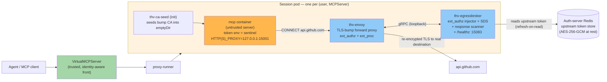

# Untrusted Mode: Egress Credential Broker

> **Audience**: operators enabling `spec.untrusted` on an MCPServer, and MCP
> server authors whose servers will run untrusted. For the design rationale and
> rejected alternatives, see [ADR-0001](adr/0001-untrusted-mcp-egress-broker.md).

Untrusted mode runs a third-party MCP server — arbitrary community code the
platform operator does not trust — while still letting that server call upstream
APIs (GitHub, Google, …) **as the human driving the agent**, without the server
ever possessing a real credential. Kubernetes only; the flag is inert in
CLI/Docker mode.

## 1. What untrusted mode is

One paragraph version: the untrusted server runs **single-tenant** — one backend
pod per `(user, MCPServer)` pair, cloned on first use by vMCP — and every
credentialed upstream call it makes is transparently intercepted by an **Envoy
sidecar inside its own pod** that terminates TLS, asks a co-located **Go
credential broker** which token applies, and injects `Authorization` at the
boundary. The server's env contains only a sentinel literal; the real token
lives in the auth server's Redis store and is touched only by the broker.



**Implementation**: broker `pkg/egressbroker/` + `cmd/thv-egressbroker/`; pod
lifecycle `pkg/vmcp/session/untrusted/`; vMCP wiring `pkg/vmcp/cli/untrusted.go`;
operator resources `cmd/thv-operator/controllers/mcpserver_untrusted_resources.go`.

## 2. Threat model

The untrusted server is assumed to be **fully malicious or compromised**:

- It can read its own environment, filesystem, and process memory.
- It can initiate arbitrary outbound network connections and shape every byte
  of them (host, path, method, headers, body).
- It can return anything it wants in MCP tool responses to the agent.
- It cannot be relied on to forward any value faithfully (no per-call dispatch
  IDs — ADR D1), so nothing the security boundary depends on ever transits it.
- It shares a pod with the trusted sidecar but has no K8s API access beyond what
  the pod's ServiceAccount grants (none, by default).

What the design assumes is *not* compromised: vMCP, the operator, the auth
server and its Redis, the broker sidecar image, and the cluster CNI's
NetworkPolicy enforcement (a hard dependency — see §8).

## 3. THE SECURITY BOUNDARY — read before enabling

> **Untrusted mode defeats credential theft, replay, cross-user use, and
> post-hoc use.** The server never holds a token it can carry off, replay
> later, or use as another user. The pod↔user binding plus destination binding
> plus response scanning enforce this at points the server cannot reach.

> **It does NOT defeat:**
>
> 1. **Authority abuse within scope for the current call.** The server shapes
>    every outbound request, so it directs the current user's credential within
>    granted scopes for the current session. A compromised GitHub MCP server can
>    still call `DELETE /repos/{user}/{repo}` as the user. The actual mitigations
>    are: least-privilege upstream consent scopes; per-provider
>    method+path-prefix ACLs in `egressPolicy`; and the audit trail of every
>    injected call as the primary detection surface (§8).
> 2. **Data exfiltration via MCP responses.** Anything the upstream API returns
>    to the server can be embedded in tool responses to the agent. The credential
>    never leaks; the data it fetches can.
> 3. **Transformed echoes of the credential.** The response scanner (§4) matches
>    the injected header value **byte-exactly, plus its standard base64 form**.
>    It is a tripwire, not a proof: a server that transforms the echo — gzip,
>    hex, base64-of-base64, splitting across chunks or fields, or smuggling in
>    response trailers (unscanned, SKIP mode) — evades the match. The real
>    boundary remains the allowlist + destination binding: the credential can
>    only travel to consented hosts in the first place, and every injection is
>    audited.

"Untrusted" means **credential-safe**, not **harmless**. Do not read it as a
sandbox that makes a malicious server safe to point at production APIs with
broad scopes.

## 4. How credentials flow

1. **Consent.** The first tool call that needs an upstream provider fails with a
   consent-required signal (§9): the user opens the ToolHive authorize endpoint,
   completes the upstream OAuth flow (PKCE) against the vMCP's embedded auth
   server, and retries the call.
2. **tsid.** On successful auth, the auth server mints a session ID (`tsid`)
   into the user's ToolHive JWT and stores the upstream tokens under
   `{prefix}upstream:{sessionID}:{provider}` in Redis — AES-256-GCM envelope
   encrypted when `tokenEncryption` is configured (§7).
3. **Single-tenant pod.** vMCP clones a backend pod for the `(user, MCPServer)`
   pair and stamps pod annotations: OIDC `iss`, raw `sub`, session ID, MCPServer
   name (`pkg/egressbroker/identity.go`). The broker container receives them via
   downward-API env (`THV_UNTRUSTED_ISS` / `_SUB_RAW` / `_SESSION` /
   `_MCPSERVER`); missing identity is a startup error — the pod is the registry.
4. **Injection (ext_authz).** The server's HTTPS egress is CONNECT-tunneled
   through the loopback Envoy sidecar (TLS-bump with a per-tenant CA). For each
   tunneled request, Envoy calls the broker's `ext_authz`, which: resolves
   pod→identity locally (no lookup of anything the request carries), loads the
   session's upstream token from Redis with refresh-on-read, asserts the stored
   row's owner binding matches the pod's `(iss, sub)` in Strict mode, and —
   **only if the destination host/method/path is allowlisted for that provider
   (D5)** — returns a header mutation injecting `Authorization`. The broker
   records the injected header value in a bounded TTL map keyed by
   `x-request-id` (60s TTL, 10k entries, no token plaintext retained).
5. **Destination binding (D5, D7).** D5 is evaluated *before* any header is
   written: provider P's credential is emitted only to hosts in P's
   `allowedHosts`, only on `allowedMethods`, only under `allowedPathPrefixes`.
   Additionally the broker validates the *resolved destination IP* per dial
   against the operator-resolved CIDR allowlist (D7, DNS-rebinding protection),
   and a NetworkPolicy confines pod egress to loopback + cluster DNS + those
   same CIDRs.
6. **Response scanning (D6c).** Envoy's `ext_proc` filter (response headers +
   body only, `message_timeout: 2s`) calls the broker, which scans for the
   injected header value byte-exactly and in standard base64. A Lua filter
   copies `x-request-id` and `:authority` into dynamic metadata on the request
   path — the only working correlation path, since response-path ext_proc cannot
   see request headers. On a match the response is **replaced with a generic
   502** (`"response suppressed by egress policy"`), a Leak audit event and the
   `egress_broker_response_scan_total{result="leak"}` metric are emitted, and
   the matched value never appears in any log or event. Bodies over the scan cap
   (default 1 MiB, `THV_EGRESSBROKER_SCAN_MAX_BODY_BYTES`) are not body-scanned
   (headers still are); this is a cost bound, not a security boundary. Redirects
   are never followed: Envoy passes 3xx through untouched (D6a), and
   `preserve_external_request_id` stays false so a hostile server cannot poison
   the correlation map with its own request IDs.

## 5. Single-tenant lifecycle

vMCP owns the lifecycle (`pkg/vmcp/session/untrusted/lifecycle.go`,
`reaper.go`), cloning bare pods from the operator-built backend StatefulSet's
pod template.

**Fan-out math.** Total untrusted pods ≈ active users × untrusted servers each
user touches. 100 users each driving 3 untrusted servers = 300 pods. This is
the deliberate cost of attribution (ADR D2): pod identity *is* user identity.

**Caps** (admission gate, all fail closed when Redis is unreachable):

| Control | Default | Tunable |
|---|---|---|
| Per-user concurrent pods (across servers) | 10 | `THV_UNTRUSTED_PER_USER_QUOTA` |
| Per-user create rate | 5/min | (internal) |
| Per-MCPServer concurrent pods | 200 | `THV_UNTRUSTED_PER_SERVER_CAP` |
| Global pods | 0.8 × session cache capacity (1000) = 800 | `THV_UNTRUSTED_GLOBAL_CAP_RATIO` |

Admission denials are soft: the backend is excluded from the session
(partial-init semantics), never a hard session failure. The per-user counter is
authoritatively enforced inside the pod-create transaction; admission is a
read-only pre-flight; the reaper rebuilds counters from the pod LIST each tick.

**Cold start.** The resolver waits up to the readiness budget (default 120s,
`THV_UNTRUSTED_READINESS_TIMEOUT`) for the pod to get an IP and a Ready
condition — including image pull, CA seeding, and Envoy/broker start. A pod
older than the readiness timeout and not Ready is deleted by the reaper.

**Idle teardown.** The reaper (60s tick) deletes a pod when its `podttl` lease
lapses — default idle TTL 30m (`THV_UNTRUSTED_IDLE_TTL`), renewed while the
owning session's metadata exists (sliding window). A zombie rule deletes pods
whose vMCP heartbeat has been absent for the grace period (owning vMCP died);
session termination deletes the pod immediately.

**Cluster sizing.** Each session pod carries the backend container plus three
sidecars: Envoy (50m/64Mi req, 500m/256Mi limit), broker (25m/32Mi req,
250m/128Mi limit), and a one-shot init container. Budget node capacity for
`expected_concurrent_pods × (backend + ~75m CPU / ~96Mi RAM sidecar overhead)`.

## 6. Failure modes

| Component | Posture | Behavior |
|---|---|---|
| Broker startup | **fail closed** | Missing policy file, CA files, identity env, or dial allowlist → process exits non-zero; pod never Ready; reaper deletes it after the readiness timeout. A nil token-store wiring likewise refuses to start. |
| ext_authz (injection) | **fail closed** | `failure_mode_allow: false` — a dead injector denies; nothing ever passes uncredentialed-by-mistake. Denial reasons are a fixed vocabulary (`no-policy`, `method-not-allowed`, `path-not-allowed`, `credential-unavailable`, `binding-mismatch`, `store-error`, `malformed-request`). |
| ext_proc (response scanner) | **fail open (default)** | `failure_mode_allow: true` — a scanner outage passes responses + alert metric, rather than hard-downing every untrusted workload. Set `THV_EGRESSBROKER_SCAN_FAIL_CLOSED=true` to flip (scanner errors → 502). A *detected* echo always blocks in both modes. |
| Unknown request-id (direct hit, scanner restart, TTL eviction) | **fail open (default)** | Response passes + `egress_broker_response_scan_total{result="unknown_request"}`. |
| Admission (vMCP) | **fail closed** | Redis unreachable → every admission check denies (untrusted mode already requires Redis-backed session storage; startup refuses otherwise). |
| Reaper | **fail safe** | Redis down at tick → tick skipped entirely; no deletions without Redis evidence. |
| Encrypted token row, no KEK wired | **fail closed** | Open rejects non-legacy values; every injection denies with `store-error`/`credential-unavailable`. |
| DNS resolution at operator reconcile | **retry with backoff** | NXDOMAIN blips must not poison the workload; a permanently unresolvable host is a terminal spec error. |

## 7. Configuration reference

### MCPServer CRD fields

```yaml
spec:
  untrusted: true                 # marks the server as untrusted code (K8s-only)
  egressPolicy:                   # required when untrusted; ≥1 provider
    providers:
    - provider: github            # must match the auth-server upstream name
      allowedHosts: ["api.github.com"]   # exact hosts or one-label wildcards
      allowedMethods: [GET, POST]        # empty = GET/HEAD/OPTIONS only (read-only)
      allowedPathPrefixes: ["/repos/"]   # empty = all paths on allowed hosts
      credentialEnvName: GITHUB_TOKEN    # backend env that gets the sentinel
```

When `untrusted: true`, `permissionProfile.network.outbound` is **ignored** for
the backend pod — the NetworkPolicy derives solely from `egressPolicy` (+ DNS +
loopback). The two network dialects are intentionally separate:
`permissionProfile` remains the Docker/Squid dialect; `egressPolicy` is the K8s
untrusted-mode dialect.

### CEL validation rules (MCPServerSpec, R1–R6)

| # | Rule | Message (abbreviated) |
|---|---|---|
| R1 | `untrusted ⇒ egressPolicy with ≥1 provider` | "egressPolicy … is required when untrusted is true" |
| R2 | `untrusted ⇒ groupRef set` | "must belong to an MCPGroup fronted by a VirtualMCPServer" |
| R3 | `untrusted ⇒ spec.secrets empty` | "declare providers in egressPolicy and use sentinel env" |
| R4 | `untrusted ⇒ no podTemplateSpec` | the session lifecycle owns the pod shape |
| R5 | `untrusted ⇒ sessionAffinity: ClientIP` | per-user routing requires sticky sessions |
| R6 | `untrusted ⇒ no backendReplicas` | managed by the untrusted-mode session lifecycle |

The runtime env gate additionally rejects Secret/ConfigMap-sourced env and
Secret/ConfigMap volumes in the backend template (Wave-0 hardening), and
sentinel-forgery validation reserves the `thv-untrusted-sentinel:` prefix for
operator-injected values only. Violations surface as terminal status conditions
(`GroupRefNotVMCPFronted`, `SecretEnvRejected`, `UntrustedEgressPolicyInvalid`).

### Platform tunables (vMCP env vars, resolved once at startup — no hot reload)

| Env var | Default | Meaning |
|---|---|---|
| `THV_UNTRUSTED_IDLE_TTL` | `30m` | pod liveness lease the reaper enforces |
| `THV_UNTRUSTED_PER_USER_QUOTA` | `10` | concurrent untrusted pods per user |
| `THV_UNTRUSTED_PER_SERVER_CAP` | `200` | concurrent untrusted pods per MCPServer |
| `THV_UNTRUSTED_GLOBAL_CAP_RATIO` | `0.8` | fraction of the session cache capacity bounding total untrusted pods |
| `THV_UNTRUSTED_READINESS_TIMEOUT` | `120s` | cold-start budget (resolver wait + reaper sweep rule) |
| `THV_UNTRUSTED_ENVOY_IMAGE` | `envoyproxy/envoy:v1.36.2@sha256:4972…80ba` (tag+digest pinned) | Envoy data-plane image override (air-gapped mirrors) |
| `THV_UNTRUSTED_BROKER_IMAGE` | `ghcr.io/stacklok/toolhive/egressbroker:v0.17.0` | broker sidecar image override |
| `THV_UNTRUSTED_SIDECAR_CPU` / `THV_UNTRUSTED_SIDECAR_MEM` | `1.0` | multiplier on envoy/broker sidecar requests+limits (must be in (0, 100]) |

Every tunable fails startup on an unparseable/zero/negative value. Image
overrides tagged `:latest` are rejected outright; non-digest-pinned overrides
are honored with a loud warning.

### Broker-side env (set by the clone wiring — informational)

`THV_EGRESSBROKER_POLICY_FILE`, `THV_EGRESSBROKER_CA_FILE`,
`THV_EGRESSBROKER_CA_KEY_FILE`, `THV_EGRESSBROKER_LISTEN_ADDRESS`/`_PORT`
(default 127.0.0.1:9001), `THV_EGRESSBROKER_DIAL_ALLOWLIST` (override; normally
carried in the policy document), `THV_EGRESSBROKER_SCAN_FAIL_CLOSED`,
`THV_EGRESSBROKER_SCAN_MAX_BODY_BYTES` (default 1 MiB),
`THV_EGRESSBROKER_REDIS_ADDR`, `THV_EGRESSBROKER_REDIS_KEY_PREFIX`,
`THV_SESSION_REDIS_PASSWORD` (SecretKeyRef), `THV_EGRESSBROKER_KEK_ID` +
`THV_EGRESSBROKER_KEK_<ID>` per key ID (SecretKeyRef, active + retired),
`THV_EGRESSBROKER_ENVOY_BOOTSTRAP_OUT`.

### Token encryption at rest (KEK)

`VirtualMCPServer.spec.authServerConfig.storage.tokenEncryption` (CEL:
requires storage `type: redis`):

```yaml
spec:
  authServerConfig:
    storage:
      type: redis
      redis: { addr: "redis:6379", aclUserConfig: { passwordSecretRef: { name: redis-acl, key: password } } }
      tokenEncryption:
        activeKeyId: kek-2026-07            # key used for new writes
        keySecretRef: { name: thv-token-keks }  # Secret: one base64 32-byte KEK per data key
```

The operator renders one SecretKeyRef env per Secret data key onto the vMCP
container (`TOOLHIVE_AUTHSERVER_TOKEN_ENCRYPTION_KEK_<ID>`, max 16 keys) and
forwards the KEK *coordinates* (never values) to cloned sidecars via
`THV_UNTRUSTED_TOKEN_STORE_KEK_SECRET` / `_KEK_KEY` / `_KEK_IDS`. Sidecar
keyrings receive the full key-ID set so rotation never orphans ciphertext
sealed under a retired ID. Key IDs must match `[A-Za-z0-9_-]+` (they become
env-var suffixes). Sentinel-backed Redis cannot be dialed by sidecars —
`tokenEncryption` with Sentinel storage emits a
`TokenEncryptionNotSupportedForUntrusted` Warning event and no sidecar wiring.

## 8. Operations

### Metrics (OTel, low-cardinality per ADR D11 — never a user identifier)

| Metric | Labels | Meaning |
|---|---|---|
| `untrusted_backend_pods` (gauge) | `mcpserver` | live untrusted pods, refreshed from the pod LIST each reaper tick |
| `untrusted_pod_admissions_total` | `result` (`admitted`/`quota_exceeded`/`error`) | admission decisions |
| `egress_broker_injections_total` | `mcpserver`, `provider` | successful injections |
| `egress_broker_denials_total` | `result` (deny-reason vocabulary), `mcpserver`, `provider` | injection denials |
| `egress_broker_response_scan_total` | `mcpserver`, `provider`, `result` (`ok`/`leak`/`unknown_request`), `where` (`header`/`body`, leaks only) | D6c scan outcomes |
| `egress_broker_scan_skipped_total` | `mcpserver`, `provider` | body-over-cap skips (headers still scanned) |

**Audit**: every injection, denial, and leak emits one structured slog JSON line
to stdout (Inject/Deny/Leak events; `pkg/egressbroker/audit.go`). The user sub
appears only here, as `SHA-256(sub)[:16hex]` — never in metric labels. Token
values, bodies, KEKs, and CA material are never logged.

### Recommended alerts

- `egress_broker_response_scan_total{result="leak"} > 0` → **page**: an
  upstream endpoint echoed the injected credential back.
- `rate(untrusted_pod_admissions_total{result="quota_exceeded"}[10m]) > 0` →
  possible session-creation DoS.
- `untrusted_backend_pods` per mcpserver approaching 200 → capacity.
- `egress_broker_denials_total{result="credential-unavailable"}` spike →
  consent-flow breakage.
- Bump CA `notAfter` within 14 days → run the rotation check below (rotation is
  automatic; alert only if generations stop advancing).

### CA rotation runbook (generation-named, N/N-1)

The per-tenant bump CA is a self-signed ECDSA P-256 CA valid 90 days; rotation
becomes due at 50% of validity. Rotation is fully automatic and
generation-named, never in-place:

1. The operator mints a **new** CA into a new Secret `<name>-bump-ca-<sha>`
   (generation = `sha256(cert)[:16hex]`) plus a matching public bundle
   ConfigMap, and stamps the new generation on the backend StatefulSet's
   `toolhive.stacklok.dev/bump-ca-generation` pod-template annotation.
2. New session pods clone the new template and mount exactly one consistent
   cert/key pair; existing pods keep the CA their emptyDir was seeded with
   (no cross-pod TLS).
3. GC retains the current and previous generations (N and N-1) and deletes
   everything older.

Manual verification: list `secrets -l toolhive.stacklok.dev/untrusted-resource=true`
and confirm at most two `-bump-ca-*` generations exist per MCPServer. To force a
rotation early, delete the current generation Secret; the next reconcile mints
a fresh CA (existing pods are unaffected until their idle TTL lapses).

### Upgrade story

Sidecar images are part of the cloned pod template. New sessions clone the new
template; existing pods run to idle-TTL (30m default). CA generations are
backward-compatible (N and N-1 retained). **No in-place pod mutation ever
happens** — that invariant is what makes upgrades trivially safe.

### Known limitations

- **kube-dns selector assumption**: the NetworkPolicy permits DNS only to pods
  labeled `k8s-app: kube-dns` in namespace `kube-system`. On clusters whose DNS
  lives elsewhere, backend DNS lookups fail loudly until the policy is adjusted
  — an explicit failure, never a silent port-53-to-anywhere hole.
- **Sentinel-managed Redis unsupported for the token store**: sidecars need a
  standalone/cluster Redis address. `tokenEncryption` with Sentinel storage
  emits a Warning event and sidecars cannot decrypt.
- **stdio proxy-env caveat (D10)**: a stdio server that ignores
  `HTTP_PROXY`/`HTTPS_PROXY` makes direct egress attempts → NetworkPolicy blocks
  them → the server cannot call upstreams. Compatibility limit, not a security
  gap.
- **No non-HTTP upstreams**: databases, gRPC, SSH-git are denied by default;
  only HTTP(S) through the forward proxy is credentialed.
- **Cert-pinning servers fail closed**: pinning against a public CA bundle
  breaks the TLS-bump handshake (D9) — see §9.
- **Byte-exact scanner limits**: see §3 item 3 — the scanner is a tripwire, not
  a proof.
- **Container-level confinement**: NetworkPolicy is pod-level, not
  container-level; the backend container's confinement rests on the proxy-env
  routing and the fact that no credential ever resides in it. The load-bearing
  controls are D5 destination binding and D7 per-dial IP validation.

## 9. For MCP server authors

Your server runs unmodified, but the environment it sees is shaped by untrusted
mode:

- **Sentinel semantics.** The env var that would normally carry your upstream
  token (declared as `credentialEnvName` in the egress policy) contains the
  literal `thv-untrusted-sentinel:<provider>` — **not** a token. It exists so
  servers that refuse to start tokenless still boot. Never send it anywhere.
- **Make the call anyway.** Issue the upstream HTTPS request exactly as you
  would with a real token (any placeholder `Authorization` header is fine — it
  is replaced). The broker injects the real credential at the sidecar, only for
  policy-allowlisted hosts/methods/paths. Calls outside the policy are denied
  (403 from the proxy) or have no route (connection refused).
- **Honor proxy env.** Your HTTP client must respect `HTTP_PROXY`/`HTTPS_PROXY`
  (most stdlib clients do by default). Direct egress is blocked by
  NetworkPolicy — there is no fallback path.
- **Cert pinning fails closed.** If you pin against public CA bundles or
  specific leaf certs, the TLS-bump handshake fails. Your pod already trusts
  the per-tenant bump CA via `SSL_CERT_FILE`, `NODE_EXTRA_CA_CERTS`,
  `REQUESTS_CA_BUNDLE`, and `CURL_CA_BUNDLE`; use the default trust store.
- **Request-driven only.** Background polling cannot work: pods are per-session
  and torn down after the idle TTL (default 30m), and every upstream call needs
  a live session's consent. Do work only in response to tool calls.
- **Consent UX.** When the user has not consented the provider, your tool call
  chain surfaces an error result whose text starts with
  `UPSTREAM_CONSENT_REQUIRED` followed by a JSON payload
  `{"provider":"<name>","authorize_url":"<url>"}` — pass it through untouched;
  MCP clients render it as an actionable consent prompt.

## Related documentation

- [ADR-0001: Untrusted MCP Server Egress Credential Broker](adr/0001-untrusted-mcp-egress-broker.md) — decisions D1–D11, rejected alternatives
- [Virtual MCP Server Architecture](10-virtual-mcp-architecture.md) — the trusted front
- [vMCP Scalability Limits](13-vmcp-scalability.md) — session cache cap the global pod cap derives from
- [Auth Server Storage](11-auth-server-storage.md) — upstream token store, key prefixes
- [RunConfig and Permissions](05-runconfig-and-permissions.md) — the Docker/Squid network dialect
- Operator how-to: [docs/operator/untrusted-mode.md](../operator/untrusted-mode.md)
