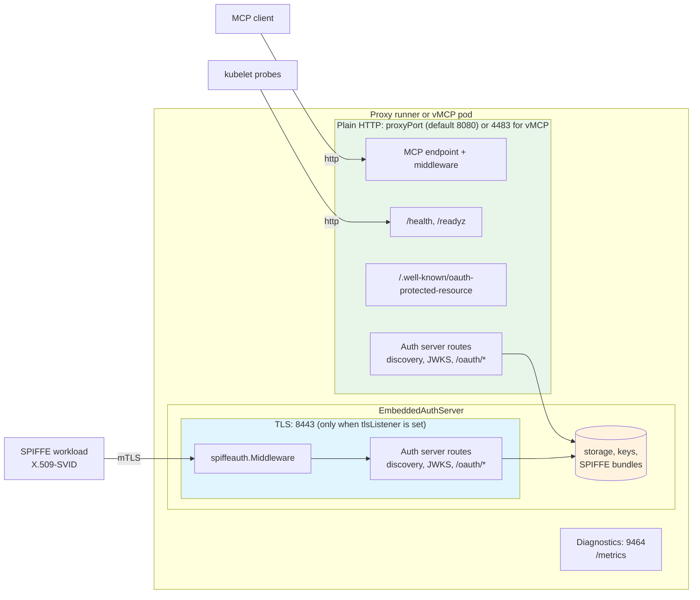

# Auth Server TLS Listener

The embedded OAuth authorization server can serve its routes on a second, TLS-only listener on port 8443. This listener exists so that SPIFFE X.509-SVID client authentication (mutual TLS at `/oauth/token`) works while MCP traffic, health checks and metrics stay on plain HTTP. This document describes the listener, how the proxy runner, vMCP and the operator use it, and why it is built this way.

## Overview

SPIFFE X.509-SVID client authentication proves a client's identity with the certificate it presents during the TLS handshake. The server must terminate that TLS connection itself: `spiffeauth.Middleware` (`pkg/authserver/spiffe/middleware.go`) reads the certificate from `r.TLS.PeerCertificates`, and when there is none it passes the request through unchanged.

The MCP proxy port and the vMCP port serve plain HTTP. Everything around them assumes that: MCP client URLs, `Status.URL` on the custom resources, the CLI's workload URLs, Kubernetes probes on `/health`, metrics scrapes, and the runner's own readiness check.

The TLS listener gives the token endpoint mutual TLS without changing any of that:

- The plain port keeps serving MCP traffic, `/health`, metrics and all auth server routes over HTTP.
- The TLS listener serves the auth server routes only, on port 8443, and asks clients for a certificate when an X.509 association is configured.
- Both listeners share one `EmbeddedAuthServer`: one storage backend, one signing key set, one SPIFFE bundle source.

The listener is optional. A deployment that does not configure it gets no extra port and no change in behaviour.

## Architecture



### What each listener serves

The TLS listener serves the full route map from `EmbeddedAuthServer.Routes()` (`pkg/authserver/runner/embeddedauthserver.go`): OIDC and OAuth discovery with their RFC 8414 path-suffix variants, `/.well-known/jwks.json`, and the `/oauth/` subtree. The whole map is wrapped in `spiffeauth.Middleware`. Any other path returns 404.

The TLS listener does not serve `/.well-known/oauth-protected-resource`. That document describes the MCP resource, which lives on the plain port, and the proxies and vMCP own that path.

The plain port serves the same auth server routes, mounted by the proxy runner as prefix handlers (`pkg/runner/runner.go`) and by vMCP through `RegisterHandlers` (`pkg/vmcp/server/server.go`). Requests on the plain port never carry a TLS peer certificate.

`spiffe_x509` therefore only works on the TLS listener. `spiffe_jwt`, client secrets, delegate clients and public clients work on both.

## Alternatives considered

**Serving the whole proxy port over TLS.** This would give `/oauth/token` a TLS connection with no second listener, but every other user of the port would have to change with it. Every MCP client URL, `Status.URL`, CLI workload URL, Kubernetes probe and metrics scrape would have to switch to `https` and trust the serving certificate. stdio MCP servers could not use it, because their proxies serve plain HTTP. And every connection would be asked for a client certificate, so browsers reaching `/oauth/authorize` would show a certificate picker. A feature that only the token endpoint needs would change the whole workload.

**Issuer on the plain port behind an HTTPS ingress, with an RFC 8705 `mtls_endpoint_aliases` token endpoint on the TLS port.** This is the standards-based way to offer mTLS alongside a normal token endpoint, and existing clients would keep using the same issuer. It needs two things this design avoids. First, an HTTPS ingress: in-cluster deployments without one cannot use an `http://` issuer, because `validateIssuerURLCore` (`pkg/authserver/config.go`) rejects a non-loopback HTTP issuer unless `insecureAllowHTTP` is set, and `insecureAllowHTTP` cannot be combined with delegate clients or confidential client registration. Second, new discovery code to publish the aliases. It is deferred, not rejected: it can be added later on top of the same listener by changing only the discovery document.

**A sidecar or service mesh terminating mTLS and forwarding the certificate in a header** (`X-Forwarded-Client-Cert`). ToolHive would have to trust a request header for client identity. Anyone who could reach the pod without going through the proxy could then claim any SPIFFE ID.

**JWT-SVID only.** JWT-SVID client authentication works over plain HTTP and is supported. But a JWT-SVID is a bearer credential: a captured assertion can be replayed until it expires (see [SPIFFE Association Declarations](18-spiffe-association-declarations.md#jwt-svid-client-authentication)). X.509-SVID authentication keeps proof of possession, because the client must hold the private key during the handshake.

## Design choices

### Additive listener

The auth server routes stay on the plain port and are also served on the TLS listener. Moving them to the TLS listener would break every deployment that points clients at `http://<svc>:<proxyPort>/oauth/...` or at an HTTPS ingress in front of the plain port. Serving them in two places costs one extra `http.ServeMux` over handlers that already exist.

### Issuer

The issuer is a user-supplied string. Deployments that use SPIFFE X.509 set it to the TLS listener URL, for example `https://mcp-foo-proxy.ns.svc.cluster.local:8443`. Discovery derives `token_endpoint` and `jwks_uri` from the issuer, so every client that follows discovery reaches the TLS listener. The listener does not require a client certificate, so non-X.509 clients work there too.

The MCP resource URL, and so `allowedAudiences`, stays on the plain port, for example `http://mcp-foo-proxy.ns.svc.cluster.local:8080/mcp`. `ValidateAudienceURI` (`pkg/authserver/server/audience.go`) accepts `http` resources. The issuer and the resource are on different origins.

Some consequences follow from putting the issuer on 8443:

- **Discovery on the plain port reports the 8443 issuer.** A client that fetches discovery from the plain port and checks RFC 8414 §3.3 strictly (the `issuer` must match the URL it used) rejects the document. Such clients must use the issuer URL.
- **JWT-SVID audience.** A JWT-SVID assertion's sole audience must be the issuer, so clients request the 8443 URL as audience.
- **Protected resource metadata** on the plain port lists the configured OIDC issuer as its authorization server (`pkg/auth/token.go`), and that issuer must equal the auth server's. Every MCP client is sent to the 8443 URL. See [Exposure and deployment](#exposure-and-deployment).

When a `spiffe_x509` association is configured, the embedded auth server checks the issuer at startup:

- It rejects an issuer whose scheme is not `https`.
- It warns, but does not reject, when the issuer's port is not 8443. An L4 passthrough with an external issuer on port 443 is a valid setup.
- It warns when the serving certificate fails `x509.Certificate.VerifyHostname` for the issuer's host.

These checks run where the key pair is loaded, so they see the real certificate.

### Fixed port 8443

The port is a constant, `TLSListenerPort = 8443`, with no configuration field. The diagnostics listener's fixed `DefaultPort` (`pkg/diagnostics/server.go`) is the precedent.

The listener fails if the port is taken. Unlike the diagnostics listener, it never falls back to another port. The port is part of the issuer URL, so a listener on any other port would make every issued token and discovery document point to the wrong place. The bind error names port 8443 as the auth server TLS listener port. That covers the one likely collision: two local workloads on one host that both enable the listener through an imported RunConfig. Only one of them can have it.

When the listener is enabled, the runner and `vmcp serve` reject at startup:

- a proxy or vMCP port of 8443;
- a diagnostics port of 8443, but only when metrics are enabled. The diagnostics port comes from `diagnostics.ResolvePort`, which uses `DefaultPort` (9464) when no port is configured.

This startup check is the real guard. Start order is a backstop: the TLS listener binds before the diagnostics listener, so if the check were bypassed, diagnostics would fall back to another port instead of taking 8443.

### Ownership: `EmbeddedAuthServer` runs the listener

`EmbeddedAuthServer` owns the listener. The proxy runner and `vmcp serve` only call `Start` and `Close`. Both binaries get identical behaviour, and any other code embedding `EmbeddedAuthServer` with a config that enables the listener gets it automatically instead of silently getting no TLS.

### Plain-port confidential clients

The plain port accepts client secrets, delegate-client credentials and JWT-SVID assertions over HTTP. `ValidateConfidentialClientTransport` (`pkg/authserver/server/provider.go`) checks the issuer's scheme, not the listener a request arrives on, so with an `https` issuer nothing stops a client from sending a secret to the plain port. This is left as is. Clients are expected to follow discovery, which sends them to the TLS listener, and a NetworkPolicy can restrict who reaches the plain port (see [NetworkPolicy](#networkpolicy)).

## Component API

The public surface lives in `pkg/authserver/runner`, except `HasSPIFFEX509ClientAuth`, which is in `pkg/authserver`:

```go
// TLSListenerPort is the fixed port of the auth server TLS listener. It is
// part of the issuer URL, so the listener never falls back to another port.
const TLSListenerPort = 8443

// WithListenerHost sets the address the TLS listener binds. Callers pass the
// same host as their MCP listener. There is no default.
func WithListenerHost(host string) Option

// NewEmbeddedAuthServer creates the auth server. When cfg.TLSListener is set
// it also loads the key pair and runs the issuer checks, so a bad certificate
// fails before anything starts.
func NewEmbeddedAuthServer(ctx context.Context, cfg *authserver.RunConfig, opts ...Option) (*EmbeddedAuthServer, error)

// Start binds Host:TLSListenerPort synchronously and serves in a goroutine.
// No-op when cfg.TLSListener is nil. Returns an error when cfg.TLSListener is
// set but no host was given with WithListenerHost. A bind failure is returned,
// never retried on another port.
func (e *EmbeddedAuthServer) Start() error

// Close stops the TLS listener with its own timeout and then closes storage
// and the rest of the server. Idempotent.
func (e *EmbeddedAuthServer) Close() error

// HasSPIFFEX509ClientAuth reports whether any SPIFFE client association
// enables spiffe_x509. A nil *RunConfig returns false.
func (c *RunConfig) HasSPIFFEX509ClientAuth() bool
```

`Start` takes no context, like `diagnostics.Server.Start`: binding is synchronous and serving runs until `Close`. Only stopping needs a context, and `Close` creates its own.

`WithListenerHost` exists because the bind address belongs to the process (the runner's host, vMCP's `--host`), not to the auth server config. There is deliberately no default. A silent loopback default would bind 8443 where the Kubernetes Service cannot reach it, and the problem would only show up later as X.509 clients timing out. Binding every interface by default would be the opposite mistake for an embedder.

Inside the package, an unexported listener type holds the `http.Server`, the `net.Listener`, the key-pair cache and the CA-hint cache. Its handler is `Routes()` on an `http.ServeMux`, wrapped in `spiffeauth.Middleware`. For the CA hint it needs the live X.509 bundle source, which `authserver.Server` exposes through an accessor together with the trust domains that enable `spiffe_x509`.

The `http.Server` uses the same timeouts as the diagnostics listener, because the token endpoint has no long-lived streams. Request bodies are capped by `EmbeddedAuthServer.Handler()`. `ErrorLog` goes to `slog` at debug level, so failed handshakes from port scanners and misconfigured clients do not flood stderr.

## TLS behaviour

- **Minimum version:** TLS 1.2.
- **HTTP/1.1 only.** The listener has no `NextProtos`, so HTTP/2 is never negotiated. The token endpoint gains nothing from it.
- **No renegotiation.** Go's TLS server refuses renegotiation with a `no_renegotiation` alert, `tls.Config.Renegotiation` only affects Go clients, and TLS 1.3 has no renegotiation at all. A connection cannot change client identity partway through, and certificates cannot be requested for some paths only.

### Client certificates

- **When to ask.** `ClientAuth` is `tls.RequestClientCert` when `HasSPIFFEX509ClientAuth()` is true, and `tls.NoClientCert` otherwise. Without an X.509 association, asking for a certificate would only cause browser prompts.
- **CA hint.** When certificates are requested, `tls.Config.GetConfigForClient` fills `ClientCAs` with the X.509 authorities of every trust domain that enables `spiffe_x509`. Go sends `ClientCAs.Subjects()` as the `certificate_authorities` list in the CertificateRequest, so browsers and other clients with several certificates only offer ones from a SPIFFE trust domain. On each handshake the listener reads the current authorities from the bundle source and hashes their DER bytes. It reuses the cached pool when the hash matches and rebuilds it when it does not. There is no background goroutine; the bundle source is in memory, so the cost is a read and a hash. A stale hint only affects which certificates a picker offers. It never accepts or rejects anything.
- **No verification in the handshake.** With `RequestClientCert`, Go does not verify the client certificate even when `ClientCAs` is set. Verification happens in the OAuth strategy: `authenticateSPIFFEX509Client` (`pkg/authserver/server/spiffe_client_auth.go`) re-verifies the peer certificate against the live bundle and compares the result with the identity the middleware extracted. Every provider installs this strategy by wrapping fosite's default client-authentication strategy with `newSPIFFEClientAuthenticationStrategy` (`pkg/authserver/server/provider.go`).

  Verifying in the handshake instead (`VerifyClientCertIfGiven`) was rejected for three reasons. A handshake failure is a TLS alert, not an OAuth `invalid_client` response. A pool that lags behind a bundle rotation would reject valid clients, while the strategy reads the live source on every request. And the strategy runs SPIFFE-specific checks (leaf not a CA, key usage, claimed-ID match) that the handshake cannot. Keeping verification in one place avoids two checks that could disagree.
- **Non-SPIFFE client certificates.** A client that presents a certificate with no SPIFFE URI SAN at all on `/oauth/token` passes through `spiffeauth.Middleware` untouched; the request is then authenticated by whatever other method it carries, such as a client secret. A client that presents a certificate whose SPIFFE URI SAN is invalid — a root SPIFFE ID, a non-canonical path, or more than one URI SAN — is rejected by `spiffeauth.Middleware` with HTTP 401 and a plain-text `invalid client` body, even if it also sends a valid client secret. The body is not an OAuth JSON error.

### Serving certificate

The recommended serving certificate has two SANs: a DNS SAN matching the host in the issuer URL, and the auth server's SPIFFE URI SAN. The DNS SAN is required. The URI SAN lets SPIFFE-aware clients also authorize the server by its ID.

A URI-only X.509-SVID does not work as the serving certificate. Standard TLS clients (Go's `crypto/tls`, curl, browsers, generic OAuth libraries) check the server name against DNS and IP SANs only, and reject a certificate that has none. Only clients using a SPIFFE-aware verifier, such as go-spiffe's `tlsconfig.AuthorizeID`, would accept it. SPIRE can issue an SVID with DNS SANs (`dns_names` on the registration entry), and cert-manager can issue a dual-SAN certificate.

### Certificate rotation

The listener caches the key pair and picks up new files without a restart:

1. `NewEmbeddedAuthServer` loads the pair and fails if it cannot. It records a SHA-256 hash over the contents of both files.
2. On each handshake, `GetCertificate` returns the cached pair.
3. At most once every 30 seconds, the listener re-reads both files and hashes them. If the hash differs from the one recorded at the last successful load, it tries to reload.
4. If the reload fails, for example because the certificate has been replaced but the key has not yet, it keeps serving the last good pair and logs a warning. It also records the failed hash, so it logs and retries once per file change rather than on every check.

Hashing the contents is exact and cheap for two small files. Modification time and size can miss a change, or report one that did not happen. Any stat-based shortcut must use `os.Stat`, which follows kubelet's `..data` symlink, and never `os.Lstat`, which sees a symlink that does not change.

## Lifecycle

### Proxy runner

1. `Runner.Run` creates the embedded auth server with `WithListenerHost` set to the proxy host. Construction loads the key pair and runs the issuer checks. `Run` defers closing the auth server.
2. The port checks run before anything is bound.
3. After the middleware is built, and just before the diagnostics listener starts, `Run` calls `Start`. This is before the transport and container start, so a taken port fails the runner before any container exists.
4. `Runner.Cleanup` closes the auth server. `Close` stops the listener before closing storage, so no request is in flight against a closed backend.

`Close` stops the listener with a fresh `context.WithTimeout(context.Background(), …)`, as the runner does for the diagnostics listener, so a cancelled caller context cannot cut the shutdown short.

Every exit from `Run` goes through the deferred close: a failed `Start`, any later failure, and the path that returns `ErrContainerExitedRestartNeeded` so the workload can be restarted. The port is therefore free before the next attempt. This matters because the listener has no fallback port. `Close` is idempotent, so the additional call from `Cleanup` is harmless.

An error from `Serve` after startup, other than `http.ErrServerClosed`, is logged at error level and does not stop the runner. The diagnostics listener logs the same case at warn; the auth listener uses error because X.509 clients are locked out when it happens.

### vMCP

`vmcp serve` (`pkg/vmcp/cli/serve.go`) creates the embedded auth server with `WithListenerHost` set to the host the vMCP server binds, and calls `Start` right after construction. That is before backend discovery, so a bad certificate or a taken port fails before any slow work. Tokens issued before the MCP port is up are valid, because they are not tied to it. The deferred `Close` stops the listener when the server returns.

The command's context comes from `signal.NotifyContext` in `cmd/vmcp/main.go` and is already cancelled when shutdown runs. `Close` uses its own timeout context for that reason.

### Readiness

The runner's MCP readiness check and all Kubernetes probes use the plain port. The TLS listener is bound synchronously in `Start`, so once `Start` has returned it accepts connections. Probes do not check it; a `tcpSocket` probe would not prove that TLS works.

## Configuration

### RunConfig

The listener is configured on `authserver.RunConfig` (`pkg/authserver/config.go`):

```go
// TLSListenerRunConfig enables the auth server TLS listener on port 8443.
type TLSListenerRunConfig struct {
    CertFile string `json:"cert_file" yaml:"cert_file"`
    KeyFile  string `json:"key_file" yaml:"key_file"`
}

type RunConfig struct {
    // ...
    // TLSListener serves the auth server routes over TLS on port 8443, in
    // addition to the MCP port. Required for spiffe_x509 client authentication.
    TLSListener *TLSListenerRunConfig `json:"tls_listener,omitempty" yaml:"tls_listener,omitempty"`
}
```

The listener belongs to the auth server, not to the proxy, so its settings live in the auth server's config. That config reaches both binaries unchanged: the proxy runner receives it as `EmbeddedAuthServerConfig` in its own RunConfig, and vMCP reads it from the `authserver-config.yaml` file next to its main config, which the operator writes from `BuildAuthServerRunConfig`. Neither binary needs a separate field.

Checks are split by what each place can see:

- `authserver.RunConfig.Validate` checks that both file paths are set together, and that `TLSListener` is set when any association enables `spiffe_x509`.
- `NewEmbeddedAuthServer` runs the issuer checks, because it has the loaded certificate (see [Issuer](#issuer)).
- The runner and `vmcp serve` run the port checks, because they know their own ports (see [Fixed port 8443](#fixed-port-8443)).

### CRD

Both `MCPExternalAuthConfig.spec.embeddedAuthServer` and `VirtualMCPServer.spec.authServerConfig` use `EmbeddedAuthServerConfig` (`cmd/thv-operator/api/v1beta1/mcpexternalauthconfig_types.go`), which has a `tlsListener` field:

```yaml
embeddedAuthServer:
  issuer: https://mcp-foo-proxy.ns.svc.cluster.local:8443
  tlsListener:
    certificateSecretRef:
      name: mcp-foo-auth-tls
      key: tls.crt
    privateKeySecretRef:
      name: mcp-foo-auth-tls
      key: tls.key
```

`certificateSecretRef` and `privateKeySecretRef` are required. The rule that `spiffe_x509` requires `tlsListener` is enforced in Go at reconcile time rather than in CEL: the natural CEL expression is a nested `exists()` over two unbounded arrays, which exceeds the API server's CEL cost budget.

`BuildAuthServerRunConfig` (`cmd/thv-operator/pkg/controllerutil/authserver.go`) sets `TLSListener` to the mounted file paths under `/etc/toolhive/authserver/tls`. `validateDelegateClientsAndTrustedIssuers` validates a trimmed copy of the config and copies `TLSListener` into it, so the "`spiffe_x509` requires `TLSListener`" rule sees the listener.

## Operator

### Detecting the listener

`controllerutil.TLSListenerEnabled` reports whether an `EmbeddedAuthServerConfig` enables the listener, based on the spec alone. MCPServer and MCPRemoteProxy reference their auth config by name, so their reconcilers resolve the flag once per reconcile: `EmbeddedAuthServerConfigName` picks the referenced config and `GetExternalAuthConfigByName` fetches it. The flag is passed to the Deployment builder, the Service builder and both drift checks. VirtualMCPServer reads its inline `spec.authServerConfig` directly.

The lookup deliberately does not reuse `GenerateAuthServerConfigByName`, which also validates CA bundles. A CA-bundle problem should not stop the Service from being reconciled.

### Ports and Services

When `tlsListener` is set, the workload gets a second container port and a second Service port:

```yaml
- name: https-auth
  port: 8443            # containerPort on the Deployment
  targetPort: 8443
  protocol: TCP
  appProtocol: https
```

This applies to MCPServer, MCPRemoteProxy and VirtualMCPServer, using shared `ContainerPort` and `ServicePort` constructors in `controllerutil`. The name `https-auth` and `appProtocol: https` tell service meshes and Gateway implementations that the port carries TLS the pod terminates itself. The `http` port has no `appProtocol` and is not affected by the listener.

No additional RBAC is needed: the operator already reads MCPExternalAuthConfigs and manages Deployments and Services.

### Probes

All probes use plain HTTP on the `http` port, whether or not the listener is enabled.

### Drift detection

The drift checks for Deployments and Services compare the full port list through one shared helper. It compares a projection of each port, in order: name, port, target port, protocol and appProtocol. Container ports use the same projection.

Whole `ServicePort` structs are not compared. VirtualMCPServer supports `NodePort` and `LoadBalancer` Services, for which the API server fills in `NodePort`. A full comparison would always see a difference and update the Service on every reconcile.

Turning `tlsListener` off removes the port again, because Service updates replace `Spec.Ports` as a whole.

### Certificate mount

The certificate and key are mounted from one projected volume, `authserver-tls-listener`, as a directory at `/etc/toolhive/authserver/tls` (`tls.crt` and `tls.key`):

- When both refs name the same Secret, the volume has one `secret` source with two items. When they name different Secrets, it has two `secret` sources with one item each.
- The volume is mounted as a directory, not as individual files with `subPath`. Kubelet updates Secret-backed volumes in place through a `..data` symlink swap, but never updates files mounted with `subPath`. Without a directory mount, a rotated certificate would never reach the pod.
- `projected.defaultMode` is `0400`. The proxy pods run with `fsGroup: 1000` (`pkg/container/kubernetes/security.go`), so kubelet makes the files `0440` owned by `root:1000`, readable by the non-root runner, the same as the signing-key volumes.

The recommended setup is a single `kubernetes.io/tls` Secret with `tls.crt` and `tls.key`, referenced by both refs. That is what cert-manager and most rotators produce, and both files change in one kubelet update. Split Secrets are supported; the listener's keep-last-good reload covers the window where only one has changed.

Expect about one to two minutes between a Secret update and the new certificate being served: the kubelet sync period plus the listener's 30-second check.

### Reconcile-time validation

- `certificateSecretRef` and `privateKeySecretRef` are required by the schema.
- `spiffe_x509` requires `tlsListener` (Go check, see [CRD](#crd)).
- For MCPServer and MCPRemoteProxy with `tlsListener` set, the proxy port must not be 8443. The check runs once per RunConfig build, after all auth options are applied, so it covers both `externalAuthConfigRef` and `authServerRef`. It returns `InvalidEmbeddedAuthServerConfigError`, which the reconcilers treat as terminal: they set a condition and stop instead of retrying with backoff. Changing the port lets the workload recover.
- VirtualMCPServer's port is fixed at 4483 and needs no port check. No CRD exposes the diagnostics port, so the operator does not check it; the runtime check in [Fixed port 8443](#fixed-port-8443) covers it.

### NetworkPolicy

Port 8443 is an extra ingress port on the pod. With a default-deny NetworkPolicy, it must be allowed from the workloads that authenticate with X.509-SVIDs, and from anything else that follows discovery to the issuer.

Because MCP traffic and the token endpoint are on separate ports, a policy can allow one without the other. The plain port accepts client secrets over HTTP (see [Plain-port confidential clients](#plain-port-confidential-clients)), so a policy that allows the plain port only from MCP clients, and 8443 only from token clients, keeps secrets off the plain port in practice.

## Exposure and deployment

- **In-cluster.** Clients reach `https://<svc>.<ns>.svc.cluster.local:8443` through the ClusterIP Service. The serving certificate needs that DNS name as a SAN, and clients need its CA.
- **Clients outside the cluster, including human-driven MCP clients.** Protected resource metadata sends every MCP client to the configured issuer. `authorizationEndpointBaseUrl` only moves `authorization_endpoint`; the token endpoint, JWKS and dynamic client registration stay on the issuer. A deployment with any clients outside the cluster therefore needs an external issuer on an L4 passthrough path: a Gateway API `TLSRoute` in passthrough mode, ingress-nginx with `ssl-passthrough`, or a `LoadBalancer` Service. The serving certificate must cover the external name.
- **TLS-terminating ingress.** An ingress that terminates TLS cannot pass the client certificate on in a form ToolHive trusts. It can still front the plain port for MCP traffic and for browser-facing endpoints.
- **One issuer for all clients.** Tokens carry one `iss`, and JWT-SVID audiences and discovery must all match it. A deployment cannot use the in-cluster name for some clients and an external name for others. If both kinds of client exist, both use the external name, for example with split-horizon DNS. `mtls_endpoint_aliases` (see [Alternatives considered](#alternatives-considered)) would relax this.
- **Browser flows.** With the issuer on 8443, discovery also puts `authorization_endpoint` on 8443, where browsers may still show a certificate picker (narrowed by the CA hint). Deployments that combine an interactive upstream login with X.509 clients should point both `authorizationEndpointBaseUrl` and each upstream's `redirectUri` at an HTTPS ingress in front of the plain port. That URL is `https`, so it does not need `insecureAllowHTTP`. Setting `redirectUri` explicitly matters because its default depends on how the config was built: the operator defaults it to the resource URL plus `/oauth/callback`, while a hand-written RunConfig that uses upstream DCR gets `issuer + /oauth/callback` from the DCR resolver (`pkg/authserver/runner/dcr_adapter.go`), which would send browsers back to 8443.
- **vMCP Service type.** VirtualMCPServer can use a `NodePort` or `LoadBalancer` Service. The `https-auth` port is added to that same Service, so a `LoadBalancer` vMCP also exposes 8443 externally.
- **Multiple replicas.** Each replica runs its own TLS listener with the same certificate, and the Service balances connections at L4. Auth server state must be shared through Redis, as for any multi-replica auth server ([Auth Server Storage](11-auth-server-storage.md)).

## Known limitations

- **The plain port accepts client secrets over HTTP.** See [Plain-port confidential clients](#plain-port-confidential-clients).
- **First-request delay when the pod cannot reach its own issuer.** The proxy's token validator uses the in-process key provider, but on the first validation it still tries OIDC discovery against the issuer (`ensureOIDCDiscovered` in `pkg/auth/token.go`), with up to three attempts of five seconds each plus backoff. If the pod cannot reach its own 8443 URL, or does not trust the serving CA, the first request waits about 15 seconds before the validator falls back to the local keys. Skipping discovery when a key provider is set would remove the delay.
- **Rotation lag** of about one to two minutes (see [Certificate mount](#certificate-mount)).
- **Bearer tokens.** Tokens issued on the TLS listener are not bound to the client certificate (RFC 8705 `cnf.x5t#S256` is not implemented).

## Related documentation

- [SPIFFE Association Declarations](18-spiffe-association-declarations.md): associations, bundle sources, and X.509 and JWT-SVID verification.
- [Auth Server Storage](11-auth-server-storage.md): shared state for multi-replica auth servers.
- [Kubernetes Operator Architecture](09-operator-architecture.md): CRDs and reconciliation.
- [Virtual MCP Server Architecture](10-virtual-mcp-architecture.md): the vMCP embedded auth server.
- [Transport Architecture](03-transport-architecture.md): the proxy listeners, which stay on plain HTTP.
