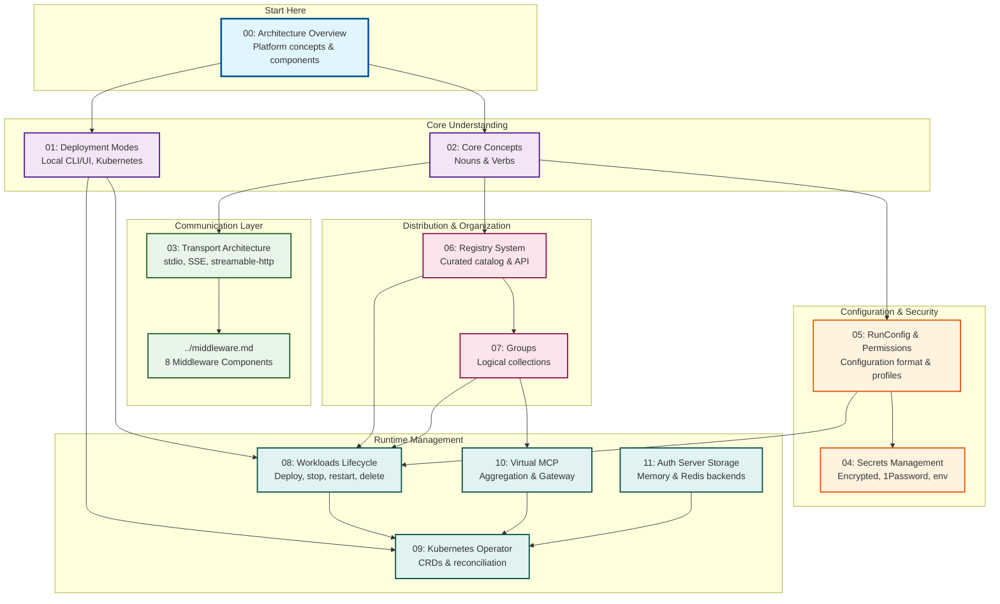

# ToolHive Architecture Documentation

Welcome to the ToolHive architecture documentation. This directory contains comprehensive technical documentation about ToolHive's design, components, and implementation.

## Documentation Index

### Core Architecture Documents

1. **[Architecture Overview](00-overview.md)** - Start here
   - High-level platform overview
   - Key components and concepts
   - Five ways to run MCP servers

2. **[Deployment Modes](01-deployment-modes.md)**
   - Local Mode: CLI and UI
   - Kubernetes Mode: Operator
   - Mode comparison and migration paths
   - Runtime abstraction and detection

3. **[Transport Architecture](03-transport-architecture.md)**
   - Three MCP transport types (stdio, SSE, streamable-http)
   - Proxy architecture (transparent vs protocol-specific)
   - Remote MCP server proxying
   - Port management and sessions

### Detailed Component Documentation

4. **[Core Concepts](02-core-concepts.md)**
   - Nouns: Workloads, Transports, Proxy, Middleware, RunConfig, Permissions, Groups, Registry, Sessions
   - Verbs: Deploy, Proxy, Attach, Parse, Filter, Authorize, Audit, Export, Import, Monitor
   - Terminology quick reference

5. **[Secrets Management](04-secrets-management.md)**
   - Provider types (encrypted, 1password, environment)
   - OS keyring integration
   - Fallback chain
   - Security model

6. **[RunConfig and Permission Profiles](05-runconfig-and-permissions.md)**
   - RunConfig schema and versioning
   - Permission profiles (read, write, network)
   - Built-in profiles and custom profiles
   - Mount declarations and resource URIs
   - Security best practices

7. **[Registry System](06-registry-system.md)**
   - Built-in curated registry
   - Custom registries (file and remote)
   - Registry API server architecture
   - MCPRegistry CRD
   - Image and remote server metadata

8. **[Groups](07-groups.md)**
   - Group concept and use cases
   - Registry groups
   - Client configuration

9. **[Workloads Lifecycle Management](08-workloads-lifecycle.md)**
   - Workloads API interface
   - Lifecycle: deploy, stop, restart, delete, update
   - State management
   - Container vs remote workloads
   - Async operations

10. **[Kubernetes Operator Architecture](09-operator-architecture.md)**
    - CRD design (MCPServer, MCPRegistry, MCPToolConfig, MCPExternalAuthConfig, VirtualMCPServer)
    - Two-binary architecture (operator + proxy-runner)
    - Deployment pattern
    - Status management
    - Design principles

11. **[Virtual MCP Server Architecture](10-virtual-mcp-architecture.md)**
    - MCP Gateway for aggregating multiple backends
    - Backend discovery and capability aggregation
    - Conflict resolution strategies
    - Two-boundary authentication model
    - Composite tool workflows

12. **[Auth Server Storage Architecture](11-auth-server-storage.md)**
    - Storage interface design (fosite + ToolHive extensions)
    - Memory and Redis Sentinel backends
    - Multi-tenancy via key prefixes
    - Atomic operations with Lua scripts
    - Configuration and security model

### Existing Documentation

For middleware architecture, see: **[docs/middleware.md](../middleware.md)**
- Complete middleware system documentation
- Eight middleware components
- Extending the middleware system
- Error handling and performance

## Architecture Map

This visual map shows how all documentation relates to the core ToolHive architecture:



**Color Legend:**
- 🔵 **Blue (Start Here)**: Entry point for all readers
- 🟣 **Purple (Core Understanding)**: Foundational concepts and deployment patterns
- 🟢 **Green (Communication Layer)**: How MCP servers communicate and process requests
- 🟠 **Orange (Configuration & Security)**: Security model and configuration management
- 🔴 **Pink (Distribution & Organization)**: How servers are cataloged and organized
- 🟦 **Teal (Runtime Management)**: Lifecycle and cluster management

**Navigation Paths:**
- **For first-time readers**: Follow the arrows from Overview → Concepts → your area of interest
- **For implementers**: Focus on the green (Transport/Middleware) and teal (Workloads/Operator) sections
- **For operators**: Start with Deployment → Operator, then dive into RunConfig and Registry

## Quick Navigation

### By Role

**For Platform Developers:**
Start with [Architecture Overview](00-overview.md) → [Core Concepts](02-core-concepts.md) → [Deployment Modes](01-deployment-modes.md)

**For Middleware Developers:**
Read [Transport Architecture](03-transport-architecture.md) → [Middleware](../middleware.md)

**For Operators:**
See [Deployment Modes](01-deployment-modes.md) → [Kubernetes Operator](09-operator-architecture.md)

**For Contributors:**
Review all documents in order (00 → 01 → 02 → 03 → ...)

### By Topic

**Understanding the Platform:**
- [Architecture Overview](00-overview.md)
- [Core Concepts](02-core-concepts.md)

**Running MCP Servers:**
- [Deployment Modes](01-deployment-modes.md)
- [Transport Architecture](03-transport-architecture.md)

**Configuration:**
- [RunConfig and Permission Profiles](05-runconfig-and-permissions.md)
- [Secrets Management](04-secrets-management.md)
- [Registry System](06-registry-system.md)

**Extending ToolHive:**
- [Middleware](../middleware.md)

**Advanced Features:**
- [Groups](07-groups.md)
- [Workloads Lifecycle](08-workloads-lifecycle.md)
- [Kubernetes Operator](09-operator-architecture.md)

## Architecture Principles

ToolHive follows these architectural principles:

### 1. Platform, Not Just a Runner

ToolHive is a **platform** for MCP server management, providing:
- Proxy layer with middleware
- Security and access control
- Aggregation and composition
- Registry and distribution

### 2. Abstraction and Portability

- **RunConfig**: Portable configuration format (JSON/YAML)
- **Runtime Interface**: Abstract container operations
- **Transport Interface**: Abstract communication protocols
- **Middleware Interface**: Composable request processing

### 3. Security by Default

- Network isolation by default
- Permission profiles for fine-grained control
- Authentication and authorization built-in
- Audit logging for compliance

### 4. Extensibility

- Middleware system for custom processing
- Custom registries
- Protocol builds (uvx://, npx://, go://)
- [Virtual MCP composition](10-virtual-mcp-architecture.md)

### 5. Cloud Native

- Kubernetes operator for cluster deployments
- Container-based isolation
- StatefulSets for stateful workloads
- Service discovery and load balancing

## Key Architectural Decisions

### Why Two Binaries for Kubernetes?

**`thv-operator`**: Watches CRDs, reconciles Kubernetes resources
**`thv-proxyrunner`**: Runs in pods, creates containers, proxies traffic

This separation provides:
- Clear responsibility boundaries
- Operator focuses on Kubernetes resources
- Proxy-runner focuses on MCP traffic
- Independent scaling and lifecycle

**Reference**: [Deployment Modes](01-deployment-modes.md#why-two-binaries)

### Why Transparent Proxy for SSE/Streamable HTTP?

SSE and Streamable HTTP transports use the same transparent proxy because:
- Container already speaks HTTP
- No protocol translation needed
- Middleware applies uniformly
- Simpler implementation

**Reference**: [Transport Architecture](03-transport-architecture.md#key-insight-two-proxy-types)

### Why RunConfig as API Contract?

RunConfig is part of ToolHive's API contract because:
- Export/import workflows
- Versioned schema with migrations
- Portable across deployments
- Reproducible configurations

**Reference**: [Architecture Overview](00-overview.md#runconfig)

## Implementation Patterns

### Factory Pattern

Used extensively for runtime-specific implementations:

```go
// Container runtime factory
runtime, err := container.NewFactory().Create(ctx)

// Transport factory
transport, err := transport.NewFactory().Create(config)
```

**Files**:
- `pkg/container/factory.go`
- `pkg/transport/factory.go`

### Interface Segregation

Clean abstractions for:
- **Runtime**: Container operations (`pkg/container/runtime/types.go`)
- **Transport**: Communication (`pkg/transport/types/transport.go`)
- **Middleware**: Request processing (`pkg/transport/types/transport.go`)
- **Workloads**: Lifecycle management (`pkg/workloads/manager.go`)

### Middleware Chain

Request processing as composable layers:

```go
// Middleware applied in reverse order
for i := len(middlewares) - 1; i >= 0; i-- {
    handler = middlewares[i](handler)
}
```

**Reference**: [Middleware](../middleware.md)

## Diagrams Legend

Throughout this documentation, we use Mermaid diagrams:

- **Blue boxes**: ToolHive components
- **Orange boxes**: MCP servers or containers
- **Green boxes**: Proxy components
- **Purple boxes**: External systems
- **Solid arrows**: Direct communication
- **Dashed arrows**: Configuration or state

## Contributing to Documentation

When adding new architecture documentation:

1. **Use consistent numbering**: `XX-topic-name.md`
2. **Start with "Why"**: Explain design decisions
3. **Include code references**: Link to `file:line` where possible
4. **Add diagrams**: Use Mermaid for visual clarity
5. **Cross-reference**: Link related documents
6. **Keep it current**: Update when implementation changes

### Documentation Template

```markdown
# Topic Name

## Overview
Brief explanation of what this covers

## Why This Exists
Design rationale and decisions

## How It Works
Technical details with code references

## Key Components
List of main pieces

## Implementation
Code pointers and examples

## Related Documentation
Links to related docs
```

## Getting Help

- **General questions**: See [CLAUDE.md](../../CLAUDE.md)
- **Operator specifics**: See [cmd/thv-operator/DESIGN.md](../../cmd/thv-operator/DESIGN.md)
- **Contributing**: See [CONTRIBUTING.md](../../CONTRIBUTING.md)
- **Middleware**: See [docs/middleware.md](../middleware.md)


---

**Version**: 0.1.0 (Initial architecture documentation)
**Last Updated**: 2026-02-13
**Maintainers**: ToolHive Core Team
