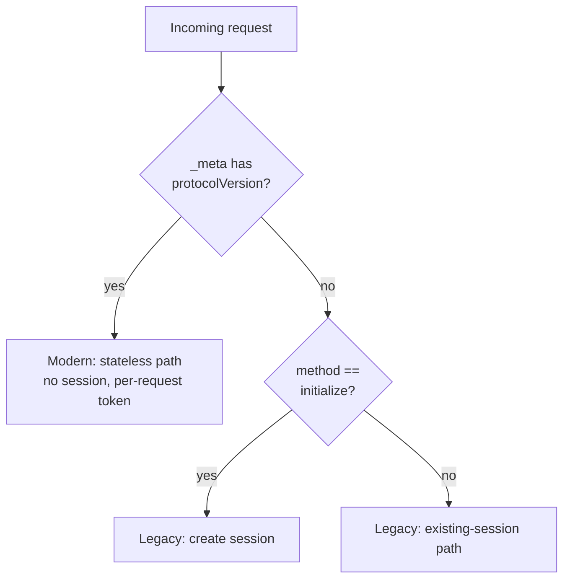

# Stateless Transport Proxy Support (MCP 2026-07-28)

## Overview

This document designs dual-protocol operation for ToolHive's two transport proxies —
the transparent proxy (HTTP→HTTP reverse proxy) and the streamable proxy (HTTP→stdio
container proxy) — so they can serve both the current stable MCP revision (2025-11-25)
and the upcoming stateless revision (2026-07-28) on the same endpoint, discriminating
per request rather than requiring a cutover.

It is a design/sequencing document (tracking issue #5755). vMCP, the go-sdk v1.7 bump,
and OAuth hardening are separate efforts (see [Out of scope](#out-of-scope)). File and line
references point into `pkg/transport/proxy/` and `pkg/mcp/`; line numbers drift over time, so
re-locate by symbol name where they no longer match.

## Why this exists

The 2026-07-28 MCP revision removes the pieces the proxies are currently built around:

- the `initialize` handshake (replaced by per-request `_meta` metadata plus a
  `server/discover` RPC),
- protocol sessions and the `Mcp-Session-Id` header (traffic becomes stateless), and
- the standalone GET SSE stream.

The ecosystem will straddle both revisions for a long time — SDKs (go-sdk v1.7, TS SDK v2)
serve both on one endpoint, and clients/servers will upgrade independently. ToolHive
therefore needs **per-request revision discrimination**, not a flag day: a 2025-11-25 client
must keep working unchanged while a 2026-07-28 peer is served natively.

## Background: what `initialize` does today

Two properties of the current implementation shape the entire approach.

**The proxies parse MCP bodies themselves.** `transparent_proxy.go`, `streamable_proxy.go`,
and `pkg/mcp/parser.go` decode JSON-RPC with `golang.org/x/exp/jsonrpc2` and `encoding/json`;
they do not route through the go-sdk or toolhive-core's `mcpcompat` shim. Revision detection
therefore lives in ToolHive-owned code, above any SDK. (The authz/telemetry middleware wrapping
the proxies import `mcpcompat/mcp` for types only — a compile-time coupling, not a data-path
dependency.)

**`initialize` is used as a trigger, not as stored state.** The only field any proxy extracts
from an `initialize` body is `clientInfo.name` (`parser.go:262-271`), used for audit/authz
labels. Everything else keys off a single boolean — *is this request the `initialize` method?* —
which triggers session creation, backend-pod pinning, and health-check enablement. Removing the
handshake therefore removes a *trigger*; there is very little negotiated state to reconstruct.

## How it works

### Revision classification

Each request is classified per-request as **Modern** (2026-07-28, stateless) or **Legacy**
(≤2025-11-25, `initialize`-based):

- **Modern** when the request body's `_meta` carries `io.modelcontextprotocol/protocolVersion`.
  That key is required on every Modern request (`schema/draft/schema.ts`, `RequestMetaObject`),
  so it is a reliable per-request signal. On Streamable HTTP it is mirrored into the
  `MCP-Protocol-Version` header; a header/body mismatch is rejected with `400` and JSON-RPC
  error `-32020` (`HeaderMismatch`). The body is authoritative.
- **Legacy** otherwise, with `method == "initialize"` marking session start. A malformed or
  absent `_meta` classifies as Legacy, which is the safe direction — it preserves the existing
  session guard.

The existing header validation does not stand in the way: `isSupportedMCPVersion`
(`streamable/utils.go:62-65`, called at `streamable_proxy.go:361`) accepts any version, so the
proxy does not reject a Modern `MCP-Protocol-Version` today. Discrimination therefore belongs at
the body-parse seam, where the authoritative `_meta` lives, not at the optional header check.



Classification is a pure function in `pkg/mcp`, called at the existing decode points rather
than threaded through a shared context object (neither proxy reads `ParsedMCPRequest` on its
routing path — the transparent proxy sniffs bytes inside `RoundTrip`, the streamable proxy
decodes a `jsonrpc2.Request` directly):

```go
// pkg/mcp
func ClassifyRevision(method string, meta map[string]any, protoHeader string) (Revision, error)
```

A connection does not change revision mid-stream, so the transparent proxy classifies once and
stores the `Revision` in session metadata (as it already does for `sessionMetadataBackendSID`),
letting `RoundTrip` read one field instead of re-deriving it.

A Modern-aware parser must also recognize the mandatory request headers introduced alongside
the metadata model: `Mcp-Method` (required on every Modern POST) and `Mcp-Name` (required for
`tools/call`, `resources/read`, `prompts/get`). Both are validated against the body with the
same `-32020` code. As an intermediary that reads bodies for authz/audit, ToolHive should verify
that the protocol version indicates a header-validation-required revision before trusting any
mirrored header value.

### Security invariant

The `_meta` protocol fields and the mirrored headers are entirely client-controlled and now
appear on every request. They are telemetry and labels, never a security principal — the
authenticated identity established by the middleware chain (which runs before session handling)
remains the only principal, and authorization policies must not key off client-asserted `_meta`.
Registering `server/discover` in the parser's method tables is partly a security measure: an
unknown method currently yields an empty resource ID, so this confirms authorization
default-denies rather than matching a broad allow rule.

### The dual-era matrix

A proxy fronts one backend and serves whatever client connects; the two sides have independent
revisions.

| Client | Backend | Proxy behavior |
|--------|---------|----------------|
| Legacy | Legacy | Today's path, unchanged. |
| Modern | Modern | Stateless pass-through (the streamable proxy's existing sessionless branch). |
| Legacy | Modern | Client expects the handshake and a session; backend has neither. The gateway must terminate the handshake itself. |
| Modern | Legacy | Client uses `server/discover` and per-request `_meta`; backend requires `initialize`. The gateway must synthesize `initialize` toward the backend. |

The two diagonal cells are the supported scope. The off-diagonal cells require the gateway to
translate between eras and are deferred (see [decision D2](#decisions-and-rationale)). The MCP
specification's probe-then-fallback mechanism is normative but only protects a client talking
*directly* to a server; its compatibility matrix marks the Legacy-client/Modern-server case as
"Fails" with no fall-forward, so a gateway is the only thing that could bridge it. The
agentgateway project reached the same conclusion — it ships the diagonals and the
Modern-client/Legacy-server synthetic-initialize path, and deliberately declined the
Legacy-client/Modern-server case as unsound.

This binary Modern/Legacy classification suffices while there is a single Modern revision. When
a second ships, `DiscoverResult.supportedVersions` and `UnsupportedProtocolVersionError.data.supported`
are version lists, and the classifier will need real version-string negotiation.

## Implementation phases

Each phase is independently shippable. Everything classifies as Legacy by default, so behavior
is unchanged until a Modern request actually arrives.

### Phase 1 — Classifier and parser vocabulary (no behavior change)

Add `ClassifyRevision` and wire it at the three decode points; store `Revision` in the
transparent proxy's session metadata. In `parser.go` (method tables at `:186-211`), source
`clientInfo`/protocolVersion from `_meta` for Modern requests, and register `server/discover`,
`Mcp-Method`, and `Mcp-Name` so they are labeled for authz/audit (`server/discover` is currently
unlabeled). Verification: existing tests stay green; a Modern-shaped request classifies Modern;
a request with spoofed or absent `_meta` classifies Legacy.

### Phase 2 — Streamable proxy: Modern is stateless

In `resolveSessionForRequest` (`streamable_proxy.go:761-804`), Modern requests must
unconditionally mint a fresh per-request routing token and ignore any client-supplied
`Mcp-Session-Id`. This is stronger than "take the sessionless path": that branch is guarded by
`if sessID == ""` (`:789-796`), so a Modern request carrying a session header would otherwise
fall through to session lookup and risk delivering one client's response to another. The
per-request token is a load-bearing confidentiality invariant (`:722-729`, `:751-758`): a unique
token prevents concurrent sessionless requests from colliding on the same
`compositeKey(sessID, idKey)` in the response-correlation maps. Modern is sessionless by
definition, so the client has no legitimate session header. `ensureSession` (`:712`) is unused
on this path, and no `Mcp-Session-Id` is minted.

This token is easy to mistake for surviving MCP-session state; it is not. The two must be kept
distinct:

- **MCP-protocol session state is dropped** — `session.Manager` and its storage, `ensureSession`,
  the lookup/`initialize` branches, and the `Mcp-Session-Id` response header all no-op for Modern.
- **The per-request token is transport plumbing that survives regardless of protocol.** The
  streamable proxy multiplexes every concurrent request onto a single stdio pipe to the container,
  and one reader goroutine (`dispatchResponses`, `dispatcher.go:16-54`) demuxes backend responses
  back to the correct blocked HTTP handler by JSON-RPC id, via `compositeKey(sessID, idKey)`
  (`utils.go:57-60`) into the `waiters` map. Two independent clients can both pick id `1`, so a
  unique per-request key is required even with no session — otherwise they collide and cross-deliver.
  On the Modern path the `sessID` slot is therefore a correlation nonce, not a session id; a
  from-scratch stateless HTTP→stdio proxy would have to reinvent it. Verification (security
critical): two concurrent Modern requests sharing a JSON-RPC id, one carrying a foreign session
header, must not cross-deliver responses.

### Phase 3 — Transparent proxy: gate the initialize-triggered machinery

Unlike the streamable proxy, the transparent proxy keeps **no** session code on the Modern path
and needs no correlation token: there is no shared pipe, so Go's `http.Transport` matches responses
to requests natively per connection, and the Modern path collapses to a plain reverse proxy.
Because Modern requests never mint a session, most of the sticky-session machinery simply never
engages, rather than needing a branch at every site. The session guard (`:600-609`), pod-pinning
and init-body storage (`:632-640`, `:708-734`), and `reinitializeAndReplay` (`:944-1055`, invoked
at `:652`/`:700`) all already key off `sawInitialize` or session presence. The backend-SID rewrite
(`:620-626`) must additionally be gated so a Modern request's session header is never rewritten
onto a pinned backend.

The health gate needs care. `serverInitialized` gates only the internal `monitorHealth` loop
(read at `:1365`; failure calls `p.Stop()` at `:1341`), not Kubernetes probes or request
forwarding — the Kubernetes probes hit `/health` on the proxy pod and return 200 for both
Healthy and Degraded. For Legacy, the loop is deferred until the first successful `initialize`
to avoid pinging a cold backend. Modern must not simply "default to ready," which would start
the loop immediately and could self-terminate the proxy during a slow backend cold-start;
instead, gate off the first successful backend contact (the existing `StatelessMCPPinger`
POST-ping is a suitable signal). Verification: a Modern request to a multi-replica backend routes
without pod-pinning and does not re-initialize on a backend `404`; a Modern request carrying a
foreign session header is not rewritten onto a pinned backend; Legacy traffic keeps its sticky
behavior; and the internal monitor does not self-terminate on a cold-starting Modern backend.

### Phase 4 — Off-diagonal translation (deferred; see D2)

If the cross-era cells are taken on later: for Modern-client/Legacy-server, synthesize
`initialize` toward the backend before the first forward and rewrite responses (strip
`resultType`/`ttlMs`/`cacheScope` for a Legacy downstream, add `resultType: "complete"` for a
Modern one). The Legacy-client/Modern-server cell — the gateway terminating the client handshake
and holding a gateway-side session — is the highest-risk and likely stays deferred.

### Session manager

No change. `session/manager.go:161-211` is trigger-agnostic; only the proxy call sites that
create sessions move behind the Legacy branch.

## Kubernetes and operational considerations

Statelessness removes the cross-replica affinity problem **for unary request/response only**:
any Modern request may hit any backend pod, so pod-pinning and re-initialization become
unnecessary. Server-push traffic (GET SSE notifications, resource subscriptions, progress) still
binds a client to the pod that accepted the stream, so that traffic remains affinity-bound even
under Modern.

A single backend Deployment may receive both Legacy (session-pinned) and Modern (any-pod) traffic
at once, while `SessionAffinity` on the client-facing Service is a per-Service switch
(`ClientIP` or `None`). Mixed traffic across more than one replica therefore requires shared
session storage (Redis) — already enforced by `validateSessionStorageForReplicas` — after which
`SessionAffinity: None` is safe for both eras. The per-request classifier is auto-detected from
`_meta` and needs no CRD or operator change, so a rolling upgrade is safe: old and new proxy pods
share one Service and Redis, and Modern adds no session writes.

## Relationship to the existing `--stateless` flag

ToolHive already has a `--stateless` run flag (`run_flags.go:280`), an operator opt-in that
declares a server "POST-only, no SSE." It is orthogonal to this design and composes additively.
The flag affects only the transparent proxy, and only its method layer and health check: it
rejects GET/HEAD/DELETE with 405 (`statelessMethodGate`, `:1229-1230`) and swaps in
`StatelessMCPPinger`. It does not touch the POST session/initialize path, and the streamable
proxy ignores it entirely. The Modern classifier operates on exactly the layer the flag leaves
alone.

The one interaction is the GET/DELETE gate: its server-global 405 would reject a Legacy client's
SSE stream on a dual-era endpoint, so under per-request classification the gate must become
revision-aware (rejecting GET/DELETE only for connections presenting a Modern
`MCP-Protocol-Version`). When `--stateless` is set the operator has asserted there are no Legacy
SSE clients, so the existing global gate remains correct.

## Decisions and rationale

- **D1 — Independent of the go-sdk v1.7 bump.** The proxy routing/session/forwarding path never
  constructs an `mcpcompat`/go-sdk client or server (only `bridge.go`, used by the `thv proxy
  stdio` CLI, does, and it is not a transport proxy). This work is ToolHive-owned and can proceed
  in parallel with the SDK bump rather than behind it.
- **D2 — Diagonals-only scope; off-diagonal deferred.** Phases 1–3 cover the Legacy↔Legacy and
  Modern↔Modern cells. For Modern-client/Legacy-server, rely on the spec's normative client
  fallback; the Legacy-client/Modern-server cell is deferred. Full bidirectional era translation
  belongs to the vMCP gateway, not the transport proxies.
- **D3 — Backend revision detection (deferred with the off-diagonal work).** When needed: a stdio
  backend is probed once with `server/discover` and cached per backend; an HTTP backend is
  detected by attempting a Modern request and inspecting the `400` body (the two transports use
  different mechanisms). A "recognized modern error" includes `-32020`, `-32022`
  (`UnsupportedProtocolVersion`), and `MissingRequiredClientCapability`. The health gate keys off
  backend revision, not client revision.
- **D4 — Orthogonal to `--stateless`.** See [the section above](#relationship-to-the-existing---stateless-flag);
  additive, with one gate refinement, no CRD surface.

## Out of scope

- vMCP stateless support and the cross-generation bridge (#5756).
- The go-sdk v1.7 bump and `mcpcompat` stateless plumbing (#5754); D1 de-gates this design from it.
- OAuth RFC 9207 `iss` validation, which is genuine uncovered work in ToolHive's own
  `pkg/auth/oauth` (ToolHive uses `golang.org/x/oauth2` and `go-oidc`, not the go-sdk OAuth
  helpers), tracked separately (#5760).
- MRTR, Tasks, the `x-mcp-header` tool-parameter mirroring extension (distinct from the mandatory
  `Mcp-Method`/`Mcp-Name` headers, which are in scope), and caching metadata.

## Related documentation

- [Transport Architecture](03-transport-architecture.md) — the two proxy types and session model.
- [Virtual MCP Server Architecture](10-virtual-mcp-architecture.md) — where the cross-generation
  bridge (#5756) lives.
- [vMCP Scalability Limits](13-vmcp-scalability.md) — session-cache and Redis constraints.
- Specification: draft `basic/versioning` (era terminology, compatibility matrix, fallback),
  `server/discover`, and `basic/transports/{stdio,streamable-http}`.
- Prior art — agentgateway: `crates/agentgateway/src/mcp/README.md` (dual-era design rationale) and
  `session.rs` (`stateless_send_and_initialize`, the Modern/Legacy forward decision); the evolution
  is traceable through issue #221 and PRs #262, #2365, and #2477 (pragmatic synthetic-initialize to
  spec-aligned per-request handling).
