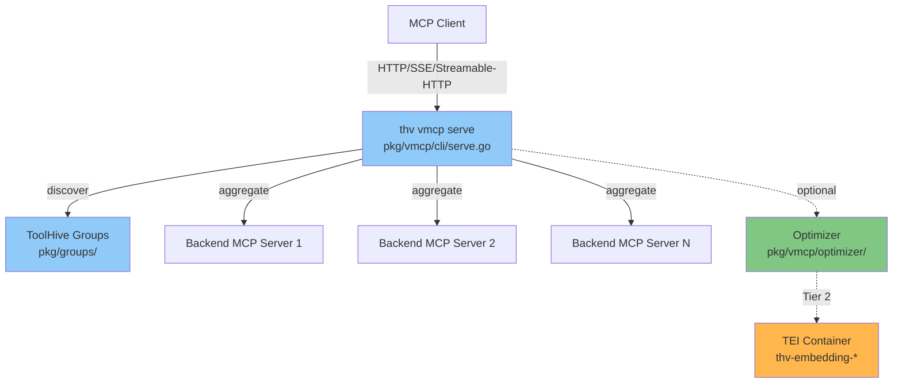
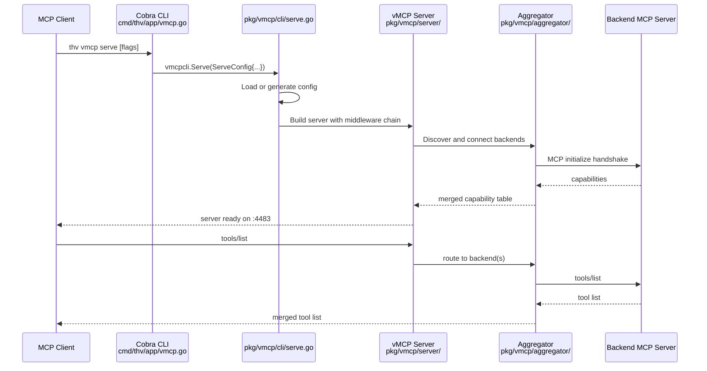
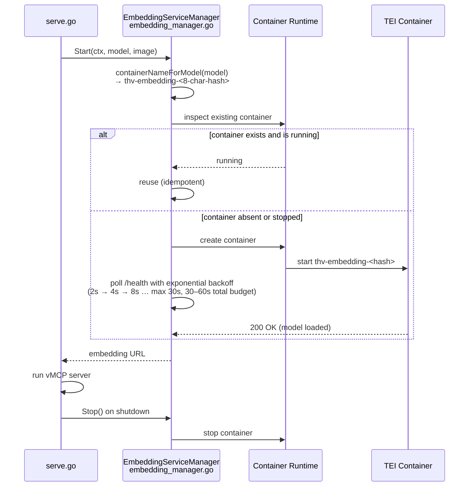

# Local vMCP CLI Mode

## Overview

The `thv vmcp` subcommand lets users run a Virtual MCP Server (vMCP) locally without Kubernetes. It aggregates multiple MCP server backends from a ToolHive group into a single unified endpoint that any MCP client can connect to.



## Why This Exists

The original vMCP deployment model required a Kubernetes cluster and a `VirtualMCPServer` CRD managed by the operator. This is well-suited for production multi-tenant environments but creates friction for local development and non-Kubernetes users.

`thv vmcp` provides the same aggregation, tool routing, and optimizer capabilities without requiring a cluster. It runs as a foreground process driven by Cobra CLI flags, with a zero-config quick mode for the common case of aggregating a local ToolHive group.

This path replaces the earlier Python [`StacklokLabs/mcp-optimizer`](https://github.com/StacklokLabs/mcp-optimizer) project (see [Migration from mcp-optimizer](#migration-from-stacklok-labsmcp-optimizer)).

## How It Works

The `thv vmcp` command has three subcommands:

| Subcommand | Purpose |
|------------|---------|
| `thv vmcp init` | Generate a starter YAML config from a running group |
| `thv vmcp validate` | Validate a YAML config for syntax and semantic errors |
| `thv vmcp serve` | Start the aggregated vMCP server |

### Request Path



**Implementation**: `cmd/thv/app/vmcp.go`, `pkg/vmcp/cli/serve.go`

## Key Components

### Zero-Config Quick Mode

When `--config` is omitted and `--group` is set, `thv vmcp serve` generates an in-memory YAML configuration from the named ToolHive group. No configuration file is required.

Security requirement: the server always binds to `127.0.0.1` (loopback only) in quick mode. The `--host` flag allows overriding this only when a config file is explicitly provided.

**Implementation**: `pkg/vmcp/cli/serve.go` — `buildConfigFromGroup()`

### Config-File Mode

The recommended workflow for reproducible or customized deployments:

```
thv vmcp init --group <group-name> --output vmcp.yaml
# review and edit vmcp.yaml
thv vmcp validate --config vmcp.yaml
thv vmcp serve --config vmcp.yaml
```

`thv vmcp init` discovers running workloads in the given group and writes a starter YAML pre-populated with one `backends` entry per accessible workload.

**Implementation**: `pkg/vmcp/cli/init.go`

### Optimizer Tiers

`thv vmcp serve` supports an optional tool optimizer that exposes `find_tool` and `call_tool` instead of passing all backend tools through to the client. This is useful when the aggregated tool count is large.

| Tier | Flag(s) | Optimizer | External Service | Exposed Tools |
|------|---------|-----------|-----------------|---------------|
| 0 | (none) | None | None | All backend tools passed through |
| 1 | `--optimizer` | FTS5 keyword (SQLite in-process) | None | `find_tool`, `call_tool` only |
| 2 | `--optimizer-embedding` | FTS5 + TEI semantic | Managed TEI container | `find_tool`, `call_tool` only |
| 3 | `optimizer.embeddingService` in config YAML | FTS5 + external embedding service | User-managed | `find_tool`, `call_tool` only |

Tier 2 (`--optimizer-embedding`) implies `--optimizer`. The TEI container is started automatically and stopped on server shutdown.

**Implementation**: `pkg/vmcp/optimizer/optimizer.go`, `pkg/vmcp/cli/embedding_manager.go`

### TEI Container Lifecycle (Tier 2)

When `--optimizer-embedding` is set, ToolHive manages a HuggingFace Text Embeddings Inference (TEI) container for semantic search.



**Container naming**: `thv-embedding-<model-short-hash>` where the hash is the first 8 hex characters of the SHA-256 of the model name. This avoids invalid container-name characters (e.g., slashes in `BAAI/bge-small-en-v1.5`).

**Idempotent reuse**: if a container with the correct name is already running, ToolHive reuses it without restarting. This means repeated `thv vmcp serve` invocations do not re-pull or restart TEI unnecessarily.

**Health polling**: exponential backoff starting at 2 s, multiplier 2, cap at 30 s. First-start budget is 30–60 s (time for the model to download and load). If `--optimizer-embedding` is set explicitly and the container fails to become healthy, the server exits immediately (fail-fast).

**Graceful shutdown**: when `thv vmcp serve` exits, `EmbeddingServiceManager.Stop()` stops the TEI container.

**Implementation**: `pkg/vmcp/cli/embedding_manager.go`

#### ARM64 / Apple Silicon Note

The default TEI image (`ghcr.io/huggingface/text-embeddings-inference:cpu-latest`) is published as an `amd64`-only image. On Apple Silicon Macs, Docker/OrbStack runs it via Rosetta 2 x86-64 emulation. This works but is slower than native. A future improvement may select an ARM64-native image automatically; for now, `cpu-latest` is the only supported CPU path.

## Implementation

Key files:

| File | Role |
|------|------|
| `cmd/thv/app/vmcp.go` | Cobra command definitions; flag parsing |
| `pkg/vmcp/cli/serve.go` | `Serve()` entry point; config loading, optimizer wiring, server start |
| `pkg/vmcp/cli/init.go` | `Init()` entry point; workload discovery and YAML template generation |
| `pkg/vmcp/cli/validate.go` | `Validate()` entry point; config file validation |
| `pkg/vmcp/cli/embedding_manager.go` | TEI container lifecycle (Tier 2) |
| `pkg/vmcp/optimizer/optimizer.go` | `GetAndValidateConfig`, `NewOptimizerFactory` |
| `pkg/vmcp/config/config.go` | `Config` struct; `OptimizerConfig.EmbeddingService` for Tier 3 |

## Migration from StacklokLabs/mcp-optimizer

The Python [`StacklokLabs/mcp-optimizer`](https://github.com/StacklokLabs/mcp-optimizer) project is **deprecated** in favour of the Go-native `thv vmcp serve --optimizer`. The Go implementation ships in every ToolHive release, requires no separate Python environment, and is fully integrated with ToolHive's container and group management.

### Feature Parity

| mcp-optimizer feature | `thv vmcp` equivalent |
|-----------------------|-----------------------|
| Keyword (FTS5) search | `thv vmcp serve --optimizer` |
| Semantic (embedding) search | `thv vmcp serve --optimizer-embedding` |
| Custom embedding model | `--embedding-model <HuggingFace model name>` |
| Custom TEI image | `--embedding-image <image ref>` |
| External embedding service | `optimizer.embeddingService` in config YAML (Tier 3) |

### Migration Steps

1. Stop the Python `mcp-optimizer` process.
2. Ensure ToolHive is up to date (`thv version`).
3. Run `thv vmcp init --group <your-group> --output vmcp.yaml` to generate a config from your current group.
4. Start with `thv vmcp serve --group <your-group> --optimizer` (quick mode) or `thv vmcp serve --config vmcp.yaml --optimizer` (config-file mode).
5. Update any MCP client configuration to point at the new `thv vmcp` endpoint (default `http://127.0.0.1:4483`).

## Related Documentation

- [Virtual MCP Server Architecture](10-virtual-mcp-architecture.md) — Kubernetes-side vMCP (CRD, operator, backend discovery)
- [vMCP Library Embedding](vmcp-library.md) — Embedding `pkg/vmcp/` in downstream Go projects
- [Groups](07-groups.md) — ToolHive groups used as vMCP backend source
- [Deployment Modes](01-deployment-modes.md) — Local vs Kubernetes deployment comparison
