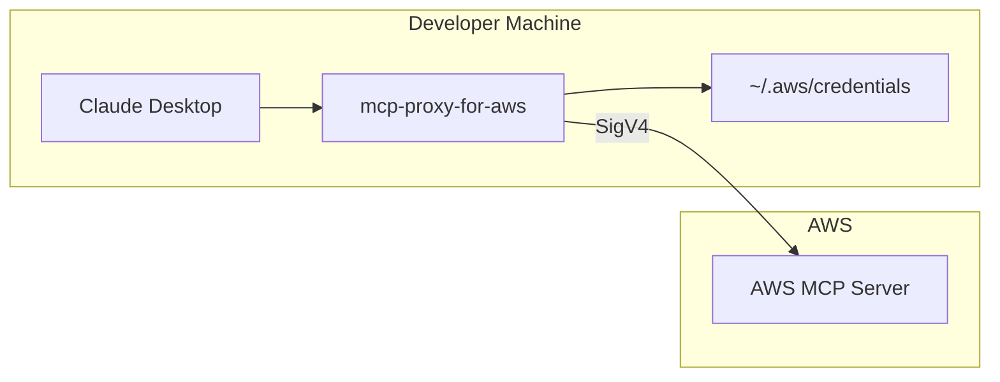
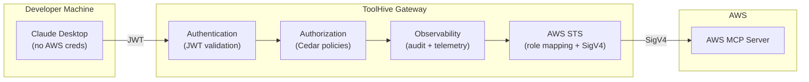

# Secure Enterprise Access to AWS MCP Server

## The Opportunity

AI assistants using MCP (Model Context Protocol) are transforming developer productivity. AWS MCP Server gives these assistants access to AWS services. Here's how the standard approach compares to ToolHive:

### AWS Recommended Approach

Each developer runs `mcp-proxy-for-aws` locally, which reads credentials from `~/.aws/`:



Setup: `aws configure sso` or `aws configure` on each machine.

### ToolHive Approach

Developers authenticate via SSO. ToolHive gateway handles AWS credentials centrally:



Setup: Developers just log in via Okta/Azure AD. No AWS CLI configuration.

### Why ToolHive?

| Challenge | AWS Approach | ToolHive |
|-----------|--------------|----------|
| **Credential location** | Each developer's `~/.aws/` | Centralized at gateway |
| **Identity provider** | AWS Identity Center | Any OIDC (Okta, Azure AD, Google) |
| **Audit logging** | CloudTrail (AWS-side only) | Gateway logs + CloudTrail, correlated |
| **Per-user permissions** | Configure IAM per user | Map IdP groups to IAM roles |
| **Onboarding** | AWS CLI setup per machine | SSO login, done |

---

## MVP: STS Direct Federation

This implementation uses direct STS federation via `AssumeRoleWithWebIdentity`—a straightforward approach well-suited for single-account or small multi-account deployments.

### How It Works

When a developer authenticates with Okta, their JWT contains a custom claim for AWS session tags:

```json
"https://aws.amazon.com/tags/principal_tags/Groups": "s3-readers:Everyone"
```

ToolHive's role mapper matches these groups against configured role mappings to select the appropriate IAM role. The gateway then calls AWS STS `AssumeRoleWithWebIdentity`, passing the user's groups as session tags. This enables defense in depth: ToolHive enforces role selection at the gateway, while AWS ABAC policies verify the session tags at the AWS layer.

```yaml
role_mappings:
  - claim: s3-readers
    role_arn: arn:aws:iam::ACCOUNT:role/S3ReadOnlyMCPRole
  - claim: ec2-viewers
    role_arn: arn:aws:iam::ACCOUNT:role/EC2ViewOnlyMCPRole
```

| User | IdP Group | S3 Access | EC2 Access |
|------|-----------|-----------|------------|
| Alice | s3-readers | Allowed | Denied |
| Bob | ec2-viewers | Denied | Allowed |

### Why This Approach for MVP

- **Simple setup**: One OIDC provider, a few IAM roles, done
- **Instant group changes**: Okta group membership changes take effect on the next authentication—no sync lag
- **No additional infrastructure**: No SCIM provisioning, no Identity Center configuration
- **Full control**: Gateway explicitly maps claims to roles with priority-based selection

### Credential Management

| Capability | Benefit |
|------------|---------|
| Temporary credentials | 1-hour maximum lifetime, auto-refresh |
| SSO integration | Okta, Azure AD, any OIDC provider |
| No credential distribution | Nothing to leak, rotate, or revoke |

### Fine-Grained Authorization

Beyond IAM role selection, Cedar policies at the gateway control which MCP tools users can invoke:

```cedar
permit(
  principal in Group::"data-analysts",
  action in [Action::"tools/call"],
  resource
) when {
  resource.tool_name == "aws___call_aws" &&
  resource.arguments.cli_command.startsWith("aws s3 ls")
};
```

---

## Visibility & Compliance

### Audit Trail

Every action is logged with user attribution:

**Gateway (ToolHive):**
- User identity, tool called, arguments, timestamp
- OpenTelemetry traces for request lifecycle
- 20+ event types captured

**AWS (CloudTrail):**
```json
{
  "userIdentity": {
    "arn": "...assumed-role/S3ReadOnlyRole/alice@company.com",
    "principalTag": {"Groups": "s3-readers:Everyone"}
  },
  "eventName": "ListBuckets"
}
```

### Observability

- **OpenTelemetry**: Distributed tracing and metrics
- **Prometheus**: Metrics export for dashboards
- **Correlation IDs**: Link gateway logs to CloudTrail events

### Compliance Support

| Framework | Relevant Controls |
|-----------|-------------------|
| SOC2 | CC6.1 (logical access), CC7.2 (monitoring) |
| HIPAA | 164.312(b) audit, 164.312(d) authentication |
| PCI-DSS | 7.1 (least privilege), 10.2 (audit trails) |

---

## Value Summary

| Stakeholder | Benefit |
|-------------|---------|
| **Security** | Zero long-lived credentials, complete audit trail, policy enforcement |
| **Platform** | Single configuration point, group-based access via IdP |
| **Developers** | SSO experience, no credential management |

---

## Configuration

```yaml
oidc_config:
  issuer: https://your-okta.okta.com/oauth2/default
  audience: aws-mcp

aws_sts_config:
  region: us-east-1
  role_claim: https://aws.amazon.com/tags/principal_tags/Groups
  role_mappings:
    - claim: s3-readers
      role_arn: arn:aws:iam::ACCOUNT:role/S3ReadOnlyMCPRole
    - claim: ec2-viewers
      role_arn: arn:aws:iam::ACCOUNT:role/EC2ViewOnlyMCPRole
  role_arn: arn:aws:iam::ACCOUNT:role/DefaultMCPRole
```

---

## Future: IAM Identity Center

For organizations scaling beyond a handful of AWS accounts, IAM Identity Center offers a more centralized approach with two integration patterns.

### Pattern 1: Permission Sets

As organizations grow to many AWS accounts (dev, staging, prod, per-team), STS Direct requires an OIDC provider and IAM roles in each account. For fifty accounts with three permission levels, that's 150 roles to manage.

Identity Center addresses this with Permission Sets—centrally defined policy templates that automatically deploy as IAM roles across your AWS Organization. A single Permission Set update propagates to every account. Your Okta groups sync via SCIM, so the same group memberships drive access—though changes propagate through the sync pipeline (~40 minutes) rather than instantly.

**Trade-off**: More centralized management, but requires SCIM infrastructure and AWS Organizations.

### Pattern 2: Trusted Identity Propagation

For data-centric workloads, Trusted Identity Propagation offers a fundamentally different model. Instead of the gateway selecting an IAM role based on claims, the gateway simply propagates the user's identity to AWS. Authorization decisions move to the AWS service layer—S3 Access Grants, Lake Formation, Redshift—which evaluate all the user's group memberships against fine-grained resource grants.

This eliminates gateway-side role mappings entirely. A user in both `s3-readers` and `ec2-admins` groups gets access to everything their groups allow, evaluated at the resource level. CloudTrail shows the actual user identity, not just "role assumed."

**Trade-off**: Only works with specific AWS services (S3 Access Grants, Lake Formation, Redshift, Athena). General AWS API access still requires the role-based approach.

### When to Consider Identity Center

- **50+ AWS accounts**: Permission Sets dramatically reduce management overhead
- **AWS Control Tower**: Identity Center is the natural fit
- **Data-centric access patterns**: Trusted Identity Propagation with S3 Access Grants or Lake Formation
- **User-centric audit requirements**: First-class user identity in CloudTrail

For single-account deployments or teams that need instant IdP group changes, STS Direct delivers robust security with minimal operational footprint.
