# ToolHive Domain Model

This document describes the key domain concepts in ToolHive and their relationships.

## Domain Concepts Overview

### Core MCP Concepts

#### **MCP (Model Context Protocol)**
The foundational protocol for enabling LLM tools to interact with external systems. This is the central concept around which ToolHive is built. MCP defines how language models can discover and use tools, prompts, and resources provided by servers.

#### **MCP Server**
A containerized service that implements the MCP protocol, providing tools, prompts, or resources to LLM clients. Can be either local (container-based) or remote (HTTP/HTTPS accessed). Each MCP server exposes a set of capabilities that clients can discover and invoke.

#### **Feature** (MCP Feature)
Three main types of capabilities MCP servers provide:
- **Tools**: Functions that can be called by the LLM to perform actions (e.g., file operations, API calls)
- **Prompts**: Templates for LLM interactions that provide structured guidance
- **Resources**: Data providing context to the LLM (e.g., file contents, API responses)

#### **Operation** (MCP Operation)
Actions performed on features:
- **list**: Get a list of available items (tools, prompts, resources)
- **get**: Retrieve a specific prompt
- **call**: Execute a specific tool
- **read**: Access a specific resource

---

### Registry & Discovery

#### **Registry**
Centralized catalog of available MCP servers with metadata including images, permissions, environment variables, and provenance information. Contains both container-based servers and remote servers. The registry enables users to discover, search, and deploy MCP servers from a trusted source.

#### **Image Metadata**
Registry information about container-based MCP servers including:
- Docker image reference and available tags
- Target port for network communication
- Permission profiles defining security boundaries
- Environment variables and their configurations
- Command-line arguments
- Provenance and attestation data

#### **Remote Server Metadata**
Registry information about HTTP/HTTPS accessible MCP servers including:
- Server URL endpoint
- Authentication headers and OAuth configuration
- Required environment variables
- Transport type (SSE or streamable-http)

#### **Group**
A logical collection of related MCP servers that can be deployed together as a unit (e.g., "developer tools", "data analytics suite"). Groups enable batch operations and organized management of related servers.

#### **Provenance**
Cryptographic verification metadata for container images using Sigstore, including:
- Sigstore attestation URL
- Repository URI and reference
- Signer identity and certificate issuer
- Runner environment information
- Verified attestation predicates

---

### Deployment & Runtime

#### **Workload**
A complete deployment unit consisting of the primary MCP server container, optional sidecars, networking, volumes, and security policies. Abstracts away the complexity of orchestrating multiple interconnected components. A workload represents everything needed to run an MCP server in production.

#### **Runtime**
Container orchestration platform abstraction supporting Docker, Podman, Colima, and Kubernetes. Provides unified interface for workload lifecycle management including:
- Deploying and starting workloads
- Stopping and removing workloads
- Listing active workloads
- Retrieving logs and status information
- Health checking

Supported runtime types:
- **Docker**: Standard Docker Engine
- **Podman**: Daemonless container engine
- **Colima**: Docker-compatible runtime for macOS
- **Kubernetes**: Full orchestration platform for production deployments

#### **Sidecar**
Additional containers running alongside the primary MCP server for cross-cutting concerns like logging, monitoring, or proxying. Sidecars share the same network namespace and lifecycle as the main container.

#### **Egress Proxy**
Specialized sidecar that filters and controls outbound network traffic from MCP servers based on permission profiles. Enforces network security policies by allowing only approved destinations.

#### **Container Monitor**
Watches running containers for unexpected exits and lifecycle events. Enables automatic restart policies and failure detection.

---

### Transport & Communication

#### **Transport**
Communication protocol for MCP servers. Different transports suit different deployment scenarios:

- **stdio**: Standard input/output communication, suitable for local CLI tools
- **SSE**: Server-Sent Events for streaming, works over HTTP with unidirectional server-to-client streaming
- **streamable-http**: Custom HTTP streaming protocol with bidirectional capabilities
- **HTTP**: Traditional request/response for stateless interactions

#### **Proxy Mode**
For stdio transport, the proxy mode determines how the proxy communicates with clients (sse or streamable-http). Direct transports (sse, streamable-http) use their native protocol. This enables stdio-based MCP servers to be accessed over the network.

#### **Session**
Active connection state between a client and an MCP server through a transport, with lifecycle management for cleanup. Sessions track:
- Client identity
- Active transport connection
- Request/response correlation
- Resource cleanup on disconnect

---

### Client Integration

#### **Client**
MCP client applications that consume MCP servers. ToolHive manages configuration files for these clients, automatically updating them with available server endpoints. Supported clients include:

- **VS Code**: Standard Visual Studio Code editor
- **VS Code Insiders**: Preview version of VS Code
- **Cursor**: AI-first code editor
- **Claude Code**: Claude's official CLI
- **Cline**: VS Code extension for Claude integration
- **Windsurf**: Codeium's IDE
- **Windsurf JetBrains**: Windsurf plugin for JetBrains IDEs
- **Amp CLI**: Sourcegraph's CLI tool
- **Amp Extensions**: Sourcegraph extensions for various editors
- **LM Studio**: Local LLM runtime
- **Goose**: AI agent framework

#### **Discovery**
Automatic detection of installed MCP clients on the system and their configuration file locations based on platform-specific paths. Discovery scans standard locations for each supported client and validates configuration file formats.

---

### Security & Permissions

#### **Permission Profile**
Security configuration defining filesystem access (read/write paths), network permissions (outbound hosts/ports), and container capabilities. Can be builtin (like "none" or "network") or custom (defined in ConfigMaps for Kubernetes).

Permission profiles implement defense-in-depth by:
- Restricting filesystem access to explicitly allowed paths
- Limiting network egress to approved hosts and ports
- Dropping unnecessary container capabilities
- Enforcing read-only mounts where possible

#### **Network Permissions**
Defines outbound network access controls:
- Allowlist of hostnames/IPs
- Allowlist of ports
- InsecureAllowAll flag for development (not recommended for production)

#### **Secret**
Sensitive configuration data stored securely and injected into containers as environment variables. Supported backends:
- **1Password**: Integration with 1Password CLI
- **Encrypted Storage**: AES-encrypted local storage
- **Kubernetes Secrets**: Native K8s secret management

Secrets are never logged or exposed in configuration files.

#### **Authorization (Cedar)**
Policy-based authorization using Amazon's Cedar policy language to control access to MCP features (tools, prompts, resources) based on client identity and JWT claims.

Cedar policies define:
- Principal (who is making the request)
- Action (what operation is being performed)
- Resource (what is being accessed)
- Context (additional information like JWT claims, arguments)

Enables fine-grained access control like "allow client X to call tool Y only during business hours".

#### **Authentication (OIDC/OAuth)**
Identity verification supporting multiple methods:
- **Anonymous**: No authentication (local development only)
- **Local Token**: Simple bearer token validation
- **OIDC/OAuth2**: Industry-standard authentication for production
- **Kubernetes Service Accounts**: Native K8s identity for pod-to-pod communication

Authentication happens before authorization and establishes the principal identity.

#### **Ignore Config**
Configuration for filtering bind mount contents using `.thvignore` patterns (similar to `.gitignore`), creating tmpfs overlays to hide sensitive files from MCP servers. This prevents accidental exposure of secrets, credentials, or private keys that might exist in mounted directories.

---

### Configuration & State

#### **Run Configuration (RunConfig)**
Persistent state for a running MCP server instance including:
- Runtime settings and deployment options
- Proxy configuration and mode
- Group membership
- Connection details and URLs
- Environment variables and secrets

Stored locally in `~/.toolhive/` or in Kubernetes as part of the MCPServer resource.

#### **Environment Variable (EnvVar)**
Configuration passed to MCP servers with rich metadata:
- Name and description
- Required vs optional
- Secret vs plain text
- Default values
- Validation choices (enumerated options)

#### **Port Binding**
Mapping between container internal ports and host machine ports for network-exposed services. Includes:
- Container port and protocol
- Host IP and port
- Automatic port allocation support

#### **Resource Requirements**
CPU and memory limits/requests for container scheduling and runtime constraints. Follows Kubernetes resource specification format:
- Limits: Maximum resources allowed
- Requests: Minimum resources guaranteed

#### **Tool Filter**
Mechanism to restrict which tools from an MCP server are exposed to clients, supporting allowlists and denylists. Enables security policies like "only expose read-only tools" or "hide administrative functions".

---

### Kubernetes Resources (Operator)

#### **MCPServer CRD (Custom Resource Definition)**
Kubernetes resource defining an MCP server deployment including:
- Container image and version
- Transport type and proxy mode
- Port configuration
- Environment variables and secrets
- Volume mounts
- Permission profile reference
- OIDC/OAuth authentication config
- Cedar authorization policies
- Audit logging settings
- Telemetry configuration
- Tool filtering
- Pod template customization

The operator watches MCPServer resources and reconciles actual state with desired state.

#### **MCPRegistry CRD**
Kubernetes resource for centralized registry management, supporting multiple sources:
- **Git**: Clone registries from Git repositories
- **HTTP**: Fetch registries from HTTP endpoints
- **ConfigMap**: Use K8s ConfigMaps as registry sources

Includes sync status tracking with phases: Pending, Syncing, Ready, Failed.

#### **MCPToolConfig CRD**
Kubernetes resource for filtering and renaming tools exposed by MCP servers, enabling fine-grained control over tool availability. Supports:
- Tool name filtering (allowlist/denylist)
- Tool renaming for clarity or namespace management
- Cross-namespace references (for security isolation)

#### **Status Collector Pattern**
Batched update mechanism for Kubernetes resource status to avoid conflicts. Collects all status changes and applies them atomically. Essential for high-concurrency operator scenarios where multiple reconciliation loops might try to update status simultaneously.

---

### Observability

#### **Audit Event**
NIST SP 800-53 compliant audit log entry tracking:
- **Who**: Subject identity (user, service account)
- **What**: Event type and operation
- **When**: Timestamp in UTC
- **Where**: Component and target resource
- **Why**: Outcome (success, failure, denied)
- **How**: Source (network, local) and additional context

Used for compliance, security investigations, and forensic analysis.

#### **Telemetry**
Observability configuration supporting:
- **OpenTelemetry (OTLP)**: Industry-standard distributed tracing and metrics
- **Prometheus**: Metrics scraping endpoint for Prometheus/Grafana stack

Telemetry can be configured per-MCPServer with:
- OTLP endpoint and authentication
- Service name for correlation
- Sampling rates for traces
- Metric collection intervals

---

### Additional Services

#### **Tunnel Provider**
Service for creating public URLs to locally running MCP servers (e.g., via ngrok) for remote access scenarios. Enables:
- Exposing local development servers to remote clients
- Testing webhooks and callbacks
- Sharing servers across networks without VPN

---

## Domain Model Diagram

The following Mermaid diagram visualizes the relationships between these concepts:

```mermaid
graph TD
    %% Top Level - Core MCP
    MCP[MCP Protocol]
    MCPServer[MCP Server]

    MCP --> MCPServer

    %% MCP Server Features
    MCPServer --> Feature[MCP Feature]
    Feature --> Tool[Tool]
    Feature --> Prompt[Prompt]
    Feature --> Resource[Resource]

    %% Registry Layer
    Registry[Registry]
    Registry --> ImageMeta[Image Metadata]
    Registry --> RemoteMeta[Remote Server Metadata]
    Registry --> Group[Group]

    ImageMeta --> Provenance[Provenance]
    MCPServer -.-> ImageMeta
    MCPServer -.-> RemoteMeta

    %% Workload and Runtime
    Workload[Workload]
    Workload --> MCPServer
    Workload --> PermProfile[Permission Profile]
    Workload --> Transport[Transport]

    PermProfile --> NetPerms[Network Permissions]
    PermProfile --> Secret[Secret]
    PermProfile -.-> Ignore[Ignore Config]

    Runtime[Runtime]
    Workload --> Runtime
    Runtime --> Docker[Docker]
    Runtime --> Podman[Podman]
    Runtime --> Colima[Colima]
    Runtime --> K8s[Kubernetes]

    %% Transport Types
    Transport --> Stdio[stdio]
    Transport --> SSE[SSE]
    Transport --> StreamHTTP[streamable-http]
    Transport --> HTTP[HTTP]

    Stdio --> Proxy[Proxy Mode]

    %% Client Layer
    Client[Client]
    Client --> Session[Session]
    Session --> Transport
    Session --> MCPServer

    Discovery[Discovery]
    Discovery -.-> Client

    %% Security
    Auth[Authentication<br/>OIDC/OAuth]
    Authz[Authorization<br/>Cedar]

    Auth --> Authz
    Authz --> Op[Operation]
    Op -.-> Tool
    Op -.-> Prompt
    Op -.-> Resource

    %% Kubernetes CRDs
    MCRD[MCPServer CRD]
    RegCRD[MCPRegistry CRD]
    ToolCRD[MCPToolConfig CRD]

    MCRD --> Workload
    MCRD --> PermProfile
    MCRD --> Auth
    MCRD --> Authz
    MCRD --> Telem[Telemetry]
    MCRD --> Audit[Audit Event]
    MCRD --> ToolCRD

    RegCRD --> Registry

    ToolCRD --> Filter[Tool Filter]
    Filter --> Tool

    %% Observability
    Telem --> OTLP[OpenTelemetry]
    Telem --> Prom[Prometheus]

    %% Configuration
    RunCfg[Run Config]
    RunCfg --> EnvVar[Env Variables]
    RunCfg --> PortBind[Port Binding]
    RunCfg --> Group
    RunCfg --> Proxy

    Workload --> RunCfg

    %% Sidecars
    Workload --> Sidecar[Sidecar]
    Sidecar --> Egress[Egress Proxy]
    Egress --> NetPerms

    %% Monitoring
    Runtime --> Monitor[Container Monitor]

    %% Additional
    Tunnel[Tunnel Provider]
    Tunnel -.-> Session

    Status[Status Collector]
    MCRD -.-> Status
    RegCRD -.-> Status

    %% Styling
    classDef mcp fill:#e1f5ff,stroke:#01579b,stroke-width:2px
    classDef reg fill:#fff4e6,stroke:#e65100,stroke-width:2px
    classDef wl fill:#f3e5f5,stroke:#4a148c,stroke-width:2px
    classDef trans fill:#e8f5e9,stroke:#1b5e20,stroke-width:2px
    classDef cli fill:#fce4ec,stroke:#880e4f,stroke-width:2px
    classDef sec fill:#ffebee,stroke:#b71c1c,stroke-width:2px
    classDef k8s fill:#e3f2fd,stroke:#0d47a1,stroke-width:2px
    classDef obs fill:#f1f8e9,stroke:#33691e,stroke-width:2px

    class MCP,MCPServer,Feature,Tool,Prompt,Resource mcp
    class Registry,ImageMeta,RemoteMeta,Group,Provenance reg
    class Workload,Runtime,Docker,Podman,Colima,K8s,Sidecar,Egress,Monitor wl
    class Transport,Stdio,SSE,StreamHTTP,HTTP,Proxy,Session trans
    class Client,Discovery cli
    class PermProfile,NetPerms,Secret,Auth,Authz,Ignore,Op sec
    class MCRD,RegCRD,ToolCRD,Status k8s
    class Audit,Telem,OTLP,Prom obs
```

## Key Relationships

### Solid Arrows (-->)
Direct composition or "has-a" relationships:
- A Workload contains an MCP Server
- A Registry contains Image Metadata and Remote Server Metadata
- A Runtime manages Docker, Podman, Colima, or Kubernetes
- An MCP Server exposes Features (Tools, Prompts, Resources)

### Dotted Arrows (-.->)
Weaker associations or "uses" relationships:
- Operations use Features
- Discovery locates Clients
- Authorization checks Operations on Features

## Architecture Flows

### MCP Server Deployment Flow
1. User selects server from **Registry** (with **Image Metadata**)
2. **Run Config** created with desired settings
3. **Runtime** creates **Workload** with:
   - MCP Server container
   - **Permission Profile** enforced
   - **Secrets** injected as environment variables
   - **Egress Proxy** sidecar (if network restrictions apply)
4. **Container Monitor** watches for failures
5. **Client** connects via **Transport** creating a **Session**

### Authorization Flow
1. **Client** authenticates via **Auth** (OIDC/OAuth)
2. Client attempts **Operation** on a **Feature**
3. **Authorization (Cedar)** evaluates policy based on:
   - Client identity (principal)
   - Operation type (action)
   - Feature being accessed (resource)
   - JWT claims and arguments (context)
4. **Audit Event** logged with outcome
5. If authorized, operation proceeds; otherwise, denied

### Kubernetes Operator Flow
1. User creates **MCPServer CRD** in cluster
2. Operator reconciles by:
   - Creating **Workload** via **Runtime** (Kubernetes)
   - Applying **Permission Profile** as security context
   - Mounting **Secrets** from Kubernetes
   - Configuring **Auth** and **Authz**
   - Setting up **Telemetry** exporters
3. **Status Collector** batches updates to avoid conflicts
4. **MCPToolConfig CRD** filters exposed tools
5. Server URL published in status

### Registry Sync Flow (Kubernetes)
1. User creates **MCPRegistry CRD**
2. Operator fetches from source (Git, HTTP, ConfigMap)
3. **Status Collector** updates sync phase
4. **Registry** data cached and exposed via API
5. MCPServer resources can reference registry entries

---

## Implementation Notes

### Package Organization
- `pkg/client/`: Client configuration and discovery
- `pkg/registry/`: Registry types and providers
- `pkg/container/runtime/`: Runtime abstraction and implementations
- `pkg/transport/`: Transport protocols and session management
- `pkg/authz/`: Cedar authorization engine
- `pkg/auth/`: Authentication providers
- `pkg/audit/`: Audit event logging
- `pkg/workloads/`: Workload lifecycle management
- `pkg/permissions/`: Permission profile handling
- `pkg/secrets/`: Secret storage backends
- `pkg/telemetry/`: OpenTelemetry integration
- `cmd/thv/`: CLI application
- `cmd/thv-operator/`: Kubernetes operator
- `cmd/thv-proxyrunner/`: Proxy runner for stdio servers

### Design Patterns
- **Factory Pattern**: Runtime creation, transport selection
- **Strategy Pattern**: Different authentication/authorization strategies
- **Observer Pattern**: Container monitoring, audit events
- **Repository Pattern**: Registry access, state storage
- **Adapter Pattern**: Multiple client configuration formats
- **Decorator Pattern**: Transport wrapping, telemetry middleware
