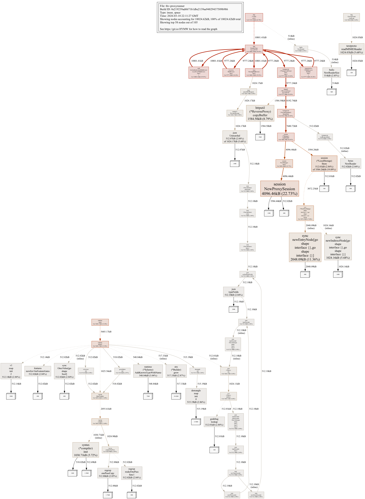
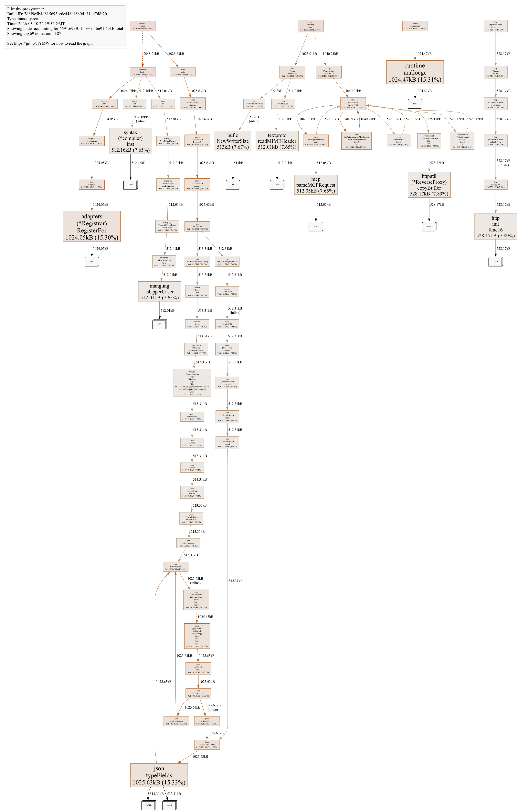

# Proxyrunner OOMKilled: Session Leak in Transparent Proxy

**Issue**: [#4062](https://github.com/stacklok/toolhive/issues/4062)
**Date**: March 2026
**Component**: `thv-proxyrunner` (streamable-http transport)

## Problem

The proxyrunner container was being OOMKilled (128Mi limit) under sustained session churn. Even with clean session lifecycles (initialize → notify initialized → tools/list → echo x2 →
  DELETE), memory grew monotonically and was never reclaimed, eventually crashing the pod.

## Root Cause

The transparent proxy (`pkg/transport/proxy/transparent/transparent_proxy.go`) creates a session in its own `session.Manager` whenever it sees an `Mcp-Session-Id` header in a response. However, it had **no code to delete sessions** when a DELETE request was forwarded.

Sessions were only cleaned up by the TTL cleanup routine, which runs every `TTL/2` (1 hour with the default 2-hour TTL). During sustained load, tens of thousands of session objects accumulated in the transparent proxy's session manager, growing memory monotonically until the pod was OOMKilled.

In pprof output this manifested as growing allocations from:
- `session.NewProxySession` — the session objects held in the map
- `internal/sync.newEntryNode` — `sync.Map` internal hash table entry nodes
- `internal/sync.newIndirectNode` — `sync.Map` internal hash table indirect nodes

These were initially suspected to be a `sync.Map` data structure issue, but testing proved the `sync.Map` growth was a symptom of sessions never being deleted — not a problem with `sync.Map` itself. When sessions are deleted promptly, the `sync.Map` only holds a small number of concurrent entries and its bucket structure stays bounded.

## Debugging with pprof

We used Go's built-in heap profiler to inspect live allocations on the running proxyrunner pod. The pprof endpoint was exposed at `:6060` via a debug server added to the proxyrunner.

### Enabling pprof in the proxyrunner

Apply this diff to `cmd/thv-proxyrunner/main.go`:

```diff
 import (
 	"log/slog"
+	"net/http"
+	_ "net/http/pprof" //nolint:gosec // G108: pprof for debugging
 	"os"

 	"github.com/spf13/viper"
@@ main()
 	slog.SetDefault(l)

+	// Start pprof server for heap profiling
+	go func() {
+		slog.Debug("pprof server starting on :6060")
+		if err := http.ListenAndServe(":6060", nil); err != nil { //nolint:gosec // G114: debug server
+			slog.Error("pprof server error", "error", err)
+		}
+	}()
+
 	// Skip update check for completion command or if we are running in kubernetes
```

Then port-forward to the proxyrunner pod to access it locally:

```bash
kubectl port-forward pod/<proxyrunner-pod-name> 6060:6060
```

### Commands

```bash
# One-shot snapshot (text)
go tool pprof -inuse_space -top -nodecount=20 http://localhost:6060/debug/pprof/heap

# Continuous monitoring (1s refresh)
watch -n 1 'go tool pprof -inuse_space -top -nodecount=20 http://localhost:6060/debug/pprof/heap 2>/dev/null'
```

### Saving profiles and generating graphs

```bash
# Save a heap profile to disk for later analysis
curl -s http://localhost:6060/debug/pprof/heap > heap_50k_sessions.pb.gz

# Generate an SVG call graph (opens in browser)
go tool pprof -http=:8081 heap_50k_sessions.pb.gz

# Generate a PNG graph directly
go tool pprof -png -inuse_space heap_50k_sessions.pb.gz > heap_graph.png

# Generate an SVG graph directly
go tool pprof -svg -inuse_space heap_50k_sessions.pb.gz > heap_graph.svg

# Compare two profiles (e.g. before and after a fix)
go tool pprof -base heap_baseline.pb.gz -png heap_50k_sessions.pb.gz > heap_diff.png
```

The `-http=:8081` flag launches an interactive web UI at `http://localhost:8081` with multiple views:

- **Top**: ranked list of allocations (same as `-top` CLI output)
- **Graph**: call graph with box sizes proportional to allocation size — the most useful view for identifying leak sources
- **Flame Graph**: flame graph visualization showing the full call stack
- **Source**: line-level allocation annotations on source code

When comparing profiles with `-base`, the graph highlights only the *difference* between the two snapshots — useful for isolating what grew between two points in time.

### Key pprof columns

| Column | Meaning |
|--------|---------|
| `flat` | Memory directly allocated by this function |
| `flat%` | Flat as percentage of total heap |
| `sum%` | Running cumulative total of flat% |
| `cum` | Memory allocated by this function + everything it calls |
| `cum%` | Cum as percentage of total heap |

### A note on GC and pprof snapshots

Some allocations (particularly `ReverseProxy.copyBuffer`, `bufio.NewReaderSize`, `bufio.NewWriterSize`, and `net/textproto.readMIMEHeader`) appeared and disappeared between pprof snapshots. These are transient in-flight request buffers that get cleaned up when GC runs. For example, `ReverseProxy.copyBuffer` showed 2.6 MB in one snapshot and dropped to 528 KB in the next — this is normal GC behavior reclaiming short-lived allocations between cycles.

The critical distinction: these transient allocations are **bounded** by the number of concurrent in-flight requests and fluctuate around a stable level. The session-related allocations (`NewProxySession`, `newEntryNode`, `newIndirectNode`) were **monotonically increasing** — they never dropped between snapshots regardless of GC activity, because sessions were never deleted from the transparent proxy's session manager.

## Test methodology

All measurements were taken using the `memory_test.go` e2e test (`test/e2e/thv-operator/virtualmcp/memory_test.go`) running clean session lifecycles: initialize → DELETE. The test used 50 concurrent workers with HTTP keep-alives enabled, targeting a proxyrunner pod with a 128Mi memory limit.

```
KUBECONFIG=/Users/chrisburns/projects/stacklok/toolhive/kconfig.yaml MEMLEAK_TEST_URL="http://localhost:${NODE_PORT}/mcp"
ginkgo -v --focus="does not OOM after 100000 session lifecycles" --timeout=30m \
  ./test/e2e/thv-operator/virtualmcp/
  ```

<details>
<summary> Testing Code

```golang
// SPDX-FileCopyrightText: Copyright 2025 Stacklok, Inc.
// SPDX-License-Identifier: Apache-2.0

package virtualmcp

import (
	"bufio"
	"bytes"
	"encoding/json"
	"fmt"
	"net/http"
	"os"
	"strings"
	"sync"
	"sync/atomic"
	"time"

	. "github.com/onsi/ginkgo/v2"
	. "github.com/onsi/gomega"
	corev1 "k8s.io/api/core/v1"
	metav1 "k8s.io/apimachinery/pkg/apis/meta/v1"
	"sigs.k8s.io/controller-runtime/pkg/client"

	mcpv1alpha1 "github.com/stacklok/toolhive/cmd/thv-operator/api/v1alpha1"
	"github.com/stacklok/toolhive/test/e2e/images"
)

var _ = Describe("Proxyrunner memory under session churn", Ordered, func() {
	var (
		testNamespace   = "default"
		mcpServerName   = "yardstick-memleak-test"
		timeout         = 3 * time.Minute
		pollingInterval = 1 * time.Second
		baseURL         string
		deployed        bool // true if we created the MCPServer (need to clean up)
	)

	BeforeAll(func() {
		// Allow pre-deployed server via env var to separate deploy from test.
		if u := os.Getenv("MEMLEAK_TEST_URL"); u != "" {
			baseURL = u
			GinkgoWriter.Printf("Using pre-deployed server at %s\n", baseURL)
			return
		}

		deployed = true

		By("Ensuring MCPServer exists with tight memory limits")
		mcpServer := &mcpv1alpha1.MCPServer{}
		err := k8sClient.Get(ctx, client.ObjectKey{
			Name:      mcpServerName,
			Namespace: testNamespace,
		}, mcpServer)
		if err != nil {
			// Not found, so create it
			mcpServer = &mcpv1alpha1.MCPServer{
				ObjectMeta: metav1.ObjectMeta{
					Name:      mcpServerName,
					Namespace: testNamespace,
				},
				Spec: mcpv1alpha1.MCPServerSpec{
					Image:     images.YardstickServerImage,
					Transport: "streamable-http",
					ProxyPort: 8080,
					McpPort:   8080,
					Env: []mcpv1alpha1.EnvVar{
						{Name: "TRANSPORT", Value: "streamable-http"},
					},
					Resources: mcpv1alpha1.ResourceRequirements{
						Limits: mcpv1alpha1.ResourceList{
							CPU:    "200m",
							Memory: "128Mi",
						},
						Requests: mcpv1alpha1.ResourceList{
							CPU:    "50m",
							Memory: "64Mi",
						},
					},
					PermissionProfile: &mcpv1alpha1.PermissionProfileRef{
						Type: mcpv1alpha1.PermissionProfileTypeBuiltin,
						Name: "network",
					},
				},
			}
			Expect(k8sClient.Create(ctx, mcpServer)).To(Succeed())
		} else {
			GinkgoWriter.Printf("MCPServer %s already exists, will use existing one\n", mcpServerName)
		}

		By("Waiting for MCPServer to be running")
		Eventually(func() error {
			server := &mcpv1alpha1.MCPServer{}
			if err := k8sClient.Get(ctx, client.ObjectKeyFromObject(mcpServer), server); err != nil {
				return fmt.Errorf("failed to get MCPServer: %w", err)
			}
			if server.Status.Phase == mcpv1alpha1.MCPServerPhaseRunning {
				return nil
			}
			return fmt.Errorf("MCPServer not ready yet, phase: %s", server.Status.Phase)
		}, timeout, pollingInterval).Should(Succeed())

		By("Patching the operator-created proxy service to NodePort")
		proxyServiceName := fmt.Sprintf("mcp-%s-proxy", mcpServerName)
		var nodePort int32
		Eventually(func() error {
			svc := &corev1.Service{}
			if err := k8sClient.Get(ctx, client.ObjectKey{
				Name: proxyServiceName, Namespace: testNamespace,
			}, svc); err != nil {
				return fmt.Errorf("proxy service not found yet: %w", err)
			}
			if svc.Spec.Type != corev1.ServiceTypeNodePort {
				svc.Spec.Type = corev1.ServiceTypeNodePort
				if err := k8sClient.Update(ctx, svc); err != nil {
					return fmt.Errorf("failed to patch service to NodePort: %w", err)
				}
			}
			if len(svc.Spec.Ports) == 0 || svc.Spec.Ports[0].NodePort == 0 {
				return fmt.Errorf("nodePort not assigned yet")
			}
			nodePort = svc.Spec.Ports[0].NodePort

			if err := checkPortAccessible(nodePort, 1*time.Second); err != nil {
				return fmt.Errorf("nodePort %d not accessible: %w", nodePort, err)
			}
			if err := checkHTTPHealthReady(nodePort, 2*time.Second); err != nil {
				return fmt.Errorf("HTTP server not ready on port %d: %w", nodePort, err)
			}
			return nil
		}, timeout, pollingInterval).Should(Succeed())

		baseURL = fmt.Sprintf("http://localhost:%d/mcp", nodePort)
	})

	AfterAll(func() {
		if !deployed {
			return
		}
		By("Cleaning up MCPServer")
		_ = k8sClient.Delete(ctx, &mcpv1alpha1.MCPServer{
			ObjectMeta: metav1.ObjectMeta{Name: mcpServerName, Namespace: testNamespace},
		})
	})

	It("does not OOM after 100000 session lifecycles", func() {
		const (
			iterations  = 100000
			concurrency = 50
		)
		httpClient := &http.Client{
			Timeout: 30 * time.Second,
			Transport: &http.Transport{
				MaxIdleConns:        concurrency * 2,
				MaxIdleConnsPerHost: concurrency * 2,
				IdleConnTimeout:     30 * time.Second,
			},
		}

		By("Warming up: waiting for proxy to be ready for MCP traffic")
		Eventually(func() error {
			return tryMCPInitialize(httpClient, baseURL)
		}, 60*time.Second, 1*time.Second).Should(Succeed(),
			"proxy should become ready for MCP initialize requests")

		By(fmt.Sprintf("Running %d session lifecycles with %d concurrent workers", iterations, concurrency))
		var (
			completed atomic.Int64
			firstErr  atomic.Value
			wg        sync.WaitGroup
			work      = make(chan int, concurrency)
		)

		// Start workers
		for range concurrency {
			wg.Add(1)
			go func() {
				defer wg.Done()
				for i := range work {
					if firstErr.Load() != nil {
						return
					}
					if err := doSessionLifecycle(httpClient, baseURL, i); err != nil {
						firstErr.CompareAndSwap(nil, fmt.Errorf("iteration %d: %w", i, err))
						return
					}
					n := completed.Add(1)
					if n%500 == 0 {
						GinkgoWriter.Printf("  completed %d/%d session lifecycles\n", n, iterations)
					}
				}
			}()
		}

		// Feed work
		for i := range iterations {
			if firstErr.Load() != nil {
				break
			}
			work <- i
		}
		close(work)
		wg.Wait()

		By("Verifying pod is still running and was not OOMKilled")
		assertProxyrunnerHealthy(testNamespace, mcpServerName)

		if err := firstErr.Load(); err != nil {
			Fail(fmt.Sprintf("session loop stopped after %d/%d iterations: %v",
				completed.Load(), iterations, err))
		}
	})
})

// doSessionLifecycle runs a complete MCP session lifecycle, returning an error
// instead of failing the test directly. This allows the caller to check pod
// health when errors occur (e.g., due to OOMKill).
func doSessionLifecycle(httpClient *http.Client, baseURL string, iteration int) error {
	sessionID, err := doMCPInitialize(httpClient, baseURL, iteration)
	if err != nil {
		return fmt.Errorf("initialize: %w", err)
	}

	if err := doMCPNotifyInitialized(httpClient, baseURL, sessionID); err != nil {
		return fmt.Errorf("notify initialized: %w", err)
	}

	if err := doMCPToolsList(httpClient, baseURL, sessionID); err != nil {
		return fmt.Errorf("tools/list: %w", err)
	}

	if err := doMCPToolsCallEcho(httpClient, baseURL, sessionID, fmt.Sprintf("ping-%d-1", iteration)); err != nil {
		return fmt.Errorf("tools/call echo 1: %w", err)
	}

	if err := doMCPToolsCallEcho(httpClient, baseURL, sessionID, fmt.Sprintf("ping-%d-2", iteration)); err != nil {
		return fmt.Errorf("tools/call echo 2: %w", err)
	}

	if err := doMCPDeleteSession(httpClient, baseURL, sessionID); err != nil {
		return fmt.Errorf("delete session: %w", err)
	}

	return nil
}

// assertProxyrunnerHealthy checks that the proxyrunner pod has not been
// OOMKilled and has zero restarts.
func assertProxyrunnerHealthy(namespace, mcpServerName string) {
	podList := &corev1.PodList{}
	Expect(k8sClient.List(ctx, podList,
		client.InNamespace(namespace),
		client.MatchingLabels{
			"app.kubernetes.io/name":     "mcpserver",
			"app.kubernetes.io/instance": mcpServerName,
		},
	)).To(Succeed())
	Expect(podList.Items).NotTo(BeEmpty(), "expected at least one pod for MCPServer")

	for _, pod := range podList.Items {
		Expect(pod.Status.Phase).To(Equal(corev1.PodRunning),
			"pod %s should be Running, got %s", pod.Name, pod.Status.Phase)

		for _, cs := range pod.Status.ContainerStatuses {
			Expect(cs.RestartCount).To(Equal(int32(0)),
				"container %s in pod %s should have 0 restarts, got %d",
				cs.Name, pod.Name, cs.RestartCount)

			if cs.LastTerminationState.Terminated != nil {
				Expect(cs.LastTerminationState.Terminated.Reason).NotTo(Equal("OOMKilled"),
					"container %s in pod %s was OOMKilled", cs.Name, pod.Name)
			}
		}
	}
}

// ssePost sends a JSON-RPC POST with the required Accept header and reads the
// SSE response. Returns the HTTP status code, the Mcp-Session-Id header, and
// the JSON payload from the first "data:" line (if any). Returns an error
// instead of failing the test.
func ssePost(httpClient *http.Client, url, sessionID string, body []byte) (int, string, string, error) {
	req, err := http.NewRequest(http.MethodPost, url, bytes.NewReader(body))
	if err != nil {
		return 0, "", "", fmt.Errorf("creating request: %w", err)
	}
	req.Header.Set("Content-Type", "application/json")
	req.Header.Set("Accept", "application/json, text/event-stream")
	if sessionID != "" {
		req.Header.Set("Mcp-Session-Id", sessionID)
	}

	resp, err := httpClient.Do(req)
	if err != nil {
		return 0, "", "", fmt.Errorf("executing request: %w", err)
	}

	sessHdr := resp.Header.Get("Mcp-Session-Id")
	status := resp.StatusCode

	// Read the SSE body: scan for the first "data:" line, then close.
	var dataLine string
	scanner := bufio.NewScanner(resp.Body)
	for scanner.Scan() {
		line := scanner.Text()
		if strings.HasPrefix(line, "data: ") {
			dataLine = strings.TrimPrefix(line, "data: ")
			break
		}
	}
	_ = resp.Body.Close()

	return status, sessHdr, dataLine, nil
}

// mcpRequestBody builds a JSON-RPC 2.0 request body for MCP.
func mcpRequestBody(method string, id int, params map[string]any) ([]byte, error) {
	body := map[string]any{
		"jsonrpc": "2.0",
		"method":  method,
	}
	if id > 0 {
		body["id"] = id
	}
	if params != nil {
		body["params"] = params
	}
	return json.Marshal(body)
}

// tryMCPInitialize attempts a single MCP initialize+delete cycle, returning an
// error if it fails. Used with Eventually for the warmup phase.
func tryMCPInitialize(httpClient *http.Client, baseURL string) error {
	body, err := json.Marshal(map[string]any{
		"jsonrpc": "2.0",
		"id":      1,
		"method":  "initialize",
		"params": map[string]any{
			"protocolVersion": "2025-03-26",
			"capabilities":    map[string]any{},
			"clientInfo": map[string]any{
				"name":    "warmup-probe",
				"version": "1.0.0",
			},
		},
	})
	if err != nil {
		return err
	}

	req, err := http.NewRequest(http.MethodPost, baseURL, bytes.NewReader(body))
	if err != nil {
		return err
	}
	req.Header.Set("Content-Type", "application/json")
	req.Header.Set("Accept", "application/json, text/event-stream")

	resp, err := httpClient.Do(req)
	if err != nil {
		return fmt.Errorf("POST initialize: %w", err)
	}
	// Read until first data: line then close (SSE format)
	scanner := bufio.NewScanner(resp.Body)
	for scanner.Scan() {
		if strings.HasPrefix(scanner.Text(), "data: ") {
			break
		}
	}
	_ = resp.Body.Close()

	if resp.StatusCode != http.StatusOK {
		return fmt.Errorf("initialize returned %d, want 200", resp.StatusCode)
	}

	sessionID := resp.Header.Get("Mcp-Session-Id")
	if sessionID == "" {
		return fmt.Errorf("no Mcp-Session-Id in response")
	}

	// Clean up the warmup session
	delReq, err := http.NewRequest(http.MethodDelete, baseURL, nil)
	if err != nil {
		return err
	}
	delReq.Header.Set("Mcp-Session-Id", sessionID)
	delResp, err := httpClient.Do(delReq)
	if err != nil {
		return err
	}
	_ = delResp.Body.Close()

	return nil
}

// doMCPInitialize sends the initialize request and returns the session ID.
func doMCPInitialize(httpClient *http.Client, baseURL string, iteration int) (string, error) {
	body, err := mcpRequestBody("initialize", 1, map[string]any{
		"protocolVersion": "2025-03-26",
		"capabilities":    map[string]any{},
		"clientInfo": map[string]any{
			"name":    fmt.Sprintf("memleak-test-%d", iteration),
			"version": "1.0.0",
		},
	})
	if err != nil {
		return "", err
	}

	status, sessionID, _, err := ssePost(httpClient, baseURL, "", body)
	if err != nil {
		return "", err
	}
	if status != http.StatusOK {
		return "", fmt.Errorf("initialize returned %d, want 200", status)
	}
	if sessionID == "" {
		return "", fmt.Errorf("no Mcp-Session-Id in response")
	}

	return sessionID, nil
}

// doMCPNotifyInitialized sends the notifications/initialized notification.
func doMCPNotifyInitialized(httpClient *http.Client, baseURL, sessionID string) error {
	body, err := mcpRequestBody("notifications/initialized", 0, nil)
	if err != nil {
		return err
	}
	status, _, _, err := ssePost(httpClient, baseURL, sessionID, body)
	if err != nil {
		return err
	}
	if status < 200 || status >= 300 {
		return fmt.Errorf("notifications/initialized returned %d", status)
	}
	return nil
}

// doMCPToolsList sends tools/list and checks for a successful response.
func doMCPToolsList(httpClient *http.Client, baseURL, sessionID string) error {
	body, err := mcpRequestBody("tools/list", 2, map[string]any{})
	if err != nil {
		return err
	}
	status, _, _, err := ssePost(httpClient, baseURL, sessionID, body)
	if err != nil {
		return err
	}
	if status != http.StatusOK {
		return fmt.Errorf("tools/list returned %d, want 200", status)
	}
	return nil
}

// doMCPToolsCallEcho sends a tools/call for the yardstick "echo" tool.
func doMCPToolsCallEcho(httpClient *http.Client, baseURL, sessionID, input string) error {
	body, err := mcpRequestBody("tools/call", 3, map[string]any{
		"name": "echo",
		"arguments": map[string]any{
			"input": input,
		},
	})
	if err != nil {
		return err
	}
	status, _, _, err := ssePost(httpClient, baseURL, sessionID, body)
	if err != nil {
		return err
	}
	if status != http.StatusOK {
		return fmt.Errorf("tools/call echo returned %d, want 200", status)
	}
	return nil
}

// doMCPDeleteSession sends DELETE to terminate the session.
func doMCPDeleteSession(httpClient *http.Client, baseURL, sessionID string) error {
	req, err := http.NewRequest(http.MethodDelete, baseURL, nil)
	if err != nil {
		return err
	}
	req.Header.Set("Mcp-Session-Id", sessionID)

	resp, err := httpClient.Do(req)
	if err != nil {
		return err
	}
	_ = resp.Body.Close()
	if resp.StatusCode < 200 || resp.StatusCode >= 300 {
		return fmt.Errorf("DELETE returned %d", resp.StatusCode)
	}
	return nil
}
```
</details>

The test was run against two configurations to isolate the impact of the fix:
1. **Before fix** (main branch): no transparent proxy DELETE cleanup
2. **After fix**: transparent proxy DELETE cleanup added

## Before fix

### Heap growth

| Sessions | Heap (inuse_space) | Session-related allocations | Notes |
|---|---|---|---|
| 0 (baseline) | 7.2 MB | 0 | Init-time allocations only |
| ~5k | 9.3 MB | 2.5 MB | Session allocations appear |
| ~15k | 14.4 MB | 5 MB | Linear growth continues |
| ~25k | 17.5 MB | 7.2 MB | No sign of slowing |
| ~50k+ | ~24 MB+ | ~17 MB+ | Eventually **OOMKilled** |

Session-related allocations are the combined flat allocations from:
- `session.NewProxySession` — session objects held in the transparent proxy's session manager
- `internal/sync.newEntryNode` — `sync.Map` internal hash table entry nodes
- `internal/sync.newIndirectNode` — `sync.Map` internal hash table indirect nodes

### pprof output at ~5k sessions

```
Showing nodes accounting for 9285kB, 100% of 9285kB total
      flat  flat%   sum%        cum   cum%
 1536.15kB 16.54% 16.54%  1536.15kB 16.54%  session.NewProxySession
 1030.71kB 11.10% 27.64%  1030.71kB 11.10%  regexp/syntax.(*compiler).inst
  528.17kB  5.69% 39.24%   528.17kB  5.69%  net/http/httputil.(*ReverseProxy).copyBuffer
  512.08kB  5.51% 72.43%   512.08kB  5.51%  internal/sync.newIndirectNode[...]
  512.02kB  5.51% 77.94%   512.02kB  5.51%  internal/sync.newEntryNode[...]
```

### pprof output at ~25k sessions

```
Showing nodes accounting for 17481kB, 100% of 17481kB total
      flat  flat%   sum%        cum   cum%
 4096.46kB 23.43% 23.43%  4096.46kB 23.43%  session.NewProxySession
 2048.09kB 11.72% 35.15%  2048.09kB 11.72%  internal/sync.newEntryNode[...]
 1024.16kB  5.86% 46.90%  1024.16kB  5.86%  internal/sync.newIndirectNode[...]
 1024.03kB  5.86% 52.76%  1024.03kB  5.86%  net/textproto.readMIMEHeader
```

`NewProxySession` grew from 1.5 MB to 4 MB between snapshots — these are session objects accumulating in the transparent proxy's session manager because DELETE never removes them.

(Notice `session.NewProxySession`, `sync.newIndirectNode` and `sync.newIndirectNode`)



## After fix

### Heap growth

| Sessions | Heap (inuse_space) | Notes |
|---|---|---|
| 0 (baseline) | 4.6 MB | Init-time allocations |
| ~5k | 6.1 MB | No session-related allocations in top 20 |
| ~15k | 6.2 MB | Flat — identical to 5k |
| ~25k | 6.2 MB | Still flat — no growth |

### Comparison

| Sessions | Before fix | After fix |
|---|---|---|
| ~5k | 9.3 MB | 6.1 MB |
| ~15k | 14.4 MB | 6.2 MB |
| ~25k | 17.5 MB | 6.2 MB |


### pprof output at ~5k sessions

```
Showing nodes accounting for 6148kB, 100% of 6148kB total
      flat  flat%   sum%        cum   cum%
 1542.01kB 25.00% 25.00%  1542.01kB 25.00%  bufio.NewReaderSize
 1025.63kB 16.63% 41.63%  1025.63kB 16.63%  encoding/json.typeFields
 1024.47kB 16.61% 58.23%  1024.47kB 16.61%  runtime.mallocgc
 1024.05kB 16.60% 74.83%  1024.05kB 16.60%  github.com/go-openapi/swag/jsonutils/adapters.(*Registrar).RegisterFor
  512.08kB  8.33% 83.34%   512.08kB  8.33%  internal/sync.newIndirectNode[...]
```

No `NewProxySession` or `newEntryNode` — only a single 512 KB `newIndirectNode` that did not grow further.

### pprof output at ~25k sessions

```
Showing nodes accounting for 6195kB, 100% of 6195kB total
      flat  flat%   sum%        cum   cum%
 1056.33kB 17.05% 17.05%  1056.33kB 17.05%  net/http.init.func16
 1025.63kB 16.55% 33.60%  1025.63kB 16.55%  encoding/json.typeFields
 1024.47kB 16.53% 50.14%  1024.47kB 16.53%  runtime.mallocgc
 1024.05kB 16.53% 66.67%  1024.05kB 16.53%  github.com/go-openapi/swag/jsonutils/adapters.(*Registrar).RegisterFor
  528.17kB  8.52% 75.19%   528.17kB  8.52%  net/http/httputil.(*ReverseProxy).copyBuffer
     513kB  8.28% 83.47%      513kB  8.28%  bufio.NewWriterSize
```



Zero session-related allocations in the top 20 at 25k sessions. All entries are init-time or transient in-flight request buffers.

## Fix

**File**: `pkg/transport/proxy/transparent/transparent_proxy.go`

Added session cleanup in the `RoundTrip` method, before the existing response processing:

```go
// Clean up session on successful DELETE so the transparent proxy's
// session manager doesn't hold references until TTL expiry (#4062).
if req.Method == http.MethodDelete && resp.StatusCode >= 200 && resp.StatusCode < 300 {
    if sid := req.Header.Get("Mcp-Session-Id"); sid != "" {
        if err := t.p.sessionManager.Delete(sid); err != nil {
            slog.Debug("failed to delete session from transparent proxy",
                "session_id", sid, "error", err)
        }
    }
}
```

When a DELETE request with an `Mcp-Session-Id` header receives a 2xx response from the backend, the transparent proxy now immediately removes its session — instead of waiting up to 2 hours for TTL cleanup.

## Remaining Considerations

- **Abandoned sessions (no DELETE sent)**: Clients that disconnect without sending DELETE still rely on TTL cleanup. The default 2-hour TTL means these sessions hold memory for up to 2 hours. With the fix, memory is freed when TTL cleanup runs — it no longer grows indefinitely.
- **`sync.Map` vs map + RWMutex**: During investigation we also tested replacing `sync.Map` with `map + sync.RWMutex` in `LocalStorage`. While this is a valid improvement (regular maps release memory more eagerly on delete), the data showed it is not required to fix the OOM — the transparent proxy DELETE fix alone keeps memory flat. The `sync.Map` replacement may be considered as a defense-in-depth measure.
- **OTEL SDK memory**: When OpenTelemetry is enabled, the OTEL SDK itself consumes ~22 MB of the 29 MB heap growth that was responsible for `OOMKilled` errors very early on in the testing (~2000 sessions).