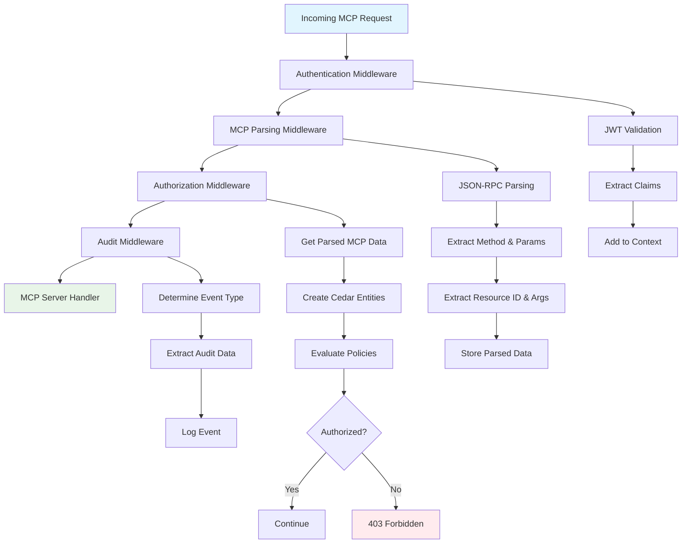
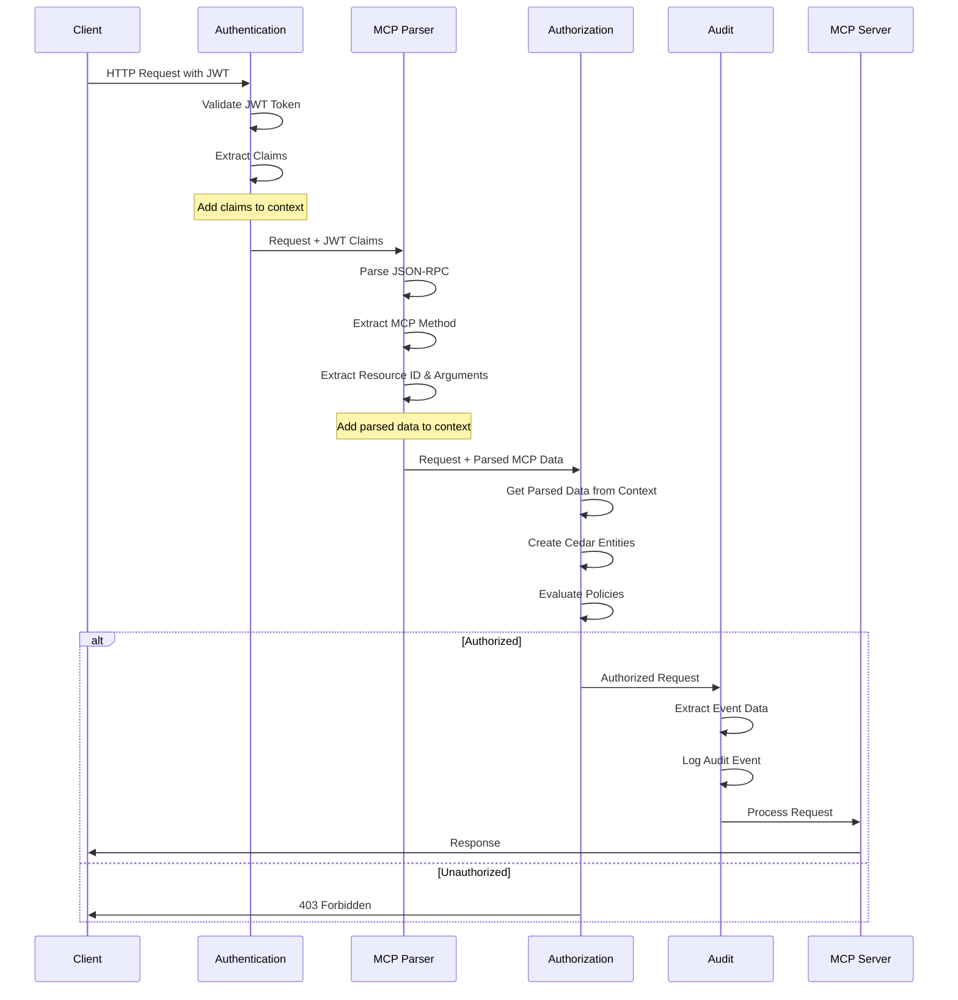
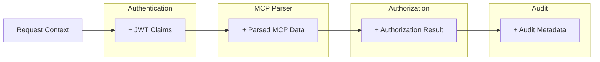
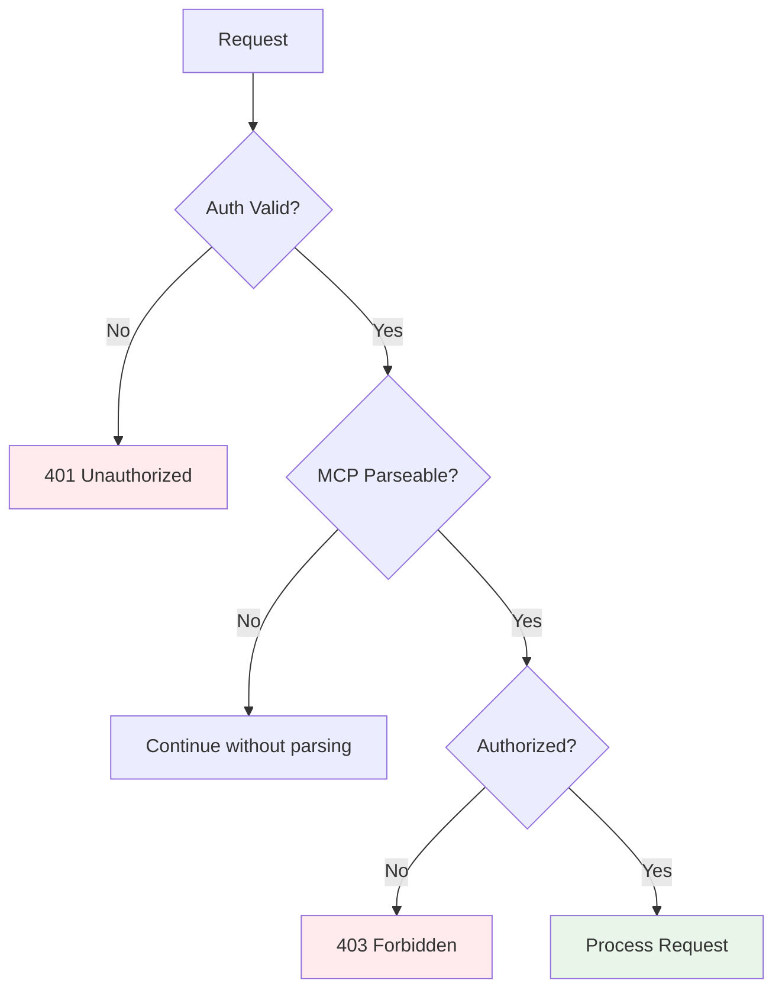

# Middleware Architecture

This document describes the middleware architecture used in ToolHive for processing MCP (Model Context Protocol) requests. The middleware chain provides authentication, parsing, authorization, and auditing capabilities in a modular and extensible way.

## Overview

ToolHive uses a layered middleware architecture to process incoming MCP requests. Each middleware component has a specific responsibility and operates in a well-defined order to ensure proper request handling, security, and observability.

The middleware chain consists of the following components:

1. **Authentication Middleware**: Validates JWT tokens and extracts client identity
2. **Token Exchange Middleware**: Exchanges JWT tokens for external service tokens (optional)
3. **MCP Parsing Middleware**: Parses JSON-RPC MCP requests and extracts structured data
4. **Tool Mapping Middleware**: Enables tool filtering and override capabilities through two complementary middleware components that process outgoing `tools/list` responses and incoming `tools/call` requests (optional)
5. **Usage Metrics Middleware**: Collects anonymous usage metrics for ToolHive development (optional)
6. **Telemetry Middleware**: Instruments requests with OpenTelemetry (optional)
7. **Authorization Middleware**: Evaluates Cedar policies to authorize requests (optional)
8. **Audit Middleware**: Logs request events for compliance and monitoring (optional)

## Architecture Diagram



## Middleware Flow



## Middleware Components

### 1. Authentication Middleware

**Purpose**: Validates JWT tokens and extracts client identity information.

**Location**: `pkg/auth/middleware.go`

**Responsibilities**:
- Validate JWT token signature and expiration
- Extract JWT claims (sub, name, roles, etc.)
- Add claims to request context for downstream middleware

**Context Data Added**:
- JWT claims with `claim_` prefix (e.g., `claim_sub`, `claim_name`)

### 2. MCP Parsing Middleware

**Purpose**: Parses JSON-RPC MCP requests and extracts structured information.

**Location**: `pkg/mcp/parser.go`

**Responsibilities**:
- Parse JSON-RPC 2.0 messages
- Extract MCP method names (e.g., `tools/call`, `resources/read`)
- Extract resource IDs and arguments based on method type
- Store parsed data in request context

**Context Data Added**:
- `ParsedMCPRequest` containing:
  - Method name
  - Request ID
  - Raw parameters
  - Extracted resource ID
  - Extracted arguments

**Supported MCP Methods**:
- `initialize` - Client initialization
- `tools/call`, `tools/list` - Tool operations
- `prompts/get`, `prompts/list` - Prompt operations
- `resources/read`, `resources/list` - Resource operations
- `notifications/*` - Notification messages
- `ping`, `logging/setLevel` - System operations

### 3. Authorization Middleware

**Purpose**: Evaluates Cedar policies to determine if requests are authorized.

**Location**: `pkg/authz/middleware.go`

**Responsibilities**:
- Retrieve parsed MCP data from context
- Create Cedar entities (Principal, Action, Resource)
- Evaluate Cedar policies against the request
- Allow or deny the request based on policy evaluation
- Filter list responses based on user permissions

**Dependencies**:
- Requires JWT claims from Authentication middleware
- Requires parsed MCP data from MCP Parsing middleware

### 4. Tool Mapping Middleware

**Purpose**: Provides tool filtering and override capabilities for MCP tools.

**Location**: `pkg/mcp/middleware.go` and `pkg/mcp/tool_filter.go`

**Features Provided**:

This middleware enables two key features for controlling tool visibility and presentation:

1. **Tool Filtering**: Restricts which tools are available to clients, allowing administrators to expose only a subset of tools provided by the MCP server
2. **Tool Override**: Allows renaming tools and modifying their descriptions as presented to clients, while maintaining correct routing to the actual underlying tools

**Implementation Notes**:

These features are implemented through two complementary middleware components that process traffic in different directions:
- One component handles outgoing responses containing tool lists
- Another component handles incoming requests to execute tools

Both components must be in place for the features to work correctly, as they ensure consistency between tool discovery and tool execution.

**Configuration**:
- `FilterTools`: List of tool names to expose to clients
- `ToolsOverride`: Map of tool name overrides and description changes

**Note**: When either filtering or override is configured, both middleware components are automatically enabled and configured with the same parameters to ensure consistent behavior, however it is an explicit design choice to avoid sharing any state between the two middleware components.

### 5. Usage Metrics Middleware

**Purpose**: Tracks tool call counts for usage analytics and usage metrics.

**Location**: `pkg/usagemetrics/middleware.go`

**Responsibilities**:
- Count `tools/call` requests by examining parsed MCP data
- Aggregate counts in-memory with atomic operations
- Flush metrics to API endpoint periodically (every 15 minutes)
- Reset counts daily at midnight UTC
- Manage background flush goroutine lifecycle

**Configuration**:
- Enabled by default
- Can be disabled via config: `thv config usage-metrics disable`
- Can be disabled via environment variable: `TOOLHIVE_USAGE_METRICS_ENABLED=false`
- Automatically disabled in CI environments

**Dependencies**:
- Requires parsed MCP data from MCP Parsing middleware

**Opting Out**:

Users can opt out of anonymous usage metrics in two ways:

```bash
# Via config (persistent)
thv config usage-metrics disable

# Via environment variable (session-only)
export TOOLHIVE_USAGE_METRICS_ENABLED=false
```

To re-enable:
```bash
thv config usage-metrics enable
```

**Note**: This middleware collects anonymous usage metrics for ToolHive development. Failures do not break request processing.

### 6. Telemetry Middleware

**Purpose**: Instruments HTTP requests with OpenTelemetry tracing and metrics.

**Location**: `pkg/telemetry/middleware.go`

**Responsibilities**:
- Create trace spans for HTTP requests
- Inject trace context into outgoing requests
- Record request metrics (duration, status codes, etc.)
- Export telemetry data to configured backends

**Configuration**:
- OTLP endpoint
- Service name and version
- Tracing enabled/disabled
- Metrics enabled/disabled
- Sampling rate
- Custom headers

### 7. Token Exchange Middleware

**Purpose**: Exchanges incoming JWT tokens for external service tokens using OAuth 2.0 Token Exchange.

**Location**: `pkg/auth/tokenexchange/middleware.go`

**Responsibilities**:
- Extract claims from authenticated JWT tokens
- Perform OAuth 2.0 Token Exchange with external identity providers
- Inject exchanged tokens into requests (replace Authorization header or custom header)
- Handle token exchange errors gracefully

**Context Data Used**:
- JWT claims from Authentication middleware

**Configuration**:
- Token exchange endpoint URL
- OAuth client credentials
- Target audience
- Scopes
- Header injection strategy (replace or custom)

**Note**: This middleware is currently implemented but not registered in the supported middleware factories (`pkg/runner/middleware.go:15`). It can be used directly via the proxy command but is not available through the standard middleware configuration system.

### 8. Audit Middleware

**Purpose**: Logs request events for compliance, monitoring, and debugging.

**Location**: `pkg/audit/middleware.go`

**Responsibilities**:
- Determine event type based on request characteristics
- Extract audit-relevant data from request and response
- Log structured audit events as JSON
- Track request duration and outcome
- Support file-based and stdout log destinations

**Event Types**:
- `mcp_initialize` - Client initialization events
- `mcp_tool_call` - Tool execution events
- `mcp_tools_list` - Tool listing events
- `mcp_resource_read` - Resource access events
- `mcp_resources_list` - Resource listing events
- `mcp_prompt_get` - Prompt retrieval events
- `mcp_prompts_list` - Prompt listing events
- `mcp_notification` - Notification message events
- `mcp_ping` - Ping events
- `mcp_logging` - Logging level change events
- `mcp_completion` - Completion events
- `mcp_roots_list_changed` - Roots list change notifications
- `sse_connection` - SSE connection events (for SSE transport)
- `http_request` - General HTTP request events (fallback)

#### Configuration

The audit middleware is configured via the `audit-config` parameter:

```bash
# CLI usage
thv run --transport sse --name my-server --audit-config audit.json my-image:latest
```

**Configuration File Format** (`audit.json`):

```json
{
  "component": "my-service",
  "logFile": "/var/log/audit/audit.log",
  "eventTypes": ["mcp_tool_call", "mcp_resource_read"],
  "excludeEventTypes": ["mcp_ping"],
  "includeRequestData": true,
  "includeResponseData": true,
  "maxDataSize": 4096
}
```

**Configuration Options**:

| Field | Type | Required | Default | Description |
|-------|------|----------|---------|-------------|
| `component` | string | No | `"toolhive-api"` | Component name to include in audit logs |
| `logFile` | string | No | stdout | Path to audit log file (file created with 0600 permissions; parent directory must exist) |
| `eventTypes` | []string | No | all events | Whitelist of event types to audit (empty = audit all) |
| `excludeEventTypes` | []string | No | none | Blacklist of event types to exclude (takes precedence) |
| `includeRequestData` | bool | No | `false` | Include request body in audit logs |
| `includeResponseData` | bool | No | `false` | Include response body in audit logs |
| `maxDataSize` | int | No | `1024` | Maximum bytes to capture for request/response data |

**Important Notes**:
- `excludeEventTypes` takes precedence over `eventTypes`
- When `includeRequestData` or `includeResponseData` is enabled, **`maxDataSize` must be set** (non-zero) for data capture to work
- Log files are created with restrictive permissions (0600) for security
- Logs are written in newline-delimited JSON format for easy parsing

#### Log Output Format

Audit events are logged as structured JSON objects:

```json
{
  "audit_id": "01be8d47-3ab0-4aa9-ad14-bd5bb408005d",
  "type": "mcp_tool_call",
  "logged_at": "2025-12-15T10:38:32.164124Z",
  "outcome": "success",
  "component": "vmcp-server",
  "source": {
    "type": "network",
    "value": "192.168.1.100",
    "extra": {
      "user_agent": "mcp-client/1.0",
      "request_id": "req-12345"
    }
  },
  "subjects": {
    "user_id": "user123",
    "user": "john.doe@example.com",
    "client_name": "my-mcp-client",
    "client_version": "1.0.0"
  },
  "target": {
    "endpoint": "/messages",
    "method": "POST",
    "type": "tool",
    "name": "weather_tool"
  },
  "metadata": {
    "extra": {
      "duration_ms": 150,
      "transport": "streamable-http",
      "response_size_bytes": 1024
    }
  },
  "data": {
    "request": {"location": "New York"},
    "response": {"temperature": "22°C", "humidity": "65%"}
  }
}
```

**Field Descriptions**:

- `audit_id`: Unique identifier for the audit event (UUID format)
- `type`: Event type (one of the event types listed above)
- `logged_at`: ISO 8601 timestamp when the event was logged
- `outcome`: Result of the operation (`success`, `failure`, `denied`, `error`)
- `component`: Service/component that generated the event
- `source`: Information about the request source
  - `type`: Source type (`network` for HTTP requests)
  - `value`: Source identifier (client IP address)
  - `extra`: Additional source metadata (user agent, request ID, etc.)
- `subjects`: Information about the authenticated user/client
  - `user_id`: User subject identifier from JWT
  - `user`: User display name (from `name` claim, `preferred_username`, or `email`)
  - `client_name`: MCP client name (from JWT claims)
  - `client_version`: MCP client version (from JWT claims)
- `target`: Information about the operation target
  - `endpoint`: HTTP endpoint path
  - `method`: HTTP method
  - `type`: Target type (`tool`, `resource`, `prompt`, `endpoint`)
  - `name`: MCP resource identifier (tool name, resource URI, etc.)
- `metadata.extra`: Additional operational metadata
  - `duration_ms`: Request duration in milliseconds
  - `transport`: Transport type (`sse`, `streamable-http`, `http`)
  - `response_size_bytes`: Response body size (when capturing response data)
- `data`: Captured request/response data (only present if enabled)
  - `request`: Request body (parsed as JSON if possible, otherwise string)
  - `response`: Response body (parsed as JSON if possible, otherwise string)

#### CLI Usage

**With audit configuration file**:
```bash
thv run --transport sse --name my-server --audit-config audit.json my-image:latest
```

**Minimal audit configuration (stdout)**:
```bash
thv run --transport sse --name my-server --audit-config <(echo '{"component":"my-service"}') my-image:latest
```

**Event filtering example**:
```json
{
  "component": "api-gateway",
  "eventTypes": ["mcp_tool_call", "mcp_resource_read"],
  "excludeEventTypes": ["mcp_ping"],
  "includeRequestData": true,
  "includeResponseData": true,
  "maxDataSize": 2048
}
```

## Data Flow Through Context

The middleware chain uses Go's `context.Context` to pass data between components:



## Configuration

### Enabling Middleware

The middleware chain is automatically configured when starting an MCP server with ToolHive:

```bash
# Basic MCP server (Authentication + Parsing + Audit)
thv run --transport sse --name my-server my-image:latest

# With authorization enabled
thv run --transport sse --name my-server --authz-config authz.yaml my-image:latest

# With custom audit configuration
thv run --transport sse --name my-server --audit-config audit.yaml my-image:latest
```

### Middleware Order

The middleware order is critical and enforced by the system:

1. **Authentication** - Must be first to establish client identity
2. **MCP Parsing** - Must come after authentication to access JWT context
3. **Authorization** - Must come after parsing to access structured MCP data
4. **Audit** - Must be last to capture the complete request lifecycle

## Error Handling

Each middleware component handles errors gracefully:



**Error Responses**:
- `401 Unauthorized` - Invalid or missing JWT token
- `403 Forbidden` - Valid token but insufficient permissions
- `400 Bad Request` - Malformed MCP request (when parsing is required)

## Performance Considerations

### Parsing Optimization

The MCP parsing middleware uses efficient strategies:

- **Map-based method handlers** instead of large switch statements
- **Single-pass parsing** of JSON-RPC messages
- **Lazy evaluation** - only parses MCP-specific endpoints
- **Context reuse** - parsed data shared across middleware

### Authorization Caching

The authorization middleware optimizes policy evaluation:

- **Policy compilation** happens once at startup
- **Entity creation** is optimized for common patterns
- **Result caching** for repeated identical requests (when enabled)

## Monitoring and Observability

### Audit Events

All middleware components contribute to audit events:

```json
{
  "type": "mcp_tool_call",
  "loggedAt": "2025-06-03T13:02:28Z",
  "source": {"type": "network", "value": "192.0.2.1"},
  "outcome": "success",
  "subjects": {"user": "user123"},
  "component": "toolhive-api",
  "target": {
    "endpoint": "/messages",
    "method": "POST",
    "type": "tool",
    "resource_id": "weather"
  },
  "data": {
    "request": {"location": "New York"},
    "response": {"temperature": "22°C"}
  },
  "metadata": {
    "auditId": "uuid",
    "duration_ms": 150,
    "transport": "http"
  }
}
```

### Metrics

Key metrics tracked by the middleware:

- **Request duration** - Time spent in each middleware component
- **Authorization decisions** - Permit/deny rates and reasons
- **Parsing success rates** - MCP message parsing statistics
- **Error rates** - Authentication and authorization failures

## Middleware Interfaces

ToolHive defines two key interfaces that middleware must implement to integrate with the system:

### Core Middleware Interface

All middleware must implement the `types.Middleware` interface defined in `pkg/transport/types/transport.go:24`:

```go
type Middleware interface {
    // Handler returns the middleware function used by the proxy.
    Handler() MiddlewareFunction
    // Close cleans up any resources used by the middleware.
    Close() error
}
```

The `MiddlewareFunction` type is defined as:

```go
type MiddlewareFunction func(http.Handler) http.Handler
```

### Middleware Configuration

Middleware configuration is handled through the `MiddlewareConfig` struct:

```go
type MiddlewareConfig struct {
    // Type is a string representing the middleware type.
    Type string `json:"type"`
    // Parameters is a JSON object containing the middleware parameters.
    Parameters json.RawMessage `json:"parameters"`
}
```

### Middleware Factory Function

Each middleware must provide a factory function that matches the `MiddlewareFactory` signature:

```go
type MiddlewareFactory func(config *MiddlewareConfig, runner MiddlewareRunner) error
```

The factory function is responsible for:
1. Parsing the middleware parameters from JSON
2. Creating the middleware instance
3. Registering the middleware with the runner
4. Setting up any additional handlers (auth info, metrics, etc.)

### Middleware Runner Interface

Middleware can interact with the runner through the `MiddlewareRunner` interface:

```go
type MiddlewareRunner interface {
    // AddMiddleware adds a middleware instance to the runner's middleware chain
    AddMiddleware(middleware Middleware)
    
    // SetAuthInfoHandler sets the authentication info handler (used by auth middleware)
    SetAuthInfoHandler(handler http.Handler)
    
    // SetPrometheusHandler sets the Prometheus metrics handler (used by telemetry middleware)
    SetPrometheusHandler(handler http.Handler)
    
    // GetConfig returns a config interface for middleware to access runner configuration
    GetConfig() RunnerConfig
}
```

## Extending the Middleware

### Adding New Middleware

To add new middleware to the chain:

1. **Implement the Core Interface**: Create a struct that implements `types.Middleware`
2. **Define Parameters Structure**: Create a parameters struct for configuration
3. **Create Factory Function**: Implement a factory function with the correct signature
4. **Register with Runner**: Add your middleware type to the supported middleware map
5. **Update Configuration**: Add middleware to the configuration population logic
6. **Write Tests**: Include comprehensive tests for your middleware

#### Step-by-Step Implementation

**Step 1: Implement the Middleware Interface**

```go
package yourpackage

import (
    "net/http"
    "github.com/stacklok/toolhive/pkg/transport/types"
)

const (
    MiddlewareType = "your-middleware"
)

// MiddlewareParams defines the configuration parameters
type MiddlewareParams struct {
    SomeConfig string `json:"some_config"`
    Enabled    bool   `json:"enabled"`
}

// Middleware implements the types.Middleware interface
type Middleware struct {
    middleware types.MiddlewareFunction
    params     MiddlewareParams
}

// Handler returns the middleware function
func (m *Middleware) Handler() types.MiddlewareFunction {
    return m.middleware
}

// Close cleans up resources
func (m *Middleware) Close() error {
    // Cleanup logic here
    return nil
}
```

**Step 2: Create the Factory Function**

```go
// CreateMiddleware factory function for your middleware
func CreateMiddleware(config *types.MiddlewareConfig, runner types.MiddlewareRunner) error {
    // Parse parameters
    var params MiddlewareParams
    if err := json.Unmarshal(config.Parameters, &params); err != nil {
        return fmt.Errorf("failed to unmarshal middleware parameters: %w", err)
    }

    // Create the actual HTTP middleware function
    middlewareFunc := func(next http.Handler) http.Handler {
        return http.HandlerFunc(func(w http.ResponseWriter, r *http.Request) {
            // Your middleware logic here
            next.ServeHTTP(w, r)
        })
    }

    // Create middleware instance
    middleware := &Middleware{
        middleware: middlewareFunc,
        params:     params,
    }

    // Add to runner
    runner.AddMiddleware(middleware)
    
    // Set up additional handlers if needed
    // runner.SetPrometheusHandler(someHandler)
    // runner.SetAuthInfoHandler(someHandler)

    return nil
}
```

**Step 3: Register with the System**

Add your middleware to `pkg/runner/middleware.go:15` in the `GetSupportedMiddlewareFactories()` function:

```go
func GetSupportedMiddlewareFactories() map[string]types.MiddlewareFactory {
    return map[string]types.MiddlewareFactory{
        auth.MiddlewareType:              auth.CreateMiddleware,
        mcp.ParserMiddlewareType:         mcp.CreateParserMiddleware,
        mcp.ToolFilterMiddlewareType:     mcp.CreateToolFilterMiddleware,
        mcp.ToolCallFilterMiddlewareType: mcp.CreateToolCallFilterMiddleware,
        telemetry.MiddlewareType:         telemetry.CreateMiddleware,
        authz.MiddlewareType:             authz.CreateMiddleware,
        audit.MiddlewareType:             audit.CreateMiddleware,
        // tokenexchange.MiddlewareType:  tokenexchange.CreateMiddleware, // Not yet registered
        yourpackage.MiddlewareType:       yourpackage.CreateMiddleware,
    }
}
```

**Step 4: Update Configuration Population**

Add your middleware to `pkg/runner/middleware.go:27` in the `PopulateMiddlewareConfigs()` function:

```go
// Your middleware (if enabled)
if config.YourMiddlewareConfig != nil {
    yourParams := yourpackage.MiddlewareParams{
        SomeConfig: config.YourMiddlewareConfig.SomeConfig,
        Enabled:    config.YourMiddlewareConfig.Enabled,
    }
    yourConfig, err := types.NewMiddlewareConfig(yourpackage.MiddlewareType, yourParams)
    if err != nil {
        return fmt.Errorf("failed to create your middleware config: %w", err)
    }
    middlewareConfigs = append(middlewareConfigs, *yourConfig)
}
```

#### Example: Authentication Middleware Implementation

For reference, here's how the authentication middleware is implemented:

```go
// pkg/auth/middleware.go
func CreateMiddleware(config *types.MiddlewareConfig, runner types.MiddlewareRunner) error {
    var params MiddlewareParams
    if err := json.Unmarshal(config.Parameters, &params); err != nil {
        return fmt.Errorf("failed to unmarshal auth middleware parameters: %w", err)
    }

    // Create token validator
    validator, err := NewTokenValidator(params.OIDCConfig)
    if err != nil {
        return fmt.Errorf("failed to create token validator: %w", err)
    }

    // Create middleware function
    middlewareFunc := createAuthMiddleware(validator)

    // Create middleware instance
    middleware := &Middleware{
        middleware:      middlewareFunc,
        authInfoHandler: createAuthInfoHandler(params.OIDCConfig),
    }

    // Register with runner
    runner.AddMiddleware(middleware)
    runner.SetAuthInfoHandler(middleware.AuthInfoHandler())

    return nil
}
```

### Middleware Execution Order

The middleware chain execution order is critical and controlled by the order in `PopulateMiddlewareConfigs()` in `pkg/runner/middleware.go:27`:

1. **Authentication Middleware** (always present) - Validates JWT tokens and extracts claims
2. **Token Exchange Middleware** (if enabled) - Exchanges JWT for external service tokens
3. **Tool Filter Middleware** (if enabled) - Filters available tools in list responses
4. **Tool Call Filter Middleware** (if enabled) - Filters tool call requests
5. **MCP Parser Middleware** (always present) - Parses JSON-RPC MCP requests
6. **Telemetry Middleware** (if enabled) - OpenTelemetry instrumentation
7. **Authorization Middleware** (if enabled) - Cedar policy evaluation
8. **Audit Middleware** (if enabled) - Request logging

**Important Ordering Rules**:
- Authentication must come first to establish client identity
- Token Exchange must come after Authentication (requires JWT claims)
- Tool filters should come before MCP Parser to operate on raw requests
- MCP Parser must come before Authorization (provides structured MCP data)
- Audit should be last to capture the complete request lifecycle

### Custom Authorization Policies

See the [Authorization Framework](authz.md) documentation for details on writing Cedar policies.

### Custom Audit Events

The audit middleware can be extended to capture additional event types and data fields based on your requirements.

## Troubleshooting

### Common Issues

**Middleware Order Problems**:
- Ensure authentication runs before authorization
- Ensure MCP parsing runs before authorization
- Check that all required middleware is included in tests

**Context Data Missing**:
- Verify middleware order is correct
- Check that upstream middleware completed successfully
- Ensure context keys are correctly defined and used

**Performance Issues**:
- Monitor middleware execution time
- Check for inefficient policy evaluation
- Consider enabling authorization result caching

### Debug Information

Enable debug logging to see middleware execution:

```bash
export LOG_LEVEL=debug
thv run --transport sse --name my-server my-image:latest
```

This will show detailed information about each middleware component's execution and data flow.