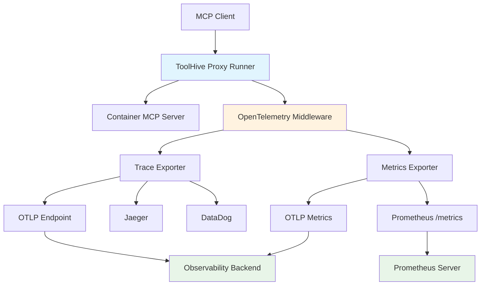
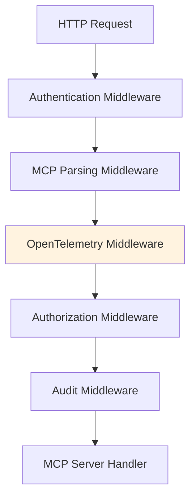

# Observability and Telemetry

This document describes the comprehensive observability features available in ToolHive for monitoring MCP (Model Context Protocol) server interactions. ToolHive provides OpenTelemetry-based instrumentation with support for distributed tracing, metrics collection, and structured logging.

## Overview

ToolHive's observability stack provides complete visibility into MCP proxy operations through:

1. **Distributed Tracing**: Track requests across the proxy-container boundary with OpenTelemetry traces
2. **Metrics Collection**: Monitor performance, usage patterns, and error rates with Prometheus and OTLP metrics
3. **Structured Logging**: Capture detailed audit events for compliance and debugging
4. **Protocol-Aware Instrumentation**: MCP-specific insights beyond generic HTTP metrics

## Architecture



## Configuration

### Basic Setup

Enable OpenTelemetry instrumentation with CLI flags:

```bash
# Enable OTLP export to Jaeger
thv run \
  --otel-endpoint localhost:14268 \
  --otel-insecure \
  --otel-service-name my-mcp-proxy \
  --otel-sampling-rate 0.1 \
  --transport sse \
  --name github \
  ghcr.io/example/github-mcp:latest

# Enable Prometheus metrics endpoint
thv run \
  --otel-enable-prometheus-metrics-path \
  --transport stdio \
  --name weather \
  weather-mcp:latest
```

### Configuration Options

| Flag | Description | Default |
|------|-------------|---------|
| `--otel-endpoint` | OTLP endpoint URL for traces and metrics | None |
| `--otel-service-name` | Service name for telemetry | `toolhive-mcp-proxy` |
| `--otel-sampling-rate` | Trace sampling rate (0.0-1.0) | `0.1` (10%) |
| `--otel-headers` | Authentication headers (key=value format) | None |
| `--otel-insecure` | Disable TLS verification | `false` |
| `--otel-enable-prometheus-metrics-path` | Enable Prometheus `/metrics` endpoint on main transport port | `false` (disabled) |

### Environment Variables

Currently, ToolHive telemetry configuration is only available via CLI flags. Environment variable support may be added in future versions.

### Dual Export Configuration

ToolHive supports simultaneous OTLP and Prometheus export:

```bash
# Export to both OTLP backend and Prometheus
thv run \
  --otel-endpoint trace.agent.datadoghq.com \
  --otel-headers "dd-api-key=your-api-key" \
  --otel-enable-prometheus-metrics-path \
  --transport sse \
  --name multi-export \
  my-mcp-server:latest
```

## Distributed Tracing

### Trace Structure

ToolHive creates comprehensive traces for all MCP interactions:

```
Span: mcp.proxy.request (1.2s)
├── service.name: toolhive-mcp-proxy
├── service.version: v0.0.46
├── http.method: POST
├── http.url: http://localhost:8080/messages?session_id=abc123
├── http.status_code: 200
├── mcp.server.name: github
├── mcp.transport: sse
└── Child Span: mcp.tools/call (800ms)
    ├── mcp.method: tools/call
    ├── mcp.request.id: req_456
    ├── rpc.system: jsonrpc
    ├── rpc.service: mcp
    ├── mcp.tool.name: create_issue
    ├── mcp.tool.arguments: title=Bug report, body=...
    └── span.kind: client
```

### Trace Attributes

**HTTP Layer Attributes**:
```
service.name: toolhive-mcp-proxy
service.version: v0.0.46
http.method: POST
http.url: http://localhost:8080/sse
http.status_code: 200
http.user_agent: Claude/1.0
http.request_content_length: 256
http.response_content_length: 1024
http.duration_ms: 150.5
```

**MCP Protocol Attributes**:
```
mcp.server.name: github
mcp.transport: sse
mcp.method: tools/call
mcp.request.id: 123
mcp.tool.name: create_issue
mcp.tool.arguments: title=Bug report, body=Found an issue
mcp.resource.uri: file:///data/config.json
mcp.prompt.name: greeting
mcp.client.name: claude
mcp.is_batch: false
rpc.system: jsonrpc
rpc.service: mcp
```

### Span Names

Spans are named based on MCP method when available:

- `mcp.tools/call` - Tool execution
- `mcp.tools/list` - Tool listing
- `mcp.resources/read` - Resource access
- `mcp.resources/list` - Resource listing
- `mcp.prompts/get` - Prompt retrieval
- `mcp.prompts/list` - Prompt listing
- `mcp.initialize` - Client initialization
- `POST /messages` - Fallback for non-MCP requests

## Metrics Collection

### Core Metrics

ToolHive exposes the following metrics:

#### Request Metrics
```prometheus
# Total number of MCP requests
toolhive_mcp_requests_total{method="POST",status_code="200",mcp_method="tools/call",server="github",transport="sse",status="success"} 42

# Request duration histogram
toolhive_mcp_request_duration_seconds_bucket{method="POST",mcp_method="tools/call",server="github",transport="sse",le="0.1"} 10
toolhive_mcp_request_duration_seconds_bucket{method="POST",mcp_method="tools/call",server="github",transport="sse",le="0.5"} 35
toolhive_mcp_request_duration_seconds_bucket{method="POST",mcp_method="tools/call",server="github",transport="sse",le="1.0"} 40
toolhive_mcp_request_duration_seconds_bucket{method="POST",mcp_method="tools/call",server="github",transport="sse",le="+Inf"} 42
toolhive_mcp_request_duration_seconds_sum{method="POST",mcp_method="tools/call",server="github",transport="sse"} 12.5
toolhive_mcp_request_duration_seconds_count{method="POST",mcp_method="tools/call",server="github",transport="sse"} 42
```

#### Connection Metrics
```prometheus
# Number of active MCP connections
toolhive_mcp_active_connections{server="github",transport="sse"} 5
```

#### Tool-Specific Metrics
```prometheus
# Tool call counts by tool name
toolhive_mcp_tool_calls_total{server="github",tool="create_issue",status="success"} 15
toolhive_mcp_tool_calls_total{server="github",tool="create_issue",status="error"} 2
toolhive_mcp_tool_calls_total{server="github",tool="list_repos",status="success"} 8
```

### Metric Labels

All metrics include consistent labels for filtering and aggregation:

- `server` - MCP server name (e.g., "github", "weather")
- `transport` - Backend transport type ("stdio" or "sse")
- `method` - HTTP method ("POST", "GET")
- `mcp_method` - MCP protocol method ("tools/call", "resources/read")
- `status` - Request outcome ("success" or "error")
- `status_code` - HTTP status code ("200", "400", "500")
- `tool` - Tool name for tool-specific metrics

### Prometheus Integration

#### Direct Scraping

Configure Prometheus to scrape ToolHive metrics:

```yaml
# prometheus.yml
scrape_configs:
  - job_name: 'toolhive-mcp-proxy'
    static_configs:
      - targets: ['localhost:9090']
    scrape_interval: 15s
    metrics_path: /metrics
```

#### Service Discovery

For Kubernetes deployments:

```yaml
# prometheus.yml
scrape_configs:
  - job_name: 'toolhive-mcp-proxy'
    kubernetes_sd_configs:
      - role: pod
    relabel_configs:
      - source_labels: [__meta_kubernetes_pod_label_app]
        action: keep
        regex: toolhive-mcp-proxy
      - source_labels: [__meta_kubernetes_pod_annotation_prometheus_io_port]
        action: replace
        target_label: __address__
        regex: (.+)
        replacement: ${1}:9090
```

## Backend Integration

### Honeycomb

```bash
thv run \
  --otel-endpoint api.honeycomb.io \
  --otel-headers "x-honeycomb-team=your-api-key" \
  --otel-service-name production-mcp-proxy \
  --transport sse \
  --name github \
  ghcr.io/example/github-mcp:latest
```

### Jaeger

```bash
# Local Jaeger instance
thv run \
  --otel-endpoint localhost:14268 \
  --otel-insecure \
  --transport stdio \
  --name weather \
  weather-mcp:latest
```

### DataDog

```bash
thv run \
  --otel-endpoint trace.agent.datadoghq.com \
  --otel-headers "dd-api-key=your-api-key" \
  --transport sse \
  --name datadog-monitored \
  my-mcp-server:latest
```

### Grafana Cloud

```bash
thv run \
  --otel-endpoint otlp-gateway-prod-us-central-0.grafana.net \
  --otel-headers "authorization=Basic $(echo -n 'user:password' | base64)" \
  --transport sse \
  --name grafana-monitored \
  my-mcp-server:latest
```

## Example Scenarios

### Tool Call Tracing

When a client calls the `create_issue` tool:

**Request**:
```json
{
  "jsonrpc": "2.0",
  "id": "req_456",
  "method": "tools/call",
  "params": {
    "name": "create_issue",
    "arguments": {
      "title": "Bug report",
      "body": "Found an issue with the API"
    }
  }
}
```

**Generated Trace**:
```
Span: mcp.tools/call
├── mcp.method: tools/call
├── mcp.request.id: req_456
├── mcp.tool.name: create_issue
├── mcp.tool.arguments: title=Bug report, body=Found an issue with the API
├── mcp.server.name: github
├── mcp.transport: sse
├── http.method: POST
├── http.status_code: 200
└── duration: 850ms
```

**Generated Metrics**:
```prometheus
toolhive_mcp_requests_total{mcp_method="tools/call",server="github",status="success"} 1
toolhive_mcp_request_duration_seconds{mcp_method="tools/call",server="github"} 0.85
toolhive_mcp_tool_calls_total{server="github",tool="create_issue",status="success"} 1
```

### Resource Access Monitoring

When accessing a configuration file:

**Request**:
```json
{
  "jsonrpc": "2.0",
  "id": "req_789",
  "method": "resources/read",
  "params": {
    "uri": "file:///app/config.json"
  }
}
```

**Generated Trace**:
```
Span: mcp.resources/read
├── mcp.method: resources/read
├── mcp.request.id: req_789
├── mcp.resource.uri: file:///app/config.json
├── mcp.server.name: filesystem
├── mcp.transport: stdio
└── duration: 45ms
```

### Error Tracking

Failed requests generate error traces and metrics:

**Error Trace**:
```
Span: mcp.tools/call
├── mcp.method: tools/call
├── mcp.tool.name: invalid_tool
├── http.status_code: 400
├── span.status: ERROR
├── span.status_message: Tool not found
└── duration: 12ms
```

**Error Metrics**:
```prometheus
toolhive_mcp_requests_total{mcp_method="tools/call",server="github",status="error",status_code="400"} 1
toolhive_mcp_tool_calls_total{server="github",tool="invalid_tool",status="error"} 1
```

## Performance Monitoring

### Key Performance Indicators

Monitor these metrics for optimal performance:

1. **Request Rate**: `rate(toolhive_mcp_requests_total[5m])`
2. **Error Rate**: `rate(toolhive_mcp_requests_total{status="error"}[5m])`
3. **Response Time**: `histogram_quantile(0.95, toolhive_mcp_request_duration_seconds_bucket)`
4. **Active Connections**: `toolhive_mcp_active_connections`

### Alerting Rules

Example Prometheus alerting rules:

```yaml
groups:
  - name: toolhive-mcp-proxy
    rules:
      - alert: HighErrorRate
        expr: rate(toolhive_mcp_requests_total{status="error"}[5m]) > 0.1
        for: 2m
        labels:
          severity: warning
        annotations:
          summary: "High error rate in MCP proxy"
          description: "Error rate is {{ $value }} errors per second"

      - alert: HighResponseTime
        expr: histogram_quantile(0.95, toolhive_mcp_request_duration_seconds_bucket) > 2.0
        for: 5m
        labels:
          severity: warning
        annotations:
          summary: "High response time in MCP proxy"
          description: "95th percentile response time is {{ $value }}s"

      - alert: ProxyDown
        expr: up{job="toolhive-mcp-proxy"} == 0
        for: 1m
        labels:
          severity: critical
        annotations:
          summary: "MCP proxy is down"
          description: "ToolHive MCP proxy has been down for more than 1 minute"
```

### Grafana Dashboard

Example Grafana dashboard queries:

```promql
# Request rate by server
sum(rate(toolhive_mcp_requests_total[5m])) by (server)

# Error rate percentage
sum(rate(toolhive_mcp_requests_total{status="error"}[5m])) by (server) / 
sum(rate(toolhive_mcp_requests_total[5m])) by (server) * 100

# Response time percentiles
histogram_quantile(0.50, sum(rate(toolhive_mcp_request_duration_seconds_bucket[5m])) by (le, server))
histogram_quantile(0.95, sum(rate(toolhive_mcp_request_duration_seconds_bucket[5m])) by (le, server))
histogram_quantile(0.99, sum(rate(toolhive_mcp_request_duration_seconds_bucket[5m])) by (le, server))

# Tool usage distribution
sum(rate(toolhive_mcp_tool_calls_total[5m])) by (tool, server)

# Active connections
toolhive_mcp_active_connections
```

## Security and Privacy

### Data Sanitization

ToolHive automatically sanitizes sensitive data in traces:

- **Sensitive Arguments**: Tool arguments containing passwords, tokens, or keys are redacted
- **PII Protection**: Personal information is masked in trace attributes
- **Argument Truncation**: Long arguments are truncated to prevent excessive trace size

**Example Sanitization**:
```
Original: mcp.tool.arguments: password=secret123, api_key=abc456, title=Bug report
Sanitized: mcp.tool.arguments: password=[REDACTED], api_key=[REDACTED], title=Bug report
```

### Sampling Configuration

Control trace volume and costs with sampling:

```bash
# High-traffic production (1% sampling)
--otel-sampling-rate 0.01

# Development environment (100% sampling)
--otel-sampling-rate 1.0

# Balanced monitoring (10% sampling - default)
--otel-sampling-rate 0.1
```

## Troubleshooting

### Common Issues

**No traces appearing in backend**:
- Verify OTLP endpoint URL and authentication headers
- Check network connectivity to the endpoint
- Ensure sampling rate is not too low
- Verify TLS configuration with `--otel-insecure` for testing

**Prometheus metrics not available**:
- Confirm `--otel-enable-prometheus-metrics-path` is set
- Check that the `/metrics` endpoint is accessible
- Verify Prometheus scrape configuration
- Ensure no firewall blocking the main transport port

**High memory usage**:
- Reduce sampling rate with `--otel-sampling-rate`
- Check for metric cardinality explosion
- Monitor trace batch sizes

### Debug Information

Enable debug logging for telemetry:

```bash
export LOG_LEVEL=debug
thv run --otel-endpoint api.honeycomb.io --otel-headers "x-honeycomb-team=key" ...
```

### Health Checks

Verify telemetry configuration:

```bash
# Check metrics endpoint
curl http://localhost:9090/metrics

# Verify OTLP connectivity
curl -v https://api.honeycomb.io/v1/traces
```

## Best Practices

### Production Deployment

1. **Use appropriate sampling rates** (1-10% for high-traffic systems)
2. **Configure authentication** for OTLP endpoints
3. **Enable TLS verification** in production
4. **Monitor telemetry overhead** with metrics
5. **Set up alerting** on key performance indicators

### Development and Testing

1. **Use 100% sampling** for complete visibility
2. **Enable local backends** (Jaeger, Prometheus)
3. **Test with realistic workloads** to validate metrics
4. **Verify trace correlation** across service boundaries

### Cost Optimization

1. **Tune sampling rates** based on traffic patterns
2. **Use head-based sampling** for consistent trace collection
3. **Monitor backend costs** and adjust accordingly
4. **Filter out health check requests** if not needed

## Integration with Existing Middleware

The OpenTelemetry middleware integrates seamlessly with ToolHive's existing middleware stack:



The telemetry middleware:
- **Leverages parsed MCP data** from the parsing middleware
- **Includes authentication context** from JWT claims
- **Captures authorization decisions** for compliance
- **Correlates with audit events** for complete observability

This provides end-to-end visibility across the entire request lifecycle while maintaining the modular architecture of ToolHive's middleware system.