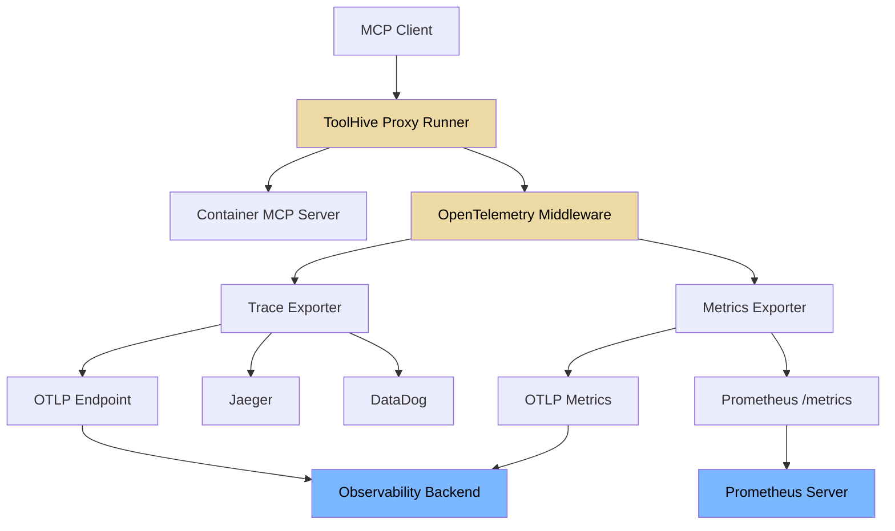
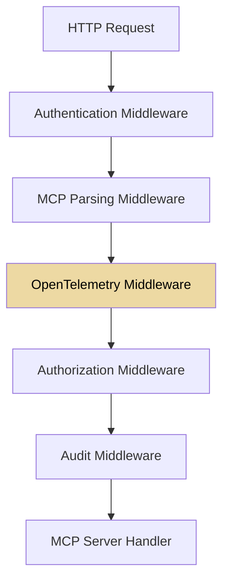

# Observability and Telemetry

This document describes the observability architecture implemented in ToolHive
for monitoring MCP (Model Context Protocol) server interactions. ToolHive
provides OpenTelemetry-based instrumentation with support for distributed
tracing, metrics collection, and structured logging.

This document is intended for developers working on ToolHive. For user guides on
setting up and using these features, see the ToolHive documentation:

- [Observability overview](https://docs.stacklok.com/toolhive/concepts/observability),
  including trace structure and example metrics
- [CLI guide](https://docs.stacklok.com/toolhive/guides-cli/telemetry-and-metrics),
  including how to enable and configure telemetry and send to common backends

For migrating from legacy attribute names to the new OTEL MCP semantic
conventions, see the [Telemetry Migration Guide](./telemetry-migration-guide.md).

## Overview

ToolHive's observability stack provides complete visibility into MCP proxy
operations through:

1. **Distributed tracing**: Track requests across the proxy-container boundary
   with OpenTelemetry traces
2. **Metrics collection**: Monitor performance, usage patterns, and error rates
   with Prometheus and OTLP metrics
3. **Structured logging**: Capture detailed audit events for compliance and
   debugging
4. **Protocol-aware instrumentation**: MCP-specific insights beyond generic HTTP
   metrics

See [the original design document](./proposals/otel-integration-proposal.md) for
more details on the design and goals of this observability architecture.

## Architecture



## Integration with Existing Middleware

The OpenTelemetry middleware integrates seamlessly with ToolHive's
[existing middleware stack](./middleware.md):



The telemetry middleware:

- **Leverages parsed MCP data** from the parsing middleware
- **Includes authentication context** from JWT claims
- **Captures authorization decisions** for compliance
- **Correlates with audit events** for complete observability

This provides end-to-end visibility across the entire request lifecycle while
maintaining the modular architecture of ToolHive's middleware system.

## Configuration

### CLI Flags

| Flag | Type | Default | Description |
|------|------|---------|-------------|
| `--otel-endpoint` | string | `""` | OTLP endpoint URL (e.g., `localhost:4317`). Telemetry is disabled when empty and Prometheus is not enabled. |
| `--otel-tracing-enabled` | bool | `true` | Enable distributed tracing (requires endpoint) |
| `--otel-metrics-enabled` | bool | `true` | Enable OTLP metrics export (requires endpoint) |
| `--otel-sampling-rate` | float | `0.1` | Trace sampling rate (0.0–1.0). The CLI default is `0.1` (10%); the Kubernetes CRD default is `0.05` (5%). Config file values override the CLI default when the flag is not explicitly set. |
| `--otel-service-name` | string | `"toolhive-mcp-proxy"` | Service name for telemetry resource |
| `--otel-headers` | string[] | `nil` | OTLP authentication headers (`key=value` format) |
| `--otel-insecure` | bool | `false` | Use HTTP instead of HTTPS for the OTLP endpoint |
| `--otel-enable-prometheus-metrics-path` | bool | `false` | Expose Prometheus `/metrics` endpoint on the transport port |
| `--otel-env-vars` | string[] | `nil` | Environment variables to include in spans (comma-separated) |
| `--otel-custom-attributes` | string | `""` | Custom resource attributes (`key1=value1,key2=value2`) |
| `--otel-use-legacy-attributes` | bool | `true` | Emit legacy attribute names alongside new OTEL semantic convention names |

### Configuration File

Telemetry can also be configured via `~/.toolhive/config.yaml`:

```yaml
otel:
  endpoint: "localhost:4317"
  sampling-rate: 0.1
  env-vars:
    - NODE_ENV
    - DEPLOYMENT_ENV
  insecure: true
  use-legacy-attributes: false
```

CLI flags take precedence over configuration file values when explicitly set.

### Kubernetes CRD

For MCPServer resources, use `spec.openTelemetry`. For VirtualMCPServer
resources, use `spec.config.telemetry`. See the
[vMCP observability docs](./operator/virtualmcpserver-observability.md) for
CRD examples.

### Validation Rules

- If an OTLP endpoint is configured but both `tracingEnabled` and
  `metricsEnabled` are `false`, configuration validation fails.
- If only `enablePrometheusMetricsPath` is enabled (no OTLP endpoint),
  Prometheus metrics are served without OTLP export.
- If nothing is configured (no endpoint, no Prometheus), telemetry is disabled.

## Metrics Reference

### MCP Proxy Metrics

These metrics are emitted by the telemetry middleware (`pkg/telemetry/middleware.go`)
for each MCP server proxy.

#### `toolhive_mcp_requests` (Counter)

Total number of MCP requests processed.

| Attribute | Type | Description |
|-----------|------|-------------|
| `method` | string | HTTP method (`POST`, `GET`) |
| `status_code` | string | HTTP status code (`200`, `500`) |
| `status` | string | `"success"` or `"error"` (error if status >= 400) |
| `mcp_method` | string | MCP method name (`tools/call`, `resources/read`, etc.) |
| `mcp_resource_id` | string | Tool name, resource URI, or prompt name |
| `server` | string | MCP server name |
| `transport` | string | Backend transport type (`stdio`, `sse`, `streamable-http`) |

> **Note**: SSE connection establishment events also increment this counter
> with `mcp_method="sse_connection"` and do not include `mcp_resource_id`.

#### `toolhive_mcp_request_duration` (Histogram, seconds)

Duration of MCP requests. Uses default histogram bucket boundaries.

**Attributes**: Same as `toolhive_mcp_requests`.

#### `mcp.server.operation.duration` (Histogram, seconds)

Duration of MCP server operations per the
[OTEL MCP semantic conventions](https://github.com/open-telemetry/semantic-conventions/blob/main/docs/gen-ai/mcp.md).

**Bucket boundaries**: `[0.01, 0.02, 0.05, 0.1, 0.2, 0.5, 1, 2, 5, 10, 30, 60, 120, 300]`

| Attribute | Type | Condition | Description |
|-----------|------|-----------|-------------|
| `mcp.method.name` | string | Always | MCP method (`tools/call`, `resources/read`, etc.) |
| `jsonrpc.protocol.version` | string | Always | Always `"2.0"` |
| `network.transport` | string | Always | `"tcp"` or `"pipe"` |
| `network.protocol.name` | string | If applicable | `"http"` for SSE/streamable-http |
| `network.protocol.version` | string | If available | HTTP protocol version (`1.1`, `2`) |
| `error.type` | string | On HTTP 5xx | HTTP status code as string |
| `gen_ai.operation.name` | string | For `tools/call` | Always `"execute_tool"` |
| `gen_ai.tool.name` | string | For `tools/call` | Tool name |
| `gen_ai.prompt.name` | string | For `prompts/get` | Prompt name |

#### `toolhive_mcp_tool_calls` (Counter)

Total number of MCP tool invocations (only recorded for `tools/call` requests).

| Attribute | Type | Description |
|-----------|------|-------------|
| `server` | string | MCP server name |
| `tool` | string | Tool name |
| `status` | string | `"success"` or `"error"` |

#### `toolhive_mcp_active_connections` (UpDownCounter)

Number of currently active MCP connections.

| Attribute | Type | Description |
|-----------|------|-------------|
| `server` | string | MCP server name |
| `transport` | string | Backend transport type |
| `connection_type` | string | `"sse"` (only present for SSE connections) |

## Span Attributes

### HTTP Attributes

These follow the [OTEL HTTP semantic conventions](https://opentelemetry.io/docs/specs/semconv/http/).
They are always emitted.

**Request attributes:**

| Attribute | Type | Description |
|-----------|------|-------------|
| `http.request.method` | string | HTTP request method |
| `url.full` | string | Full request URL |
| `url.scheme` | string | URL scheme (`http`, `https`) |
| `url.path` | string | URL path |
| `url.query` | string | URL query string (if present) |
| `server.address` | string | Server host |
| `user_agent.original` | string | User agent string |
| `http.request.body.size` | int64 | Request body size (if > 0) |

**Response attributes:**

| Attribute | Type | Description |
|-----------|------|-------------|
| `http.response.status_code` | int | Response HTTP status code |
| `http.response.body.size` | int64 | Response body size |

### MCP Protocol Attributes

These are set when an MCP JSON-RPC request is parsed by the MCP parsing
middleware (`pkg/mcp/parser.go`).

| Attribute | Type | Condition | Description |
|-----------|------|-----------|-------------|
| `mcp.method.name` | string | Always | MCP JSON-RPC method name |
| `rpc.system.name` | string | Always | Always `"jsonrpc"` |
| `jsonrpc.protocol.version` | string | Always | Always `"2.0"` |
| `jsonrpc.request.id` | string | If request has ID | JSON-RPC request ID |
| `mcp.resource.uri` | string | Resource methods only | Resource URI |
| `mcp.server.name` | string | Always | MCP server name |
| `mcp.is_batch` | bool | If batch request | Batch request indicator |

The `mcp.resource.uri` attribute is set only for the following methods:
`resources/read`, `resources/subscribe`, `resources/unsubscribe`,
`notifications/resources/updated`.

### Tool, Prompt, and Resource Attributes

**For `tools/call`:**

| Attribute | Type | Description |
|-----------|------|-------------|
| `gen_ai.tool.name` | string | Tool name |
| `gen_ai.operation.name` | string | Always `"execute_tool"` |
| `gen_ai.tool.call.arguments` | string | Sanitized tool arguments (max 200 chars) |

**For `prompts/get`:**

| Attribute | Type | Description |
|-----------|------|-------------|
| `gen_ai.prompt.name` | string | Prompt name |

**For `initialize`:**

| Attribute | Type | Description |
|-----------|------|-------------|
| `mcp.client.name` | string | Client name from `clientInfo` |

### Network and Transport Attributes

| Attribute | Type | Description | Values |
|-----------|------|-------------|--------|
| `network.transport` | string | Network transport protocol | `"tcp"` (SSE, streamable-http), `"pipe"` (stdio) |
| `network.protocol.name` | string | Application protocol | `"http"` (SSE, streamable-http), empty (stdio) |
| `network.protocol.version` | string | HTTP protocol version | `"1.1"`, `"2"` |
| `mcp.backend.protocol.version` | string | Backend MCP protocol version | SSE: `"1.1"` |

### Session and Client Attributes

| Attribute | Type | Condition | Description |
|-----------|------|-----------|-------------|
| `mcp.session.id` | string | `Mcp-Session-Id` header present | Session identifier |
| `mcp.protocol.version` | string | `MCP-Protocol-Version` header present | MCP protocol version |
| `client.address` | string | Remote address available | Client IP address |
| `client.port` | int | Port parseable from remote address | Client port |

### Error Attributes

| Attribute | Type | Condition | Description |
|-----------|------|-----------|-------------|
| `error.type` | string | HTTP 5xx errors | HTTP status code as string (e.g., `"500"`) |

**Span status behavior:**
- HTTP 5xx: Span status set to `Error` with message `"HTTP {code}"`
- HTTP 4xx: Span status left as `Unset` (client errors per OTEL semconv)
- HTTP 2xx/3xx: Span status set to `Ok`

### Environment and Custom Attributes

**Environment variables** (`--otel-env-vars`): Specified host environment
variables are read and added to spans as `environment.{VAR_NAME}` attributes.
Only variables explicitly listed in the configuration are captured.

**Custom resource attributes** (`--otel-custom-attributes` or
`OTEL_RESOURCE_ATTRIBUTES`): Key-value pairs added as OTEL resource attributes
to all telemetry signals.

### SSE Connection Attributes

SSE connections get a dedicated short-lived span (`sse.connection_established`)
with:

| Attribute | Type | Description |
|-----------|------|-------------|
| `sse.event_type` | string | Always `"connection_established"` |
| `mcp.server.name` | string | MCP server name |

Plus the standard HTTP, network, and transport attributes.

## Span Naming Conventions

Span names follow the OTEL MCP semantic conventions:

| Pattern | When | Example |
|---------|------|---------|
| `{mcp.method.name} {target}` | MCP request with resource ID | `"tools/call fetch"` |
| `{mcp.method.name}` | MCP request without resource ID | `"initialize"` |
| `{HTTP_METHOD} {url.path}` | Non-MCP requests (fallback) | `"GET /health"` |
| `sse.connection_established` | SSE connection setup | — |

All proxy spans use `SpanKindServer`.

## Distributed Tracing

### Trace Context Propagation

ToolHive supports W3C Trace Context propagation through two mechanisms:

1. **HTTP headers** — Standard `traceparent` and `tracestate` headers
2. **MCP `_meta` field** — Trace context embedded in the JSON-RPC
   `params._meta` object, as recommended by the MCP OpenTelemetry specification

**Priority**: When both are present, `_meta` trace context takes precedence
over HTTP headers, since `_meta` is the MCP-specified propagation mechanism.

### How It Works

**Inbound (client → ToolHive proxy):**

The telemetry middleware first extracts trace context from HTTP headers, then
checks for `_meta` in the parsed MCP request. If `_meta` contains `traceparent`
(and optionally `tracestate`), the middleware extracts the trace context from it,
which overrides the HTTP header context. A child span is then created with the
extracted trace as parent.

```json
{
  "method": "tools/call",
  "params": {
    "name": "fetch",
    "arguments": {"url": "https://example.com"},
    "_meta": {
      "traceparent": "00-abcdef1234567890abcdef1234567890-1234567890abcdef-01",
      "tracestate": "vendor=value"
    }
  }
}
```

**Outbound (vMCP → backend):**

The `InjectMetaTraceContext` function (`pkg/telemetry/propagation.go`) can
inject the current trace context into the `_meta` field when forwarding requests
to backends, enabling end-to-end distributed tracing across the vMCP
aggregation layer.

### Propagators

ToolHive configures the following OTEL propagators globally:
- `propagation.TraceContext{}` — W3C Trace Context
- `propagation.Baggage{}` — W3C Baggage

### Implementation

The trace context propagation is implemented in `pkg/telemetry/propagation.go`
using a `MetaCarrier` that implements `propagation.TextMapCarrier` for MCP
`_meta` maps. The MCP `_meta` field is extracted by the MCP parsing middleware
(`pkg/mcp/parser.go`) and stored in the request context.

## Legacy Attribute Compatibility

ToolHive supports dual emission of span attributes controlled by the
`useLegacyAttributes` configuration option. When set to `true` (the current
default), both legacy and new OTEL semantic convention attribute names are
emitted on every span, allowing existing dashboards to continue working during
migration.

For a complete mapping of legacy to new attribute names and migration
instructions, see the [Telemetry Migration Guide](./telemetry-migration-guide.md).

## Virtual MCP Server Telemetry

For observability in the Virtual MCP Server (vMCP), including backend request
metrics, workflow execution telemetry, and distributed tracing, see the
dedicated [Virtual MCP Server Observability](./operator/virtualmcpserver-observability.md)
documentation.
