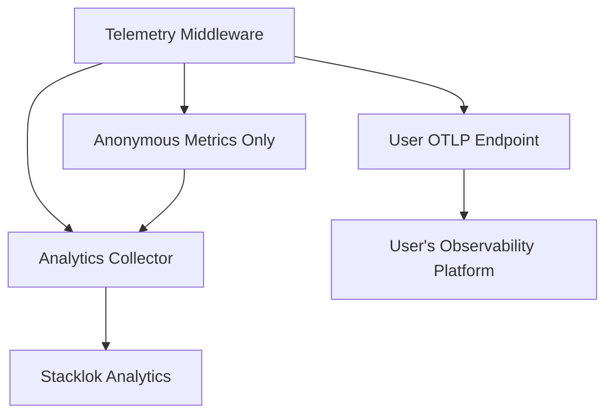

# Observability and Telemetry

This document describes the observability architecture implemented in ToolHive
for monitoring MCP (Model Context Protocol) server interactions. ToolHive
provides OpenTelemetry-based instrumentation with support for distributed
tracing, metrics collection, and structured logging.

This document is intended for developers working on ToolHive. For user guides on
setting up and using these features, see the ToolHive documentation:

- [Observability overview](https://docs.stacklok.com/toolhive/concepts/observability),
  including trace structure and example metrics
- [CLI guide](https://docs.stacklok.com/toolhive/guides-cli/telemetry-and-metrics),
  including how to enable and configure telemetry and send to common backends

## Overview

ToolHive's observability stack provides complete visibility into MCP proxy
operations through:

1. **Distributed tracing**: Track requests across the proxy-container boundary
   with OpenTelemetry traces
2. **Metrics collection**: Monitor performance, usage patterns, and error rates
   with Prometheus and OTLP metrics
3. **Structured logging**: Capture detailed audit events for compliance and
   debugging
4. **Protocol-aware instrumentation**: MCP-specific insights beyond generic HTTP
   metrics
5. **Privacy-first usage analytics**: Anonymous tool call metrics for product
   improvement (can be disabled)

See [the original design document](./proposals/otel-integration-proposal.md) for
more details on the design and goals of this observability architecture.

## Architecture

## Integration with Existing Middleware

The OpenTelemetry middleware integrates seamlessly with ToolHive's
[existing middleware stack](./middleware.md):

The telemetry middleware:

- **Leverages parsed MCP data** from the parsing middleware
- **Includes authentication context** from JWT claims
- **Captures authorization decisions** for compliance
- **Correlates with audit events** for complete observability

This provides end-to-end visibility across the entire request lifecycle while
maintaining the modular architecture of ToolHive's middleware system.

## Usage Analytics

ToolHive includes privacy-first usage analytics that collect anonymous tool call
metrics for product improvement. This feature uses a dual-endpoint architecture
to ensure user telemetry remains unaffected.

**Key Features:**
- **Anonymous**: Only tool call counts with success/error status
- **Privacy-first**: No server names, tool names, or sensitive data collected
- **Dual-endpoint**: Separate from user's telemetry configuration
- **Opt-out**: Can be disabled via configuration
- **Default enabled**: Helps improve ToolHive for all users

**Architecture:**

For detailed information on usage analytics, including privacy policy and
configuration options, see [Usage Analytics Documentation](./usage-analytics.md).
