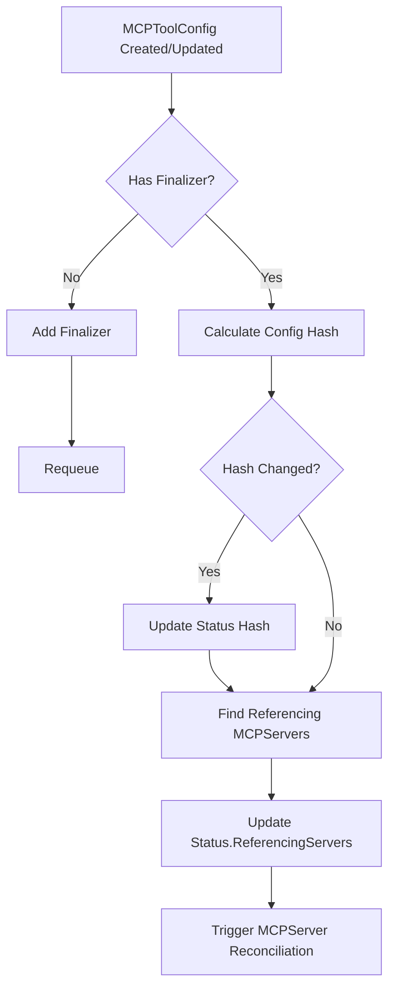
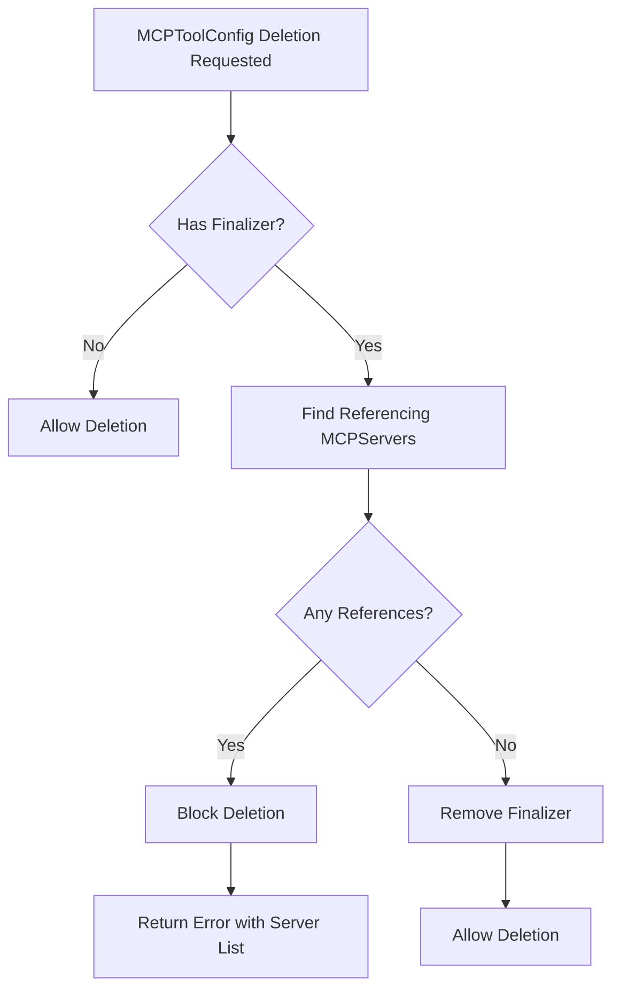

# MCPToolConfig Reconciliation Strategy

## Overview

The MCPToolConfig CRD provides a centralized way to manage tool filtering and renaming configurations that can be shared across multiple MCPServer resources within the same namespace. This document describes the reconciliation strategy used to ensure consistency and automatic updates when configurations change.

## Key Design Decisions

### 1. Finalizer-Based Lifecycle Management

MCPToolConfig uses finalizers instead of owner references because:
- **Multiple References**: A single MCPToolConfig can be referenced by multiple MCPServers
- **Controlled Deletion**: Prevents accidental deletion while MCPServers are still using the configuration
- **Clean Cleanup**: Ensures proper cleanup when the MCPToolConfig is no longer needed

The finalizer `toolhive.stacklok.dev/toolconfig-finalizer` is automatically added when a MCPToolConfig is created and removed only when no MCPServers reference it.

### 2. Hash-Based Change Detection

The reconciliation strategy uses content hashing to detect configuration changes:

```go
// Uses Kubernetes utilities for consistent hashing
hashString := dump.ForHash(spec)
hasher := fnv.New32a()
hasher.Write([]byte(hashString))
configHash := fmt.Sprintf("%x", hasher.Sum32())
```

Benefits:
- **Efficient Detection**: Quick comparison of hashes instead of deep object comparison
- **Consistency**: Uses Kubernetes standard utilities (`dump.ForHash()`) for deterministic serialization
- **Performance**: FNV-1a hash algorithm provides fast, non-cryptographic hashing

### 3. Automatic MCPServer Reconciliation

When a MCPToolConfig changes, all referencing MCPServers are automatically reconciled:

1. **MCPToolConfig Update**: When the MCPToolConfig spec changes, a new hash is calculated
2. **Hash Comparison**: The new hash is compared with the stored hash in the status
3. **MCPServer Notification**: If the hash differs, all referencing MCPServers are queued for reconciliation
4. **Configuration Propagation**: Each MCPServer fetches the updated MCPToolConfig and applies the new configuration

## Reconciliation Flow

### Create/Update Flow



### Deletion Flow



## MCPServer Integration

### MCPToolConfig Reference

MCPServers reference a MCPToolConfig through the `toolConfigRef` field:

```yaml
apiVersion: toolhive.stacklok.dev/v1alpha1
kind: MCPServer
metadata:
  name: my-server
spec:
  image: mcp/server:latest
  toolConfigRef:
    name: my-tool-config
```

### Change Detection in MCPServer

The MCPServer controller detects MCPToolConfig changes by:

1. **Fetching MCPToolConfig**: Retrieves the referenced MCPToolConfig
2. **Hash Comparison**: Compares the MCPToolConfig's current hash with the stored hash in MCPServer status
3. **Update Detection**: If hashes differ, the MCPServer knows the configuration has changed
4. **Configuration Application**: Updates the RunConfig with the new tool filtering and renaming rules

```go
// In MCPServer controller
toolConfig, err := GetToolConfigForMCPServer(ctx, r.Client, mcpServer)
if toolConfig != nil {
    currentHash := toolConfig.Status.ConfigHash
    if mcpServer.Status.ToolConfigHash != currentHash {
        // MCPToolConfig has changed, update configuration
        mcpServer.Status.ToolConfigHash = currentHash
        // Trigger pod recreation with new config
    }
}
```

## Status Fields

### MCPToolConfig Status

```go
type MCPToolConfigStatus struct {
    // ConfigHash is the hash of the current configuration
    ConfigHash string `json:"configHash,omitempty"`
    
    // ReferencingServers lists MCPServers using this config
    ReferencingServers []string `json:"referencingServers,omitempty"`
}
```

### MCPServer Status Addition

```go
type MCPServerStatus struct {
    // ... existing fields ...
    
    // ToolConfigHash stores the hash of the applied MCPToolConfig
    ToolConfigHash string `json:"toolConfigHash,omitempty"`
}
```

## Error Handling

### Deletion Blocked

When a MCPToolConfig deletion is blocked due to existing references:
- Error message includes the list of referencing MCPServers
- Administrator must remove references or delete MCPServers first
- Provides clear feedback about why deletion is blocked

### Missing MCPToolConfig

When an MCPServer references a non-existent MCPToolConfig:
- MCPServer enters Failed phase
- Clear error message in status
- Reconciliation retries with exponential backoff

## Best Practices

1. **Reusable Configurations**: Create MCPToolConfigs for common tool sets (e.g., "read-only-tools", "admin-tools")
2. **Namespace Isolation**: MCPToolConfigs are namespace-scoped, ensuring isolation between teams. Each namespace manages its own MCPToolConfigs independently
3. **Version Management**: Use different MCPToolConfig names for different versions of tool configurations
4. **Monitoring**: Watch MCPToolConfig status to track which MCPServers are using each configuration

## Testing Coverage

The implementation includes comprehensive tests with high coverage:
- **Reconcile**: 82.9% coverage
- **calculateConfigHash**: 100% coverage
- **handleDeletion**: 85.7% coverage
- **findReferencingMCPServers**: 100% coverage
- **GetToolConfigForMCPServer**: 100% coverage

Tests cover:
- Basic CRUD operations
- Multiple MCPServers referencing same MCPToolConfig
- Deletion blocking and cleanup
- Hash-based change detection
- Error scenarios and edge cases
