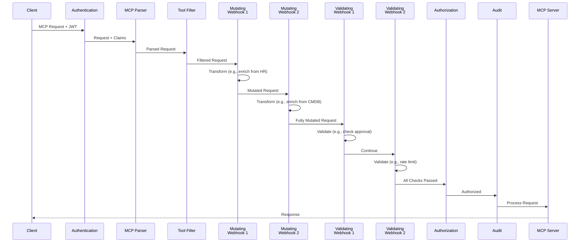

# Dynamic Webhook Middleware for ToolHive

## Executive Summary

This proposal introduces a dynamic webhook middleware system for ToolHive, inspired by Kubernetes' admission webhook pattern. The system enables external services to participate in the MCP request pipeline through two webhook types: **validating webhooks** (accept/deny requests) and **mutating webhooks** (transform requests). This provides a powerful extension mechanism that allows organizations to plug arbitrary systems into ToolHive's middleware chain without modifying ToolHive code.

**Impact**: Organizations can extend ToolHive with custom logic and integrate with existing enterprise systems (SIEMs, ticketing, policy engines) without forking ToolHive. The webhook system follows HTTP best practices and is designed to be stateless, secure, and observable.

## Problem Statement

ToolHive's current middleware architecture (`docs/middleware.md`) provides eight built-in middleware components (authentication, parsing, authorization, audit, etc.), but adding new functionality requires code changes to ToolHive itself. Organizations often need to:

- Integrate with external policy engines or decision systems
- Enrich requests with data from external sources (HR, CMDB, project databases)
- Log to enterprise SIEM systems with custom formats
- Apply business-specific validation rules beyond Cedar policies
- Transform requests based on organizational policies
- Integrate with ticketing or approval workflows
- Enforce rate limits using external state stores

Currently, these use cases require:
- Forking ToolHive and adding custom middleware
- Maintaining custom builds
- Complex deployment pipelines
- Difficulty upgrading to new ToolHive versions
- Duplicating organizational logic across systems

## Goals

- Enable external HTTP services to participate in MCP request processing
- Support both validation (accept/deny) and mutation (transform) use cases
- Support multiple webhook instances (multiple validating, multiple mutating)
- Maintain ToolHive's security and observability guarantees
- Follow HTTP best practices for webhook communication
- Provide clear failure mode semantics
- Integrate seamlessly with existing middleware chain
- Enable stateless, horizontally scalable architecture

## Non-Goals

- Real-time streaming or bidirectional communication (webhooks are request/response)
- Plugin systems (WASM, shared libraries, etc.)
- Message queue integration (async processing patterns)
- Built-in webhook server implementations (organizations provide their own)
- Webhook response caching (initial implementation; future enhancement)
- Circuit breaker patterns (initial implementation; future enhancement)

## Use Cases

### 1. External Policy Engine Integration

**Scenario**: A company uses Open Policy Agent (OPA) or a custom policy engine for organization-wide access control. They want to reuse this infrastructure for MCP requests without duplicating policies in Cedar.

**Solution**: Deploy a validating webhook that queries the policy engine. The webhook receives MCP request context (user, action, resource) and returns an allow/deny decision.

**Benefits**:
- Centralized policy management
- Consistent policy enforcement across platforms
- Leverage existing policy infrastructure

### 2. Request Enrichment from External Systems

**Scenario**: Before processing an MCP request, enrich it with user context from HR systems (department, manager, cost center), project databases (project membership, permissions), or configuration management databases (asset ownership).

**Solution**: Deploy a mutating webhook that fetches additional context from external APIs and injects it into the MCP request parameters. Downstream systems (MCP servers, audit logs) receive enriched requests.

**Benefits**:
- Centralized user/context management
- Automatic context propagation
- No changes to MCP servers

### 3. Approval Workflow Integration

**Scenario**: Certain high-risk tool calls (production database writes, infrastructure changes) require approval from a manager or security team before execution.

**Solution**: Deploy a validating webhook that checks a ticketing system for approval. If no approval exists, deny the request with a link to create an approval ticket.

**Benefits**:
- Enforce approval workflows
- Audit trail in ticketing system
- User-friendly error messages with next steps

### 4. SIEM Integration for Compliance

**Scenario**: Enterprise compliance requires all MCP tool executions to be logged in a SIEM (Splunk, Elastic, etc.) with organization-specific formatting and enrichment.

**Solution**: Deploy a validating webhook (used for side effects) that sends detailed audit records to the SIEM, then returns "allowed". The webhook never denies requests but ensures SIEM logging happens.

**Benefits**:
- Centralized compliance logging
- Custom log formats
- Real-time alerting in SIEM

### 5. Rate Limiting with External State

**Scenario**: Enforce per-user or per-team rate limits on expensive MCP operations using an external rate limiter (Redis-based, API gateway, etc.).

**Solution**: Deploy a validating webhook that queries the rate limiter. If the limit is exceeded, deny the request with a 429 status and retry information.

**Benefits**:
- Cost control
- Prevent abuse
- Share rate limits across services

### 6. Multi-Stage Request Processing

**Scenario**: Apply multiple transformations and validations from different systems (enrich from HR, validate against ticketing, check compliance).

**Solution**: Deploy multiple webhooks that execute in sequence. Each mutating webhook adds context, each validating webhook performs a specific check.

**Benefits**:
- Compose multiple systems
- Separation of concerns
- Independent webhook development

## Proposed Solution

Introduce two new middleware types that call external HTTP services during request processing:

1. **Validating Webhook Middleware**: Sends request metadata to external service for accept/deny decision
2. **Mutating Webhook Middleware**: Sends full request to external service for transformation

Both webhook types:
- Support multiple instances (multiple webhooks of each type can be configured)
- Operate as standard middleware in ToolHive's existing chain (`docs/middleware.md`)
- Can be configured alongside existing middleware like auth, authz, and audit
- Execute in configuration order when multiple webhooks are present

## Architecture

### High-Level Flow



### HTTP Protocol Design

**Design Decisions**:
- Use **POST** for both webhook types (standard HTTP method for data processing)
- Use **200 OK** with JSON body for decisions (avoid confusion between policy vs operational errors)
- Use **5xx** status codes for webhook operational errors (trigger failure policies)

**Validating Webhook Request** (POST to webhook URL):
```json
{
  "version": "v0.1.0",
  "uid": "unique-request-id-for-idempotency",
  "timestamp": "2025-10-23T10:30:00Z",
  "principal": {
    "sub": "user123",
    "email": "user@example.com",
    "name": "John Doe",
    "groups": ["engineering", "admins"],
    "claims": {
      "department": "platform",
      "role": "sre"
    }
  },
  "mcp_request": {
    "method": "tools/call",
    "resource_id": "database_query",
    "arguments": {
      "query": "SELECT * FROM users",
      "database": "production"
    }
  },
  "context": {
    "server_name": "postgres-mcp",
    "namespace": "production",
    "source_ip": "192.0.2.1",
    "transport": "sse"
  }
}
```

**Validating Webhook Response** (200 OK with JSON body):
```json
{
  "version": "v0.1.0",
  "uid": "unique-request-id-for-idempotency",
  "allowed": true
}
```

**Validating Webhook Response (Denied)**:
```json
{
  "version": "v0.1.0",
  "uid": "unique-request-id-for-idempotency",
  "allowed": false,
  "code": 403,
  "message": "Production writes require approval",
  "reason": "RequiresApproval",
  "details": {
    "ticket_url": "https://tickets.example.com/PROD-1234",
    "instructions": "Please request approval from security-team"
  }
}
```

**Mutating Webhook Request** (POST to webhook URL):
```json
{
  "version": "v0.1.0",
  "uid": "unique-request-id-for-idempotency",
  "timestamp": "2025-10-23T10:30:00Z",
  "principal": {
    "sub": "user123",
    "email": "user@example.com",
    "name": "John Doe",
    "groups": ["engineering"]
  },
  "jsonrpc": "2.0",
  "id": 1,
  "method": "tools/call",
  "params": {
    "name": "database_query",
    "arguments": {
      "query": "SELECT * FROM users",
      "database": "production"
    }
  },
  "context": {
    "server_name": "postgres-mcp",
    "namespace": "production",
    "source_ip": "192.0.2.1"
  }
}
```

**Mutating Webhook Response (JSONPatch)**:
```json
{
  "version": "v0.1.0",
  "uid": "unique-request-id-for-idempotency",
  "allowed": true,
  "patch_type": "json_patch",
  "patch": [
    {
      "op": "add",
      "path": "/params/arguments/audit_user",
      "value": "user@example.com"
    },
    {
      "op": "add",
      "path": "/params/arguments/department",
      "value": "engineering"
    }
  ]
}
```

**Mutating Webhook Response (Full Request)**:
```json
{
  "version": "v0.1.0",
  "uid": "unique-request-id-for-idempotency",
  "allowed": true,
  "patch_type": "full_request",
  "mutated_request": {
    "jsonrpc": "2.0",
    "id": 1,
    "method": "tools/call",
    "params": {
      "name": "database_query",
      "arguments": {
        "query": "SELECT * FROM users",
        "database": "production",
        "audit_user": "user@example.com",
        "department": "engineering"
      }
    }
  }
}
```

**HTTP Status Codes**:

| Status Code | Validating Webhook | Mutating Webhook |
|-------------|-------------------|------------------|
| 200 OK | Decision made (check `allowed` field) | Mutation successful |
| 422 Unprocessable Entity | N/A | Cannot mutate request (deny) |
| 500 Internal Server Error | Apply failure policy | Apply failure policy |
| 503 Service Unavailable | Apply failure policy | Apply failure policy |
| 408 Request Timeout | Apply failure policy | Apply failure policy |

**Design Rationale**:
- Simple JSON structures (no Kubernetes apiVersion/kind)
- Consistent with ToolHive's existing configuration patterns
- HTTP status indicates operational status, JSON body contains decision
- Support both JSONPatch (RFC 6902) and full request replacement
- **Version field** (semver format): Enables protocol evolution and backward compatibility
  - Initial version: `v0.1.0`
  - Webhook servers can check version and adapt behavior
  - ToolHive can maintain backward compatibility as protocol evolves
  - UID enables idempotency tracking and request correlation

### Failure Modes

**Fail-Closed vs Fail-Open**:

Each webhook is configured with a failure policy:

- **`failure_policy: "fail"`** (Fail-Closed): Deny request on webhook error
  - Recommended for security-critical validating webhooks
  - Ensures policies are always enforced
  - Risk: availability impact if webhook is down

- **`failure_policy: "ignore"`** (Fail-Open): Allow request on webhook error
  - Recommended for non-critical webhooks and mutating webhooks
  - Maintains availability when webhook is unavailable
  - Risk: policy bypass during outages

**Error Scenarios**:

| Scenario | Validating (fail) | Validating (ignore) | Mutating (fail) | Mutating (ignore) |
|----------|-------------------|---------------------|-----------------|-------------------|
| Network error | Deny (403) | Allow | Deny (500) | Use original |
| Timeout (408) | Deny (403) | Allow | Deny (500) | Use original |
| Webhook 5xx | Deny (403) | Allow | Deny (500) | Use original |
| Invalid JSON response | Deny (403) | Allow | Deny (500) | Use original |
| 200 {allowed: false} | Deny (403) | N/A | N/A | N/A |
| 422 | N/A | N/A | Deny (422) | Deny (422) |

**Design Rationale**:
- Validating webhooks default to fail-closed (security-first)
- Mutating webhooks default to fail-open (availability-first)
- Explicit configuration prevents confusion
- 422 always denies (webhook explicitly cannot process)

### Middleware Ordering

Webhooks are inserted at specific points in the existing middleware chain (`docs/middleware.md`):

1. **Authentication Middleware** - Validates JWT tokens, extracts claims
2. **Token Exchange Middleware** (optional) - Exchanges tokens
3. **MCP Parser Middleware** - Parses JSON-RPC requests
4. **Tool Filter Middleware** (optional) - Filters available tools
5. **Mutating Webhook Middleware** (if configured, multiple in order) - Transforms requests
6. **Validating Webhook Middleware** (if configured, multiple in order) - Validates requests
7. **Telemetry Middleware** (optional) - OpenTelemetry instrumentation
8. **Authorization Middleware** (optional) - Cedar policy evaluation
9. **Audit Middleware** (optional) - Request logging

**Design Rationale**:
- Mutating webhooks run **after tool filter** so they see the filtered tool list
- Mutating webhooks run **before validation** to allow transformation before checks
- Validating webhooks run **after mutation** to validate the final request
- All webhooks run **before authorization** to enable pre-Cedar checks
- **Multiple webhooks execute sequentially in configuration order**:
  - Multiple mutating webhooks: Each receives output of previous webhook (pipeline)
  - Multiple validating webhooks: All must pass (AND logic), evaluated in order
  - First failure in validating webhooks stops processing (fail-fast)

## Configuration

### RunConfig Configuration

```yaml
# Validating webhooks (multiple supported)
validating_webhooks:
  - name: external-policy
    url: https://policy.company.com/validate
    failure_policy: fail  # or "ignore"
    timeout: 5s
    ca_bundle: |
      -----BEGIN CERTIFICATE-----
      ...
      -----END CERTIFICATE-----

  - name: rate-limiter
    url: https://ratelimit.company.com/check
    failure_policy: ignore
    timeout: 2s

# Mutating webhooks (multiple supported)
mutating_webhooks:
  - name: hr-enrichment
    url: https://hr-api.company.com/enrich
    failure_policy: ignore
    timeout: 3s

  - name: cmdb-enrichment
    url: https://cmdb-api.company.com/enrich
    failure_policy: ignore
    timeout: 3s
    client_cert: /path/to/cert.pem
    client_key: /path/to/key.pem

# Standard middleware still applies
image: ghcr.io/stacklok/postgres-mcp:latest
transport: sse
oidc_config:
  type: inline
  inline:
    issuer: https://auth.company.com
    audience: toolhive
authz_config:
  type: config_map
  config_map:
    name: postgres-authz
audit_config:
  enabled: true
```

### CLI Configuration

Webhook configurations are provided via YAML/JSON configuration files. Each file defines one webhook configuration.

**Validating Webhook Configuration File** (`external-policy-webhook.yaml`):
```yaml
version: v0.1.0
type: validating
name: external-policy
url: https://policy.company.com/validate
failure_policy: fail
timeout: 5s
ca_bundle: |
  -----BEGIN CERTIFICATE-----
  ...
  -----END CERTIFICATE-----
```

**Mutating Webhook Configuration File** (`hr-enrichment-webhook.yaml`):
```yaml
version: v0.1.0
type: mutating
name: hr-enrichment
url: https://hr-api.company.com/enrich
failure_policy: ignore
timeout: 3s
client_cert: /path/to/client-cert.pem
client_key: /path/to/client-key.pem
```

**CLI Usage**:
```bash
# Single webhook
thv run postgres-mcp \
  --webhook-config external-policy-webhook.yaml

# Multiple webhooks
thv run postgres-mcp \
  --webhook-config external-policy-webhook.yaml \
  --webhook-config hr-enrichment-webhook.yaml \
  --webhook-config rate-limiter-webhook.yaml

# Webhooks execute in the order they are specified
# Mutating webhooks run before validating webhooks (per middleware ordering)
```

**Design Rationale**:
- Configuration files are easier to manage than long CLI arguments
- Each file represents one webhook (clear, reusable)
- Files can be version controlled
- Same format can be used across CLI and RunConfig
- Supports complex configurations (certs, bundles, headers)

**Versioning Strategy**:
- **Webhook config files** (CLI): Include `version` field (e.g., `v0.1.0`) for independent config format evolution
- **RunConfig webhook configurations**: No version field - covered by RunConfig's `schema_version` (similar to `tools_filter`, `tools_override`)
- **Webhook HTTP protocol** (requests/responses): Include `version` field for protocol evolution and backward compatibility

### Kubernetes Configuration

**MCPWebhookConfig CRD** (new):
```yaml
apiVersion: toolhive.stacklok.dev/v1alpha1
kind: MCPWebhookConfig
metadata:
  name: company-policy-webhook
  namespace: mcp-servers
spec:
  type: validating  # or "mutating"
  url: https://policy.company.com/validate
  failure_policy: fail  # or "ignore"
  timeout: 5s
  client_cert_ref:
    secret_name: webhook-mtls-cert
    cert_key: tls.crt
    key_key: tls.key
  ca_bundle: |
    -----BEGIN CERTIFICATE-----
    ...
    -----END CERTIFICATE-----
---
apiVersion: toolhive.stacklok.dev/v1alpha1
kind: MCPWebhookConfig
metadata:
  name: hr-enrichment-webhook
  namespace: mcp-servers
spec:
  type: mutating
  url: https://hr-api.company.com/enrich
  failure_policy: ignore
  timeout: 3s
---
apiVersion: toolhive.stacklok.dev/v1alpha1
kind: MCPServer
metadata:
  name: postgres-mcp
  namespace: mcp-servers
spec:
  image: ghcr.io/stacklok/postgres-mcp:latest
  transport: sse

  # Reference webhook configs
  webhook_config_refs:
    - name: company-policy-webhook
    - name: hr-enrichment-webhook

  oidc_config:
    type: kubernetes
    kubernetes:
      audience: toolhive
```

**Design Decision**: Kubernetes operator only supports `MCPWebhookConfig` CRD references (no inline configuration) to:
- Encourage reusability across MCPServers
- Enable centralized webhook management
- Simplify MCPServer CRD structure
- Support RBAC controls on webhook configurations

## Security Considerations

### Authentication and Authorization

**Webhook Server Authentication**:
- **TLS/HTTPS**: Required for all webhook endpoints
- **mTLS**: Optional client certificates for mutual authentication
- **Bearer Token**: ToolHive can send bearer token in `Authorization` header
- **HMAC Signatures**: Request signing (future enhancement)

**Recommendation**: Use mTLS for production deployments.

**ToolHive Authorization**:
- Webhooks run after authentication middleware (principal is validated)
- Webhooks access validated JWT claims for policy decisions
- Webhook configuration requires appropriate privileges

### Information Disclosure

Webhook requests contain sensitive information:
- User identity (JWT claims: email, name, groups)
- MCP request parameters (may contain sensitive data, secrets, queries)
- System metadata (server names, namespaces, source IPs)

**Mitigations**:
- TLS encryption required for all webhook traffic
- Certificate validation for webhook server identity
- Audit webhook access and responses
- Limit webhook endpoints to trusted systems via network policies
- Document security requirements for webhook server operators

### Denial of Service

**Threats**:
- Slow webhook responses blocking request processing
- Webhook unavailability causing request failures
- Malicious webhooks returning large responses
- Webhook endpoints under attack

**Mitigations**:
- Configurable timeouts per webhook (default: 10s, max: 30s)
- Failure policies to handle unavailability
- HTTP response size limits (1MB max)
- Connection pooling and reuse
- Circuit breaker pattern (future enhancement)

### Trust Boundaries

**Webhook Server Trust Model**:
- ToolHive trusts webhook responses to make security decisions
- Compromised webhook server can deny legitimate requests or allow malicious ones
- Mutating webhooks can inject data into requests seen by downstream systems

**Implications**:
- Webhook endpoints must be operated by trusted parties
- Network isolation and access controls are critical
- Defense in depth: use multiple layers (webhooks + Cedar authz + audit)
- Monitor webhook behavior for anomalies

## Performance Considerations

### Latency Impact

Each webhook adds latency to request processing:
- **Network round-trip**: 10-100ms (same cluster), 100-500ms (WAN)
- **Webhook processing**: Variable (depends on webhook logic)
- **Serialization/deserialization**: <1ms

**Total per webhook**: 10-500ms

**Recommendations**:
- Deploy webhooks close to ToolHive (same Kubernetes cluster or region)
- Use aggressive timeouts (3-10s)
- Limit number of webhooks per request (recommend 1-3 max)
- Monitor webhook latency and set SLOs

### Connection Pooling

- HTTP client maintains connection pools per webhook endpoint
- Connections are reused across requests
- Configurable pool size (default: 100)
- Automatic idle connection cleanup

### Webhook Best Practices

For webhook server operators:
- **Fast response times**: Aim for <100ms response time
- **Horizontal scaling**: Design webhooks to be stateless for easy scaling
- **Caching**: Implement caching for repeated decisions
- **Async processing**: For side effects (logging), respond immediately and process async
- **Circuit breaking**: Detect and shed load from unhealthy backends

## Monitoring and Observability

### Metrics

Expose Prometheus metrics:

```
# Webhook request duration histogram
toolhive_webhook_duration_seconds{webhook_name, webhook_type, result}

# Webhook request total counter
toolhive_webhook_requests_total{webhook_name, webhook_type, result}

# Webhook errors counter
toolhive_webhook_errors_total{webhook_name, webhook_type, error_type}

# Webhook timeout counter
toolhive_webhook_timeouts_total{webhook_name, webhook_type}
```

**Labels**:
- `webhook_name`: Name of the webhook
- `webhook_type`: "validating" or "mutating"
- `result`: "allowed", "denied", "error", "timeout"
- `error_type`: "network", "timeout", "invalid_response", "5xx", etc.

### Audit Logging

Log webhook invocations to ToolHive audit log:

```json
{
  "type": "webhook_invocation",
  "logged_at": "2025-10-23T10:30:00Z",
  "outcome": "denied",
  "component": "toolhive-webhook",
  "webhook": {
    "name": "external-policy",
    "type": "validating",
    "url": "https://policy.company.com/validate",
    "duration_ms": 150,
    "status_code": 200
  },
  "request": {
    "uid": "unique-request-id",
    "principal": "user@example.com",
    "method": "tools/call",
    "resource_id": "database_query"
  },
  "response": {
    "allowed": false,
    "reason": "RequiresApproval"
  }
}
```

### Distributed Tracing

Integrate with OpenTelemetry (existing ToolHive telemetry middleware):
- Create span for each webhook call
- Propagate trace context to webhook (W3C Trace Context headers)
- Record webhook latency and outcome in span attributes

### Debugging

Enable debug mode for detailed webhook logs:

```yaml
validating_webhooks:
  - name: external-policy
    url: https://policy.company.com/validate
    debug: true  # Log full request/response bodies
```

**Warning**: Debug mode logs sensitive data. Use only in development.

## Implementation Approach

### Phase 1: Core Implementation (MVP)
- Implement webhook middleware interfaces (`pkg/webhooks/`)
- Validating webhook support with fail-closed/fail-open
- Mutating webhook support with JSONPatch
- Multiple webhook instances support
- CLI flags for webhook configuration
- RunConfig webhook fields
- Basic metrics and audit logging
- Documentation and examples

### Phase 2: Kubernetes Integration
- Implement MCPWebhookConfig CRD
- Add webhook_config_refs to MCPServer CRD
- Operator controller updates
- E2E tests for Kubernetes deployments

### Phase 3: Advanced Features
- HMAC signature verification
- Request field filtering (security)
- Full request mutation support
- Circuit breaker pattern
- Enhanced metrics and dashboards
- Webhook SDK/library for webhook authors

### Phase 4: Ecosystem and Examples
- Example webhook implementations (Go, Python, Node.js)
- Integration guides (OPA, custom policy engines, SIEMs)
- Performance benchmarking
- Best practices documentation

## Future Enhancements

### 1. Conditional Webhooks

Only call webhooks for certain request types:

```yaml
validating_webhooks:
  - name: production-policy
    url: https://policy.company.com/validate
    when:
      mcp_method: tools/call
      resource_id_pattern: database_*
      namespace: production
```

### 2. Async Webhooks

For non-blocking use cases (logging, analytics):

```yaml
validating_webhooks:
  - name: siem-logger
    url: https://siem.company.com/log
    async: true  # Fire and forget
```

### 3. Webhook Response Caching

Allow webhooks to specify caching:

```json
{
  "uid": "...",
  "allowed": true,
  "cache": {
    "ttl_seconds": 300,
    "cache_key": ["principal.sub", "mcp_request.resource_id"]
  }
}
```

### 4. Circuit Breaker

Automatically disable failing webhooks:

```yaml
validating_webhooks:
  - name: external-policy
    circuit_breaker:
      failure_threshold: 5
      timeout_seconds: 30
      half_open_requests: 3
```

### 5. Request Field Filtering

Filter sensitive fields from webhook payloads:

```yaml
validating_webhooks:
  - name: external-policy
    exclude_fields:
      - mcp_request.arguments.password
      - mcp_request.arguments.api_key
```

## Documentation Requirements

### User Documentation
1. **Webhook Concepts Guide**: What are webhooks, when to use them
2. **Webhook Configuration Guide**: CLI, RunConfig, Kubernetes CRDs
3. **Writing Webhook Servers**: Request/response formats, security best practices
4. **Integration Guides**: OPA, custom policy engines, SIEM integration
5. **Troubleshooting**: Common issues, debugging techniques

### Developer Documentation
1. **Webhook API Specification**: OpenAPI spec for webhook endpoints
2. **Architecture Documentation**: Update `docs/middleware.md` with webhook details
3. **Example Implementations**: Reference webhook servers in multiple languages

### Operator Documentation
1. **Security Best Practices**: mTLS setup, network policies, access controls
2. **Monitoring and Alerting**: Metrics, dashboards, SLOs
3. **Failure Modes**: Troubleshooting webhook failures

## Related Work

### Kubernetes Admission Webhooks
- **Reference**: https://kubernetes.io/docs/reference/access-authn-authz/extensible-admission-controllers/
- **Similarities**: Request/response pattern, validating/mutating split, failure policies
- **Differences**: MCP-specific context, simpler JSON format (no apiVersion/kind), ToolHive-specific configuration patterns

### Open Policy Agent (OPA)
- **Reference**: https://www.openpolicyagent.org/
- **Integration**: OPA can be deployed as a validating webhook endpoint
- **Use Case**: Organizations using OPA can reuse policies without duplication

### Envoy External Authorization
- **Reference**: https://www.envoyproxy.io/docs/envoy/latest/api-v3/service/auth/v3/external_auth.proto
- **Similarities**: External authorization decision point
- **Differences**: gRPC-based, proxy-specific, no mutation support

## Conclusion

Dynamic webhook middleware provides a powerful, flexible extension mechanism for ToolHive that enables organizations to integrate external systems without modifying ToolHive code. The design follows HTTP best practices, uses ToolHive's configuration patterns, and integrates seamlessly with the existing middleware architecture.

The webhook system enables use cases ranging from external policy enforcement to request enrichment to enterprise system integration, all while maintaining security, observability, and performance. By supporting multiple webhooks with clear failure mode semantics, ToolHive empowers organizations to customize their MCP request pipeline to meet their specific needs.
