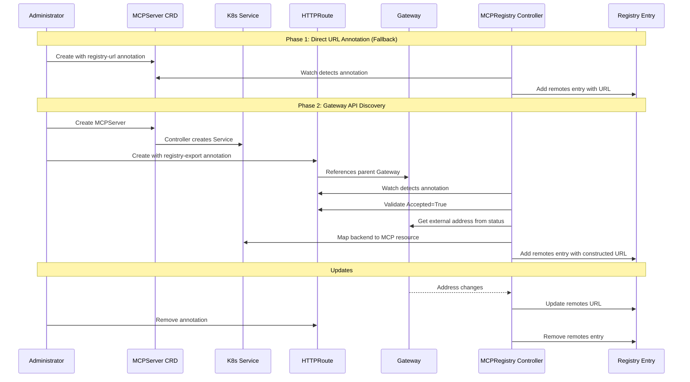
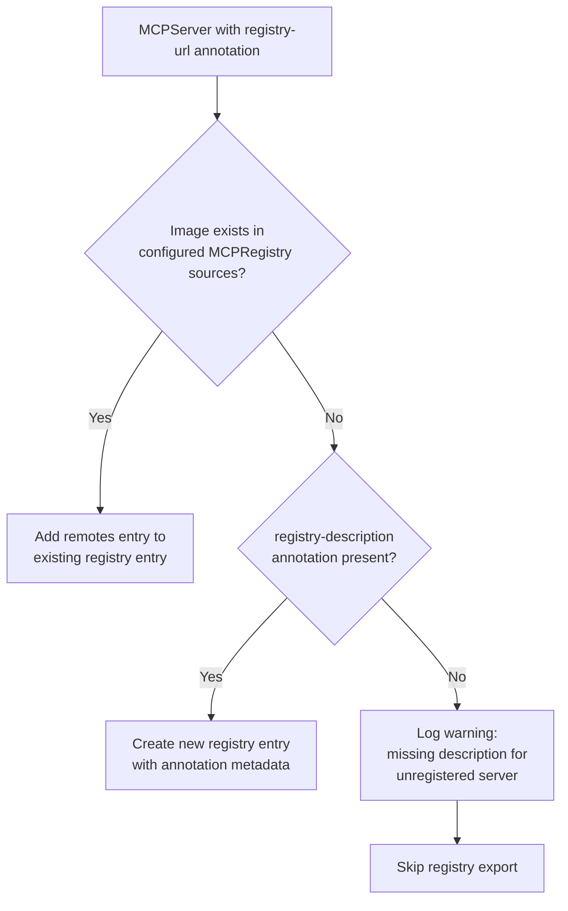

# Operator Registry Integration via Gateway API

## Problem Statement

ToolHive operators deploy two types of MCP resources in Kubernetes: MCPServer and MCPRemoteProxy. Organizations want to expose these servers externally and make them discoverable via the MCP registry, but there's currently no mechanism to:

1. Automatically detect which MCP resources are externally accessible
2. Populate the registry with external endpoints for these resources
3. Keep registry entries synchronized with ingress configuration changes

Without this integration, administrators must manually maintain registry entries, leading to configuration drift and stale registry data.

## Goals

- Enable automatic registry population based on Gateway API HTTPRoute resources
- Provide annotation-based fallback for organizations not using Gateway API
- Maintain separation between ingress configuration and MCP resource definitions
- Support both MCP resource types (MCPServer, MCPRemoteProxy)
- Give administrators explicit control over what gets exposed in the registry

## Non-Goals

- Automatic Gateway API resource creation (administrators explicitly create HTTPRoutes)
- Support for Ingress v1 or other non-Gateway API ingress types
- Multi-cluster registry aggregation
- Rich metadata management (tier, tools, tags) - deferred to future work
- Automatic metadata extraction from source registries - deferred to future work
- Introspection of MCP servers for tool discovery - deferred to future work

## Dependencies

This proposal builds on [Issue #2105: Expose deployed and registered servers as remote servers](https://github.com/stacklok/toolhive/issues/2105), which establishes the foundation for registering deployed MCP servers in the registry using the upstream MCP Registry `remotes` format.

## Proposed Solution

### Architecture

The operator watches Gateway API resources to discover which MCP servers are externally accessible. Administrators explicitly mark HTTPRoutes for registry export using an annotation. When an annotated HTTPRoute references an MCP resource's Service, the operator:

1. Detects the annotated HTTPRoute and validates it's accepted by the Gateway controller
2. Extracts the base MCP path from HTTPRoute rules
3. Traverses to parent Gateway resource(s) to get external hostname/IP (required because HTTPRoute hostnames can be empty or wildcards, and the actual external address comes from Gateway status)
4. Constructs the full external endpoint URL
5. Adds a `remotes` entry to the server's registry entry

For organizations not yet using Gateway API, a simple annotation on the MCP resource itself provides an explicit URL.



### Primary Approach: Gateway API with Explicit Annotation

Administrators expose MCP resources using standard HTTPRoute resources with an explicit registry export annotation:

```yaml
apiVersion: gateway.networking.k8s.io/v1
kind: HTTPRoute
metadata:
  name: github-mcp-external
  namespace: mcp-servers
  annotations:
    # Required: Opt-in to registry export
    toolhive.stacklok.dev/registry-export: "true"
spec:
  parentRefs:
    - name: external-gateway
      namespace: gateway-system

  hostnames:
    - "mcp.company.com"

  rules:
    - matches:
        - path:
            type: PathPrefix
            value: /github
      backendRefs:
        - name: github-mcp-service  # Service created by MCPServer controller
          port: 8080
```

The MCPRegistry controller:

- **Watches HTTPRoute resources** for the registry export annotation
- **Ignores HTTPRoutes without annotation** (explicit opt-in model)
- **Validates HTTPRoute acceptance** via status conditions before creating registry entries
- **Maps Services to MCP resources** using owner references
- **Extracts Gateway addresses** from Gateway status (needed because HTTPRoute hostnames may be empty/wildcards)
- **Constructs endpoint URLs** combining protocol (from Gateway listeners), hostname (from Gateway addresses), and path (from HTTPRoute matches)
- **Adds `remotes` entry** to the server's existing registry entry

**Benefits:**
- **Explicit control**: Administrators explicitly choose what to expose in registry
- **Progressive rollout**: Create HTTPRoute first, test it, then add annotation when ready
- **Clear intent**: Annotation signals "this is meant to be publicly discoverable"
- **Standard Kubernetes pattern**: Gateway API is the future of ingress
- **Separation of concerns**: Ingress config separate from MCP resources
- **Follows ToolHive design principle**: CRD attributes for business logic, infrastructure concerns elsewhere

### Fallback Approach: Direct URL Annotation

For organizations not yet using Gateway API, or for internal MCP servers not from a known registry, explicit URL and description specification via annotations on the MCP resource:

```yaml
apiVersion: toolhive.stacklok.dev/v1alpha1
kind: MCPServer
metadata:
  name: github-mcp
  namespace: mcp-servers
  annotations:
    # Required for registry export: External URL
    toolhive.stacklok.dev/registry-url: "https://mcp.company.com/github"
    # Required for servers not in a source registry: Description
    toolhive.stacklok.dev/registry-description: "GitHub MCP server for repository operations"
spec:
  image: ghcr.io/stacklok/mcp-github:v1.0.0
  transport: sse
  port: 8080
```

The MCPRegistry controller scans MCP resources for these annotations and adds corresponding `remotes` entries to the registry.

**Benefits:**
- Enables adoption without Gateway API migration
- Simple and explicit
- Provides smooth transition path
- Same explicit opt-in model as HTTPRoute annotation

### Annotation Keys

**Discovery Control:**
| Annotation | Location | Required | Description |
|------------|----------|----------|-------------|
| `toolhive.stacklok.dev/registry-export` | HTTPRoute | Yes (for Gateway API) | Opt-in for Gateway API-based discovery |
| `toolhive.stacklok.dev/registry-url` | MCP resource | Yes (for fallback) | Direct URL for non-Gateway API users |
| `toolhive.stacklok.dev/registry-description` | MCP resource | Yes (if not in source registry) | Human-readable description for servers not from a known registry |

### Handling Servers Not in a Source Registry

When an MCPServer is deployed from an internal/custom image that isn't registered in any configured MCPRegistry source, the operator needs to create a **new registry entry** rather than just adding a `remotes` entry to an existing one.

**Decision Flow:**



**For servers FROM a known registry:**
- The operator looks up the image reference in configured MCPRegistry sources
- If found, it adds a `remotes` entry to the existing server entry
- Metadata (name, description, version) comes from the source registry

**For servers NOT in any registry (internal/custom servers):**
- The `registry-description` annotation is **required**
- The operator creates a new registry entry with:
  - `name`: Generated from MCP resource namespace/name in reverse-DNS format
  - `description`: From `registry-description` annotation
  - `version`: "1.0.0" (default)
  - `remotes`: The discovered external URL

**Example - Internal Server:**

```yaml
apiVersion: toolhive.stacklok.dev/v1alpha1
kind: MCPServer
metadata:
  name: internal-analytics
  namespace: mcp-servers
  annotations:
    toolhive.stacklok.dev/registry-url: "https://mcp.company.com/analytics"
    toolhive.stacklok.dev/registry-description: "Internal analytics MCP server for business metrics"
spec:
  image: registry.company.com/mcp/analytics:v2.1.0  # Not in any public registry
  transport: sse
  port: 8080
```

**Results in registry entry:**

```json
{
  "name": "dev.stacklok.toolhive/mcp-servers.internal-analytics",
  "description": "Internal analytics MCP server for business metrics",
  "version": "1.0.0",
  "remotes": [
    {
      "type": "sse",
      "url": "https://mcp.company.com/analytics"
    }
  ]
}
```

### Registry Entry Format

This proposal adds `remotes` entries to servers in the registry. The format follows the [upstream MCP Registry schema](https://github.com/modelcontextprotocol/registry/blob/main/docs/reference/server-json/server.schema.json):

```json
{
  "name": "io.github.stacklok/github-mcp",
  "description": "GitHub MCP server for repository operations",
  "version": "1.0.0",
  "remotes": [
    {
      "type": "sse",
      "url": "https://mcp.company.com/github"
    }
  ]
}
```

**Key points:**
- `remotes` is the standard MCP Registry field for pre-deployed remote servers
- A server can have multiple `remotes` entries (e.g., in-cluster and external)
- Transport type (`sse`, `streamable-http`) comes from the MCPServer spec
- For servers not in a source registry, `registry-description` annotation is required

**Metadata Sources:**

| Field | Source | Notes |
|-------|--------|-------|
| `name` | Source registry entry OR generated from namespace/name | Generated format: `dev.stacklok.toolhive/{namespace}.{name}` |
| `description` | Source registry entry OR `registry-description` annotation | **Required** if server not from known registry |
| `version` | Source registry entry or "1.0.0" | Version identifier |
| `remotes[].type` | MCPServer/MCPRemoteProxy spec | Transport protocol |
| `remotes[].url` | Gateway + HTTPRoute OR `registry-url` annotation | Discovered external endpoint |

## Design Decisions

### Why Require Annotation on HTTPRoute?

**Explicit Control**: Operators may create HTTPRoute for testing or staged rollout before making it publicly discoverable. The annotation provides explicit opt-in:

1. **Create HTTPRoute** → Service is exposed via Gateway
2. **Test and validate** → Ensure routing works correctly
3. **Add annotation** → Make it discoverable in registry

Without annotation requirement, every HTTPRoute would automatically appear in registry, which may not be desired.

**Security**: Prevents accidental exposure of internal/test MCP servers in the public-facing registry.

### Why Traverse to Gateway Resource?

While HTTPRoute has a `hostnames` field, we need to traverse to the Gateway because:

1. **Hostnames can be empty**: If not specified, the route accepts requests from any hostname the Gateway accepts
2. **Hostnames can be wildcards**: e.g., `*.example.com` doesn't give us the actual endpoint
3. **External address is in Gateway status**: The actual IP/hostname assigned by the load balancer is in `Gateway.status.addresses`

This does require read access to Gateway resources, but only for annotation-marked HTTPRoutes.

### Why Gateway API Instead of Ingress v1?

- Gateway API is the future of Kubernetes ingress
- Richer API with better separation of concerns
- Better support for advanced routing (which MCP servers may need)
- Annotation fallback provides compatibility for non-Gateway API users

### Why Not Direct CRD Fields for External URL?

**Separation of Concerns**: Follows ToolHive's design principle from `cmd/thv-operator/DESIGN.md`:
- CRD attributes: Business logic affecting reconciliation
- Infrastructure configuration: How to expose resources

Adding an `externalURL` field to MCPServer would mix these concerns. HTTPRoute watching keeps ingress configuration separate.

### Why Both Gateway API and Annotation?

**Gradual Adoption**: Organizations at different Gateway API maturity levels:
- Advanced: Full Gateway API adoption → use HTTPRoute annotation
- Traditional: Using Ingress v1 or other systems → use direct URL annotation
- Transitioning: Mix both approaches during migration

### Controller Watch Strategy

Use controller-runtime watches (not client-go informers) for consistency with existing ToolHive controllers:
- Watch HTTPRoute resources → filter by annotation → map to affected MCPRegistry resources
- Watch Gateway resources → map to MCPRegistry resources using affected HTTPRoutes
- Watch MCP resources → scan for direct URL annotations
- Follow existing pattern in `mcpregistry_controller.go`

**Change Detection**: The controller detects URL changes by:
1. Watching Gateway status for address changes
2. Watching HTTPRoute for path/hostname changes
3. Comparing constructed URL against current registry entry
4. Updating registry entry when URL changes

## Edge Cases

### HTTPRoute with Multiple Backends

**Issue**: HTTPRoute with weighted traffic splitting to multiple backends

**Solution**: Create registry entry for the canonical Gateway endpoint. The HTTPRoute handles internal backend routing transparently. If multiple distinct MCP resources need separate registry entries, create separate HTTPRoutes with different annotations.

### HTTPRoute Not Yet Accepted

**Issue**: HTTPRoute exists with annotation but Gateway controller hasn't accepted it

**Solution**: Validate HTTPRoute status conditions. Only create registry entry when at least one parent Gateway has accepted the route (status condition `Accepted=True`). Log warning if annotation present but route not accepted.

### Gateway Address Not Assigned

**Issue**: Gateway exists but LoadBalancer hasn't assigned IP/hostname yet

**Solution**: Gateway watch triggers reconciliation when status changes. Registry entry created once address appears. Status condition indicates waiting for Gateway address.

### Cross-Namespace Gateway References

**Issue**: HTTPRoute in namespace A referencing Gateway in namespace B requires ReferenceGrant

**Solution**: Validate ReferenceGrant exists before creating registry entry. Log warning if reference not allowed. Don't create registry entry until reference is valid.

### Both HTTPRoute and Direct URL Annotations Present

**Issue**: MCP resource has `registry-url` annotation AND is referenced by HTTPRoute with `registry-export` annotation

**Solution**: Direct URL annotation takes precedence (explicit > inferred). Log warning in status conditions about conflicting configuration. Recommendation: use one or the other, not both.

### Duplicate Registry Names

**Issue**: Multiple resources with same name exposed via different routes

**Solution**: Generate unique names using namespace/name combination. If annotation absent and conflict detected, generate unique names using Gateway name suffix (e.g., `github-mcp-external-gateway`, `github-mcp-internal-gateway`).

### Stale Endpoint Cleanup

**Issue**: HTTPRoute deleted or annotation removed but registry entry remains

**Solution**: Track endpoint source. During reconciliation, remove `remotes` entries that no longer have corresponding HTTPRoute annotation or direct URL annotation.

## Security Considerations

### Authentication Still Required

**Critical**: Gateway API exposure makes servers **reachable** but doesn't bypass authentication.

- MCPServer/MCPRemoteProxy `OIDCConfig` and `AuthzConfig` still apply
- Clients must provide valid tokens

### Explicit Opt-In Security Model

The annotation requirement provides defense against accidental exposure:
- HTTPRoutes for internal testing don't appear in registry
- Administrators must consciously decide to make resources discoverable
- Remove annotation to quickly remove from registry without deleting HTTPRoute

### RBAC Requirements

Operator needs additional permissions:

```yaml
# Added to operator RBAC
- apiGroups: ["gateway.networking.k8s.io"]
  resources: ["httproutes", "gateways", "referencegrants"]
  verbs: ["get", "list", "watch"]
```

### Network Policy Recommendations

Document that administrators should:
- Apply NetworkPolicies to control Gateway access
- Restrict which namespaces can create HTTPRoutes to specific Gateways
- Maintain defense in depth

## Implementation Phases

### Phase 1: Direct URL Annotation

**Why First**: Provides immediate value with minimal complexity, no Gateway API dependency

**Deliverables**:
- Annotation scanning for MCPServer and MCPRemoteProxy
- Registry entry generation from `registry-url` and `registry-description` annotations
- Unit tests and documentation

### Phase 2: Gateway API Integration

**Deliverables**:
- Gateway API dependency and RBAC
- HTTPRoute and Gateway watches with annotation filtering
- Service → MCP resource mapping
- Gateway address extraction and URL construction
- Integration tests

### Phase 3: Production Hardening

**Deliverables**:
- Cross-namespace reference validation
- Conflict detection and resolution
- Stale endpoint cleanup
- End-to-end Chainsaw tests

## Testing Strategy

- **Unit Tests**: Annotation extraction, URL construction, registry entry generation, annotation filtering
- **Integration Tests** (envtest): Watch triggers, annotation filtering, status updates, ConfigMap content
- **E2E Tests** (Chainsaw): Full lifecycle with real Gateway API resources, annotation workflows

## Success Criteria

**Phase 1**:
- Direct URL annotation discovery working for both MCP resource types
- Registry entries reflect annotated endpoints with `remotes` entries
- Description annotation used for servers not from source registry

**Phase 2**:
- HTTPRoute annotation-based discovery working
- Only annotated HTTPRoutes create registry entries
- Gateway address changes trigger registry updates

**Phase 3**:
- Cross-namespace references validated
- Conflicting annotations handled gracefully
- Stale endpoints cleaned up automatically
- Production-ready

## Open Questions

1. **How should we handle rich metadata (tier, tools, tags) for internally-created MCP servers?**
   - Options: Annotations on MCP resource, fields in CRD spec, server.json in OCI image, separate metadata CRD
   - Deferred to future proposal

2. **Should we automatically extract metadata from source registries when deploying from a known image?**
   - If MCPServer image matches a registry entry, use that entry's metadata
   - Deferred to future proposal

3. **Should we introspect MCP servers to discover tools dynamically?**
   - Query running servers via MCP protocol for `tools/list`
   - Deferred to future proposal

4. **Should we validate direct URL annotations are reachable?**
   - Recommendation: Basic URL parsing only, no reachability checks. Operators responsible for correct URLs.

5. **How to handle HTTPRoute with annotation but no matching MCP resource backend?**
   - Recommendation: Log warning, don't create registry entry. HTTPRoute might be for non-MCP service.

## Alternative Approaches Considered

### Automatic Discovery Without Annotation

**Approach**: Watch all HTTPRoutes and auto-discover MCP backends

**Rejected**:
- No explicit control over what appears in registry
- HTTPRoutes for testing/staging would appear in production registry
- Operator can't distinguish "exposed for testing" from "ready for public discovery"

### Add externalURL Field to CRD Specs

**Rejected**: Violates separation of concerns (infrastructure vs business logic per ToolHive design principles)

### Custom Ingress Annotations

**Rejected**: Ingress v1 is deprecated, Gateway API is the future

### Separate RegistryExport CRD

**Rejected**: Unnecessary complexity, annotations provide sufficient control

## Related Work

- [Issue #2105: Expose deployed and registered servers as remote servers](https://github.com/stacklok/toolhive/issues/2105) - Foundation for this proposal
- [THV-2151: Remote MCP Proxy](THV-2151-remote-mcp-proxy.md) - MCPRemoteProxy architecture
- [THV-2207: MCPGroup CRD](THV-2207-kubernetes-mcpgroup-crd.md) - MCPGroup for organization
- [Gateway API Documentation](https://gateway-api.sigs.k8s.io/)
- [MCP Registry Schema](https://github.com/modelcontextprotocol/registry/blob/main/docs/reference/server-json/server.schema.json)
