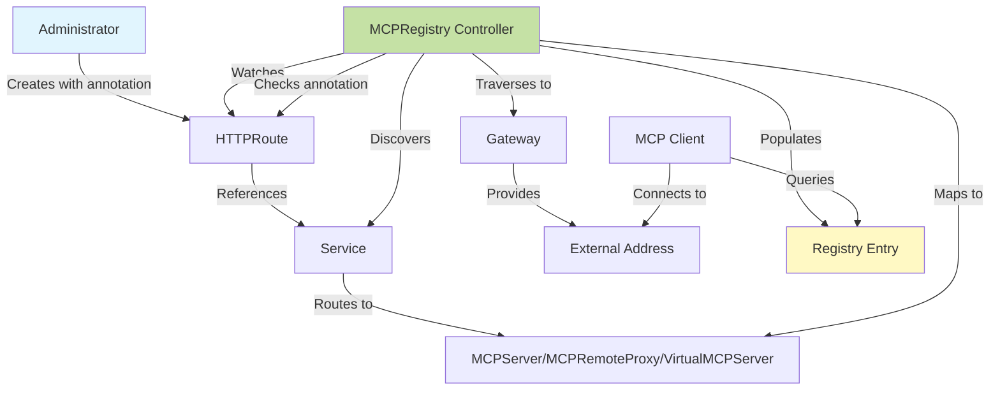

# Operator Registry Integration via Gateway API

## Problem Statement

ToolHive operators deploy three types of MCP resources in Kubernetes: MCPServer, MCPRemoteProxy, and VirtualMCPServer. Organizations want to expose these servers externally and make them discoverable via the MCP registry, but there's currently no mechanism to:

1. Automatically detect which MCP resources are externally accessible
2. Populate the registry with external endpoints for these resources
3. Keep registry entries synchronized with ingress configuration changes

Without this integration, administrators must manually maintain registry entries, leading to configuration drift and stale registry data.

## Goals

- Enable automatic registry population based on Gateway API HTTPRoute resources
- Provide annotation-based fallback for organizations not using Gateway API
- Maintain separation between ingress configuration and MCP resource definitions
- Support all three MCP resource types (MCPServer, MCPRemoteProxy, VirtualMCPServer)
- Give administrators explicit control over what gets exposed in the registry

## Non-Goals

- Automatic Gateway API resource creation (administrators explicitly create HTTPRoutes)
- Support for Ingress v1 or other non-Gateway API ingress types
- Multi-cluster registry aggregation

## Proposed Solution

### Architecture

The operator watches Gateway API resources to discover which MCP servers are externally accessible. Administrators explicitly mark HTTPRoutes for registry export using an annotation. When an annotated HTTPRoute references an MCP resource's Service, the operator:

1. Detects the annotated HTTPRoute and validates it's accepted by the Gateway controller
2. Extracts the base MCP path from HTTPRoute rules
3. Traverses to parent Gateway resource(s) to get external hostname/IP
4. Constructs the full external endpoint URL
5. Creates an entry in the MCPRegistry pointing to this external endpoint

For organizations not yet using Gateway API, a simple annotation on the MCP resource itself provides an explicit URL.


```mermaid
graph TB
    Admin[Administrator] -->|Creates with annotation| HTTPRoute[HTTPRoute]
    HTTPRoute -->|References| Service[Service]
    Service -->|Routes to| MCP[MCPServer/MCPRemoteProxy/VirtualMCPServer]

    Operator[MCPRegistry Controller] -->|Watches| HTTPRoute
    Operator -->|Checks annotation| HTTPRoute
    Operator -->|Discovers| Service
    Operator -->|Maps to| MCP
    Operator -->|Traverses to| Gateway[Gateway]
    Gateway -->|Provides| Address[External Address]

    Operator -->|Populates| Registry[Registry Entry]

    Client[MCP Client] -->|Queries| Registry
    Client -->|Connects to| Address

    style Admin fill:#e1f5fe
    style Operator fill:#c5e1a5
    style Registry fill:#fff9c4
```

### Primary Approach: Gateway API with Explicit Annotation

Administrators expose MCP resources using standard HTTPRoute resources with an explicit registry export annotation:

```yaml
apiVersion: gateway.networking.k8s.io/v1
kind: HTTPRoute
metadata:
  name: github-mcp-external
  namespace: mcp-servers
  annotations:
    # Discovery control
    toolhive.stacklok.dev/registry-export: "true"
    toolhive.stacklok.dev/registry-name: "github-production"

    # Registry metadata
    toolhive.stacklok.dev/registry-tier: "Official"
    toolhive.stacklok.dev/registry-tools: "create_pr,merge_pr,list_issues,create_issue"
    toolhive.stacklok.dev/registry-tags: "github,vcs,production"
    toolhive.stacklok.dev/registry-description: "GitHub MCP server for production use"
spec:
  parentRefs:
    - name: external-gateway
      namespace: gateway-system

  hostnames:
    - "mcp.company.com"

  rules:
    - matches:
        - path:
            type: PathPrefix
            value: /github
      backendRefs:
        - name: github-mcp-service  # Service created by MCPServer controller
          port: 8080
```

The MCPRegistry controller:

- **Watches HTTPRoute resources** for the registry export annotation
- **Ignores HTTPRoutes without annotation** (explicit opt-in model)
- **Validates HTTPRoute acceptance** via status conditions before creating registry entries
- **Maps Services to MCP resources** using owner references
- **Extracts Gateway addresses** from Gateway status
- **Constructs endpoint URLs** combining protocol (from Gateway listeners), hostname (from Gateway addresses), and path (from HTTPRoute matches)
- **Updates MCPRegistry status** with discovered endpoints

**Benefits:**
- **Explicit control**: Administrators explicitly choose what to expose in registry
- **Progressive rollout**: Create HTTPRoute first, test it, then add annotation when ready
- **Clear intent**: Annotation signals "this is meant to be publicly discoverable"
- **Standard Kubernetes pattern**: Gateway API is the future of ingress
- **Separation of concerns**: Ingress config separate from MCP resources
- **Follows ToolHive design principle**: CRD attributes for business logic, infrastructure concerns elsewhere

### Fallback Approach: Direct URL Annotation

For organizations not yet using Gateway API, explicit URL specification via annotation on the MCP resource:

```yaml
apiVersion: toolhive.stacklok.dev/v1alpha1
kind: MCPServer
metadata:
  name: github-mcp
  namespace: mcp-servers
  annotations:
    # Direct URL when not using Gateway API
    toolhive.stacklok.dev/registry-url: "https://mcp.company.com/github"
    # Optional: Override registry entry name
    toolhive.stacklok.dev/registry-name: "github-production"
spec:
  image: ghcr.io/stacklok/mcp-github:v1.0.0
  transport: sse
  port: 8080
```

The MCPRegistry controller scans MCP resources for this annotation and adds corresponding registry entries.

**Benefits:**
- Enables adoption without Gateway API migration
- Simple and explicit
- Provides smooth transition path
- Same explicit opt-in model as HTTPRoute annotation

### Annotation Keys

**Discovery Control:**
1. **`toolhive.stacklok.dev/registry-export`** (on HTTPRoute): Opt-in for Gateway API-based discovery
2. **`toolhive.stacklok.dev/registry-url`** (on MCP resource): Direct URL for non-Gateway API users
3. **`toolhive.stacklok.dev/registry-name`** (on either): Override registry entry name

**Metadata Annotations** (on HTTPRoute or MCP resource):
4. **`toolhive.stacklok.dev/registry-tier`**: Server classification ("Official", "Community", "Partner")
5. **`toolhive.stacklok.dev/registry-tools`**: Comma-separated list of tool names (e.g., "create_pr,merge_pr,list_issues")
6. **`toolhive.stacklok.dev/registry-tags`**: Comma-separated categorization tags (e.g., "github,vcs,production")
7. **`toolhive.stacklok.dev/registry-description`**: Human-readable description (overrides default)

### Discovery Tracking

The operator tracks discovered endpoints using Kubernetes Events for observability rather than extending MCPRegistry status. This keeps the MCPRegistry CRD focused on registry management concerns.

**Event Types:**
- `EndpointDiscovered`: When a new endpoint is discovered via HTTPRoute or annotation
- `EndpointUpdated`: When an endpoint URL changes (Gateway address change, HTTPRoute update)
- `EndpointRemoved`: When HTTPRoute annotation removed or resource deleted

**Event Example:**
```yaml
apiVersion: v1
kind: Event
metadata:
  name: github-mcp-discovered
  namespace: mcp-servers
type: Normal
reason: EndpointDiscovered
message: "Discovered endpoint for MCPServer/github-mcp via HTTPRoute/github-mcp-external: https://mcp.company.com/github"
involvedObject:
  apiVersion: toolhive.stacklok.dev/v1alpha1
  kind: MCPRegistry
  name: company-registry
```

This approach provides:
- Clear audit trail of discovery events
- No CRD status bloat
- Standard Kubernetes observability pattern
- Easy integration with monitoring systems

### Registry Entry Format

Discovered endpoints are published using the upstream MCP Registry format (from modelcontextprotocol/registry) with ToolHive publisher extensions:

```json
{
  "servers": [
    {
      "server": {
        "$schema": "https://static.modelcontextprotocol.io/schemas/2025-10-17/server.schema.json",
        "name": "com.company.mcp/github-production",
        "description": "GitHub MCP server for production use",
        "version": "1.0.0",
        "remotes": [
          {
            "type": "sse",
            "url": "https://mcp.company.com/github"
          }
        ],
        "_meta": {
          "io.modelcontextprotocol.registry/publisher-provided": {
            "io.github.stacklok": {
              "https://mcp.company.com/github": {
                "status": "active",
                "tier": "Official",
                "tools": ["create_pr", "merge_pr", "list_issues"],
                "tags": ["github", "vcs", "production"]
              }
            }
          }
        }
      },
      "_meta": {
        "io.modelcontextprotocol.registry/official": {
          "status": "active",
          "publishedAt": "2025-11-14T10:30:00Z",
          "isLatest": true
        }
      }
    }
  ]
}
```

**Metadata Sources:**

| Field | Source | Notes |
|-------|--------|-------|
| `name` | `registry-name` annotation or MCP resource name | Converted to reverse-DNS format |
| `description` | `registry-description` annotation or MCP resource description | Human-readable server description |
| `version` | MCP resource metadata or "1.0.0" | Version identifier |
| `remotes[].type` | MCPServer/MCPRemoteProxy/VirtualMCPServer spec | Transport protocol |
| `remotes[].url` | Gateway + HTTPRoute or `registry-url` annotation | Discovered external endpoint |
| `status` | HTTPRoute acceptance status | "active" if route accepted |
| `tier` | `registry-tier` annotation | Optional: "Official", "Community", "Partner" |
| `tools` | `registry-tools` annotation | Optional: Comma-separated tool names |
| `tags` | `registry-tags` annotation | Optional: Comma-separated tags |

**Publisher Extensions:**
- Nested under `io.modelcontextprotocol.registry/publisher-provided` → `io.github.stacklok` → `{url}`
- Uses existing ToolHive converter functions (`pkg/registry/converters/`)
- Compatible with standard MCP Registry API clients (extensions are optional)
- Enables rich metadata for filtering and discovery without querying live servers

## Design Decisions

### Why Require Annotation on HTTPRoute?

**Explicit Control**: Operators may create HTTPRoute for testing or staged rollout before making it publicly discoverable. The annotation provides explicit opt-in:

1. **Create HTTPRoute** → Service is exposed via Gateway
2. **Test and validate** → Ensure routing works correctly
3. **Add annotation** → Make it discoverable in registry

Without annotation requirement, every HTTPRoute would automatically appear in registry, which may not be desired.

**Security**: Prevents accidental exposure of internal/test MCP servers in the public-facing registry.

### Why Gateway API Instead of Ingress v1?

- Gateway API is the future of Kubernetes ingress
- Richer API with better separation of concerns
- Better support for advanced routing (which MCP servers may need)
- Annotation fallback provides compatibility for non-Gateway API users

### Why Not Direct CRD Fields for External URL?

**Separation of Concerns**: Follows ToolHive's design principle from `cmd/thv-operator/DESIGN.md`:
- CRD attributes: Business logic affecting reconciliation
- Infrastructure configuration: How to expose resources

Adding an `externalURL` field to MCPServer would mix these concerns. HTTPRoute watching keeps ingress configuration separate.

### Why Both Gateway API and Annotation?

**Gradual Adoption**: Organizations at different Gateway API maturity levels:
- Advanced: Full Gateway API adoption → use HTTPRoute annotation
- Traditional: Using Ingress v1 or other systems → use direct URL annotation
- Transitioning: Mix both approaches during migration

### Controller Watch Strategy

Use controller-runtime watches (not client-go informers) for consistency with existing ToolHive controllers:
- Watch HTTPRoute resources → filter by annotation → map to affected MCPRegistry resources
- Watch Gateway resources → map to MCPRegistry resources using affected HTTPRoutes
- Watch MCP resources → scan for direct URL annotations
- Follow existing pattern in `mcpregistry_controller.go`

## Edge Cases

### HTTPRoute with Multiple Backends

**Issue**: HTTPRoute with weighted traffic splitting to multiple backends

**Solution**: Create registry entry for the canonical Gateway endpoint. The HTTPRoute handles internal backend routing transparently. If multiple distinct MCP resources need separate registry entries, create separate HTTPRoutes with different annotations.

### HTTPRoute Not Yet Accepted

**Issue**: HTTPRoute exists with annotation but Gateway controller hasn't accepted it

**Solution**: Validate HTTPRoute status conditions. Only create registry entry when at least one parent Gateway has accepted the route (status condition `Accepted=True`). Log warning if annotation present but route not accepted.

### Gateway Address Not Assigned

**Issue**: Gateway exists but LoadBalancer hasn't assigned IP/hostname yet

**Solution**: Gateway watch triggers reconciliation when status changes. Registry entry created once address appears. Status condition indicates waiting for Gateway address.

### Cross-Namespace Gateway References

**Issue**: HTTPRoute in namespace A referencing Gateway in namespace B requires ReferenceGrant

**Solution**: Validate ReferenceGrant exists before creating registry entry. Log warning if reference not allowed. Don't create registry entry until reference is valid.

### Both HTTPRoute and Direct URL Annotations Present

**Issue**: MCP resource has `registry-url` annotation AND is referenced by HTTPRoute with `registry-export` annotation

**Solution**: Direct URL annotation takes precedence (explicit > inferred). Log warning in status conditions about conflicting configuration. Recommendation: use one or the other, not both.

### Duplicate Registry Names

**Issue**: Multiple resources with same name exposed via different routes

**Solution**: Use `registry-name` annotation to provide explicit unique names. If annotation absent and conflict detected, generate unique names using Gateway name suffix (e.g., `github-mcp-external-gateway`, `github-mcp-internal-gateway`).

### Stale Endpoint Cleanup

**Issue**: HTTPRoute deleted or annotation removed but registry entry remains

**Solution**: Track endpoint source in status. During reconciliation, remove entries that no longer have corresponding HTTPRoute annotation or direct URL annotation.

## Security Considerations

### Authentication Still Required

**Critical**: Gateway API exposure makes servers **reachable** but doesn't bypass authentication.

- MCPServer/MCPRemoteProxy `OIDCConfig` and `AuthzConfig` still apply
- Registry entries should indicate authentication requirements
- Clients must provide valid tokens

### Explicit Opt-In Security Model

The annotation requirement provides defense against accidental exposure:
- HTTPRoutes for internal testing don't appear in registry
- Administrators must consciously decide to make resources discoverable
- Removes annotation to quickly remove from registry without deleting HTTPRoute

### RBAC Requirements

Operator needs additional permissions:

```yaml
# Added to operator RBAC
- apiGroups: ["gateway.networking.k8s.io"]
  resources: ["httproutes", "gateways", "referencegrants"]
  verbs: ["get", "list", "watch"]
```

### Network Policy Recommendations

Document that administrators should:
- Apply NetworkPolicies to control Gateway access
- Restrict which namespaces can create HTTPRoutes to specific Gateways
- Maintain defense in depth

## Implementation Phases

### Phase 1: Direct URL Annotation

**Why First**: Provides immediate value with minimal complexity, no Gateway API dependency

**Deliverables**:
- Annotation scanning for MCPServer, MCPRemoteProxy, VirtualMCPServer
- Registry entry generation from `registry-url` annotations
- Status tracking for discovered endpoints
- Unit tests and documentation

### Phase 2: Gateway API Integration

**Deliverables**:
- Gateway API dependency and RBAC
- HTTPRoute and Gateway watches with annotation filtering
- Service → MCP resource mapping
- Gateway address extraction and URL construction
- Integration tests

### Phase 3: Production Hardening

**Deliverables**:
- Cross-namespace reference validation
- Conflict detection and resolution
- Stale endpoint cleanup
- End-to-end Chainsaw tests

## Testing Strategy

- **Unit Tests**: Annotation extraction, URL construction, registry entry generation, annotation filtering
- **Integration Tests** (envtest): Watch triggers, annotation filtering, status updates, ConfigMap content
- **E2E Tests** (Chainsaw): Full lifecycle with real Gateway API resources, annotation workflows

## Success Criteria

**Phase 1**:
- Direct URL annotation discovery working for all three MCP resource types
- Registry entries reflect annotated endpoints
- Status accurately tracks discovered endpoints

**Phase 2**:
- HTTPRoute annotation-based discovery working
- Only annotated HTTPRoutes create registry entries
- Gateway address changes trigger registry updates
- Status shows Gateway references

**Phase 3**:
- Cross-namespace references validated
- Conflicting annotations handled gracefully
- Stale endpoints cleaned up automatically
- Production-ready

## Open Questions

1. **Should we support annotation on MCP resource to reference HTTPRoute name instead of direct URL?**
   - Recommendation: No, keep it simple. Two clear patterns: HTTPRoute annotation OR direct URL annotation.

2. **Should we validate direct URL annotations are reachable?**
   - Recommendation: Basic URL parsing only, no reachability checks. Operators responsible for correct URLs.

3. **How to handle HTTPRoute with annotation but no matching MCP resource backend?**
   - Recommendation: Log warning, don't create registry entry. HTTPRoute might be for non-MCP service.

## Alternative Approaches Considered

### Automatic Discovery Without Annotation

**Approach**: Watch all HTTPRoutes and auto-discover MCP backends

**Rejected**:
- No explicit control over what appears in registry
- HTTPRoutes for testing/staging would appear in production registry
- Operator can't distinguish "exposed for testing" from "ready for public discovery"

### Add externalURL Field to CRD Specs

**Rejected**: Violates separation of concerns (infrastructure vs business logic per ToolHive design principles)

### Custom Ingress Annotations

**Rejected**: Ingress v1 is deprecated, Gateway API is the future

### Separate RegistryExport CRD

**Rejected**: Unnecessary complexity, annotations provide sufficient control

## Related Work

- [THV-2106: Virtual MCP Server](THV-2106-virtual-mcp-server.md) - VirtualMCPServer aggregation
- [THV-2151: Remote MCP Proxy](THV-2151-remote-mcp-proxy.md) - MCPRemoteProxy architecture
- [THV-2207: MCPGroup CRD](THV-2207-kubernetes-mcpgroup-crd.md) - MCPGroup for organization
- [Gateway API Documentation](https://gateway-api.sigs.k8s.io/)
