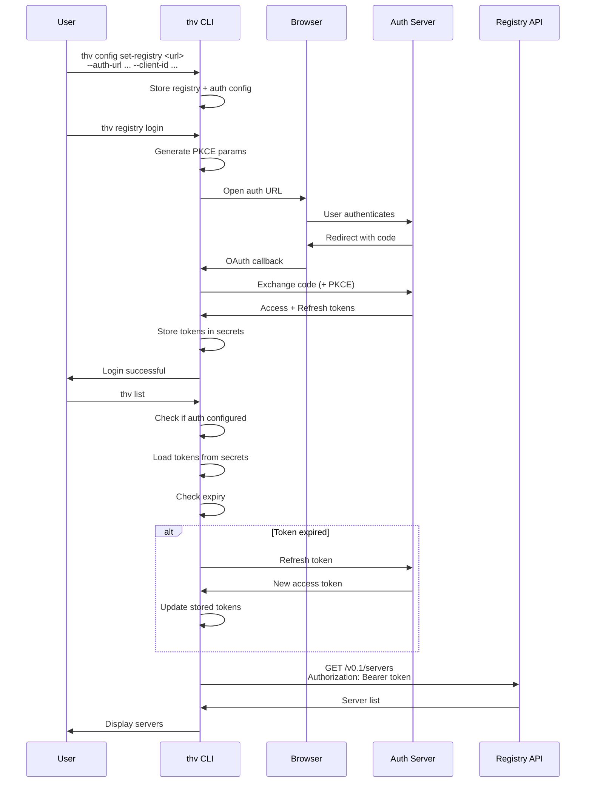

# Registry OAuth Authentication

## Problem Statement

ToolHive currently fetches MCP servers from registry APIs without authentication. This prevents users from accessing private or organization-specific registries that require authentication.

## Goals

- Enable OAuth 2.0 authentication for registry API access using Authorization Code flow with PKCE
- Automatically use authentication when configured, with no extra flags required
- Automatically refresh expired tokens without user intervention
- Store tokens securely using ToolHive's existing secret management system
- Support both authenticated and unauthenticated registries seamlessly

## Non-Goals

- Non-OAuth authentication, e.g API key or Basic authentication methods
- Support for other OAuth flows (Client Credentials, Device Code)

## Architecture Overview

The solution extends the registry API client to support OAuth 2.0 authentication using Authorization Code flow with PKCE (Proof Key for Code Exchange). When authentication is configured, ToolHive automatically uses it for registry API requests.

ToolHive already has OAuth infrastructure in `pkg/auth/oauth/flow.go` that handles PKCE, token exchange, and browser-based authentication flows. This proposal reuses that infrastructure for registry authentication.

### Authentication Flow



### Token Storage

Tokens are stored using ToolHive's existing `secrets.Provider` interface with the following secret names:
- `REGISTRY_ACCESS_TOKEN` - OAuth access token for API requests
- `REGISTRY_REFRESH_TOKEN` - OAuth refresh token for obtaining new access tokens
- `REGISTRY_TOKEN_EXPIRY` - Expiration timestamp for token refresh logic

## Detailed Design

### Configuration Model

Extend the existing `config.Config` structure in `pkg/config/config.go` to include registry authentication settings:

**New Configuration Fields:**
- `registry_auth_url` - OAuth authorization server base URL (optional)
- `registry_client_id` - OAuth client ID (optional)
- `registry_scopes` - OAuth scopes to request (optional, array of strings)
- `registry_audience` - OAuth audience parameter (optional, RFC 8707)

**Auto-detection:** If `registry_auth_url` and `registry_client_id` are present in config, authentication is automatically used for registry API requests.

### Enhanced CLI Commands

Extend `thv config set-registry` to accept authentication parameters:

```bash
# Set registry with authentication
thv config set-registry <url> \
  --auth-url <authorization-server-url> \
  --client-id <client-id> \
  [--scopes <scope1,scope2>] \
  [--audience <audience>]
```

Add new registry authentication commands:

```bash
# Login to configured registry (required after setting auth config)
thv registry login
```

### API Endpoints

The ToolHive API server (`thv serve`) will support registry authentication following the same two-step pattern as the CLI:

**1. Configure registry with authentication settings:**

```bash
PUT /api/v1beta/registry
{
  "url": "https://registry.example.com",
  "auth": {
    "auth_url": "https://auth.example.com",
    "client_id": "registry-client",
    "scopes": ["registry:read"],
    "audience": "registry-api"  // optional
  }
}
```

This endpoint stores the registry URL and authentication configuration in the API server's config, but does not trigger the OAuth flow.

**2. Trigger OAuth login:**

```bash
POST /api/v1beta/registry/login
```

This endpoint blocks until the OAuth flow completes (following the same pattern as remote MCP server authentication).

**Response:**
- Success: `200 OK` with no body
- Failure: `400 Bad Request` with error message (e.g., "OAuth authentication failed: user denied authorization")

Once authenticated, the API server uses the stored tokens for all subsequent registry operations on behalf of all API clients. This follows the same model as remote MCP server authentication where tokens are stored and managed by the API server process.

### API Client Integration

The registry API client will be enhanced to:
- Check if authentication is configured during initialization
- If configured, implement automatic token refresh using `oauth2.TokenSource`
- Include `Authorization: Bearer <token>` header on API requests when authenticated
- Handle 401 responses by refreshing tokens and retrying once
- If token refresh fails, return error prompting user to run `thv registry login`
- Fall back to unauthenticated requests when no auth is configured

### Token Management

Token refresh is handled automatically using the standard `oauth2.TokenSource` interface:
- On API request, check if token is expired
- If expired, use refresh token to obtain new access token
- Store refreshed tokens in secrets storage
- If refresh fails, return error with helpful message

## User Experience

### Initial Setup for Private Registry

```bash
# Configure authenticated registry in one command
thv config set-registry https://registry.example.com \
  --auth-url https://auth.example.com \
  --client-id registry-cli-client \
  --scopes registry:read

# Login (opens browser for authentication)
thv registry login

# Use registry normally - authentication happens automatically
thv list
thv run my-private-server
```

## Security Considerations

### PKCE (Proof Key for Code Exchange)

The implementation uses PKCE for all OAuth flows, which:
- Eliminates the need for storing client secrets in configuration
- Protects against authorization code interception attacks
- Follows OAuth 2.0 best practices for native applications and CLI tools

### Token Storage Security

Tokens are stored using ToolHive's `secrets.Provider` which provides:
- Encrypted storage with user passphrase protection
- No plaintext token storage in configuration files

### Automatic Token Refresh

The `oauth2.TokenSource` automatically refreshes expired tokens, ensuring:
- Minimal user interruption for long-running operations
- Secure token lifecycle management
- Clear error messages when refresh tokens expire

## Future Enhancements


