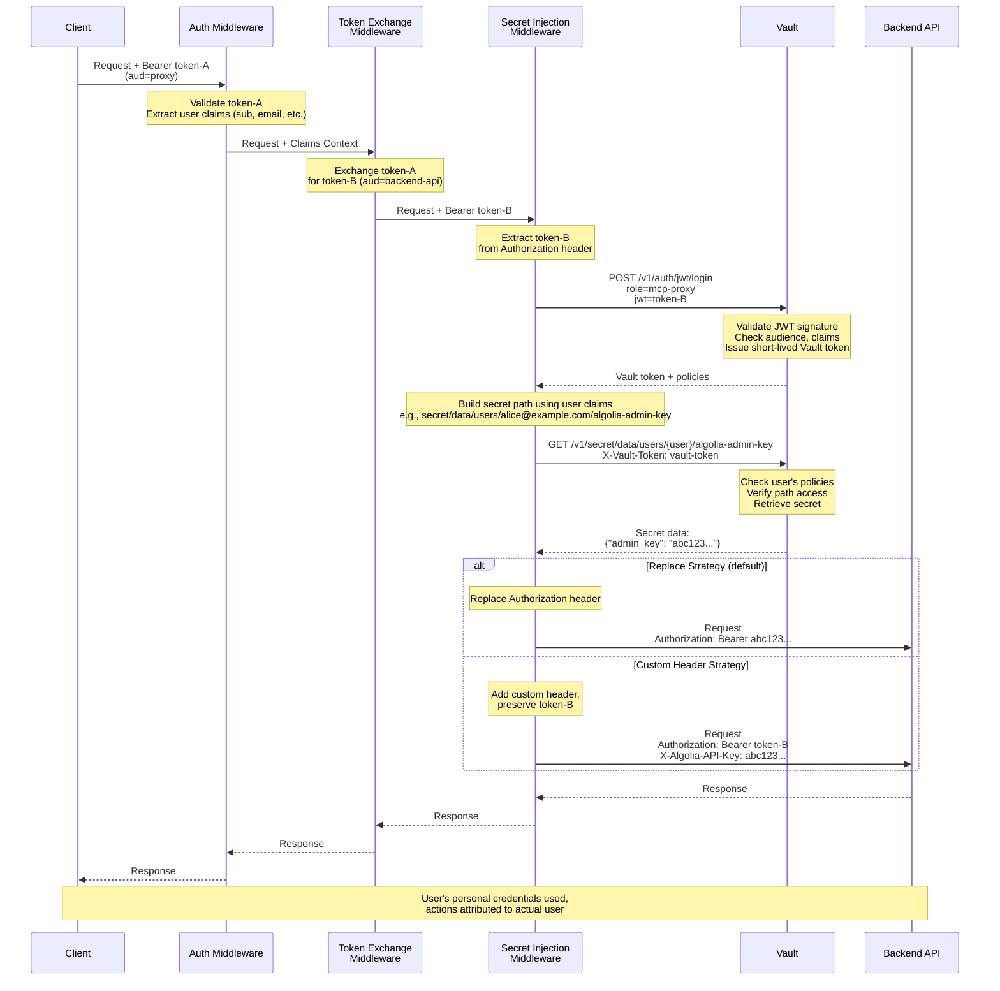

# Secret Injection Middleware

Dynamic secret fetching and injection into MCP proxy requests using HashiCorp Vault or other secret providers.

## Problem Statement

Many backend services and APIs use static authentication mechanisms (API keys, tokens, credentials) rather than OAuth/OIDC. While ToolHive's token exchange middleware (THV-2063) enables RFC-8693 token exchange for OAuth-compatible backends, it doesn't address scenarios where:

1. **Per-user secrets** are stored in Vault based on user identity, requiring the user's token to authenticate to Vault and retrieve their specific credentials (e.g., each user has their own GitHub PAT, API keys for external services)
2. **Legacy APIs** require static API keys that should be securely stored in Vault rather than environment variables
3. **Dynamic credentials** need to be fetched per-request from Vault (database credentials, cloud provider tokens) - though this is a secondary use case

Currently, ToolHive supports static secrets via environment variables or the secrets provider system (`pkg/secrets`), but these are:
- Resolved at **workload startup time** (not per-request)
- Not tied to **user identity** (shared across all users of the workload)
- Not suitable for **per-user credential isolation**

## Use Cases

### UC-1: Per-User Algolia Admin Key Management

**As a developer**, I want to use my personal Algolia admin API key when managing search indices through an MCP server, so that index modifications are attributed to me and respect my individual permissions.

**Current limitation**: The MCP server would need a single shared admin API key, meaning all index modifications (creating indices, updating settings, adding records) appear to come from one account, making it impossible to audit who made which changes.

**With secret injection**: Each user's Algolia admin API key is stored in Vault under their identity path (e.g., `secret/users/alice@example.com/algolia-admin-key`). When Alice makes a request to modify an index, the middleware authenticates to Vault as Alice and retrieves her specific admin key.

**Benefit**: Proper attribution of index modifications, individual permission scopes, audit trail tied to actual users, accountability for search configuration changes.

---

### UC-2: Multi-Tenant SaaS Integration

**As a platform administrator**, I want to run a single MCP server instance that connects to our SaaS tool (Jira, Salesforce, etc.) using different API keys per customer, so that data is properly isolated.

**Current limitation**: One shared API key means all customers' data would be accessed through a single account, breaking tenant isolation.

**With secret injection**: Each customer's API key is stored in Vault (e.g., `secret/tenants/acme-corp/jira-api-key`). The user's JWT contains a tenant claim, and the middleware fetches the appropriate tenant-specific credential.

**Benefit**: Proper multi-tenancy, data isolation, per-tenant rate limiting.

---

### UC-3: Secure API Key Storage

**As a security engineer**, I want to eliminate API keys from environment variables and configuration files, storing them instead in HashiCorp Vault with proper access controls.

**Current limitation**: Static secrets in `--secret` flags are stored in ToolHive's secrets provider, which may not meet enterprise security requirements.

**With secret injection**: API keys are stored only in Vault with centralized access policies, rotation capabilities, and audit logging. The MCP proxy fetches them dynamically.

**Benefit**: Centralized secret management, compliance with security policies, audit trail.

## Proposed Solution

Introduce a **Secret Injection Middleware** that:
1. Uses the incoming or exchanged token to authenticate to a secret provider (primarily HashiCorp Vault)
2. Fetches a **user-specific secret** from a configured path (path can include user claims like `sub`)
3. Injects the secret into the request (replacing or augmenting headers)

This middleware would run **after** the token exchange middleware in the middleware chain, allowing it to use the exchanged token for Vault authentication.

**Optional enhancement**: Secret caching per user to minimize Vault API calls (can be addressed in a later phase).

## High-Level Design

The Secret Injection Middleware sits in the middleware chain after authentication and token exchange, using the authenticated user's token to fetch user-specific secrets from Vault.



### Key Flow Points

1. **User Identity Preservation**: The JWT claims (especially `sub`) are preserved through the middleware chain and used to construct the Vault secret path
2. **Vault Authentication**: The exchanged token authenticates to Vault, ensuring only authorized users can access their secrets
3. **Per-User Secret Retrieval**: The secret path includes user identity, ensuring isolation (e.g., `/users/alice@example.com/algolia-admin-key` vs `/users/bob@example.com/algolia-admin-key`)
4. **Secret Injection**: The fetched secret replaces or augments the request headers before forwarding to the backend
5. **Audit Trail**: Vault logs all access with user identity, providing complete audit trail

## Key Design Decisions

### 1. Generic Abstraction with Vault as Primary Implementation

We'll create a generic `SecretFetcher` interface with Vault as the first and primary implementation. This allows future support for other providers (AWS Secrets Manager, Azure Key Vault) without changing the core middleware logic, while acknowledging that Vault has specific concepts (paths, auth methods, KV versions, dynamic secrets) that don't map directly to other providers. The interface will be simple: `FetchSecret(ctx, token, secretRef) (string, error)`, where `SecretReference` contains a provider-specific path and an optional key to extract from structured secrets.

### 2. Vault JWT Authentication

The middleware will use Vault's JWT/OIDC auth method to authenticate using the JWT from the previous middleware (typically token exchange). On each request, the middleware authenticates to Vault with the JWT, receives a short-lived Vault token, fetches the secret, and discards the Vault token. This provides per-user authentication to Vault, creates a complete audit trail showing which user accessed which secret, and avoids managing long-lived Vault credentials in the middleware configuration. The Vault role configuration will bind the JWT's audience claim (e.g., `bound_audiences="backend-api"`) and use a short TTL (e.g., `token_ttl="5m"`).

### 3. Phased Delivery: Static Paths First, Templating Second

**Phase 1** will support only static secret paths (e.g., `secret/data/shared/algolia-admin-key`), delivering immediate value for shared secrets while proving the JWT auth flow and Vault integration pattern. **Phase 2** will add Go template syntax to embed user claims in paths, enabling true per-user secret isolation. For example, `secret/data/users/{{.email}}/algolia-admin-key` would resolve to `secret/data/users/alice@example.com/algolia-admin-key` for user alice@example.com, or `secret/data/tenants/{{.tenant_id}}/api-key` would resolve to `secret/data/tenants/acme-corp/api-key` when the JWT contains a `tenant_id` claim. This phased approach reduces risk, allows faster MVP delivery, provides better testing of the core authentication flow, and gives us user feedback before committing to a template syntax. Per the vault expert's recommendation, templating introduces complexity in JWT claim parsing and potential injection vulnerabilities, so starting simple is the safer approach.

### 4. Path Handling for KV v2

Users must provide the full API path including `/data/` for KV v2 secrets. For example, to access a secret at logical path `users/alice/pat` in a KV v2 engine mounted at `secret/`, users specify `secret/data/users/alice/pat` in the configuration. This matches the HTTP API endpoint structure (`GET /v1/secret/data/users/alice/pat`) and aligns with how other Vault integrations (CSI driver, Vault Agent) handle paths. The middleware does not auto-inject `/data/` because: (a) it uses the HTTP API directly where `/data/` is part of the endpoint, (b) this prevents ambiguity and double-injection bugs, and (c) it provides explicit clarity for Phase 2 templating where paths like `secret/data/users/{{.email}}/api-key` show the exact API structure.

### 5. Secret Injection Strategy

The middleware will support both **replace** and **custom header** injection strategies, consistent with the existing token exchange middleware. The replace strategy (default) replaces the `Authorization: Bearer` header with the fetched secret, suitable for backends expecting the secret in the standard authorization header. The custom header strategy adds the secret to a specified header (e.g., `X-API-Key`) while preserving the OAuth token in the Authorization header, useful when backends need both OAuth validation and API key authentication. Header names will be validated to prevent header injection attacks.

### 6. Optional Caching (Phase 2)

Phase 1 will not include caching—each request will authenticate to Vault and fetch the secret fresh. This is the simplest implementation, ensures secrets are always fresh (immediate rotation), creates complete audit logs, and adds only ~10-50ms latency according to Vault performance characteristics. Phase 2 may add optional token caching (cache the Vault token, not the secret) or configurable secret caching with explicit TTL. The vault expert recommends caching tokens rather than secrets to reduce Vault load while still respecting secret rotation.

## Implementation Details

### Core Interface

```go
// SecretFetcher retrieves secrets from an external provider using authentication tokens
type SecretFetcher interface {
    // FetchSecret retrieves a secret using the provided token for authentication
    FetchSecret(ctx context.Context, token string, secretRef SecretReference) (string, error)

    // Close cleans up any resources
    Close() error
}

// SecretReference identifies a secret in the provider
type SecretReference struct {
    // Path is the provider-specific secret path
    // Phase 1: Static path (e.g., "secret/shared/algolia-admin-key")
    // Phase 2: Template path (e.g., "secret/users/{{.email}}/algolia-admin-key")
    Path string `json:"path"`

    // Key is the specific field within the secret to extract
    // For Vault KV v2: "token" extracts the value at secret.data.data.token
    // If empty, returns the first string value or entire secret as JSON
    Key string `json:"key,omitempty"`
}
```

### Vault Client Implementation: HTTP-Only, No HashiCorp Dependencies

The Vault integration will use direct HTTP API calls instead of the official `github.com/hashicorp/vault/api` client library to avoid any licensing concerns with HashiCorp's Business Source License (BSL) 1.1. We'll implement a simple HTTP client using Go's standard `net/http` package that makes calls to Vault's well-documented REST API: `POST /v1/auth/jwt/login` for JWT authentication and `GET /v1/{secret-path}` for reading secrets. This approach gives us full control over HTTP interactions (timeouts, retries, tracing), maintains a simpler dependency tree, and ensures ToolHive remains fully open-source.

### Provider Registry Pattern

The implementation will use a provider registry pattern for extensibility. Each secret provider (Vault, AWS Secrets Manager, Azure Key Vault) implements the `SecretFetcher` interface and registers itself with a global registry. The CLI flag parser creates providers based on the `--secret-provider` value, and each provider defines its own options schema with required/optional fields, defaults, and environment variable fallbacks. This architecture allows adding new providers without modifying the core middleware code.

**Environment variable fallback strategy**: When a Vault option is not explicitly provided via `--secret-provider-opts`, the code falls back to standard Vault environment variables (`VAULT_ADDR`, `VAULT_NAMESPACE`, `VAULT_CACERT`). This maintains compatibility with existing Vault workflows and tooling.

**Option parsing**: The `--secret-provider-opts` flag accepts both comma-separated key=value pairs and multiple flag invocations. A custom `pflag.Value` implementation parses the options into a map, which is then validated against the provider's schema to ensure all required options are present (either from flags or environment variables).

### Implementation Changes

The implementation will create a new `pkg/auth/secretinjection` package containing the core `SecretFetcher` interface, a provider registry system, a custom HTTP-based Vault client (`vault_http.go`), the Vault implementation of the fetcher (`vault.go`), and the middleware factory and handler (`middleware.go`). The middleware will need to be registered in `pkg/transport/types/middleware.go` with a new type constant `MiddlewareTypeSecretInjection`, and the RunConfig parser in `pkg/runner/config.go` will need updates to handle secret injection middleware configuration. CLI support will require adding `--secret-provider` and `--secret-provider-opts` flags to `cmd/thv/app/proxy.go` with dynamic help text generation based on registered providers. For Kubernetes deployments, the existing `MCPExternalAuthConfig` CRD in `cmd/thv-operator/api/v1alpha1/mcpexternalauthconfig_types.go` will be extended with a new `SecretInjection` type alongside the existing token exchange configuration, and the corresponding controller in `cmd/thv-operator/controllers/mcpexternalauthconfig_controller.go` will handle translating these CRD specs into RunConfig middleware entries.

## Relationship to `pkg/secrets`

ToolHive has two complementary secret systems serving different needs:

| Aspect | `pkg/secrets` | Secret Injection Middleware |
|--------|---------------|------------------------------|
| **Timing** | Startup | Per-request |
| **Consumer** | MCP server container | Proxy middleware |
| **Scope** | Workload-wide | Per-user |
| **Injection** | Environment variables | HTTP headers |
| **Use case** | Shared DB credentials, service keys | Personal PATs, tenant-specific API keys |

Use `pkg/secrets` for credentials the MCP server needs at startup (e.g., `DATABASE_URL`). Use secret injection middleware for per-user credentials fetched dynamically from Vault based on JWT identity (e.g., personal Algolia admin keys). Both can be used together in the same workload.

## Configuration Examples

### Phase 1: Static Secret Paths

#### CLI Configuration

**Design decision**: We use a generic `--secret-provider` flag with provider-specific options passed via `--secret-provider-opts`. This approach provides flexibility for adding future providers (AWS Secrets Manager, Azure Key Vault) while maintaining a consistent CLI interface. Each provider respects its standard environment variables as fallbacks (e.g., Vault options fall back to `VAULT_ADDR`, `VAULT_NAMESPACE`, etc.).

```bash
# Basic usage (comma-separated opts)
thv proxy algolia-mcp-server \
  --oidc-issuer https://keycloak.example.com/realms/myrealm \
  --oidc-client-id proxy-client \
  --token-exchange-url https://keycloak.example.com/realms/myrealm/protocol/openid-connect/token \
  --token-exchange-client-id exchange-client \
  --token-exchange-audience algolia-api \
  --secret-provider vault \
  --secret-provider-opts "addr=https://vault.example.com:8200,jwt-role=mcp-proxy,secret-path=secret/data/shared/algolia-admin-key,secret-field=admin_key"

# Or with multiple opts flags for readability
thv proxy algolia-mcp-server \
  --oidc-issuer https://keycloak.example.com/realms/myrealm \
  --oidc-client-id proxy-client \
  --token-exchange-url https://keycloak.example.com/realms/myrealm/protocol/openid-connect/token \
  --token-exchange-client-id exchange-client \
  --token-exchange-audience algolia-api \
  --secret-provider vault \
  --secret-provider-opts "addr=https://vault.example.com:8200" \
  --secret-provider-opts "jwt-role=mcp-proxy" \
  --secret-provider-opts "secret-path=secret/data/shared/algolia-admin-key" \
  --secret-provider-opts "secret-field=admin_key"

# With environment variable fallback
export VAULT_ADDR=https://vault.example.com:8200
export VAULT_NAMESPACE=production
thv proxy algolia-mcp-server \
  --secret-provider vault \
  --secret-provider-opts "jwt-role=mcp-proxy" \
  --secret-provider-opts "secret-path=secret/data/shared/algolia-admin-key" \
  --secret-provider-opts "secret-field=admin_key"
  # addr and namespace automatically use VAULT_ADDR and VAULT_NAMESPACE
```

**Available Vault provider options**:
- `addr` - Vault server URL (fallback: `VAULT_ADDR` env var) **[required]**
- `jwt-role` - Vault JWT authentication role **[required]**
- `jwt-mount-path` - Path where JWT auth method is mounted (default: `auth/jwt`). Vault allows mounting the same auth method multiple times at different paths to support multiple JWT configurations (e.g., `auth/jwt-prod`, `auth/jwt-dev`). Use `vault auth list` to see your mounted auth methods.
- `secret-path` - Full KV v2 path including `/data/` (e.g., `secret/data/shared/algolia-admin-key`) **[required]**
- `secret-field` - JSON field to extract from the secret (e.g., `token`)
- `namespace` - Vault Enterprise namespace (fallback: `VAULT_NAMESPACE` env var)
- `ca-cert` - CA certificate path for TLS verification (fallback: `VAULT_CACERT` env var)
- `timeout` - HTTP client timeout (default: `60s`)

**Validation**: When `--secret-provider vault` is specified, the tool validates that all required options (marked **[required]** above) are provided either via `--secret-provider-opts` or environment variables. Missing options produce helpful error messages showing exactly what's needed and which environment variables can be used as fallbacks.

#### Kubernetes Configuration

**MCPExternalAuthConfig** (extending existing CRD with new type):
```yaml
apiVersion: toolhive.stacklok.dev/v1alpha1
kind: MCPExternalAuthConfig
metadata:
  name: algolia-vault-secret
  namespace: default
spec:
  # Type discriminator - adds "secretInjection" to existing enum
  type: secretInjection

  # Secret injection configuration (matches tokenExchange pattern)
  secretInjection:
    # Vault server address
    vaultAddress: "http://vault.vault-system.svc.cluster.local:8200"

    # JWT authentication configuration
    jwtRole: mcp-proxy
    jwtMountPath: auth/jwt  # Optional, defaults to "auth/jwt"

    # Secret path (full KV v2 path including /data/)
    secretPath: "secret/data/shared/algolia-admin-key"

    # Secret field to extract from the JSON response
    secretKey: "admin_key"

    # Optional: Custom header name for the injected secret
    # If not specified, replaces the Authorization header (default behavior)
    # externalSecretHeaderName: "X-Algolia-API-Key"
```

**MCPServer** (simple reference pattern):
```yaml
apiVersion: toolhive.stacklok.dev/v1alpha1
kind: MCPServer
metadata:
  name: algolia-mcp
  namespace: default
spec:
  image: ghcr.io/example/algolia-mcp-server:latest
  transport: streamable-http

  oidcConfig:
    type: kubernetes
    kubernetes:
      audience: algolia-api

  # Reference to MCPExternalAuthConfig
  externalAuthConfigRef:
    name: algolia-vault-secret
```

### Phase 2 Preview: Per-User Secret Paths

Once templating is implemented, paths will support claim variables:

```bash
thv proxy algolia-mcp-server \
  --secret-provider vault \
  --secret-provider-opts "secret-path=secret/data/users/{{.email}}/algolia-admin-key" \
  --secret-provider-opts "secret-field=admin_key"
```

Kubernetes configuration:
```yaml
spec:
  type: secretInjection
  secretInjection:
    secretRef:
      path: "secret/data/users/{{.email}}/algolia-admin-key"
      key: "admin_key"
```

## Vault Setup

### Enable and Configure JWT Auth

```bash
# Enable JWT auth method
vault auth enable jwt

# Configure with OIDC discovery (only discovery URL needed for JWT validation)
vault write auth/jwt/config \
    oidc_discovery_url="https://keycloak.example.com/realms/myrealm"

# Create role for middleware (Phase 1: static secrets) with security controls
vault write auth/jwt/role/mcp-proxy \
    role_type="jwt" \
    bound_audiences="algolia-api" \
    bound_issuer="https://keycloak.example.com/realms/myrealm" \
    user_claim="sub" \
    token_policies="shared-secrets-reader" \
    token_ttl="15m" \
    token_max_ttl="1h" \
    token_no_default_policy=true
```

**Security controls**:
- `bound_issuer` validates the JWT `iss` claim to prevent token substitution attacks
- `bound_audiences` ensures the JWT was issued for the correct service (`algolia-api`)
- `token_no_default_policy=true` follows least privilege (only explicit policies apply)
- Adjusted TTLs (15m/1h) provide reasonable caching buffer for middleware

**Optional: Stricter claim validation**:
```bash
# Add bound_claims for defense-in-depth (e.g., require specific client ID or roles)
vault write auth/jwt/role/mcp-proxy-strict \
    role_type="jwt" \
    bound_audiences="algolia-api" \
    bound_issuer="https://keycloak.example.com/realms/myrealm" \
    bound_claims='{"azp":"mcp-middleware-client"}' \
    user_claim="sub" \
    token_policies="shared-secrets-reader" \
    token_ttl="15m" \
    token_max_ttl="1h" \
    token_no_default_policy=true
```

### Create Policies and Store Secrets

**Phase 1 policy (shared secrets)**:
```bash
vault policy write shared-secrets-reader - <<EOF
path "secret/data/shared/*" {
  capabilities = ["read"]
}
EOF
```

**Store secrets in Vault**:
```bash
# KV v2: the CLI handles /data/ injection automatically
vault kv put secret/shared/algolia-admin-key admin_key=abc123xxxxxxxxxxxxx

# Verify the secret
vault kv get secret/shared/algolia-admin-key
# Key         Value
# ---         -----
# admin_key   abc123xxxxxxxxxxxxx
```

**Important path handling**: When using the HTTP API (which this middleware does) or configuring the middleware, you must specify the full path including `/data/` for KV v2 secrets. This differs from the `vault kv` CLI, which auto-injects `/data/` as a convenience feature. For example:

- **CLI**: `vault kv get secret/shared/algolia-admin-key` (CLI adds `/data/` automatically)
- **HTTP API / Middleware**: `secret/data/shared/algolia-admin-key` (full path required)
- **API Call**: `GET /v1/secret/data/shared/algolia-admin-key`

This explicit path requirement matches how other Vault integrations (CSI driver, Vault Agent, custom applications) work with the HTTP API.

### Phase 2: Per-User Secrets

Vault's identity templating system uses entity IDs for per-user secret isolation. This is the recommended approach as it provides stable, unique identifiers regardless of claim changes.

**Role configuration**:
```bash
vault write auth/jwt/role/mcp-proxy \
    role_type="jwt" \
    bound_audiences="algolia-api" \
    user_claim="sub" \
    token_ttl="5m" \
    token_policies="user-secrets-reader"
```

**Per-user policy using entity ID**:
```bash
vault policy write user-secrets-reader - <<EOF
# Users can only read their own secrets based on entity ID
path "secret/data/{{identity.entity.id}}/*" {
  capabilities = ["read"]
}
EOF
```

**Store per-user secrets**:
```bash
# After a user authenticates, get their entity ID
ENTITY_ID=$(vault token lookup -format=json | jq -r '.data.entity_id')

# Store secrets using the entity ID
vault kv put secret/${ENTITY_ID}/algolia-admin-key admin_key=abc123xxx
```

This approach provides stable identifiers and is recommended by HashiCorp documentation.

### Testing the Setup

**Verify JWT authentication works**:
```bash
# Obtain a JWT token from your OIDC provider with aud=algolia-api
TOKEN="eyJhbGc..."

# Test JWT login
vault write auth/jwt/login role=mcp-proxy jwt=$TOKEN

# Should return a Vault token with the configured policies
```

**Verify secret access**:
```bash
# Use the Vault token from the login response
export VAULT_TOKEN="hvs.xxxxx"

# Read the secret
vault kv get secret/shared/algolia-admin-key

# Should successfully return the secret value
```

## Testing Strategy

### Unit Tests

**Location**: `pkg/auth/secretinjection/`

- `vault_test.go`: Vault HTTP client, JWT auth flow, secret retrieval, path handling, error cases
- `middleware_test.go`: Middleware handler, header injection strategies, token extraction, error responses
- `provider_test.go`: Provider registry, factory pattern, option parsing and validation

Mock Vault responses using `httptest` for deterministic testing without external dependencies.

### Integration Tests

**Location**: `test/e2e/secretinjection/`

- Test with real Vault server (Docker container) using JWT auth
- Verify end-to-end flow: OIDC token → Token exchange → Vault auth → Secret retrieval → Header injection
- Test Phase 2 per-user isolation using entity IDs
- Validate security controls (bound_issuer, bound_audiences)

### Operator Tests

**Location**: `test/e2e/chainsaw/operator/secretinjection/`

- Chainsaw tests for `MCPExternalAuthConfig` with `type: secretInjection`
- Verify CRD validation, controller reconciliation, RunConfig generation
- Test Kubernetes Secret references for CA certificates

## Conclusion

**Error Handling**: The middleware will fail fast on authentication and authorization errors (invalid JWT, missing Vault permissions), returning 401/403 to clients, while implementing retry logic with exponential backoff for transient Vault connectivity issues to prevent cascading failures.

**Security Considerations**: Vault tokens obtained via JWT auth are short-lived (5-minute TTL) and immediately discarded after secret retrieval, ensuring no long-lived credentials are cached; all secret access is logged in Vault's audit log with the user's identity for compliance tracking.

**Performance Considerations**: Phase 1 adds approximately 150ms latency per request (100ms for JWT auth + 50ms for secret fetch) according to typical Vault performance characteristics; Phase 2's optional caching can reduce this to <1ms for cache hits, making it suitable for high-throughput production deployments.

**Open Questions**: We need to decide whether to auto-detect KV v1 vs v2 and inject `/data/` automatically (with logging) or require users to provide full paths; additionally, we should determine if Phase 2 caching should cache Vault tokens (reducing Vault load) or secrets (reducing overall latency).

**Future Enhancements**: Phase 2 will add Go template support for per-user secret paths, optional token/secret caching with configurable TTL, and additional Vault features like dynamic secret support and namespace handling; Phase 3 may include AWS Secrets Manager, Azure Key Vault, and Google Secret Manager providers using the same provider registry pattern.
