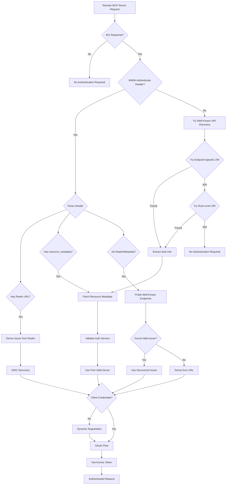

# ToolHive Remote MCP Server Authentication Analysis

This document analyzes how ToolHive handles remote MCP server authentication and its compliance with the [MCP Authorization Specification](https://modelcontextprotocol.io/specification/2025-06-18/basic/authorization).

## Executive Summary

ToolHive is **highly compliant** with the MCP authorization specification, implementing all required features including RFC 9728 (Protected Resource Metadata), RFC 8414 (Authorization Server Metadata), RFC 7591 (Dynamic Client Registration), and PKCE support.

## Specification Compliance

### ✅ Fully Compliant Features

#### 1. WWW-Authenticate Header Handling
- **Location**: [`pkg/auth/discovery/discovery.go:159-233`](../pkg/auth/discovery/discovery.go#L159)
- Correctly parses `Bearer` authentication scheme
- Extracts `realm` and `resource_metadata` parameters as per RFC 9728
- Handles error and error_description parameters

#### 2. Protected Resource Metadata Discovery (RFC 9728 & MCP Specification)

ToolHive implements BOTH discovery mechanisms required by the MCP specification:

**Method 1: WWW-Authenticate Header (Primary)**
- **Location**: [`pkg/auth/discovery/discovery.go:148-156`](../pkg/auth/discovery/discovery.go#L148)
- Extracts `resource_metadata` parameter from `Bearer` scheme in WWW-Authenticate header
- Takes precedence when present (most efficient path)

**Method 2: Well-Known URI Fallback (MCP Specification Requirement)**
- **Location**: [`pkg/auth/discovery/discovery.go:176-254`](../pkg/auth/discovery/discovery.go#L176)
- **Specification**: [MCP Protected Resource Metadata Discovery Requirements](https://modelcontextprotocol.io/specification/draft/basic/authorization#protected-resource-metadata-discovery-requirements)
- Triggers when no WWW-Authenticate header present
- Tries endpoint-specific URI: `/.well-known/oauth-protected-resource/{path}`
- Falls back to root-level URI: `/.well-known/oauth-protected-resource`
- Uses HTTP GET per RFC 9728 requirement

**Metadata Processing (Common to Both Methods)**
- **Location**: [`pkg/auth/discovery/discovery.go:575-637`](../pkg/auth/discovery/discovery.go#L575)
- Validates HTTPS requirement (with localhost exception for development)
- Verifies required `resource` field presence
- Extracts and processes `authorization_servers` array
- Enables automatic discovery for servers that only implement well-known URIs

#### 3. Authorization Server Discovery (RFC 8414)
- **Location**: [`pkg/auth/discovery/discovery.go:595-621`](../pkg/auth/discovery/discovery.go#L595)
- Validates each authorization server in metadata
- Discovers actual issuer via OIDC/.well-known endpoints
- Handles issuer mismatch cases where metadata URL differs from actual issuer
- Accepts the authoritative issuer from well-known endpoints per RFC 8414

#### 4. Dynamic Client Registration (RFC 7591)
- **Location**: [`pkg/auth/oauth/dynamic_registration.go:82-200`](../pkg/auth/oauth/dynamic_registration.go#L82)
- Automatically registers OAuth clients when no credentials provided
- Uses PKCE flow with `token_endpoint_auth_method: "none"`
- Supports both manual client configuration and automatic registration

#### 5. PKCE Support
- **Location**: [`pkg/auth/oauth/dynamic_registration.go:52`](../pkg/auth/oauth/dynamic_registration.go#L52)
- Enabled by default for enhanced security
- Required for public clients as per OAuth 2.1

## Authentication Flow

### Initial Detection
When ToolHive connects to a remote MCP server ([`pkg/runner/remote_auth.go:27-87`](../pkg/runner/remote_auth.go#L27)):

1. Makes test request to the remote server (GET, then optionally POST)
2. Checks for 401 Unauthorized response with WWW-Authenticate header
3. **If WWW-Authenticate header found:** Parses authentication requirements from the header
4. **If no WWW-Authenticate header:** Falls back to RFC 9728 well-known URI discovery:
   - Tries `{baseURL}/.well-known/oauth-protected-resource/{path}` (endpoint-specific)
   - Falls back to `{baseURL}/.well-known/oauth-protected-resource` (root-level)

### Discovery Priority Chain
ToolHive follows this priority order for discovering the OAuth issuer ([`pkg/runner/remote_auth.go:95-145`](../pkg/runner/remote_auth.go#L95)):

**Phase 1: WWW-Authenticate Header Detection**
1. **Configured Issuer**: Uses `--remote-auth-issuer` flag if provided (highest priority)
2. **WWW-Authenticate Header**: Checks for `Bearer` scheme with:
   - **Realm-Derived**: Derives from `realm` parameter (RFC 8414)
   - **Resource Metadata**: Fetches from `resource_metadata` URL (RFC 9728)

**Phase 2: Well-Known URI Fallback (MCP Specification Requirement)**
When no WWW-Authenticate header is present, tries RFC 9728 well-known URIs:
3. **Endpoint-Specific Well-Known URI**: `{baseURL}/.well-known/oauth-protected-resource/{path}`
4. **Root-Level Well-Known URI**: `{baseURL}/.well-known/oauth-protected-resource`
5. **Authorization Server Discovery**: Validates each server in metadata via OIDC discovery
6. **Issuer Mismatch Handling**: Accepts authoritative issuer from well-known endpoints per RFC 8414

**Phase 3: Fallback Discovery**
7. **URL-Derived**: Falls back to deriving from the remote URL (last resort)

### Authentication Branches



## Realm Handling

When the server advertises a realm ([`pkg/auth/discovery/discovery.go:316-345`](../pkg/auth/discovery/discovery.go#L316)):

1. Validates realm as HTTPS URL (RFC 8414 requirement)
2. Strips query and fragment components to create valid issuer
3. Uses as OAuth issuer for endpoint discovery

Example:
- Realm: `https://auth.example.com/realm/mcp?param=value#fragment`
- Derived Issuer: `https://auth.example.com/realm/mcp`

## Resource Metadata Processing

When `resource_metadata` URL is provided:

1. **Fetch Metadata**: GET request to the URL with JSON accept header
2. **Validate Response**: Ensures HTTPS, checks content-type, validates `resource` field
3. **Process Authorization Servers**: 
   - Iterates through `authorization_servers` array
   - Validates each server via OIDC discovery
   - Uses first valid server found
4. **Handle Issuer Mismatch**: Supports cases where metadata URL differs from actual issuer

## Well-Known URI Discovery (RFC 9728 & MCP Specification)

ToolHive implements the MCP specification's **Protected Resource Metadata Discovery Requirements**, which mandates trying well-known URIs when no WWW-Authenticate header is present.

### Discovery Process

**When to Trigger:**
- Server returns 401 Unauthorized
- No WWW-Authenticate header in response
- No manual `--remote-auth-issuer` configured

**Discovery Sequence** ([`pkg/auth/discovery/discovery.go:222-254`](../pkg/auth/discovery/discovery.go#L222)):

Per MCP spec priority, ToolHive tries well-known URIs in this order:

1. **Endpoint-Specific URI**: `{baseURL}/.well-known/oauth-protected-resource/{original-path}`
   - Example: For `https://mcp.example.com/api/v1/mcp`
   - Tries: `https://mcp.example.com/.well-known/oauth-protected-resource/api/v1/mcp`

2. **Root-Level URI**: `{baseURL}/.well-known/oauth-protected-resource`
   - Example: For `https://mcp.example.com/api/v1/mcp`
   - Falls back to: `https://mcp.example.com/.well-known/oauth-protected-resource`

**HTTP Method:**
- Uses `GET` requests per RFC 9728 requirement
- Sets `Accept: application/json` header
- Returns on first successful response (200 or 401)

**Response Processing:**
- Extracts `authorization_servers` array from metadata
- Validates each authorization server via OIDC discovery
- Uses first valid server found
- Accepts authoritative issuer from well-known response per RFC 8414

**Example: Server with Well-Known URI Only**

Some MCP servers implement RFC 9728 well-known URI but don't send WWW-Authenticate headers:

```bash
# Request to MCP endpoint
GET https://mcp.example.com/api/v1/mcp
→ 401 Unauthorized (no WWW-Authenticate header)

# Well-known URI fallback (root-level)
GET https://mcp.example.com/.well-known/oauth-protected-resource
→ 200 OK

# Response
{
  "resource": "https://mcp.example.com",
  "authorization_servers": ["https://auth.example.com"],
  "bearer_methods_supported": ["header"]
}

# Result
ToolHive automatically discovers and authenticates without manual configuration
```

This approach handles cases where servers implement RFC 9728 well-known URI discovery but don't send WWW-Authenticate headers, making authentication completely automatic.

## Dynamic Client Registration Flow

When no client credentials are provided ([`pkg/auth/oauth/dynamic_registration.go`](../pkg/auth/oauth/dynamic_registration.go)):

1. **Discover Registration Endpoint**: Via OIDC discovery or resource metadata
2. **Create Registration Request**:
   ```json
   {
     "client_name": "ToolHive MCP Client",
     "redirect_uris": ["http://localhost:8765/callback"],
     "token_endpoint_auth_method": "none",
     "grant_types": ["authorization_code"],
     "response_types": ["code"]
   }
   ```
3. **Register Client**: POST to registration endpoint
4. **Store Credentials**: Use returned client_id (and client_secret if provided)
5. **Proceed with OAuth Flow**: Using registered credentials

## Security Features

### HTTPS Enforcement
- All OAuth endpoints must use HTTPS
- Exception for localhost/127.0.0.1 for development
- Validates all discovered URLs

### PKCE by Default
- Automatically enabled for all OAuth flows
- Required for public clients (no client_secret)
- Provides protection against authorization code interception

### Token Handling
- Secure token storage in memory
- Automatic token refresh support
- Token passed via Authorization header to remote server

### Configurable Timeouts
- Authentication detection: 10 seconds default
- OAuth flow: 5 minutes default
- HTTP operations: 30 seconds default

## Configuration Options

### CLI Flags for Remote Authentication

```bash
# Automatic discovery (recommended)
thv run https://remote-mcp-server.com

# Manual OAuth configuration
thv run https://remote-mcp-server.com \
  --remote-auth-issuer https://auth.example.com \
  --remote-auth-client-id my-client-id \
  --remote-auth-client-secret my-secret \
  --remote-auth-scopes "openid,profile,mcp"

# Skip browser for headless environments
thv run https://remote-mcp-server.com \
  --remote-auth-skip-browser \
  --remote-auth-timeout 2m
```

### Registry Configuration

Remote servers can be configured in the registry with OAuth settings:

```json
{
  "version": "1.0.0",
  "last_updated": "2025-01-12T00:00:00Z",
  "remote_servers": {
    "example-remote": {
      "url": "https://remote-mcp-server.com",
      "description": "Remote MCP server with OAuth authentication",
      "tier": "community",
      "status": "active",
      "transport": "sse",
      "tools": ["tool1", "tool2"],
      "tags": ["remote", "oauth"],
      "headers": [
        {
          "name": "X-API-Key",
          "description": "API key for authentication",
          "required": true,
          "secret": true
        }
      ],
      "oauth_config": {
        "issuer": "https://auth.example.com",
        "client_id": "optional-client-id",
        "scopes": ["openid", "profile", "mcp"],
        "callback_port": 8765,
        "use_pkce": true,
        "oauth_params": {
          "prompt": "consent"
        }
      }
    }
  }
}
```

The `oauth_config` section supports:
- `issuer`: OIDC issuer URL for discovery
- `authorize_url` & `token_url`: Manual OAuth endpoints (when not using OIDC)
- `client_id`: Pre-configured client ID (optional, will use dynamic registration if not provided)
- `scopes`: OAuth scopes to request
- `callback_port`: Specific port for OAuth callback
- `use_pkce`: Enable PKCE (defaults to true)
- `oauth_params`: Additional OAuth parameters

## Implementation Details

### Key Components

1. **RemoteAuthHandler** ([`pkg/runner/remote_auth.go`](../pkg/runner/remote_auth.go))
   - Main entry point for remote authentication
   - Coordinates discovery and OAuth flow

2. **Discovery Package** ([`pkg/auth/discovery/`](../pkg/auth/discovery/))
   - WWW-Authenticate parsing
   - Resource metadata fetching
   - Authorization server validation

3. **OAuth Package** ([`pkg/auth/oauth/`](../pkg/auth/oauth/))
   - OIDC discovery
   - Dynamic client registration
   - OAuth flow execution with PKCE

### Error Handling

- Graceful fallback through discovery chain
- Clear error messages for debugging
- Retry logic for transient failures
- Timeout protection for all operations

## Compliance Summary

| Specification | Status | Implementation |
|--------------|--------|----------------|
| RFC 9728 (Protected Resource Metadata) | ✅ Fully Compliant | WWW-Authenticate + well-known URI fallback |
| MCP Well-Known URI Fallback | ✅ Compliant | Tries endpoint-specific and root-level URIs per spec |
| RFC 8414 (Authorization Server Metadata) | ✅ Compliant | Accepts authoritative issuer from well-known endpoints |
| RFC 7591 (Dynamic Client Registration) | ✅ Compliant | Automatic registration when needed |
| OAuth 2.1 PKCE | ✅ Compliant | Enabled by default |
| WWW-Authenticate Parsing | ✅ Compliant | Supports Bearer with realm/resource_metadata |
| Multiple Auth Servers | ✅ Compliant | Iterates and validates all servers |
| Resource Parameter (RFC 8707) | ⚠️ Partial | Infrastructure ready, not yet sent in requests |
| Token Audience Validation | ⚠️ Partial | Server-side validation support ready |

## Future Enhancements

While ToolHive is highly compliant with the current MCP specification, potential improvements include:

1. **Resource Parameter**: Add explicit `resource` parameter to OAuth requests (infrastructure exists)
2. **Token Audience Validation**: Enhanced client-side validation of token audience claims
3. **Refresh Token Rotation**: Implement automatic refresh token rotation for long-lived sessions
4. **Client Credential Caching**: Persist dynamically registered clients across sessions

## Conclusion

ToolHive's remote MCP server authentication implementation is comprehensive and standards-compliant, providing:

- Full support for the MCP authorization specification
- Automatic discovery and configuration
- Dynamic client registration for zero-configuration setup
- Strong security defaults with PKCE and HTTPS enforcement
- Flexible configuration for various deployment scenarios

The implementation correctly handles all specified authentication flows and provides a robust foundation for secure MCP server communication.