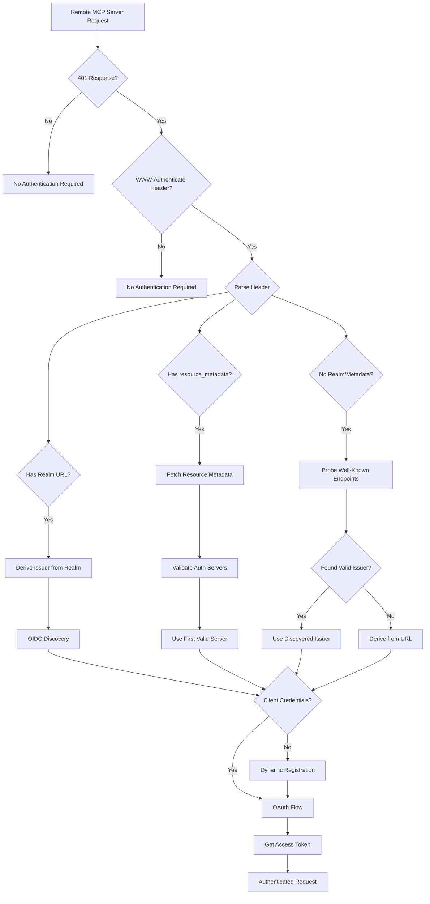

# ToolHive Remote MCP Server Authentication Analysis

This document analyzes how ToolHive handles remote MCP server authentication and its compliance with the [MCP Authorization Specification](https://modelcontextprotocol.io/specification/2025-06-18/basic/authorization).

## Executive Summary

ToolHive is **highly compliant** with the MCP authorization specification, implementing all required features including RFC 9728 (Protected Resource Metadata), RFC 8414 (Authorization Server Metadata), RFC 7591 (Dynamic Client Registration), and PKCE support.

## Specification Compliance

### ✅ Fully Compliant Features

#### 1. WWW-Authenticate Header Handling
- **Location**: [`pkg/auth/discovery/discovery.go:159-233`](../pkg/auth/discovery/discovery.go#L159)
- Correctly parses `Bearer` authentication scheme
- Extracts `realm` and `resource_metadata` parameters as per RFC 9728
- Handles error and error_description parameters

#### 2. Protected Resource Metadata (RFC 9728)
- **Location**: [`pkg/auth/discovery/discovery.go:531-593`](../pkg/auth/discovery/discovery.go#L531)
- Fetches metadata from `resource_metadata` URL in WWW-Authenticate header
- Validates HTTPS requirement (with localhost exception for development)
- Verifies required `resource` field presence
- Extracts and processes `authorization_servers` array

#### 3. Authorization Server Discovery (RFC 8414)
- **Location**: [`pkg/auth/discovery/discovery.go:595-621`](../pkg/auth/discovery/discovery.go#L595)
- Validates each authorization server in metadata
- Discovers actual issuer via OIDC/.well-known endpoints
- Handles issuer mismatch cases where metadata URL differs from actual issuer
- Accepts the authoritative issuer from well-known endpoints per RFC 8414

#### 4. Dynamic Client Registration (RFC 7591)
- **Location**: [`pkg/auth/oauth/dynamic_registration.go:82-200`](../pkg/auth/oauth/dynamic_registration.go#L82)
- Automatically registers OAuth clients when no credentials provided
- Uses PKCE flow with `token_endpoint_auth_method: "none"`
- Supports both manual client configuration and automatic registration

#### 5. PKCE Support
- **Location**: [`pkg/auth/oauth/dynamic_registration.go:52`](../pkg/auth/oauth/dynamic_registration.go#L52)
- Enabled by default for enhanced security
- Required for public clients as per OAuth 2.1

## Authentication Flow

### Initial Detection
When ToolHive connects to a remote MCP server ([`pkg/runner/remote_auth.go:27-87`](../pkg/runner/remote_auth.go#L27)):

1. Makes test request to the remote server (GET, then optionally POST)
2. Checks for 401 Unauthorized response with WWW-Authenticate header
3. Parses authentication requirements from the header

### Discovery Priority Chain
ToolHive follows this priority order for discovering the OAuth issuer ([`pkg/runner/remote_auth.go:95-145`](../pkg/runner/remote_auth.go#L95)):

1. **Configured Issuer**: Uses `--remote-auth-issuer` flag if provided
2. **Realm-Derived**: Derives from `realm` parameter in WWW-Authenticate header (RFC 8414)
3. **Resource Metadata**: Fetches from `resource_metadata` URL (RFC 9728)
4. **Well-Known Discovery**: Probes server's well-known endpoints to discover actual issuer (handles issuer mismatch)
5. **URL-Derived**: Falls back to deriving from the remote URL (last resort)

### Authentication Branches



## Realm Handling

When the server advertises a realm ([`pkg/auth/discovery/discovery.go:316-345`](../pkg/auth/discovery/discovery.go#L316)):

1. Validates realm as HTTPS URL (RFC 8414 requirement)
2. Strips query and fragment components to create valid issuer
3. Uses as OAuth issuer for endpoint discovery

Example:
- Realm: `https://auth.example.com/realm/mcp?param=value#fragment`
- Derived Issuer: `https://auth.example.com/realm/mcp`

## Resource Metadata Processing

When `resource_metadata` URL is provided:

1. **Fetch Metadata**: GET request to the URL with JSON accept header
2. **Validate Response**: Ensures HTTPS, checks content-type, validates `resource` field
3. **Process Authorization Servers**: 
   - Iterates through `authorization_servers` array
   - Validates each server via OIDC discovery
   - Uses first valid server found
4. **Handle Issuer Mismatch**: Supports cases where metadata URL differs from actual issuer

## Well-Known Endpoint Discovery

When no realm URL or resource metadata is provided ([`pkg/runner/remote_auth.go:175-211`](../pkg/runner/remote_auth.go#L175)):

1. **Derive Base URL**: Creates a base URL from the server URL
2. **Probe Well-Known Endpoints**: Attempts to fetch OAuth metadata without requiring issuer match
3. **Accept Authoritative Issuer**: Uses the issuer from the well-known response as authoritative per RFC 8414
4. **Log Mismatch**: Records when discovered issuer differs from server URL for debugging

This approach handles cases where the OAuth provider's issuer differs from the server's public URL, such as when using CDN or worker deployments.

## Dynamic Client Registration Flow

When no client credentials are provided ([`pkg/auth/oauth/dynamic_registration.go`](../pkg/auth/oauth/dynamic_registration.go)):

1. **Discover Registration Endpoint**: Via OIDC discovery or resource metadata
2. **Create Registration Request**:
   ```json
   {
     "client_name": "ToolHive MCP Client",
     "redirect_uris": ["http://localhost:8765/callback"],
     "token_endpoint_auth_method": "none",
     "grant_types": ["authorization_code"],
     "response_types": ["code"]
   }
   ```
3. **Register Client**: POST to registration endpoint
4. **Store Credentials**: Use returned client_id (and client_secret if provided)
5. **Proceed with OAuth Flow**: Using registered credentials

## Security Features

### HTTPS Enforcement
- All OAuth endpoints must use HTTPS
- Exception for localhost/127.0.0.1 for development
- Validates all discovered URLs

### PKCE by Default
- Automatically enabled for all OAuth flows
- Required for public clients (no client_secret)
- Provides protection against authorization code interception

### Token Handling
- Secure token storage in memory
- Automatic token refresh support
- Token passed via Authorization header to remote server

### Configurable Timeouts
- Authentication detection: 10 seconds default
- OAuth flow: 5 minutes default
- HTTP operations: 30 seconds default

## Configuration Options

### CLI Flags for Remote Authentication

```bash
# Automatic discovery (recommended)
thv run https://remote-mcp-server.com

# Manual OAuth configuration
thv run https://remote-mcp-server.com \
  --remote-auth-issuer https://auth.example.com \
  --remote-auth-client-id my-client-id \
  --remote-auth-client-secret my-secret \
  --remote-auth-scopes "openid,profile,mcp"

# Skip browser for headless environments
thv run https://remote-mcp-server.com \
  --remote-auth-skip-browser \
  --remote-auth-timeout 2m
```

### Registry Configuration

Remote servers can be configured in the registry with OAuth settings:

```json
{
  "version": "1.0.0",
  "last_updated": "2025-01-12T00:00:00Z",
  "remote_servers": {
    "example-remote": {
      "url": "https://remote-mcp-server.com",
      "description": "Remote MCP server with OAuth authentication",
      "tier": "community",
      "status": "active",
      "transport": "sse",
      "tools": ["tool1", "tool2"],
      "tags": ["remote", "oauth"],
      "headers": [
        {
          "name": "X-API-Key",
          "description": "API key for authentication",
          "required": true,
          "secret": true
        }
      ],
      "oauth_config": {
        "issuer": "https://auth.example.com",
        "client_id": "optional-client-id",
        "scopes": ["openid", "profile", "mcp"],
        "callback_port": 8765,
        "use_pkce": true,
        "oauth_params": {
          "prompt": "consent"
        }
      }
    }
  }
}
```

The `oauth_config` section supports:
- `issuer`: OIDC issuer URL for discovery
- `authorize_url` & `token_url`: Manual OAuth endpoints (when not using OIDC)
- `client_id`: Pre-configured client ID (optional, will use dynamic registration if not provided)
- `scopes`: OAuth scopes to request
- `callback_port`: Specific port for OAuth callback
- `use_pkce`: Enable PKCE (defaults to true)
- `oauth_params`: Additional OAuth parameters

## Implementation Details

### Key Components

1. **RemoteAuthHandler** ([`pkg/runner/remote_auth.go`](../pkg/runner/remote_auth.go))
   - Main entry point for remote authentication
   - Coordinates discovery and OAuth flow

2. **Discovery Package** ([`pkg/auth/discovery/`](../pkg/auth/discovery/))
   - WWW-Authenticate parsing
   - Resource metadata fetching
   - Authorization server validation

3. **OAuth Package** ([`pkg/auth/oauth/`](../pkg/auth/oauth/))
   - OIDC discovery
   - Dynamic client registration
   - OAuth flow execution with PKCE

### Error Handling

- Graceful fallback through discovery chain
- Clear error messages for debugging
- Retry logic for transient failures
- Timeout protection for all operations

## Compliance Summary

| Specification | Status | Implementation |
|--------------|--------|----------------|
| RFC 9728 (Protected Resource Metadata) | ✅ Compliant | Full implementation with validation |
| RFC 8414 (Authorization Server Metadata) | ✅ Compliant | Accepts authoritative issuer from well-known endpoints |
| RFC 7591 (Dynamic Client Registration) | ✅ Compliant | Automatic registration when needed |
| OAuth 2.1 PKCE | ✅ Compliant | Enabled by default |
| WWW-Authenticate Parsing | ✅ Compliant | Supports Bearer with realm/resource_metadata |
| Multiple Auth Servers | ✅ Compliant | Iterates and validates all servers |
| Resource Parameter (RFC 8707) | ⚠️ Partial | Infrastructure ready, not yet sent in requests |
| Token Audience Validation | ⚠️ Partial | Server-side validation support ready |

## Future Enhancements

While ToolHive is highly compliant with the current MCP specification, potential improvements include:

1. **Resource Parameter**: Add explicit `resource` parameter to OAuth requests (infrastructure exists)
2. **Token Audience Validation**: Enhanced client-side validation of token audience claims
3. **Refresh Token Rotation**: Implement automatic refresh token rotation for long-lived sessions
4. **Client Credential Caching**: Persist dynamically registered clients across sessions

## Conclusion

ToolHive's remote MCP server authentication implementation is comprehensive and standards-compliant, providing:

- Full support for the MCP authorization specification
- Automatic discovery and configuration
- Dynamic client registration for zero-configuration setup
- Strong security defaults with PKCE and HTTPS enforcement
- Flexible configuration for various deployment scenarios

The implementation correctly handles all specified authentication flows and provides a robust foundation for secure MCP server communication.